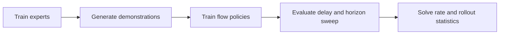

# Kinetix evaluation and reference-code stack

## Purpose and scope

The public repository is a simulation reproduction package for both RTC papers. It is evidence for
the algorithmic branches and Kinetix results, but it is not the full real-robot deployment stack.
Inspection in this report is pinned to commit `9296f31` on 2026-07-22; the code was read, not run.

## Executable modules

| File | Responsibility | Important RTC behavior |
|---|---|---|
| `src/model.py` | MLP-Mixer flow policy and samplers | Vanilla flow, BID, inference-time guidance, training-time prefix conditioning |
| `src/train_expert.py` | Reinforcement-learning expert training | Produces expert checkpoints for the 12 levels |
| `src/generate_data.py` | Demonstration collection | Builds million-transition datasets from mixtures of experts |
| `src/train_flow.py` | Imitation-learning policy training | Builds contiguous `H`-step chunks and calls the standard or prefix-conditioned loss |
| `src/eval_flow.py` | Batched delay/horizon evaluation | Compares naive async, RTC, BID, and hard-prefix sampling |
| `worlds/l/*.json` | Kinetix levels | Twelve dynamic control environments used in the paper |

The end-to-end reproduction flow documented by the repository is:

## Model and experiment contract

The default simulation policy has `H=8`, four MLP-Mixer blocks, a 256-dimensional channel, and
five flow steps at evaluation. The evaluator defaults to 2,048 rollouts and sweeps inference delays
0–4 and valid execution horizons. It asserts `s >= d`, then the loop aligns old and new chunks before
executing them.

Training forms chunks from contiguous actions and zeros positions after an episode terminates
([`train_flow.py`, lines 166–181](https://github.com/Physical-Intelligence/real-time-chunking-kinetix/blob/9296f31d62d5bfeb5779dcb2f9bcf71ca37f448b/src/train_flow.py#L166-L181)).
The repository README says training-time RTC is reproduced by setting `simulated_delay=5`, loading
the epoch-24 checkpoint, and fine-tuning for eight epochs.

## What can and cannot be reproduced

- **Verified from code/docs:** the 12 Kinetix level definitions, model/loss/sampling branches, expert
  and demonstration pipeline, and simulated evaluation sweep are public.
- **Verified from the repository README:** pretrained expert assets are about 60 GiB, computation is
  sharded over levels, and the number of GPUs must divide the number of selected levels. This report
  does not download those assets.
- **Not present:** `π0.5`/`π0.6` weights, real robot scheduler, camera/network stack, robot task data,
  or scripts reproducing the six-task and two-task real-world evaluations.
- **Not rerun:** dependency installation, checkpoint download, training, and the 2,048-rollout sweep.
  Therefore this document verifies code structure, not numerical reproducibility in this workspace.

## Practical reproduction caution

The upstream README's default expert training and datasets are expensive: multiple H100 GPUs,
millions of environment steps, and large cloud assets. A future local reproduction should first run
one level, one seed, a reduced transition count, and a reduced evaluation batch before attempting the
paper-scale sweep. This is a proposed smoke-test strategy, not a command verified in this workspace.

## Evidence

- [Repository README at commit `9296f31`](https://github.com/Physical-Intelligence/real-time-chunking-kinetix/blob/9296f31d62d5bfeb5779dcb2f9bcf71ca37f448b/README.md).
- [`src/model.py`](https://github.com/Physical-Intelligence/real-time-chunking-kinetix/blob/9296f31d62d5bfeb5779dcb2f9bcf71ca37f448b/src/model.py),
  [`src/train_flow.py`](https://github.com/Physical-Intelligence/real-time-chunking-kinetix/blob/9296f31d62d5bfeb5779dcb2f9bcf71ca37f448b/src/train_flow.py), and
  [`src/eval_flow.py`](https://github.com/Physical-Intelligence/real-time-chunking-kinetix/blob/9296f31d62d5bfeb5779dcb2f9bcf71ca37f448b/src/eval_flow.py),
  inspected 2026-07-22.
- *Real-Time Execution of Action Chunking Flow Policies*, Section 4 and Appendix A.5–A.7:
  [local PDF](<../../../papers/02-realtime-chunking/Real-Time Execution of Action Chunking Flow Policies.pdf>).
