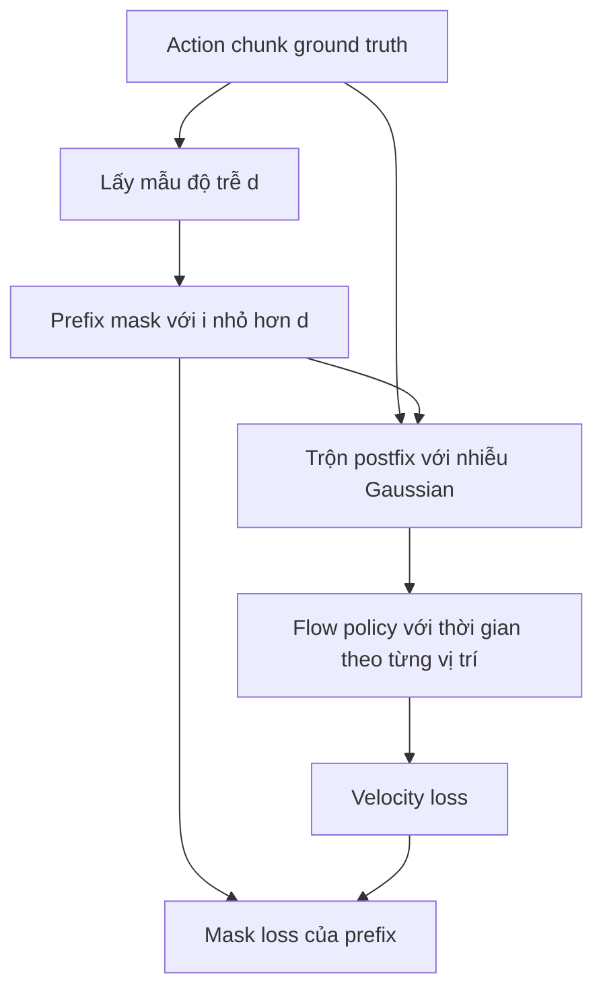

# Điều kiện hóa action prefix tại training

## Mục đích

RTC tại training thay pseudoinverse guidance bằng một phân phối có điều kiện được học:

$$
p(A_{t+d:H}\mid o_t,A_{t:t+d}).
$$

`d` vị trí đầu tiên là các action sạch từ một chunk trình diễn. Chúng đại diện cho các action sẽ
được thực thi trong khi inference chạy. Mô hình học cách chỉ sinh phần postfix tương thích.

## Ba thay đổi

1. Cho phép mỗi vị trí action có một flow timestep, thay vì dùng một timestep vô hướng cho toàn chunk.
2. Giữ các action prefix sạch và đặt flow timestep của chúng thành `1`; thêm nhiễu vào postfix như bình thường.
3. Mask objective để chỉ các vị trí postfix đóng góp vào loss.

Không cần tham số học mới đối với mô hình kiểu DiT mà cơ chế điều kiện hóa timestep đã tạo ra
các giá trị scale, shift và gate AdaLN theo từng token. Kinetix MLP-Mixer được phát hành cũng
broadcast hoặc chấp nhận giá trị thời gian theo từng vị trí
([`model.py`, lines 140–158](https://github.com/Physical-Intelligence/real-time-chunking-kinetix/blob/9296f31d62d5bfeb5779dcb2f9bcf71ca37f448b/src/model.py#L140-L158)).

## Luồng training

Mã công khai lấy mẫu `d` với xác suất giảm theo hàm mũ trong mô phỏng, đặt giá trị thời gian
của prefix thành `1` và loại các vị trí prefix khỏi MSE
([`model.py`, lines 267–289](https://github.com/Physical-Intelligence/real-time-chunking-kinetix/blob/9296f31d62d5bfeb5779dcb2f9bcf71ca37f448b/src/model.py#L267-L289)).
Ngược lại, fine-tuning trong thế giới thực của paper lấy mẫu `d` đều từ 0 đến 10 để bao phủ
tối đa 200 ms ở tần số 50 Hz.

Tại inference, mỗi bước tích phân ghi đè prefix bằng các action đã cam kết, đánh dấu flow time
của prefix là `1` và tính một forward pass thông thường. Hàm `realtime_action` được phát hành
chuyển sang luồng này khi `simulated_delay` được cấu hình
([`model.py`, lines 253–260](https://github.com/Physical-Intelligence/real-time-chunking-kinetix/blob/9296f31d62d5bfeb5779dcb2f9bcf71ca37f448b/src/model.py#L253-L260)).

## Khác biệt giữa paper và code

**Khác biệt đã xác minh:** Phương trình 2 trong paper training-time in velocity target là
`noise - action`, trong khi Thuật toán 1 và mã được phát hành dùng `action - noise`. Cách sau
khớp với phép nội suy của paper từ nhiễu tại `τ=0` đến dữ liệu tại `τ=1`, cũng như phép cập nhật
lấy mẫu dạng cộng. Một bản triển khai nên theo Thuật toán 1 và mã được phát hành, trừ khi tác giả
công bố đính chính; không nên sao chép nguyên phương trình mà không kiểm tra dấu.

## Kết quả và đánh đổi

- Kinetix dùng `H=8`, MLP-Mixer bốn lớp, 2.048 lượt thử cho mỗi điểm và độ trễ 0–4. Checkpoint
  training-time tiếp tục từ epoch 24 và fine-tune trong tám epoch để tổng compute training bằng
  với base policy được train 32 epoch.
- RTC tại training tốt hơn RTC tại inference khi độ trễ mô phỏng `d >= 2`, và khoảng cách lớn
  hơn ở độ trễ cao hơn. Trong biểu đồ được báo cáo, nó kém hơn một chút tại `d=0` và `d=1`.
- Với tác vụ xếp hộp và pha espresso trong thế giới thực, hai phương pháp RTC có hiệu năng và
  thời lượng tương tự, đồng thời đều loại bỏ khoảng dừng của thực thi đồng bộ. RTC tại training
  có độ trễ end-to-end trung bình 108 ms (`d` khoảng 5); RTC tại inference trung bình 135 ms
  (`d` khoảng 7) trên cấu hình H100 từ xa được báo cáo.
- **Đánh đổi:** RTC tại training không có overhead do guidance/backprop, nhưng các độ trễ được
  hỗ trợ phụ thuộc vào phân phối độ trễ dùng khi training. Nó không thể dùng ràng buộc mềm cho
  phần chồng lấn bổ sung nằm sau prefix đã cam kết.

## Bằng chứng

- *Training-Time Action Conditioning for Efficient Real-Time Chunking*, các Mục III–VI và
  Thuật toán 1, trang 2–6:
  [PDF cục bộ](<../../../../papers/02-realtime-chunking/Training-Time Action Conditioning for Efficient Real-Time Chunking.pdf>).
- Luồng training và lấy mẫu trong mã được phát hành:
  [`model.py`](https://github.com/Physical-Intelligence/real-time-chunking-kinetix/blob/9296f31d62d5bfeb5779dcb2f9bcf71ca37f448b/src/model.py#L253-L289),
  kiểm tra ngày 2026-07-22.
