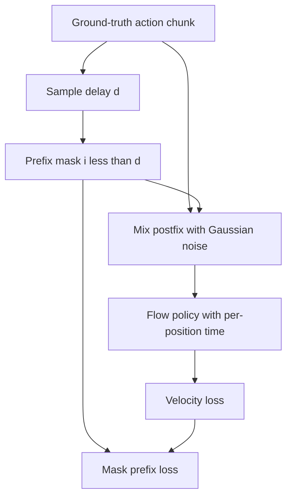

# Training-time action-prefix conditioning

## Purpose

Training-time RTC replaces pseudoinverse guidance with a learned conditional distribution:

$$
p(A_{t+d:H}\mid o_t,A_{t:t+d}).
$$

The first `d` positions are clean actions from a demonstrated chunk. They represent the actions that
will execute while inference is running. The model learns to generate only the compatible postfix.

## Three modifications

1. Allow one flow timestep per action position rather than one scalar timestep for the whole chunk.
2. Keep prefix actions clean and set their flow timestep to `1`; noise the postfix normally.
3. Mask the objective so that only postfix positions contribute to the loss.

No new learnable parameters are required for a DiT-like model whose timestep conditioning already
produces per-token AdaLN scale, shift, and gate values. The released Kinetix MLP-Mixer likewise
broadcasts or accepts per-position time values
([`model.py`, lines 140–158](https://github.com/Physical-Intelligence/real-time-chunking-kinetix/blob/9296f31d62d5bfeb5779dcb2f9bcf71ca37f448b/src/model.py#L140-L158)).

## Training path

The public code samples `d` with exponentially decreasing probability in simulation, sets prefix
time values to `1`, and excludes prefix positions from the MSE
([`model.py`, lines 267–289](https://github.com/Physical-Intelligence/real-time-chunking-kinetix/blob/9296f31d62d5bfeb5779dcb2f9bcf71ca37f448b/src/model.py#L267-L289)).
The paper's real-world fine-tuning instead samples `d` uniformly from 0 through 10 to cover up to
200 ms at 50 Hz.

At inference, each integration step overwrites the prefix with committed actions, marks prefix flow
times as `1`, and computes an ordinary forward pass. The released `realtime_action` switches to
this path when `simulated_delay` is configured
([`model.py`, lines 253–260](https://github.com/Physical-Intelligence/real-time-chunking-kinetix/blob/9296f31d62d5bfeb5779dcb2f9bcf71ca37f448b/src/model.py#L253-L260)).

## Paper/code discrepancy

**Verified discrepancy:** Equation 2 in the training-time paper prints the velocity target as
`noise - action`, while Algorithm 1 and the released implementation use `action - noise`. The latter
matches the paper's interpolation from noise at `τ=0` to data at `τ=1` and its additive sampling
update. An implementation should follow Algorithm 1 and the released code unless the authors issue
an erratum; the equation should not be copied literally without checking the sign.

## Results and tradeoffs

- Kinetix uses `H=8`, a four-layer MLP-Mixer, 2,048 trials per point, and delays 0–4. The
  training-time checkpoint resumes from epoch 24 and fine-tunes for eight epochs so total training
  compute matches the 32-epoch base policy.
- Training-time RTC is better than inference-time RTC for simulated delays `d >= 2`, with a larger
  gap at higher delays. It is marginally worse at `d=0` and `d=1` in the reported plot.
- For real-world box building and espresso making, both RTC methods have similar performance and
  duration, while both remove the pauses of synchronous execution. Training-time RTC averages
  108 ms end-to-end latency (`d` about 5); inference-time RTC averages 135 ms (`d` about 7) on the
  reported remote-H100 setup.
- **Tradeoff:** training-time RTC has no guidance/backprop overhead, but its supported delays depend
  on the delay distribution used in training. It cannot softly constrain the extra overlap beyond the
  committed prefix.

## Evidence

- *Training-Time Action Conditioning for Efficient Real-Time Chunking*, Sections III–VI and
  Algorithm 1, pages 2–6:
  [local PDF](<../../../papers/02-realtime-chunking/Training-Time Action Conditioning for Efficient Real-Time Chunking.pdf>).
- Released training and sampling paths:
  [`model.py`](https://github.com/Physical-Intelligence/real-time-chunking-kinetix/blob/9296f31d62d5bfeb5779dcb2f9bcf71ca37f448b/src/model.py#L253-L289),
  inspected 2026-07-22.
