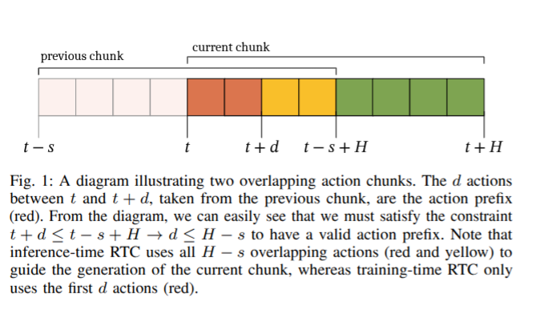
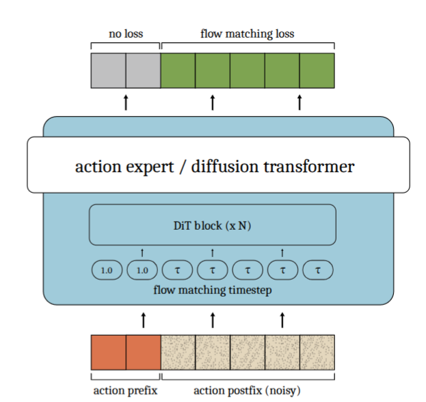

# Flow training và prefix conditioning

## Ý chính

Repository sử dụng **conditional flow matching** để huấn luyện action policy.

Ở chế độ bình thường, toàn bộ action chunk được làm nhiễu và toàn bộ chunk tham gia tính loss.

Khi bật `simulated_delay`, công thức flow matching cơ bản không thay đổi. Khác biệt chính là:

1. một số action đầu chunk được đưa vào model dưới dạng **clean prefix**;
2. loss chỉ được tính trên phần action còn lại, gọi là **postfix**.

Có thể tóm tắt:

$$
\boxed{
\text{Prefix-conditioned training}
=
\text{normal flow matching}
+
\text{clean prefix input}
+
\text{postfix-only loss mask}
}
$$





Training được thực hiện trong hai file:

- [`train_flow.py`](../../../../../third_party/01_real-time-chunking-kinetix/src/train_flow.py): tạo action chunk và cập nhật optimizer;
- [`model.py`](../../../../../third_party/01-real-time-chunking-kinetix/src/model.py): tạo noisy input, velocity target và tính loss.

## Ký hiệu

- $B$: batch size;
- $H=8$: số action trong một chunk;
- $D_a$: số chiều của một action;
- $A\in\mathbb{R}^{B\times H\times D_a}$: ground-truth action chunk;
- $\epsilon\sim\mathcal N(0,I)$: Gaussian noise;
- $\tau\in[0,1)$: flow time;
- $d$: số action đầu chunk được dùng làm clean prefix.

## Tạo action chunk

Từ vị trí bắt đầu $k_b$, code lấy $H$ action liên tiếp:

$$
A_{b,i}
=
\operatorname{data.action}[k_b+i],
\qquad i=0,\ldots,H-1.
$$

Nếu episode kết thúc bên trong chunk, action tại vị trí terminal và các action phía sau được đặt bằng 0.

Phần này chỉ chuẩn bị ground-truth action chunk và không thay đổi giữa normal training và prefix-conditioned training.

Xem [`train_flow.py`, dòng 166–181](../../../../../third_party/01-real-time-chunking-kinetix/src/train_flow.py#L166).

## Flow matching bình thường

Model lấy mẫu noise và flow time:

$$
\epsilon\sim\mathcal N(0,I),
\qquad
\tau\sim\mathcal U[0,1).
$$

Noisy action chunk được tạo bằng phép nội suy:

$$
x_\tau
=
(1-\tau)\epsilon+\tau A.
$$

Ý nghĩa:

- $\tau=0$: $x_\tau$ gần như hoàn toàn là noise;
- $\tau=1$: $x_\tau$ trở thành clean action chunk $A$.

Target velocity là:

$$
u=A-\epsilon.
$$

Policy dự đoán:

$$
v_\theta(o,x_\tau,\tau),
$$

trong đó:

- $o$: observation của robot;
- $x_\tau$: action chunk đang được làm sạch;
- $\tau$: mức tiến triển của flow;
- $v_\theta$: velocity do policy dự đoán.

Loss bình thường là MSE trên toàn bộ action chunk:

$$
\mathcal L_{\text{base}}
=
\operatorname{mean}
\left[
\left(
 v_\theta(o,x_\tau,\tau)-\nu
\right)^2
\right].
$$

Xem [`model.py`, dòng 267–278](../../../../../third_party/01-real-time-chunking-kinetix/src/model.py#L267).

## Prefix conditioning khác ở đâu?

Khi `simulated_delay` được bật, code chọn một prefix length $d$.

Ví dụ với action chunk dài 8 và $d=3$:

```text
[prefix sạch]       [postfix còn nhiễu]
 A0  A1  A2        x3  x4  x5  x6  x7
```

### 1. Prefix được giữ sạch trong input

Prefix mask được định nghĩa:

$$
m_i=
\begin{cases}
1,&i<d,\\
0,&i\ge d.
\end{cases}
$$

Flow time được đặt riêng cho từng action token:

$$
\tilde\tau_i=
\begin{cases}
1,&i<d,\\
\tau,&i\ge d.
\end{cases}
$$

Input trở thành:

$$
x_i
=
(1-\tilde\tau_i)\epsilon_i
+
\tilde\tau_iA_i.
$$

Do đó:

$$
x_i=
\begin{cases}
A_i,&i<d,\\
(1-\tau)\epsilon_i+\tau A_i,&i\ge d.
\end{cases}
$$

Nói đơn giản:

- prefix được đưa vào model dưới dạng action sạch;
- postfix vẫn được làm nhiễu như flow training bình thường.

Model nhờ đó học cách sinh phần action tiếp theo dựa trên một prefix đã được xác định.

Xem [`model.py`, dòng 280–286](../../../../../third_party/01-real-time-chunking-kinetix/src/model.py#L280).

### 2. Loss chỉ tính trên postfix

Target velocity vẫn giữ nguyên:

$$
\nu=A-\epsilon.
$$

Không có target mới dành riêng cho prefix conditioning.

Điểm khác biệt nằm ở loss mask:

$$
\mathcal L_{\text{prefix}}
=
\frac{
\displaystyle
\sum_{b,i,j}
(1-m_{b,i})
\left(
 v_{\theta,b,i,j}-\nu_{b,i,j}
\right)^2
}{
\displaystyle
\sum_{b,i}(1-m_{b,i})+10^{-8}
}.
$$

Vì $1-m_i=0$ trên prefix, lỗi của các action prefix bị bỏ qua.

Loss chỉ huấn luyện model dự đoán postfix:

```text
prefix sạch             postfix cần dự đoán
A0  A1  A2              A3  A4  A5  A6  A7
không tính loss          có tính loss
```

Prefix đóng vai trò **conditioning context**, không phải phần model cần tái tạo.

Xem [`model.py`, dòng 287–289](../../../../../third_party/01-real-time-chunking-kinetix/src/model.py#L287).

## Phần nào không thay đổi?

Ngoài clean-prefix input và loss masking, hầu hết flow training vẫn giống bình thường:

- vẫn lấy Gaussian noise $\epsilon$;
- vẫn lấy flow time $\tau$;
- vẫn dùng interpolation noise-to-action;
- vẫn dùng velocity target $A-\epsilon$;
- vẫn dùng cùng `FlowPolicy`;
- vẫn dùng squared-error loss;
- vẫn dùng cùng optimizer và training loop.

Vì vậy đây không phải một loss hoàn toàn mới. Nó là normal flow-matching training với một phần input đã biết trước.

## Simulated delay

Nếu `simulated_delay=N_d`, code lấy:

$$
d\in\{0,1,\ldots,N_d-1\}.
$$

Ví dụ với `simulated_delay=5`:

$$
d\in\{0,1,2,3,4\}.
$$

Delay nhỏ được lấy thường xuyên hơn delay lớn.

Chi tiết phân phối này giúp model thấy nhiều mức prefix khác nhau, nhưng không thay đổi nguyên lý chính của flow-matching loss.

## Inference sau khi prefix-conditioned training

Khi inference, prefix từ action chunk trước được ghi trực tiếp vào phần đầu của chunk hiện tại:

$$
x_i\leftarrow A_i^{\text{prev}},
\qquad
\tau_i\leftarrow1,
\qquad i<d.
$$

Postfix tiếp tục được cập nhật bằng Euler integration:

$$
x_{k+1}
=
x_k+\frac{1}{N}v_\theta(o,x_k,\tau_k).
$$

Vì model đã được train với clean prefix, inference không cần:

- Jacobian;
- VJP;
- soft overlap weights;
- guidance correction.

Model chỉ cần forward pass để sinh postfix phù hợp với prefix đã cho.

## So sánh với VJP-based RTC

| Thành phần          | Prefix-conditioned training | VJP-based RTC                 |
| ------------------- | --------------------------- | ----------------------------- |
| Cần fine-tune model | Có                          | Không bắt buộc                |
| Prefix              | Đưa trực tiếp vào input      | Dùng để tính guidance error   |
| Loss mask           | Chỉ tính trên postfix       | Không áp dụng ở inference     |
| Jacobian/VJP        | Không                       | Có                            |
| Guidance scale      | Không                       | Có                            |
| Inference           | Forward pass thông thường    | Forward + backward VJP        |
| Kiểu overlap        | Hard prefix                  | Có thể dùng soft weights       |

Hai phương pháp giải quyết cùng một vấn đề: giữ phần action đã committed từ chunk trước và replanning phần còn lại.

Khác biệt là:

- prefix-conditioned training dạy model kỹ năng này từ trước;
- VJP-based RTC ép model tuân theo previous chunk trong lúc inference.

## Kết luận

Prefix-conditioned flow không thay đổi công thức flow matching cốt lõi.

Hai thay đổi quan trọng nhất là:

### Clean prefix input

$$
x_i=A_i,\qquad i<d.
$$

### Postfix-only loss

$$
\mathcal L
\text{ chỉ tính tại }i\ge d.
$$

Do đó, cách hiểu đơn giản nhất là:

> Model nhìn thấy một số action đầu đã hoàn thành và học cách sinh phần action còn lại tiếp nối chúng.

## Nguồn

- [`src/model.py`](../../../../../third_party/01-real-time-chunking-kinetix/src/model.py), dòng 140–171 và 267–289.
- [`src/train_flow.py`](../../../../../third_party/01-real-time-chunking-kinetix/src/train_flow.py), dòng 90–113 và 166–198.
- *Training-Time Action Conditioning for Efficient Real-Time Chunking*, Algorithm 1.
