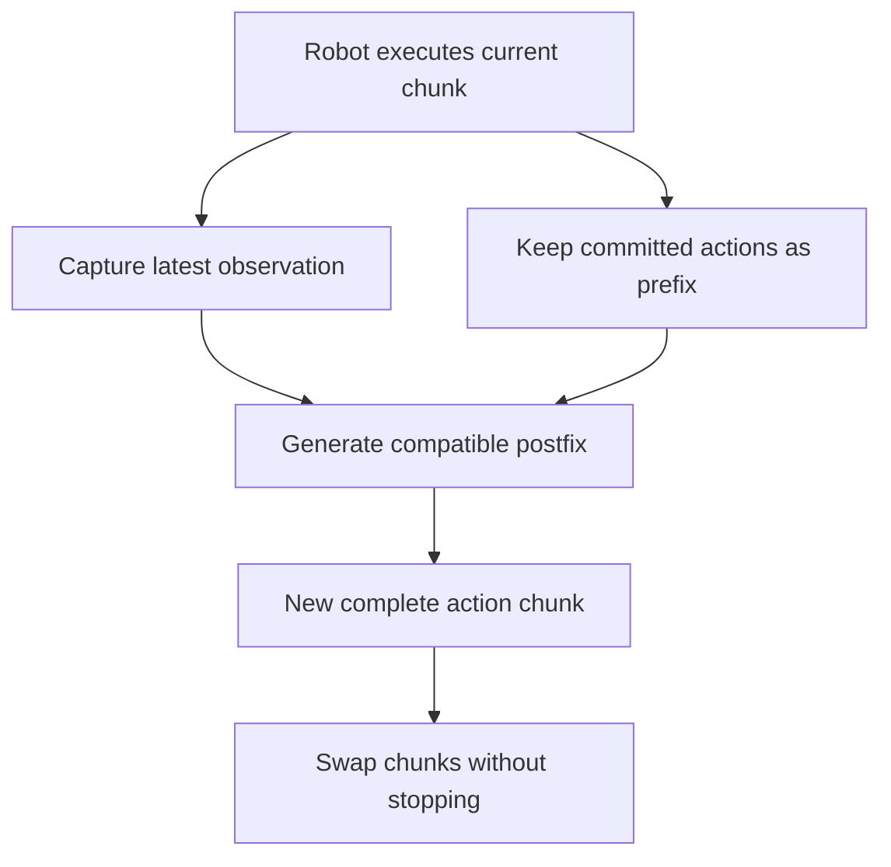

# Real-time action chunking: overview

## Research problem

A robot controller may need a new action every 20 ms, while a large vision-language-action model can take tens or hundreds of milliseconds to generate an action chunk. The robot therefore cannot wait for inference after every chunk.

Existing execution strategies have two failure modes:

- **Synchronous execution:** finish the current chunk, stop, generate the next chunk, then move again. The pauses slow the task and change the robot's motion dynamics.
- **Naive asynchronous execution:** generate the next chunk while the current one runs, then switch immediately. The two chunks may represent different strategies, so the switch can create a sudden jump, high acceleration, or unsafe motion.

The research question is:

> How can a robot generate action chunks asynchronously without pausing, while keeping the next
> chunk continuous with already committed actions and still reacting to the latest observation?

## Simple explanation of the idea

Imagine the robot is currently following this plan:

```text
old chunk:  [already executed | executing during inference | future plan]
new chunk:                    [fixed prefix              | newly generated actions]
```

While the model computes, several actions from the old chunk must still be executed. Those actions
cannot be changed anymore. RTC copies them into the beginning of the new chunk as a **committed
prefix**, then generates the remaining **postfix** so that it connects smoothly to that prefix.

This gives the model two objectives:

1. preserve the actions the robot is already committed to executing;
2. use the newest observation to correct the future part of the plan.



## Timing condition

The two chunks must overlap long enough to cover inference latency:

$$
d \le s \le H-d,
$$

where:

- `H` is the number of actions predicted in one chunk;
- `s` is the number of actions executed before starting the next chunk cycle;
- `d` is model latency measured in controller steps.

If this condition fails, the old chunk may run out of valid actions before the new chunk is ready.

## Two ways to create the compatible postfix

| Method                       | Simple idea                                                                                             | Main advantage                                                                                                     | Main cost                                                                                         |
| ---------------------------- | ------------------------------------------------------------------------------------------------------- | ------------------------------------------------------------------------------------------------------------------ | ------------------------------------------------------------------------------------------------- |
| **Inference-time RTC** | During every flow-denoising step, guide the new chunk toward the overlapping actions from the old chunk | Works with an existing flow or diffusion policy without retraining; supports soft continuity over the full overlap | Requires backpropagation during sampling, increasing latency                                      |
| **Training-time RTC**  | Train the policy with clean action prefixes so it learns to generate only the compatible postfix        | Uses normal forward sampling with no guidance overhead; stronger at larger simulated delays                        | Requires training or fine-tuning for the expected delay distribution; supports only a hard prefix |

Inference-time RTC is useful when only a pretrained policy is available. Training-time RTC is more
efficient when the policy can be fine-tuned and deployment latency is known well enough to simulate
during training.

## Why soft masking is needed

Matching only the strictly committed prefix can still allow the new chunk to change strategy
immediately afterward. Inference-time RTC therefore also considers the rest of the overlap:

- committed actions receive full guidance;
- later overlapping actions receive gradually decreasing guidance;
- actions beyond the overlap are generated freely.

The paper uses exponential decay. It also clips the guidance strength because the theoretical weight
becomes unstable near the first denoising step, especially when the controller uses only five flow
steps.

## Main findings

- On 12 dynamic Kinetix tasks, inference-time RTC is more robust to delay than naive asynchronous
  execution, temporal ensembling, and BID.
- Training-time RTC performs better than inference-time RTC at simulated delays of two controller
  steps or more, while being marginally worse at delays zero and one.
- In six reported real-robot tasks, inference-time RTC improves throughput and remains robust when
  additional latency is injected.
- In the follow-up two-task real-world evaluation, training-time and inference-time RTC have similar
  success and execution duration, while both are faster than synchronous execution.
- For the reported `π0.5` GPU profile, inference-time guidance raises model latency from 76 ms to
  97 ms. These figures are hardware- and model-specific, not universal RTC costs.

## Limitations and open questions

- Inference-time RTC directly requires an iterative diffusion or flow action generator.
- Training-time RTC depends on the delay distribution used during training and does not provide soft
  overlap guidance.
- The papers assume timing aligned to controller steps and do not fully specify recovery from missed
  deadlines, packet loss, inference failure, or `d > H-s`.
- The public repository contains the Kinetix simulation pipeline, not the complete real-robot runtime
  or robot evaluation assets.
- The experiments were not rerun in this workspace; numerical claims above come from the papers.

## Detailed reports

| Report                                                                                  | Focus                                                         |
| --------------------------------------------------------------------------------------- | ------------------------------------------------------------- |
| [Asynchronous runtime](module_details/asynchronous_runtime.md)                           | Timing, chunk alignment, and background execution             |
| [Inference-time inpainting](module_details/inference_time_inpainting.md)                 | Guided flow sampling and computational cost                   |
| [Soft masking and stability](module_details/soft_masking_and_stability.md)               | Cross-chunk continuity, weight schedules, and clipping        |
| [Training-time prefix conditioning](module_details/training_time_prefix_conditioning.md) | Prefix-conditioned loss, sampling, and paper/code discrepancy |
| [Kinetix evaluation stack](module_details/kinetix_evaluation_stack.md)                   | Public code structure and reproducibility boundary            |

## Sources

- Kevin Black, Manuel Y. Galliker, and Sergey Levine, *Real-Time Execution of Action Chunking Flow
  Policies*: [local PDF](<../../papers/02-realtime-chunking/Real-Time Execution of Action Chunking Flow Policies.pdf>),
  [arXiv](https://arxiv.org/abs/2506.07339).
- Kevin Black, Allen Z. Ren, Michael Equi, and Sergey Levine, *Training-Time Action Conditioning for
  Efficient Real-Time Chunking*: [local PDF](<../../papers/02-realtime-chunking/Training-Time Action Conditioning for Efficient Real-Time Chunking.pdf>),
  [arXiv](https://arxiv.org/abs/2512.05964).
- Physical Intelligence,
  [real-time-chunking-kinetix](https://github.com/Physical-Intelligence/real-time-chunking-kinetix/tree/9296f31d62d5bfeb5779dcb2f9bcf71ca37f448b),
  inspected at commit `9296f31` on 2026-07-22.
