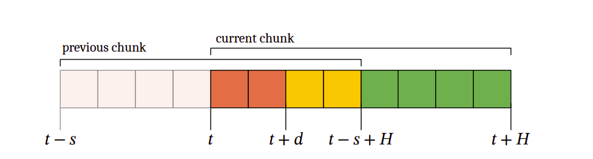
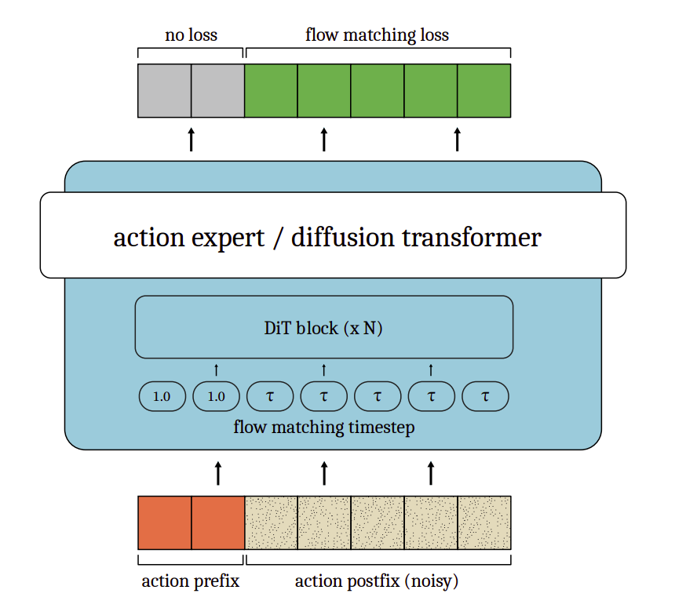
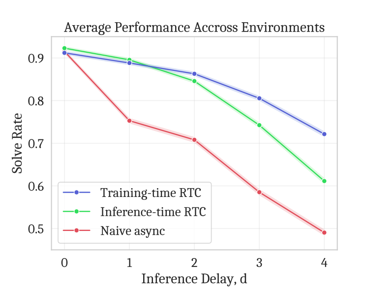
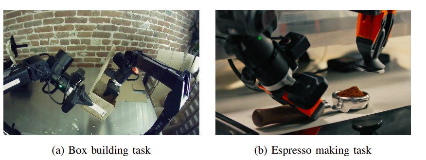
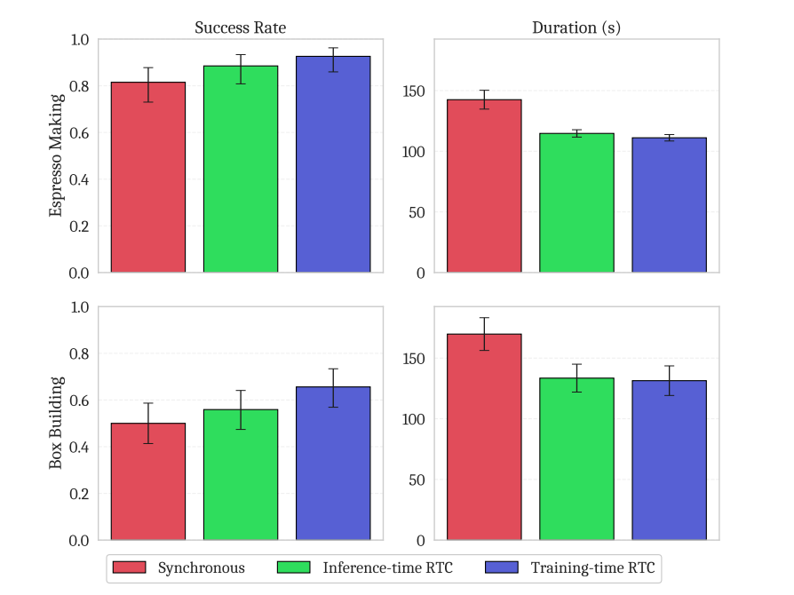
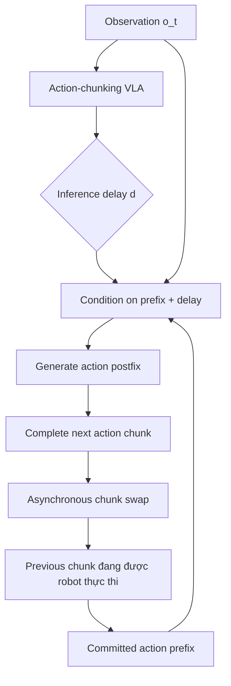
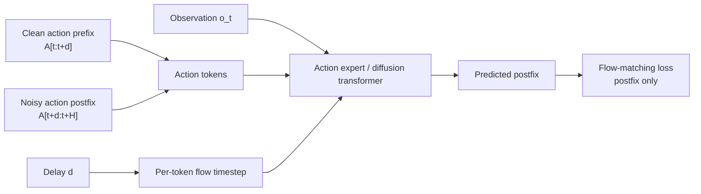
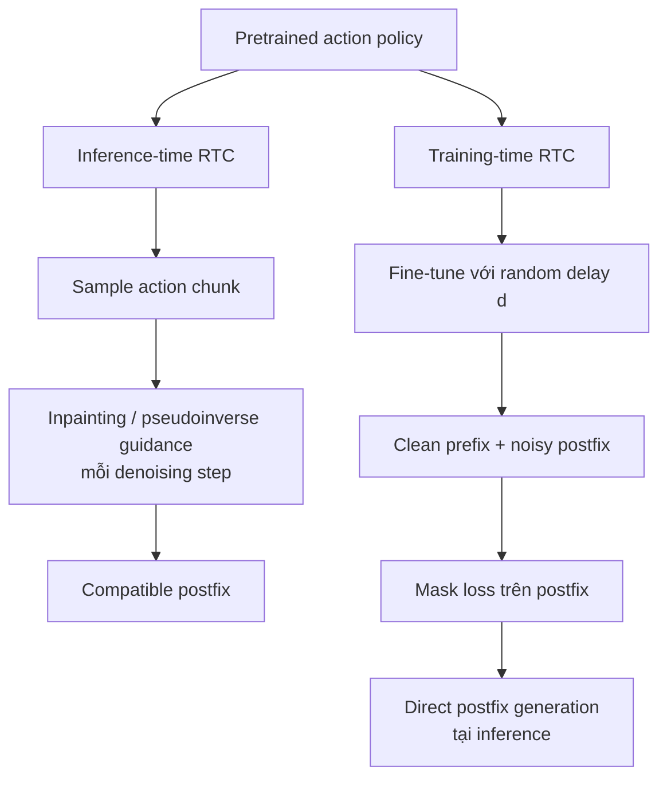

# Training-Time Action Conditioning for Efficient Real-Time 


ChunkingPaper RTC gốc đã có một ý tưởng: robot không chờ model dự đoán xong chunk mới. Trong lúc chunk cũ đang chạy, model chạy nền để dự đoán chunk mới. Nhưng chunk mới phải bắt đầu bằng các action mà robot đã cam kết chạy từ chunk cũ. RTC gốc dùng **inference-time inpainting** để sửa chunk mới cho khớp với phần đầu đó.

Paper này giữ nguyên cách chạy bất đồng bộ của RTC, nhưng thay đúng phần inpainting:

```text
RTC gốc:
observation + policy
    → sinh chunk mới
    → inpainting tại inference để ép khớp prefix
    → postfix tương thích

Paper mới:
observation + prefix + delay
    → model đã được fine-tune để hiểu prefix
    → sinh postfix trực tiếp
```

Nói đơn giản, RTC gốc nói với model lúc inference: “chunk này phải khớp với các action này”. Paper mới dạy model điều đó từ lúc training, nên lúc inference không cần chạy thêm thuật toán sửa chunk.

### Bốn câu trả lời quan trọng

- **Architecture:** không tạo VLA/backbone mới; chỉ thêm khả năng truyền prefix và delay vào action expert, đồng thời cho timestep flow-matching khác nhau giữa prefix và postfix.
- **Training:** lấy một chunk ground-truth, cắt thành prefix sạch và postfix noisy; chỉ train loss trên postfix.
- **Dataset:** không giới thiệu dataset mới; dùng dữ liệu mô phỏng Kinetix từ mixture-of-experts và hai task robot thật của π0.6: box building, espresso making.
- **Evaluation:** so sánh synchronous, naive asynchronous, inference-time RTC và training-time RTC theo solve/success rate, duration và latency.

Đóng góp chính là **đưa chi phí xử lý continuity từ inference sang training**.

## 1. Tóm tắt ngắn

Paper giải quyết bài toán chạy Vision-Language-Action model (VLA) theo thời gian thực khi model dự đoán **một chunk gồm nhiều action** nhưng suy luận mất hàng chục đến hàng trăm mili-giây.

Ý tưởng chính là **training-time action conditioning** (cũng được gọi là training-time RTC): mô phỏng inference delay ngay trong lúc train. Model được đưa sẵn các action đầu của chunk (action prefix) và chỉ phải dự đoán phần còn lại (action postfix). Nhờ đó khi deployment model có thể nhận prefix và sinh postfix trực tiếp, không cần chạy inference-time inpainting/pseudoinverse guidance.

Kết quả: trong mô phỏng, phương pháp mới tốt hơn inference-time RTC khi delay từ 2 bước trở lên; trên robot thật, nó giữ success rate và tốc độ tương đương inference-time RTC nhưng không chịu chi phí tính toán inpainting.

## Hình minh họa từ paper

### Hình 1 — Hai action chunk bị overlap



Hình này giải thích `d` action đầu của current chunk không còn kịp thực thi vì model đang suy luận. Chúng phải được lấy từ previous chunk làm action prefix. Phần còn lại là postfix cần sinh.

### Hình 2 — Architecture của training-time RTC



Prefix là action sạch, flow-matching timestep của prefix được đặt ở `1.0`, còn postfix vẫn noisy với timestep `tau`. Loss chỉ tính trên postfix.

### Hình 3 — Kết quả mô phỏng



Training-time RTC giữ solve rate cao hơn khi inference delay tăng, đặc biệt từ delay 2 trở lên.

### Hình 4 — Hai task robot thật



Hai task là box building và espresso making.

### Hình 5 — Kết quả robot thật



Hai biến thể RTC đều giảm duration so với synchronous inference; training-time RTC giữ success rate và duration tương đương inference-time RTC.

## 2. Bài toán paper đang giải quyết

### Action chunking

Thay vì mỗi lần chỉ dự đoán một action, policy sinh một chuỗi:

`A_t = [a_t, a_{t+1}, ..., a_{t+H-1}]`

Trong đó `H` là prediction horizon. Robot chỉ thực thi một phần chunk, gọi là execution horizon `s`, rồi sinh chunk tiếp theo.

Chunking làm trajectory mượt và giảm số lần gọi model, nhưng phát sinh vấn đề: trong thời gian model đang sinh chunk mới, robot vẫn phải tiếp tục chạy chunk cũ. Nếu ghép chunk mới không đúng với action đang thực thi, robot có thể bị giật hoặc discontinuity.

Flow tổng quát của runtime:



### Real-time chunking (RTC) hiện tại

RTC chạy bất đồng bộ: chunk mới được sinh trong khi chunk cũ đang thực thi. Nếu model có inference delay `d`, `d` action đầu của chunk mới đã bị quá thời điểm thực thi. Vì vậy các action này phải được lấy từ chunk trước; chúng tạo thành **action prefix**.

Inference-time RTC dùng một kỹ thuật inpainting dựa trên pseudoinverse guidance:

- cố định prefix bằng action đã biết;
- ép diffusion/flow model sinh phần postfix tương thích;
- thường dùng thêm soft masking để tận dụng các action overlap còn lại, với trọng số giảm dần.

Nhược điểm là phải tính vector-Jacobian product/backpropagation trong từng bước denoising. Điều này làm tăng latency, tức cơ chế tăng tốc real-time lại tự tạo thêm overhead.

## 3. Đóng góp chính

1. Đề xuất conditioning trên action prefix ngay ở training time bằng cách mô phỏng delay.
2. Không cần thay đổi robot runtime và không cần một kiến trúc VLA mới.
3. Với model flow/diffusion transformer, chỉ cần thay đổi nhỏ ở cách đặt flow-matching timestep, mask loss và interface sinh action.
4. Cho thấy phương pháp có thể fine-tune một model base chưa từng được train với action-prefix conditioning; thí nghiệm này dùng π0.6.
5. So sánh công bằng với synchronous, naive asynchronous và inference-time RTC trên mô phỏng lẫn robot thật.

## 4. Architecture và cơ chế conditioning

### Kiến trúc nền

Paper xét policy action-chunking sử dụng **conditional flow matching**. Model `v_theta` nhận observation, action chunk nhiễu và flow-matching timestep, sau đó dự đoán velocity để tích phân từ `tau = 0` đến `tau = 1`.

Trong thí nghiệm mô phỏng, architecture cụ thể là **MLP-Mixer 4 layer**. Trong thí nghiệm robot thật, phương pháp được áp dụng lên **π0.6 VLA**, cụ thể là action expert dạng diffusion-transformer.

### Action prefix và postfix

Với delay `d`, chunk được tách thành:

- prefix: `A[t:t+d]`, lấy từ action ground truth/đã cam kết trước đó;
- postfix: `A[t+d:t+H]`, phần model cần dự đoán.

Model học phân phối có điều kiện:

`p(A[t+d:t+H] | o_t, A[t:t+d])`

Điều này biến inference thành: nhận observation + delay + prefix, sinh trực tiếp postfix.

Pipeline conditioning bên trong action expert:



### Ba thay đổi kỹ thuật

Paper mô tả ba thay đổi tối thiểu:

1. Cho phép flow-matching timestep khác nhau theo từng action token. Với adaLN-zero, scale/shift/gate có thể khác nhau giữa các token; số lượng parameter học được không đổi đáng kể.
2. Prefix dùng action ground truth, không nhiễu, và timestep tương ứng được đặt bằng 1. Postfix vẫn được nhiễu và denoise bình thường.
3. Mask loss: chỉ tính flow-matching loss trên postfix, không phạt model tái tạo prefix.

Trong hình minh họa, prefix được đưa vào như phần action đã biết; postfix là phần noisy action đi qua các DiT blocks và được học để khử nhiễu. Delay `d` cũng được truyền vào model vì nó quyết định độ dài prefix.

Tóm tắt token-level:

```text
input actions:       [ clean prefix | noisy postfix                 ]
flow timestep:       [      1.0     | tau, tau, tau, ...             ]
loss mask:            [      0       | 1,   1,   1,   ...             ]
model output cần học: [      --      | denoised/flow target postfix   ]
```

### Ý nghĩa của timestep bằng 1

Trong formulation của paper, action noisy là `A_tau = tau A + (1-tau) epsilon`. Đặt `tau = 1` cho prefix khiến prefix chính là action sạch/ground-truth, còn postfix có timestep thông thường. Như vậy cùng một forward pass vừa “nhìn thấy” action đã cam kết, vừa học sinh phần tương lai.

## 5. Training stage

### Training objective nền

Policy flow matching tối ưu:

`L(theta) = E[ || v_theta(A_tau, o_t, tau) - (epsilon - A_t) ||^2 ]`

Với training-time RTC, loss chỉ áp dụng cho postfix. Prefix là điều kiện đầu vào chứ không phải target cần dự đoán.

### Delay sampling

Vì delay thực tế có thể thay đổi, delay được random trong training:

- mô phỏng: `d` lấy từ `{0, 1, 2, 3, 4}`, dùng trọng số giảm theo cấp số mũ;
- robot thật: delay lấy uniform từ `0` đến `10`, tương ứng hỗ trợ latency tối đa khoảng `200 ms` trên robot 50 Hz.

Tác giả nhận thấy delay lớn cần ít supervision hơn nên dùng trọng số thấp hơn trong mô phỏng. Đây là điểm cần tune theo hệ thống thực tế: nếu delay distribution lúc train lệch xa delay deployment, lợi ích có thể giảm.

### Mô phỏng Kinetix

- Dynamic Kinetix benchmark, cùng setup với RTC trước đó.
- Prediction horizon `H = 8`.
- MLP-Mixer 4 layer.
- Dữ liệu do mixture of expert policies tạo ra.
- Baseline synchronous/naive async/inference-time RTC dùng checkpoint train bình thường 32 epochs.
- Training-time RTC tiếp tục từ epoch 24 và fine-tune thêm 8 epochs với prefix conditioning, để tổng training compute tương đương.

### Fine-tuning π0.6

- Fine-tune base π0.6 trên các task mục tiêu.
- 8,000 gradient steps.
- Batch size 512.
- Train delay uniform từ 0 đến 10.
- Inference dùng 5 denoising steps trên remote H100.

Đáng chú ý: π0.6 base không cần được pretrain sẵn với action-prefix conditioning; chỉ cần thêm một stage fine-tuning.

## 6. Dataset và task

Paper không giới thiệu một dataset mới.

### Mô phỏng

Dữ liệu được tạo trong dynamic Kinetix từ **mixture of expert policies**. Đây là benchmark mô phỏng để đánh giá khả năng điều khiển dưới nhiều inference delay.

### Robot thật

Thí nghiệm dùng các task từ setup π0.6:

1. **Box building:** lắp một hộp bìa carton.
2. **Espresso making:** xay cà phê, tamp, chiết xuất và rót espresso.

Paper không cung cấp trong 6 trang này các con số chi tiết về số trajectory/episode của từng task; phần được báo cáo tập trung vào fine-tuning steps, batch size, latency và success rate.

## 7. Evaluation protocol

### Baselines

- **Synchronous inference:** chờ model sinh xong chunk rồi mới chạy tiếp; thường tạo pause rõ rệt.
- **Naive asynchronous:** sinh chunk tiếp theo bất đồng bộ nhưng không xử lý đầy đủ discontinuity.
- **Inference-time RTC:** dùng prefix inpainting/pseudoinverse guidance tại inference.
- **Training-time RTC:** học prefix conditioning trong training và sinh postfix trực tiếp.

### Simulated evaluation

- Đo binary solve rate.
- 2,048 rollouts cho mỗi data point.
- Test delay từ 0 đến 4; với `H=8`, delay tối đa được hỗ trợ là 4 trong setup này.
- Execution horizon được đặt `s = max(d, 1)`.
- Báo cáo khoảng tin cậy Wilson 95%.

### Real-world evaluation

- Inference trên remote H100.
- 5 denoising steps.
- Latency trung bình:
  - training-time RTC: khoảng 108 ms, tương ứng `d ≈ 5`;
  - inference-time RTC: khoảng 135 ms, tương ứng `d ≈ 7`.
- Đo success rate và task duration.
- Error bar success rate: Wilson 68%; duration: ±1 standard error of mean.

## 8. Kết quả

### Mô phỏng

Training-time RTC vượt inference-time RTC khi inference delay từ 2 trở lên; khoảng cách tăng rõ khi delay lớn hơn.

Giải thích của tác giả: khi prefix dài, inference-time inpainting phải “sửa” nhiều constraint hơn. Phương pháp đó dựa trên một phép tuyến tính hóa từ Jacobian của model, nên kém robust hơn khi cần condition trên prefix dài. Training-time RTC đã học trực tiếp phân phối postfix có điều kiện nên phù hợp hơn.

Ở delay 0 và 1, training-time RTC kém hơn rất nhẹ. Lý do được nêu là không phải action nào cũng luôn nhận được supervision, bởi phần prefix bị loại khỏi loss.

### Robot thật

Trên cả box building và espresso making:

- training-time RTC và inference-time RTC có performance tương đương;
- cả hai nhanh hơn synchronous inference vì không có pause giữa các chunk;
- training-time RTC giữ tốc độ tương đương inference-time RTC nhưng không cần computational overhead của inpainting.

Paper nhấn mạnh đây là kết quả “speed parity + performance parity”, chứ không tuyên bố training-time RTC luôn có success rate cao hơn trên robot thật.

## 9. Phân tích trực giác: vì sao phương pháp hiệu quả?

Inference-time RTC lấy một policy vốn được train để sinh cả chunk rồi ép nó thỏa prefix sau khi đã train. Đây là một dạng projection/inpainting hậu kỳ, phải dùng xấp xỉ cục bộ của model.

Training-time RTC thay đổi phân phối mà model phải học: model thường xuyên thấy tình huống “đầu chunk đã bị cố định, hãy dự đoán phần còn lại”. Vì vậy continuity giữa prefix và postfix được học như một năng lực chính của policy, thay vì được sửa sau cùng bằng gradient/Jacobian tại inference.

So sánh hai cách xử lý continuity:



Đánh đổi là model không còn linh hoạt với mọi loại constraint. Nó học hard prefix có độ dài tương ứng delay; inference-time RTC có thể soft-mask thêm các action overlap ngoài prefix.

## 10. Điểm mạnh

- Ý tưởng đơn giản, dễ tích hợp.
- Không cần đổi robot runtime.
- Không cần thêm correction head hay architecture lớn.
- Giảm chi phí inference và latency.
- Có bằng chứng ở cả mô phỏng và robot thật.
- Có thể thêm vào base model bằng fine-tuning, không cần pretraining lại từ đầu.
- Interface gần như tương thích drop-in với inference-time RTC: input gồm prefix và delay, output là postfix.

## 11. Hạn chế và câu hỏi còn mở

1. **Kém linh hoạt hơn:** chỉ xử lý hard prefix theo delay; không có soft conditioning phong phú như inference-time RTC.
2. **Phụ thuộc delay distribution:** cần chọn delay sampling gần latency deployment.
3. **Trade-off loss coverage:** prefix không nằm trong loss, nên delay thấp có thể hơi kém; cần thiết kế weighting tốt hơn.
4. **Không có ablation sâu trong paper ngắn này:** chưa phân tích đầy đủ ảnh hưởng của prediction horizon, execution horizon, số denoising steps, delay distribution và prefix weighting.
5. **Dữ liệu robot thật chưa được mô tả chi tiết:** paper không báo cáo đầy đủ số lượng episode/trajectory cho từng task trong phần thực nghiệm này.
6. **Latency phụ thuộc phần cứng:** kết quả H100 remote không đại diện trực tiếp cho edge hardware.
7. **Kết quả mô phỏng và robot thật chưa hoàn toàn cùng thước đo:** mô phỏng báo solve rate theo delay; robot thật báo success rate và duration.

## 12. Ý nghĩa đối với pipeline VLA/robot learning

Nếu pipeline hiện tại đã có RTC inference-time, cách áp dụng hợp lý là:

1. Giữ nguyên action chunking, model backbone và runtime asynchronous.
2. Trong fine-tuning, lấy một prefix dài `d` từ action chunk ground truth.
3. Đặt prefix sạch, postfix noisy.
4. Mask loss trên prefix, chỉ train postfix.
5. Randomize `d` theo latency thực tế.
6. Tại inference, bỏ pseudoinverse inpainting và sinh postfix trực tiếp.

Với hệ thống 50 Hz, nếu muốn hỗ trợ latency đến khoảng 200 ms thì cần train trên delay đến 10 bước, đồng thời phải bảo đảm prediction horizon đủ dài để còn postfix hợp lệ. Điều kiện hình học của RTC là `d <= H - s`; nếu delay tăng mà `H` không tăng, không còn đủ action tương lai để che phủ thời gian chờ.

## 13. Kết luận

Paper đưa ra một cải tiến training recipe rất thực dụng cho VLA action chunking. Thông điệp chính là: **thay vì dùng inference-time optimization để ép chunk mới nối đúng với chunk cũ, hãy dạy model điều kiện hóa trên phần prefix ngay từ lúc train.**

Phương pháp không tạo ra architecture mới, nhưng giải quyết một bottleneck triển khai quan trọng: chi phí inpainting làm mất một phần lợi ích của asynchronous RTC. Bằng chứng hiện tại cho thấy nó đặc biệt hữu ích khi inference delay lớn; với delay thấp, lợi ích nhỏ hơn và có thể có trade-off nhẹ do loss chỉ train trên postfix.

Đây là một paper về **efficient real-time execution/training adaptation cho VLA**, không phải paper về dataset mới, backbone mới hay một policy learning objective hoàn toàn mới.
