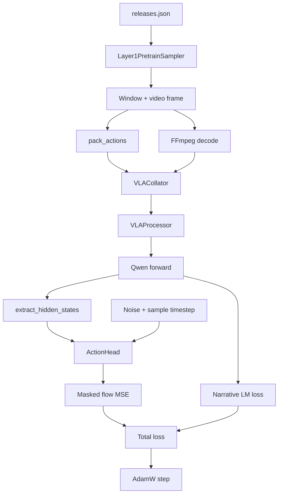
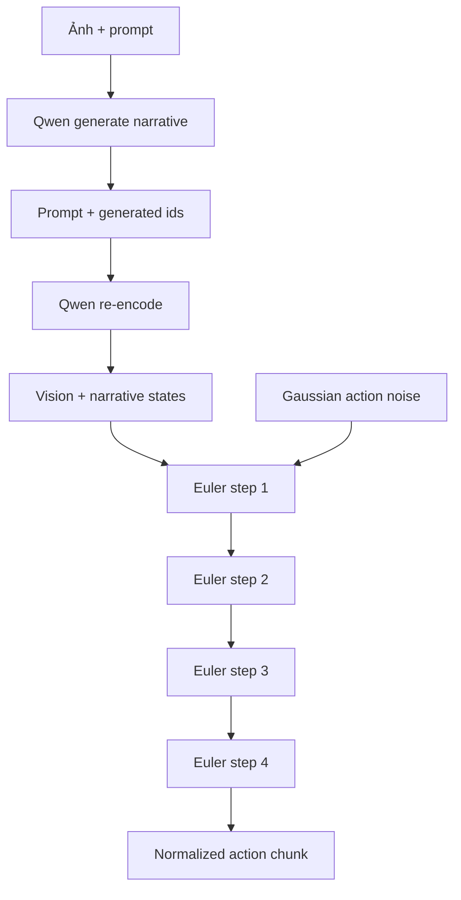

# Kiến trúc và call graph

Phân rã từng layer, attention stream, parameter count và gradient graph được trình bày riêng
tại [Cấu trúc chi tiết của model](04_model_structure.md).

## Vai trò của từng module

| Module | Trách nhiệm chính | Ranh giới |
| --- | --- | --- |
| [`data/processing.py`](https://github.com/VietnamRobotics/vla_core/blob/4c0f2d86d46df8935ade3f5c63ef83013d6c15a6/data/processing.py) | Đóng gói ảnh + text theo Qwen chat template, tạo label narrative | Không xử lý action |
| [`data/corpus_dataset.py`](https://github.com/VietnamRobotics/vla_core/blob/4c0f2d86d46df8935ade3f5c63ef83013d6c15a6/data/corpus_dataset.py) | Lấy window từ corpus ngoài, decode một frame, pack action `T × 153` | Phụ thuộc `corpus.labels.pretrain_loader` |
| [`data/collate.py`](https://github.com/VietnamRobotics/vla_core/blob/4c0f2d86d46df8935ade3f5c63ef83013d6c15a6/data/collate.py) | Right-pad text, nối vision stream, stack action và sample theo source | Một ảnh/sample trong train path hiện tại |
| [`model/utils.py`](https://github.com/VietnamRobotics/vla_core/blob/4c0f2d86d46df8935ade3f5c63ef83013d6c15a6/model/utils.py) | Tách hidden state thành vision/narrative stream và tạo pad mask | Dựa vào `image_token_id` |
| [`model/proprio_encoder.py`](https://github.com/VietnamRobotics/vla_core/blob/4c0f2d86d46df8935ade3f5c63ef83013d6c15a6/model/proprio_encoder.py) | Chiếu proprio vector thành một conditioning token | Không được dùng trong run-1 |
| [`model/action_head.py`](https://github.com/VietnamRobotics/vla_core/blob/4c0f2d86d46df8935ade3f5c63ef83013d6c15a6/model/action_head.py) | Dự đoán flow velocity từ noisy action và VLM states | 24 block mặc định |
| [`model/vla_model.py`](https://github.com/VietnamRobotics/vla_core/blob/4c0f2d86d46df8935ade3f5c63ef83013d6c15a6/model/vla_model.py) | Ghép Qwen, hidden-state split, action head, loss và sampling | Không có checkpoint loader/CLI |
| [`train/pretrain.py`](https://github.com/VietnamRobotics/vla_core/blob/4c0f2d86d46df8935ade3f5c63ef83013d6c15a6/train/pretrain.py) | Tạo dataset/model/optimizer và train loop | Chỉ train split, không evaluation |

`eval/` chỉ chứa `__init__.py` rỗng.

## Luồng training



### Processor và token streams

`VLAProcessor` tạo một user message gồm 1–3 image item rồi một text item:

```text
What action should the robot take to <task>?
History: <history>  # chỉ có khi history khác rỗng
```

Trong training, processor tokenize hai lần:

1. full conversation có assistant response;
2. prompt-only có generation prompt.

Độ dài prompt-only được dùng để mask label bằng `-100`, nên chỉ assistant response dự kiến
đóng góp LM loss. Cơ chế này chưa có unit test với tokenizer thật; boundary giữa generation
prompt và assistant response cần được kiểm tra trên version `transformers` được pin.

Collator xử lý từng sample riêng rồi:

- right-pad `input_ids`, `attention_mask`, `labels`;
- nối `pixel_values` và `image_grid_thw` của các sample theo batch order;
- stack `actions_gt` và `action_mask`.

### Backbone và hidden-state split

`VLAModel` load `Qwen3_5ForConditionalGeneration`, yêu cầu tất cả hidden states và dùng
`input_ids == image_token_id` để tách token:

```text
Qwen hidden states: tuple[L+1] của (B, S, D)
                           │
             ┌─────────────┴─────────────┐
             │ image_token_id            │ token khác và attention_mask=1
             ▼                           ▼
vision_hs: (B, L+1, Nv, D)    narrative_hs: (B, L+1, Nn, D)
```

Hai stream được pad đến độ dài lớn nhất trong batch. Hàm trả `vision_pad_mask` hoặc
`narrative_pad_mask` khi số token giữa các sample khác nhau. Hai test hiện có kiểm shape và
việc padding narrative không rò vào stream, nhưng chưa chạy được trong môi trường hiện tại.

Tên “narrative” hơi rộng hơn semantics thật: stream này chứa mọi token không phải image và
không phải batch padding, bao gồm system/chat markers, prompt, task và assistant target; nó
không chỉ chứa narrative tự nhiên.

## Action head

### Input embedding

Action head nhận:

- `noisy_actions`: `(B, 16, 153)`;
- `timesteps`: `(B,)`;
- vision và narrative hidden states từ mọi Qwen layer;
- một proprio token tùy chọn.

Noisy action được chiếu sang hidden width, cộng learned positional embedding cho từng step
và sinusoidal-MLP timestep embedding.

### Một cross-attention block

Mỗi block tạo query từ action token và ba nhóm key/value:

1. action token hiện tại cho self-attention;
2. narrative token, nối thêm proprio token nếu có;
3. vision token.

Ba ma trận score được nối lại rồi softmax chung. Block thứ `i` nhận hidden state Qwen layer
`i + 1`; embedding layer ở index `0` bị bỏ qua. Với mặc định 24 Qwen layer và 24 action
block, hai số này phải khớp nhưng code chưa assert invariant đó.

Vision score được nhân `tanh(gating_factor)`, với gate khởi tạo bằng `0`. Đây không phải
hard gate trên output: logit vision bằng 0 vẫn nhận xác suất khác 0 trong softmax chung và
vision value vẫn có thể ảnh hưởng output. Nếu ý định là tắt vision lúc khởi tạo, cần test và
đổi gating trên contribution thay vì chỉ scale logit.

Sau 24 block, layer norm và linear projection trả velocity field `(B, 16, 153)`.

## Luồng inference

`predict_action()` dùng hai pass:

1. `qwen.generate()` sinh narrative tự hồi quy;
2. full sequence được encode lại để lấy hidden states, sau đó action head tích phân flow.



Mỗi Euler step tái dùng VLM conditioning và chỉ chạy lại action head. Output vẫn ở normalized
space; snapshot không chứa denormalization hoặc adapter sang robot command.

## Invariant và điểm dễ đọc nhầm

- `VLAOutput.predicted_actions` là velocity field trong training forward, nhưng là sampled
  action khi gọi forward không có `actions_gt`. Cùng field name có hai semantics.
- `input_dim` của `ActionHead` được nhận nhưng không dùng để chiếu conditioning states;
  implementation ngầm yêu cầu Qwen hidden width bằng action-head hidden width.
- Proprio encoder tồn tại, nhưng `VLAConfig.proprio_dim=None` và train loop luôn truyền
  `proprio=None`.
- Comment đầu `vla_model.py` ghi shape cũ `(B, 50, 23)`; contract active trong config,
  dataset và train loop là `(B, 16, 153)`.
