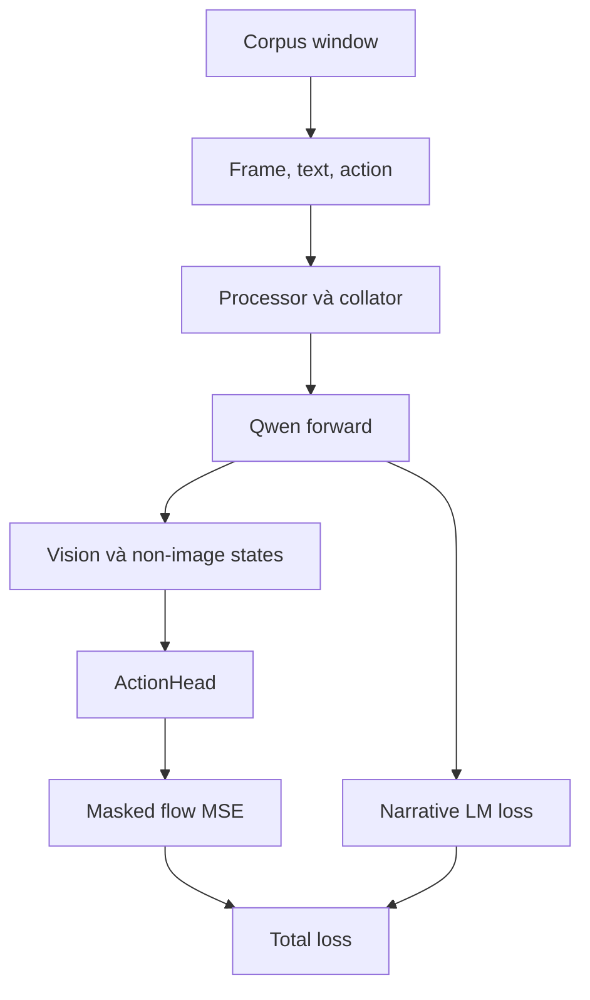
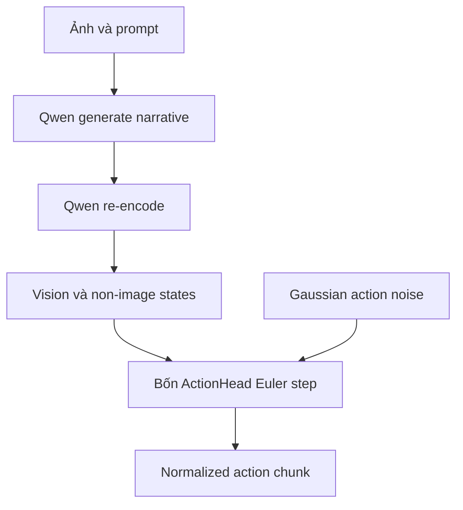

# Tổng quan code `vla_core`

## Phạm vi và cách đọc

Thư mục này mô tả working tree cục bộ của `third_party/02_vla_core`, được khảo sát ngày
2026-07-26 khi nested repository ở commit
`233396b679b1737a0ad78e3363e99c7e2be31a6c` và có thay đổi chưa commit. Mỗi sự thật chi
tiết chỉ có một báo cáo sở hữu:

| Báo cáo | Câu hỏi chính | Không lặp lại |
| --- | --- | --- |
| [Dữ liệu và training](02_data_and_training.md) | Sample, modality, action schema, batch và source sampling là gì? | Shape bên trong model |
| [Kiến trúc model](03_model_architecture.md) | Model gồm module nào, config và gradient graph ra sao? | Cơ chế attention chi tiết |
| [Cơ chế ActionHead](04_action_head_mechanics.md) | ActionHead khác attention thông thường ở đâu? | Toàn bộ data pipeline |
| [Tensor flow training](05_training_tensor_flow.md) | Tensor đổi shape thế nào từ corpus đến loss? | Diễn giải module dài |
| [Luồng inference](06_inference_flow.md) | Prompt thành sampled action-space tensor qua API nào? | Training trace |

Trạng thái dependency, test và những gì thực sự đã chạy nằm tại
[trạng thái runtime](../runtime_status.md), không nằm trong các báo cáo code path.

## Câu trả lời ngắn

`vla_core` ghép Qwen3.5 với một flow-matching action head:

1. dataset ngoài repository cung cấp window, một RGB frame và action chunk `16 × 153`;
2. Qwen xử lý ảnh và text, đồng thời trả hidden state của embedding và từng transformer
   layer;
3. code tách hidden state thành vision token và mọi non-image token hợp lệ;
4. 24 ActionHead block lần lượt dùng Qwen layer 1–24 để dự đoán velocity field;
5. training tối ưu masked flow MSE, cộng narrative LM loss với trọng số `0,1`;
6. inference sinh narrative, encode lại sequence, rồi tích phân Euler bốn bước từ Gaussian
   noise thành sampled action-space tensor.

Đây là mô tả **Verified bằng đọc code tĩnh**. Workspace chưa có bằng chứng runtime
end-to-end hoặc adapter biến output thành robot command.

## Bản đồ module

| Module | Trách nhiệm chính | Ranh giới |
| --- | --- | --- |
| [`data/processing.py`](../../../../third_party/02_vla_core/data/processing.py) | Tạo Qwen chat input và narrative labels | Không xử lý action |
| [`data/corpus_dataset.py`](../../../../third_party/02_vla_core/data/corpus_dataset.py) | Lấy window, decode frame, pack action `T × 153` | Phụ thuộc package `corpus` ngoài repo |
| [`data/collate.py`](../../../../third_party/02_vla_core/data/collate.py) | Pad text, nối visual features, stack action | Active path dùng một ảnh/sample |
| [`model/utils.py`](../../../../third_party/02_vla_core/model/utils.py) | Tách vision/non-image hidden states và tạo pad mask | Dựa vào `image_token_id` |
| [`model/proprio_encoder.py`](../../../../third_party/02_vla_core/model/proprio_encoder.py) | Chiếu proprio vector thành conditioning token | Không active trong run-1 |
| [`model/action_head.py`](../../../../third_party/02_vla_core/model/action_head.py) | Dự đoán flow velocity từ noisy action và Qwen states | 24 block mặc định |
| [`model/vla_model.py`](../../../../third_party/02_vla_core/model/vla_model.py) | Ghép Qwen, ActionHead, loss và sampling | Không có robot adapter |
| [`train/pretrain.py`](../../../../third_party/02_vla_core/train/pretrain.py) | Tạo dataset/model/optimizer và train loop | Không có evaluation loop |

`eval/` chỉ chứa `__init__.py` rỗng.

## Call graph chính

## Ranh giới đã xác minh

- Active contract là action `(B, 16, 153)`, không phải comment cũ `(B, 50, 23)`.
- `narrative_hs` chứa mọi non-image token hợp lệ, không chỉ narrative tự nhiên.
- `ActionHead` ngầm yêu cầu Qwen hidden width bằng action-head hidden width.
- Proprio encoder tồn tại nhưng `proprio_dim=None` và train loop truyền `proprio=None`.
- `predicted_actions` là velocity khi training nhưng có thể là sampled action ở inference.
- Code không chứng minh action được normalize upstream. Output inference chưa được đổi
  coordinate frame, áp safety policy hoặc gửi tới robot.

Các cơ chế, shape và rủi ro cụ thể được giữ ở đúng báo cáo sở hữu trong bảng đầu trang.
