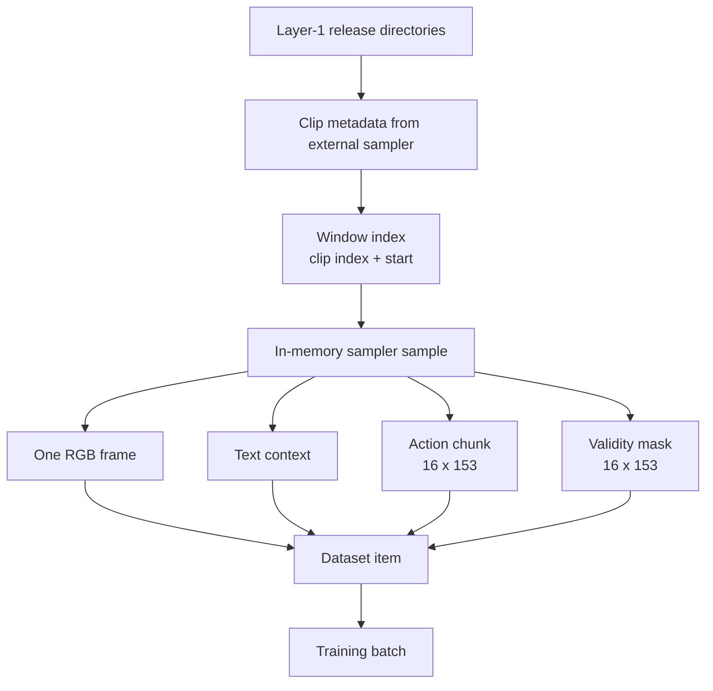

# Dữ liệu dùng cho pretraining trong `vla_core`

## Câu hỏi và phạm vi

`vla_core` thực sự lấy dữ liệu nào để train, một training sample có format gì, các modality
được giữ hoặc bỏ ra sao, và phần nào của data contract vẫn chưa thể xác minh?

Báo cáo này chỉ tập trung vào **data source, window, sample schema, action representation,
text/image preparation, batching và sampling distribution**. Báo cáo không giải thích
flow-matching objective, model layer, dimension transition bên trong model hoặc inference:

- tensor đi qua Qwen và `ActionHead`:
  [Luồng tensor training](05_training_tensor_flow.md);
- cấu trúc attention và gradient graph:
  [Kiến trúc model](03_model_architecture.md);
- khả năng chạy và test coverage:
  [Trạng thái runtime](../runtime_status.md).

Nguồn sự thật là working tree cục bộ của `third_party/02_vla_core`, khảo sát ngày
2026-07-26. Nested repository đang ở commit
`233396b679b1737a0ad78e3363e99c7e2be31a6c` và có thay đổi chưa commit, nên commit hash
không đủ để tái lập chính xác nội dung hiện tại.

## Câu trả lời ngắn

Training record active của `vla_core` là một **window từ egocentric human video**, gồm:

- một RGB frame làm visual observation;
- text ghép từ tối đa hai narrative annotation và một joystick/locomotion label;
- action chunk 16 step ở tần số danh nghĩa 10 Hz;
- mỗi action step có 153 chiều: head motion và pose/keypoint của hai tay;
- mask cùng shape để đánh dấu hand observation hợp lệ;
- source và clip ID để truy provenance ở dataset level.

Code không đọc trực tiếp LeRobot, RLDS, HDF5 hay Parquet. Nó phụ thuộc
`Layer1PretrainSampler` từ package/repository `data_corpus` không có trong workspace. Vì vậy,
adapter và format sau adapter có thể xác minh; schema lưu trên disk, timestamp alignment,
unit, coordinate frame và normalization upstream thì chưa.



## 1. Ranh giới dataset

### Ba source được cấu hình

[`configs/releases.json`](../../../../third_party/02_vla_core/configs/releases.json) chỉ là
map từ source name sang release directory:

| Source key | Release directory trong snapshot | Nội dung thực tế |
| --- | --- | --- |
| `egodex` | `/mnt/SSD4/dataset/releases/egodex_v06` | **Unknown** trong workspace |
| `egoverse` | `/mnt/SSD4/dataset/releases/egoverse_v06` | **Unknown** trong workspace |
| `xp10m` | `/mnt/SSD4/dataset/releases/xp10m_v06` | **Unknown** trong workspace |

Ba path là absolute path của máy nguồn, không tồn tại như artifact được version trong
snapshot. File này không mô tả:

- file format bên trong release;
- clip metadata schema;
- số sample/window;
- train/validation split;
- license;
- checksum hoặc release revision.

Các claim README như `4.48M windows`, group-disjoint validation hoặc license của từng source
không thể tái kiểm chỉ từ `releases.json`.

### Dependency ngoài repository

`CorpusPretrainDataset` import:

```python
from corpus.labels.pretrain_loader import Layer1PretrainSampler
```

`Layer1PretrainSampler` chịu trách nhiệm đọc release, cung cấp `clips`, đếm window và trả
sample. Package `corpus` không có trong workspace và không được pin trong dependency
manifest của nested repo.

Do đó, cần phân biệt:

- **Verified:** field mà adapter truy cập và cách adapter biến chúng thành sample;
- **Unknown:** file-on-disk schema, cách sampler nội suy/chọn timestamp, filtering, split,
  normalization và semantics đầy đủ của field.

Nguồn:
[`data/corpus_dataset.py:1-24`](../../../../third_party/02_vla_core/data/corpus_dataset.py).

## 2. Đơn vị dữ liệu: release → clip → window → training record

### Clip và window index

Dataset nhận danh sách `self.sampler.clips`. Mỗi clip tối thiểu phải có:

| Clip field | Cách adapter dùng |
| --- | --- |
| `fps` | đổi stride từ giây sang frame/index step |
| `source` | source lookup và source-balanced sampling |

Với mỗi clip, code tạo index:

```text
step = max(1, int(window_stride_s * clip["fps"]))
window_start = 0, step, 2*step, ... < sampler.n_windows(clip)
index item = (clip_idx, window_start)
```

Giá trị mặc định:

```text
n_steps          = 16
action_hz        = 10.0
window_stride_s  = 2.0
seed             = 0
```

Sau khi enumerate, toàn bộ index được shuffle đúng một lần bằng `numpy.RandomState(seed)`.
Nguồn:
[`data/corpus_dataset.py:68-90`](../../../../third_party/02_vla_core/data/corpus_dataset.py).

### Điều có thể và không thể suy ra về thời gian

**Verified:** sampler được yêu cầu trả 16 step ở 10 Hz, nên chunk có horizon danh nghĩa:

$$
16 / 10 = 1.6\ \text{seconds}.
$$

**Unknown:**

- `window_start` dùng đơn vị frame, annotation index hay timestamp;
- RGB frame nằm ở đầu, giữa hay cuối action chunk;
- action là future target, centered window hay historical motion;
- cách sampler xử lý missing frame, variable FPS và timestamp drift;
- 16 step có luôn cách đều đúng 100 ms hay đã được resample;
- train/validation split có thực sự disjoint theo clip/person/session hay không.

Không nên gọi sample là “observation → future action” trước khi đọc implementation và
`ACTION_SPEC` của `data_corpus`.

## 3. In-memory schema mà adapter yêu cầu

`sampler.sample(clip, window_start)` phải trả dictionary có ít nhất các field sau:

| Field | Shape/type tối thiểu suy ra từ code | Vai trò trong `vla_core` |
| --- | --- | --- |
| `video` | path/string | input cho FFmpeg |
| `video_frame` | integer | chọn đúng một RGB frame |
| `head_d_pos` | `(T,3)` | head translation block |
| `head_d_rot` | `(T,3,3)` | head rotation matrix → 6D |
| `hand_l` | `None` hoặc hand dict | left-hand target và validity |
| `hand_r` | `None` hoặc hand dict | right-hand target và validity |
| `narratives` | list các dict | text annotation |
| `narratives[*].text` | string | tối đa hai câu được nối |
| `narratives[*].gen_model` | string | provenance tag trong text |
| `joystick` | string hoặc false-y | locomotion text |
| `source` | string | sampling/provenance |
| `clip_id` | scalar ID | provenance ở dataset item |

Một hand dict phải có:

| Field | Shape | Adapter sử dụng |
| --- | --- | --- |
| `pos_cam` | `(T,3)` | 3 position dimensions |
| `rot_cam` | `(T,3,3)` | matrix → rotation 6D |
| `kp21` | `(T,21,3)` | flatten thành 63 dimensions |
| `valid` | `(T,)` | broadcast thành mask 72 dimensions |

Nguồn:
[`data/corpus_dataset.py:31-52`](../../../../third_party/02_vla_core/data/corpus_dataset.py)
và
[`data/corpus_dataset.py:92-108`](../../../../third_party/02_vla_core/data/corpus_dataset.py).

Đây là **in-memory adapter contract**, không phải bằng chứng rằng release trên disk lưu trực
tiếp NumPy arrays theo đúng shape này.

## 4. Các modality thực sự được dùng

| Modality | Dữ liệu active | Vai trò |
| --- | --- | --- |
| Vision | một RGB ego frame/window | visual conditioning |
| Language | tối đa hai narrative + joystick label | prompt và narrative supervision |
| Head motion | translation + rotation trên 16 step | continuous action target |
| Left hand | position, rotation, 21 keypoint + validity | continuous action target |
| Right hand | position, rotation, 21 keypoint + validity | continuous action target |
| Provenance | source, clip ID | sampling/audit ở dataset boundary |

### Những modality không có trong active data path

- không audio;
- không depth;
- không segmentation;
- không force/torque;
- không robot joint state hoặc proprioception;
- không explicit timestamp tensor;
- không reward, terminal flag hoặc success label;
- không camera calibration/intrinsics/extrinsics;
- không nhiều camera trong `CorpusPretrainDataset`.

`VLAProcessor` hỗ trợ API 1–3 ảnh, nhưng collator active luôn truyền `images=[img]`, tức đúng
một ảnh/sample. `VLAConfig.max_cameras=3` không làm dataset tự sinh wrist-camera input.

Nguồn:
[`data/collate.py:24-30`](../../../../third_party/02_vla_core/data/collate.py) và
[`data/processing.py:33-51`](../../../../third_party/02_vla_core/data/processing.py).

## 5. Image record

### Decode

Mỗi `__getitem__`:

1. spawn một FFmpeg subprocess;
2. dùng filter `select=eq(n\,FRAME)` để chọn frame;
3. ghi PNG vào temporary file;
4. đọc PNG bằng OpenCV;
5. đổi BGR → RGB.

Dataset output:

```text
image: NumPy uint8, shape (H,W,3), RGB
```

Nguồn:
[`data/corpus_dataset.py:55-65`](../../../../third_party/02_vla_core/data/corpus_dataset.py).

### Điều chưa được bảo đảm

- không validate `H`, `W`, aspect ratio hoặc color range ngoài `uint8`;
- không resize/crop/augment trong dataset;
- `VLAConfig.image_size=224` không được dataset sử dụng;
- không cache decoder; mỗi sample tạo process mới;
- không giữ `video`, `video_frame`, decode timestamp hoặc checksum trong output dataset.

Resize, patching và normalization sau `PIL.Image` thuộc Qwen processor. Exact visual tensor
format được tóm tắt ở
[báo cáo tensor flow](05_training_tensor_flow.md#trace-2--sample-thành-multimodal-batch).

## 6. Text record

### Text từ annotation

Adapter lấy tối đa hai narrative đầu:

```python
narr = " ".join(n["text"] for n in smp["narratives"][:2]) or "no narration"
```

Nếu có narrative, `gen_model` của item đầu được giữ làm tag; nếu không, dùng `"none"`.
Joystick false-y được đổi thành `"stationary"`.

Dataset text có format:

```text
<gen:GEN_MODEL> Task context: NARRATIVE_1 [NARRATIVE_2]
Locomotion: JOYSTICK_OR_STATIONARY
```

Ví dụ minh họa:

```text
<gen:annotator-v1> Task context: Reach toward the cup.
Locomotion: forward
```

Nguồn:
[`data/corpus_dataset.py:98-104`](../../../../third_party/02_vla_core/data/corpus_dataset.py).

### Chat record dùng để tokenize

Collator dùng toàn bộ dataset text làm `task`, không truyền history, và dùng dòng đầu làm
`narrative_target`:

```text
User:
  [image]
  What action should the robot take to
  <gen:annotator-v1> Task context: Reach toward the cup.
  Locomotion: forward?

Assistant:
  <gen:annotator-v1> Task context: Reach toward the cup.
```

Processor tokenize full conversation và prompt-only conversation. Labels của prompt được đặt
`-100`; assistant response giữ token IDs làm language target.

**Inferred data-quality risk:** assistant target đã xuất hiện nguyên văn trong user prompt,
nên record chứa target leakage. Đây là vấn đề cách tạo training record, không phải thuộc tính
được xác minh của corpus upstream.

Nguồn:
[`data/collate.py:24-30`](../../../../third_party/02_vla_core/data/collate.py) và
[`data/processing.py:69-135`](../../../../third_party/02_vla_core/data/processing.py).

### Information loss trong text conversion

- chỉ hai narrative đầu được giữ; narrative thứ ba trở đi bị bỏ;
- chỉ `gen_model` của narrative đầu được giữ;
- boundary giữa hai narrative bị thay bằng một space;
- metadata khác của narrative, nếu tồn tại, không được truyền;
- joystick được biến thành string, không có taxonomy/version đi kèm;
- trường hợp không narrative và không joystick được biến thành synthetic text
  `"no narration"` và `"stationary"`.

## 7. Action record

### Overall format

Một action chunk là:

```text
actions     : float32 (16,153)
action_mask : float32 (16,153)
```

Mỗi row là một timestep. Layout 153 chiều:

| Slice | Dim | Field | Conversion | Validity |
| --- | ---: | --- | --- | --- |
| `0:3` | 3 | `head_d_pos` | copy | luôn 1 |
| `3:9` | 6 | `head_d_rot` | lấy hai cột đầu | luôn 1 |
| `9:12` | 3 | left `pos_cam` | copy | left `valid` |
| `12:18` | 6 | left `rot_cam` | lấy hai cột đầu | left `valid` |
| `18:81` | 63 | left `kp21` | flatten `21×3` | left `valid` |
| `81:84` | 3 | right `pos_cam` | copy | right `valid` |
| `84:90` | 6 | right `rot_cam` | lấy hai cột đầu | right `valid` |
| `90:153` | 63 | right `kp21` | flatten `21×3` | right `valid` |

Phép cộng dimension:

$$
(3+6)_{\text{head}}
+
(3+6+21\times3)_{\text{left}}
+
(3+6+21\times3)_{\text{right}}
=9+72+72=153.
$$

`rot_to_6d()` dùng hai **cột** đầu của rotation matrix:

```text
R[..., :, 0] : (...,3)
R[..., :, 1] : (...,3)
concatenate  : (...,6)
```

Với identity matrix:

```text
[[1,0,0],
 [0,1,0],
 [0,0,1]]
    -> [1,0,0, 0,1,0]
```

Nguồn:
[`data/corpus_dataset.py:26-52`](../../../../third_party/02_vla_core/data/corpus_dataset.py).

### Mask semantics

Head block `0:9` luôn có mask 1. Với mỗi hand:

```text
valid[t] = True  -> 72 mask values tại step t bằng 1
valid[t] = False -> 72 mask values tại step t bằng 0
hand is None     -> toàn bộ action và mask của hand bằng 0
```

Mask biểu diễn **target validity**, không phải missing-value imputation. Zero trong action có
thể là giá trị thật hoặc placeholder; phải đọc mask cùng action mới phân biệt được.

### Semantics còn thiếu

Code không xác định:

- unit và coordinate frame của `head_d_pos`;
- `head_d_rot` là absolute hay delta rotation, so với frame nào;
- camera convention của `pos_cam` và `rot_cam`;
- keypoint order ngoài tên tổng quát `kp21`;
- keypoint là absolute camera coordinate hay wrist-relative;
- handedness convention;
- rotation matrix validity và cách reconstruct matrix từ 6D;
- normalization statistics hoặc clipping range.

Config của model nói action phải normalized, nhưng adapter chỉ copy/reshape raw values.
**Unknown:** sampler ngoài có normalize trước khi trả sample hay không.

## 8. Dataset item sau conversion

`CorpusPretrainDataset.__getitem__()` trả:

```python
{
    "image": np.ndarray,          # uint8 RGB (H,W,3)
    "text": str,
    "actions": torch.Tensor,      # float32 (16,153)
    "action_mask": torch.Tensor,  # float32 (16,153)
    "source": str,
    "clip_id": object,
}
```

### Ví dụ minh họa

Đây là sample **minh họa format**, không phải record thật và không khẳng định unit:

```python
dataset_item = {
    "image": np.zeros((360, 640, 3), dtype=np.uint8),
    "text": (
        "<gen:annotator-v1> Task context: Reach toward the cup.\n"
        "Locomotion: forward"
    ),
    "actions": torch.zeros((16, 153), dtype=torch.float32),
    "action_mask": torch.ones((16, 153), dtype=torch.float32),
    "source": "egodex",
    "clip_id": "clip_00042",
}
```

Ví dụ dùng zero action để minh họa shape, không phải physically valid motion sample.

## 9. Training batch format

Collator xử lý từng sample bằng Qwen processor rồi tạo batch:

| Batch field | Overall format | Nguồn |
| --- | --- | --- |
| `input_ids` | right-padded token IDs `(B,S)` | image + dataset text + assistant target |
| `attention_mask` | `(B,S)` | 1 cho token hợp lệ, 0 cho padding |
| `labels` | `(B,S)` | prompt/padding `-100`, assistant target giữ token ID |
| `pixel_values` | concatenated visual feature rows | một image/sample trong active path |
| `image_grid_thw` | concatenated image grid rows | mô tả visual grid |
| `actions_gt` | stacked `float32 (B,16,153)` | dataset action |
| `action_mask` | stacked `float32 (B,16,153)` | target validity |
| `sources` | `list[str]`, length `B` | source provenance |

Exact visual patch dimension và tensor transition bên trong model được sở hữu bởi
[báo cáo tensor flow](05_training_tensor_flow.md); không lặp lại tại đây.

Nguồn:
[`data/collate.py:24-51`](../../../../third_party/02_vla_core/data/collate.py).

### Provenance bị mất trước model

Dataset item có `clip_id`, nhưng collator không đưa field này vào batch. `video`,
`video_frame` và `window_start` cũng không có trong dataset item/batch. Kết quả:

- có thể biết source của batch item;
- không thể map trực tiếp model input/loss về clip, frame và window gốc chỉ từ batch;
- khó audit bad sample hoặc tái tạo chính xác record sau khi lỗi xảy ra.

`sources` có trong batch nhưng train loop không truyền nó vào model và không log per-source
metric. Nó chỉ còn hữu ích nếu code training bổ sung logging ngoài model call.

Nguồn:
[`data/corpus_dataset.py:92-108`](../../../../third_party/02_vla_core/data/corpus_dataset.py),
[`data/collate.py:41-50`](../../../../third_party/02_vla_core/data/collate.py) và
[`train/pretrain.py:80-95`](../../../../third_party/02_vla_core/train/pretrain.py).

## 10. Source sampling và phân phối training record

`SourceTemperatureSampler` nhóm dataset index theo `source`. Xác suất chọn source:

$$
p(s)=\frac{n_s^\tau}{\sum_j n_j^\tau}.
$$

Sau khi chọn source, sampler chọn uniform một index trong source đó, có replacement.

| `tau` | Ý nghĩa |
| ---: | --- |
| `1` | gần phân phối window tự nhiên |
| `0` | uniform giữa source |
| `0.5` | làm phẳng chênh lệch source; đây là mặc định train loop |

Một iterator sinh đúng `len(dataset)` index nhưng không phải permutation:

- một window có thể được lấy nhiều lần;
- một window có thể không xuất hiện;
- “epoch” không có nghĩa đã duyệt toàn bộ record đúng một lần.

Sampler dùng `numpy.RandomState(seed)` với seed mặc định 0, nhưng RNG/sampler state không nằm
trong data contract hay checkpoint. `--overfit N` cắt `ds.index` sau khi dataset đã enumerate
toàn bộ window, nên không giảm chi phí scan metadata ban đầu.

Nguồn:
[`data/collate.py:54-78`](../../../../third_party/02_vla_core/data/collate.py) và
[`train/pretrain.py:52-60`](../../../../third_party/02_vla_core/train/pretrain.py).

## 11. Information loss và data-quality risks

| Vấn đề | Trạng thái | Tác động |
| --- | --- | --- |
| Chỉ decode một frame/window | **Verified** | temporal visual context trong video không vào model |
| Chỉ giữ hai narrative đầu | **Verified** | annotation còn lại bị bỏ |
| Không giữ timestamp | **Verified absence** | không audit được alignment từ batch |
| `clip_id` mất ở collator | **Verified** | giảm khả năng trace bad record |
| Target nằm trong prompt | **Inferred leakage** | language supervision có thể quá dễ |
| Missing hand thành zero + mask | **Verified** | bắt buộc consumer đọc mask cùng action |
| Action normalization | **Unknown** | raw scale có thể không phù hợp model contract |
| Coordinate frame/unit | **Unknown** | không thể diễn giải hoặc execute action an toàn |
| Split/source license | **Unknown** | chưa đủ provenance để đánh giá release/commercial use |
| Decode mỗi item bằng FFmpeg process | **Verified** | có thể là input-pipeline bottleneck, chưa benchmark |

Ngoài ra, invalid hand dimensions vẫn chứa zero trong clean dataset item. Ở model training,
noise được tạo cho toàn action tensor trước khi loss mask được áp dụng; tác động của invalid
dimensions lên representation nội bộ thuộc model/training analysis, xem
[báo cáo tensor flow](05_training_tensor_flow.md#trace-4--ground-truth-action-thành-flow-matching-input).

## 12. Verified, inferred, unknown

### Verified bằng đọc code tĩnh

- source keys và machine-local release paths;
- window index construction và dataset-level shuffle;
- một RGB frame/window;
- text construction từ tối đa hai narrative và joystick;
- action layout `16×153` và mask cùng shape;
- one-image active collator path;
- batch field names và padding/stacking behavior;
- temperature-based source sampling có replacement;
- loss of clip/frame/window provenance trước model.

### Inferred

- target leakage do assistant target lặp lại text đã có trong user prompt;
- FFmpeg-per-item có khả năng thành bottleneck;
- thiếu provenance làm bad-sample debugging và reproducibility khó hơn.

### Unknown

- on-disk schema và exact revision của `data_corpus`;
- dataset size, checksum, filtering và license;
- split semantics;
- timestamp/window alignment;
- field unit, coordinate frame và action normalization;
- exact Qwen visual format trên image thật;
- missing/invalid data rate theo source;
- distribution của action, narrative length và image resolution;
- một end-to-end dataloader run trên release thật.

## 13. Data checks cần làm trước run lớn

1. Pin `data_corpus` revision và lưu release manifest/checksum.
2. Đọc `ACTION_SPEC` gốc để chốt timestamp, coordinate frame, unit và normalization.
3. Inspect ít nhất một record/source trước và sau `CorpusPretrainDataset`.
4. Thêm assertions cho field presence, dtype, `T=16`, rotation shape và finite values.
5. Log `source`, `clip_id`, `window_start`, `video_frame` và record ID xuyên qua collator.
6. Đo missing-hand rate, narrative coverage, image resolution và action quantiles theo source.
7. Test chat-template boundary và loại target khỏi user prompt.
8. Benchmark decode throughput/RAM với số worker nhỏ trước khi scale.
9. Xác minh split và license trực tiếp từ release metadata/dataset card.

## Nguồn code cục bộ

- [`configs/releases.json`](../../../../third_party/02_vla_core/configs/releases.json)
- [`data/corpus_dataset.py`](../../../../third_party/02_vla_core/data/corpus_dataset.py)
- [`data/processing.py`](../../../../third_party/02_vla_core/data/processing.py)
- [`data/collate.py`](../../../../third_party/02_vla_core/data/collate.py)
- [`train/pretrain.py`](../../../../third_party/02_vla_core/train/pretrain.py)
