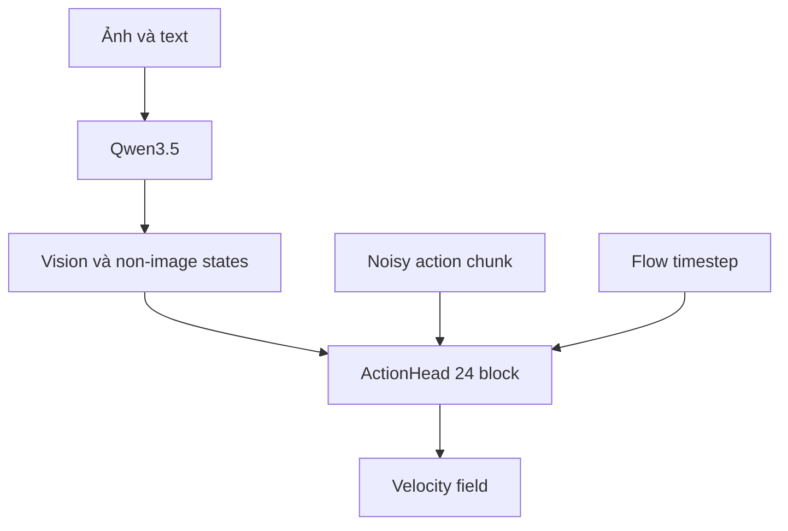

# Kiến trúc model `vla_core`

## Câu hỏi và phạm vi

Báo cáo này sở hữu bốn câu hỏi:

1. model gồm những module nào;
2. config nào thay đổi kiến trúc;
3. Qwen hidden states được ghép với ActionHead ra sao;
4. parameter và loss nào nhận gradient.

Cơ chế attention chi tiết nằm ở [Cơ chế ActionHead](04_action_head_mechanics.md); shape theo
từng phép biến đổi nằm ở [Luồng tensor training](05_training_tensor_flow.md); inference nằm
ở [Luồng inference](06_inference_flow.md).

Nguồn sự thật là working tree cục bộ của `third_party/02_vla_core`, khảo sát ngày
2026-07-26 khi nested repository ở commit
`233396b679b1737a0ad78e3363e99c7e2be31a6c` và có thay đổi chưa commit. Vì vậy local path,
không phải commit hash, mới định danh đúng code được phân tích.

Chưa load được Qwen hoặc chạy forward do thiếu dependency. Parameter count của Qwen và
trạng thái tied weight vì thế là **Unknown**; parameter count của `ActionHead` được tính
tĩnh từ code và config hiện tại.

## Ý tưởng chính

Qwen không trực tiếp sinh action token. Nó cung cấp vision-language hidden states cho một
flow-matching action head riêng:



Qwen trả embedding output và hidden state của từng transformer layer. Action block `i` dùng
Qwen layer `i + 1`; embedding output ở index `0` không được dùng. Với config mặc định, 24
Qwen layer ghép với 24 action block.

## Cây module

```text
VLAModel
├── qwen: Qwen3_5ForConditionalGeneration
│   ├── model.language_model
│   ├── model.visual
│   └── lm_head
├── action_head: ActionHead
│   ├── action_in: Linear(153 -> 1024)
│   ├── pos_embed: Parameter(16, 1024)
│   ├── time_embed: TimestepEmbedding
│   └── model: MLPResNet
│       ├── input_norm: LayerNorm(1024)
│       ├── blocks: 24 x CrossAttentionBlock
│       ├── layer_norm2: LayerNorm(1024)
│       └── fc2: Linear(1024 -> 153)
└── proprio_encoder: ProprioEncoder | None
    └── Linear(P -> 512) -> ReLU
        -> Linear(512 -> 512) -> ReLU
        -> Linear(512 -> 1024)
```

Nguồn: [`model/vla_model.py`](../../../../third_party/02_vla_core/model/vla_model.py),
[`model/action_head.py`](../../../../third_party/02_vla_core/model/action_head.py) và
[`model/proprio_encoder.py`](../../../../third_party/02_vla_core/model/proprio_encoder.py).

## Config làm thay đổi kiến trúc

| Field | Mặc định active | Tác động |
| --- | ---: | --- |
| `qwen_model_id` | `Qwen/Qwen3.5-0.8B` | Chọn backbone và processor |
| `llm_hidden_size` | `1024` | Bị ghi lại từ Qwen config sau khi load |
| `llm_num_layers` | `24` | Bị ghi lại từ Qwen config, nhưng không tự đổi số action block |
| `action_dim` | `153` | Input/output width của ActionHead |
| `num_actions_chunk` | `16` | Số action token và chiều đầu của positional embedding |
| `action_head_hidden_dim` | `1024` | Working width của ActionHead |
| `action_head_num_blocks` | `24` | Số Qwen layer được dùng và số action block |
| `action_head_num_heads` | `8` | `head_dim=128` khi hidden width là 1024 |
| `proprio_dim` | `None` | Không tạo `ProprioEncoder` trong run-1 |
| `train_dtype` | `bfloat16` | Dtype khi load Qwen và tạo action/proprio head |
| `freeze_backbone` | `True` | Freeze `qwen.model.language_model` |
| `freeze_vision` | `True` | Freeze `qwen.model.visual` |
| `num_inference_timesteps` | `4` | Số ActionHead pass trong Euler sampling |

Nguồn: [`model/config.py`](../../../../third_party/02_vla_core/model/config.py).

Các field `vision_out_dim`, `max_cameras` và `image_size` không được `VLAModel` dùng để tạo
layer hoặc validate input. `ActionHead.input_dim` cũng không tạo projection cho conditioning
states. Code do đó ngầm yêu cầu:

```text
Qwen hidden size == action_head_hidden_dim
Qwen layer count >= action_head_num_blocks
```

`VLAModel` cập nhật `llm_hidden_size` và `llm_num_layers` từ backbone runtime nhưng giữ
nguyên action-head config. Đổi Qwen variant có width hoặc layer count khác có thể gây lỗi
matrix shape hoặc indexing.

## Backbone và hidden-state contract

Qwen được load bằng `from_pretrained()` với `attn_implementation="sdpa"` và dtype từ config.
Training forward yêu cầu `output_hidden_states=True` và giả định:

```text
hidden_states = tuple dài N + 1
hidden_states[0]    : embedding output, (B,S,D)
hidden_states[1..N] : transformer layer outputs, (B,S,D)
```

`extract_hidden_states()` stack tuple rồi tách theo `input_ids == image_token_id`:

| Output | Shape | Nội dung |
| --- | --- | --- |
| `vision_hs` | `(B,N+1,Nv_max,D)` | Token có ID bằng `image_token_id` |
| `narrative_hs` | `(B,N+1,Nn_max,D)` | Mọi token khác có `attention_mask=1` |
| `vision_pad_mask` | `(B,Nv_max)` hoặc `None` | Padding thêm khi tách |
| `narrative_pad_mask` | `(B,Nn_max)` hoặc `None` | Padding thêm khi tách |

Tên `narrative_hs` rộng hơn semantics thật: stream chứa chat marker, instruction, task,
history và assistant response, không chỉ narrative tự nhiên.

Nguồn: [`model/utils.py`](../../../../third_party/02_vla_core/model/utils.py) và
[`model/vla_model.py`](../../../../third_party/02_vla_core/model/vla_model.py).

## Proprio encoder

Nếu `proprio_dim=P` dương, proprio `(B,P)` đi qua MLP rồi thành một token `(B,1,1024)`.
Token này được nối sau non-image tokens. Run-1 đặt `proprio_dim=None`, nên module không được
tạo và train loop truyền `proprio=None`.

Với ví dụ cũ `P=23`, MLP có 800.256 parameter, nhưng con số này không áp dụng cho active
run-1. Field order, unit, coordinate frame và timestamp của proprio là **Unknown** vì code
chỉ quy định shape.

## ActionHead và ghép layer

ActionHead khởi tạo action state:

$$
z_0 =
\operatorname{Linear}(x_t)
+ E_{position}
+ E_{time}(t),
$$

với `x_t: (B,16,153)` và `z_0: (B,16,1024)`. Mỗi block sau đó dùng ba K/V source:

- action state hiện tại;
- non-image tokens, cộng proprio token nếu có;
- vision tokens.

Ba score tensor được nối và dùng một softmax chung. Sau 24 block, LayerNorm và
`Linear(1024 -> 153)` trả velocity field `(B,16,153)`.

Đây chỉ là contract kiến trúc. Vision gate, RoPE, attention distribution, conditioning mask
và FFN khác Transformer chuẩn được phân tích duy nhất ở
[Cơ chế ActionHead](04_action_head_mechanics.md).

Layer mapping:

```text
Action block 0  <- Qwen hidden_states[1]
...
Action block 23 <- Qwen hidden_states[24]
```

Code không assert số block khớp số Qwen layer. Ít block hơn sẽ bỏ các Qwen layer cuối; nhiều
block hơn gây index out of range.

## Parameter count của ActionHead

Phép tính tĩnh dùng `D=1024`, `A=153`, `T=16`, 24 block và 8 head:

| Thành phần | Parameter |
| --- | ---: |
| `action_in` | 157.696 |
| `pos_embed` | 16.384 |
| `time_embed` | 2.099.200 |
| Một `CrossAttentionBlock` | 9.448.449 |
| 24 block | 226.762.776 |
| Norm và output projection | 160.921 |
| **Tổng `ActionHead`** | **229.196.977** |

Khoảng 98,9% parameter ActionHead nằm trong 24 block. Tổng này gồm bias, LayerNorm affine
parameter và 24 scalar vision gate; chưa gồm Qwen hoặc proprio encoder.

## Loss và gradient graph

Với ground-truth action $a$, noise $\epsilon$ và timestep $t$:

$$
x_t=(1-t)\epsilon+ta,\qquad v^*=a-\epsilon.
$$

ActionHead dự đoán $\hat v$ và tối ưu masked MSE. Gradient chắc chắn đi qua ActionHead, và
qua `ProprioEncoder` nếu module tồn tại và được cấp input.

Qwen đồng thời nhận labels và trả narrative LM loss:

$$
\mathcal L =
\mathcal L_{flow}
+ 0.1\mathcal L_{narrative}.
$$

Language model và vision module mặc định bị freeze. Narrative loss không đi qua ActionHead;
nó chỉ có thể cập nhật Qwen parameter còn `requires_grad=True`. Trạng thái `lm_head` là
**Unknown** cho tới khi load model và kiểm tra tied weights.

Training encode sequence có ground-truth assistant response, còn `predict_action()` encode
narrative do model sinh. Leakage riêng do cách tạo task/narrative target được sở hữu bởi
[báo cáo dữ liệu](02_data_and_training.md).

## Trạng thái bằng chứng và invariant

**Verified bằng đọc code tĩnh**

- `action_dim` phải đồng nhất giữa config, dataset và output projection;
- `num_actions_chunk` phải đồng nhất giữa config, dataset và `pos_embed`;
- action-head width phải bằng Qwen hidden width;
- số action block không được lớn hơn số Qwen layer;
- pad mask phải khớp chiều key sau khi tách stream;
- nếu thêm proprio token, adapter mask phải thêm một cột `False`.

**Inferred risk**

- đổi backbone không tự đồng bộ ActionHead;
- action head khoảng 229,2M parameter, nên bốn Euler step cần benchmark thay vì mặc định xem
  là nhẹ;
- `predicted_actions` mang hai semantics: velocity ở training và sampled action ở một số
  inference path.

**Unknown**

- parameter count và trainable set chính xác của Qwen revision được load;
- `lm_head` tied hay untied;
- action có được normalize upstream hay không;
- tác động định lượng của per-layer conditioning;
- VRAM, latency và throughput.

## Kiểm chứng tối thiểu tiếp theo

1. Load model, in trainable parameter và kiểm tra riêng `qwen.lm_head` cùng tied-weight
   identity.
2. Assert hidden width, layer count và action shape ngay khi khởi tạo.
3. Chạy shape smoke test với batch có text/image length khác nhau.
4. Profile một Qwen encode và bốn ActionHead forward riêng biệt.

## Nguồn code cục bộ

- [`model/vla_model.py`](../../../../third_party/02_vla_core/model/vla_model.py)
- [`model/action_head.py`](../../../../third_party/02_vla_core/model/action_head.py)
- [`model/proprio_encoder.py`](../../../../third_party/02_vla_core/model/proprio_encoder.py)
- [`model/utils.py`](../../../../third_party/02_vla_core/model/utils.py)
- [`model/config.py`](../../../../third_party/02_vla_core/model/config.py)
