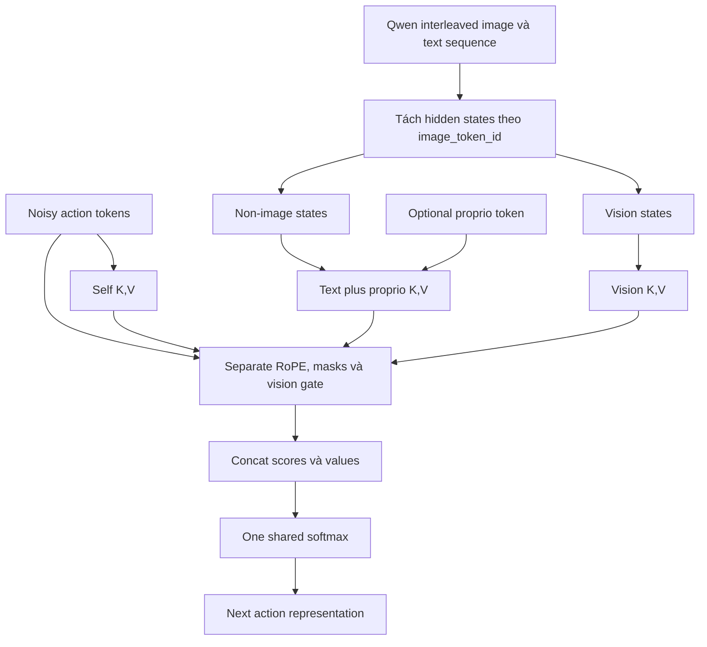

 

# Cơ chế riêng của `vla_core` ActionHead

## Câu hỏi và phạm vi

Báo cáo này chỉ trả lời:

> `ActionHead` của `vla-core` có những cơ chế đặc thù nào, đặc biệt trong cách
> tách và hợp nhất vision, text, proprioception và action features?

Các thành phần Transformer thông thường như linear projection, multi-head
reshape, scaled dot-product, output projection và residual chỉ được nhắc khi
implementation của `vla-core` làm chúng có hành vi khác thường. Cây module,
parameter count và toàn bộ `VLAModel` đã nằm trong
[báo cáo kiến trúc model](03_model_architecture.md), nên không lặp lại ở đây.

Nguồn sự thật là working tree
`third_party/02_vla_core` tại commit
`233396b679b1737a0ad78e3363e99c7e2be31a6c`, kiểm tra ngày 2026-07-26.

## Câu trả lời ngắn

Điểm độc đáo nhất không phải là một projector multimodal mới. Luồng thực tế là:

1. Qwen xử lý image và text trong **một sequence interleaved**;
2. hidden state của sequence được tách thành vision và non-image streams ở mọi Qwen layer;
3. mỗi action block lấy query chỉ từ action tokens, nhưng tạo ba nhóm key/value riêng cho action, text/proprio và vision;
4. ba nhóm score được nối lại và đi qua **một shared softmax**.

Vì vậy attention cuối cùng vẫn tương đương một attention operation trên một
concatenated memory, nhưng mỗi nhóm đã đi qua K/V weights, RoPE indexing, mask
và gating khác nhau trước khi cạnh tranh chung attention probability.



## 1. Feature separation xảy ra sau Qwen, trước ActionHead

Image và text không đi qua hai encoder độc lập trong `vla-core`. Qwen nhận một
multimodal sequence và trả:

```text
hidden_states[l]: (B, S, D)
```

cho embedding output và mọi transformer layer. `extract_hidden_states()` sau đó
dùng:

```python
vision_mask = input_ids == image_token_id
narrative_mask = ~vision_mask & attention_mask
```

để tạo:

```text
vision_hs:    (B, L, Nvision, D)
narrative_hs: (B, L, Ntext, D)
```

Tên `narrative_hs` dễ gây hiểu nhầm: nó chứa mọi token hợp lệ không phải image,
bao gồm chat marker, instruction, prompt, history và assistant target; không chỉ
chứa narrative tự nhiên.

**Tác động đặc thù:** thứ tự token bên trong từng stream được giữ, nhưng quan hệ
vị trí interleaved ban đầu giữa image và text không còn được đưa trực tiếp vào
ActionHead. ActionHead áp dụng một hệ RoPE mới trên từng stream đã compact.

Nguồn:
[`extract_hidden_states()`](../../../../third_party/02_vla_core/model/utils.py)
và
[`VLAModel.forward()`](../../../../third_party/02_vla_core/model/vla_model.py).

## 2. Không có standalone vision/text projector

Sau khi split, không có module kiểu:

```text
vision_projector(VisionD -> ActionD)
text_projector(TextD -> ActionD)
```

`ActionHead.input_dim` được nhận trong constructor nhưng không được dùng để tạo
projection cho conditioning features. Code ngầm yêu cầu:

```text
Qwen hidden width == ActionHead hidden width
```

Với run-1, cả hai là `1024`.

Tuy nhiên, điều này không có nghĩa vision và text đi thẳng vào cùng weights.
Mỗi `CrossAttentionBlock` vẫn có K/V projections riêng:

```text
action          -> k_self,    v_self
text + proprio  -> k_adapter, v_adapter
vision          -> k_task,    v_task
```

Do đó không có **projector trước ActionHead**, nhưng có **modal-specific K/V
projection bên trong từng block**.

Nguồn:
[`ActionHead.__init__()`](../../../../third_party/02_vla_core/model/action_head.py)
và
[`CrossAttentionBlock.__init__()`](../../../../third_party/02_vla_core/model/action_head.py).

## 3. Một action block ghép với một Qwen layer

ActionHead không chỉ dùng last-layer hidden state. Với block `i`, code truyền:

```python
h_a = narrative_hs[:, i + 1]
h_t = vision_hs[:, i + 1]
```

Index `0`, tức embedding output, bị bỏ qua. Cấu hình mặc định ghép:

```text
Qwen layer 1  -> Action block 1
Qwen layer 2  -> Action block 2
...
Qwen layer 24 -> Action block 24
```

Đây là **layer-wise conditioning**: representation của action được cập nhật tuần
tự bằng feature ở độ sâu tăng dần của Qwen.

Code không assert invariant số block bằng số Qwen layers:

- nhiều block hơn Qwen layers sẽ truy cập vượt index;
- ít block hơn sẽ bỏ qua các Qwen layer cuối;
- đổi backbone width còn có thể gây lỗi projection shape vì không có standalone
  projector.

Nguồn:
[`MLPResNet.forward()`](../../../../third_party/02_vla_core/model/action_head.py).

## 4. Ba K/V streams nhưng chỉ một attention distribution

Query luôn được tạo từ action representation hiện tại:

$$
Q=W_Qx.
$$

Ba nhóm score là:

$$
S_\text{self}=QK_\text{self}^{T},
\qquad
S_\text{adapter}=QK_\text{text+prop}^{T},
\qquad
S_\text{vision}=gQK_\text{vision}^{T}.
$$

Sau preprocessing riêng, code thực hiện:

$$
A=\operatorname{softmax}
\left(
\frac{
[S_\text{self};S_\text{adapter};S_\text{vision}]
}{\sqrt{d_h}}
\right),
$$

rồi:

$$
Y=A[V_\text{self};V_\text{adapter};V_\text{vision}].
$$

Đây không phải ba attention modules độc lập. Không có:

```text
softmax(self) + softmax(text) + softmax(vision)
```

Thay vào đó, action, text/proprio và vision keys cạnh tranh trong cùng một
probability budget. Sau khi đã áp dụng stream-specific transformations, cơ chế
này có thể được hiểu như **một attention block trên concatenated KV memory**.

Nguồn:
[`CrossAttentionBlock.forward()`](../../../../third_party/02_vla_core/model/action_head.py).

## 5. Proprioception không phải stream thứ tư

Nếu có proprio feature `(B,1,D)`, code nối nó sau narrative tokens:

```python
h_adapter = cat([narrative, proprio], dim=1)
```

Proprioception vì vậy:

- dùng chung `k_adapter/v_adapter` với text;
- nhận vị trí cuối trong adapter RoPE sequence;
- cạnh tranh trong cùng adapter/vision/self shared softmax;
- được nối thêm một cột `False` vào narrative padding mask.

Run-1 hiện đặt `proprio_dim=None`, nên nhánh này không active trong training
pipeline mặc định.

Nguồn:
[`CrossAttentionBlock.forward()`](../../../../third_party/02_vla_core/model/action_head.py),
[`ActionHead.forward()`](../../../../third_party/02_vla_core/model/action_head.py)
và
[`VLAConfig`](../../../../third_party/02_vla_core/model/config.py).

## 6. RoPE được reset và áp dụng độc lập cho từng stream

Mỗi block tạo ba positional sequences:

```text
action positions:       0 .. T-1
text/proprio positions: 0 .. Kadapter-1
vision positions:       0 .. Kvision-1
```

Action query và self key dùng action RoPE. Adapter key và vision key dùng RoPE
riêng theo chiều dài stream tương ứng. Value không được rotate.

Hệ quả:

- cross-modal position gốc trong Qwen sequence không được bảo toàn;
- text index `j` và vision index `j` cùng bắt đầu từ zero dù chúng từng ở các vị
  trí khác nhau trong interleaved sequence;
- proprio token nhận vị trí tiếp theo sau text, không có proprio-specific
  positional encoding.

Đây là lựa chọn kiến trúc thực tế của code. **Unknown:** chưa có ablation để biết
reset RoPE theo modality giúp hay làm mất thông tin alignment.

Nguồn:
[`RotaryPositionEmbedding`](../../../../third_party/02_vla_core/model/action_head.py)
và phần `RoPE (separate for each stream)` trong
[`CrossAttentionBlock.forward()`](../../../../third_party/02_vla_core/model/action_head.py).

### Inconsistency trong cách ghép rotary pair

**Verified bằng đọc công thức:** implementation hiện ghép frequency không nhất quán với
`rotate_half()`:

```text
inv_freq                         : (64,) khi head_dim=128
freqs                            : (K,64)
cat([freqs,freqs], dim=-1)       : (K,128)
rotate_half(x) ghép coordinate   : (0,1), (2,3), ..., (126,127)
```

Với even/odd rotation, hai coordinate trong một cặp phải dùng cùng góc. Nhưng
`cat([freqs,freqs])` tạo thứ tự
`[theta_0,...,theta_63,theta_0,...,theta_63]`, khiến cặp `(0,1)` thường nhận hai góc khác
nhau. Phép biến đổi khi đó không còn là rotation 2D chuẩn cho từng cặp.

Hai cách sửa nhất quán là giữ even/odd `rotate_half()` và dùng
`repeat_interleave(freqs,2,dim=-1)`, hoặc giữ `cat([freqs,freqs])` và đổi sang split-half
rotation. Tác động định lượng lên training vẫn **Unknown** vì chưa có runtime/ablation.

## 7. Vision gate scale logits, không tắt vision contribution

Mỗi block có một scalar:

```python
gating_factor = Parameter(0)
g = tanh(gating_factor)
scores_vision = (Q @ K_vision.T) * g
```

Khi khởi tạo, `g=0`, nên mọi vision logit bằng zero. Tuy nhiên vision values vẫn
nằm trong shared softmax:

$$
\exp(0)=1.
$$

Do đó vision tokens vẫn có attention probability và vẫn có thể ảnh hưởng output
ngay ở initialization. Gate này chỉ scale **vision logits**; nó không phải
hard gate trên vision value hoặc vision output.

Gate còn có các đặc điểm:

- một scalar riêng cho mỗi action block;
- dùng chung cho mọi head, action step và vision token trong block;
- có thể âm vì đi qua `tanh`, khi đó dot-product ranking của vision keys bị đảo
  dấu thay vì chỉ giảm biên độ.

Điểm cuối là **Inferred** trực tiếp từ công thức, chưa được đo trong runtime.

Nguồn:
[`CrossAttentionBlock.gating_factor`](../../../../third_party/02_vla_core/model/action_head.py)
và
[`scores_task`](../../../../third_party/02_vla_core/model/action_head.py).

## 8. Action tokens là noisy trajectory, không phải learned queries

ActionHead bắt đầu từ:

$$
z_0 =
\operatorname{Linear}(x_t)
+E_\text{step}
+E_\text{flow-time}(t).
$$

Trong đó:

- `x_t` là ground-truth action trộn với Gaussian noise khi train, hoặc Gaussian
  noise hiện tại khi inference;
- `E_step` là learned positional embedding riêng cho từng action step;
- flow timestep đi qua sinusoidal features và MLP, rồi được cộng giống nhau vào
  mọi action step.

Action chunk self-attend không causal: mọi future step trong chunk có thể trao
đổi thông tin ở mỗi block. Head dự đoán toàn bộ velocity field song song, không
autoregressively sinh từng action.

Đây là khác biệt quan trọng với decoder dùng một bộ learned action queries cố
định: chính noisy trajectory là nội dung query ban đầu.

Nguồn:
[`ActionHead.forward()`](../../../../third_party/02_vla_core/model/action_head.py)
và
[`TimestepEmbedding`](../../../../third_party/02_vla_core/model/action_head.py).

## 9. Conditioning mask và action-loss mask nằm ở hai nơi khác nhau

Trong ActionHead:

- `vision_key_padding_mask` chặn padded vision keys;
- `narrative_key_padding_mask` chặn padded text keys;
- action self-attention không có causal mask;
- không có action-validity mask trong attention.

Sau ActionHead, `VLAModel._compute_flow_loss()` mới áp dụng `action_mask` lên
velocity MSE. Với run-1, mask có thể có shape `(B,T,D)`, cho phép bỏ riêng từng
hand block.

Vì vậy một invalid/padded action target vẫn có representation tham gia
self-attention trong head; nó chỉ bị loại khỏi loss trực tiếp. **Inferred:** token
đó vẫn có thể ảnh hưởng các valid action tokens qua self-attention, nên loss
masking không tương đương attention masking.

Nguồn:
[`CrossAttentionBlock.forward()`](../../../../third_party/02_vla_core/model/action_head.py)
và
[`VLAModel._compute_flow_loss()`](../../../../third_party/02_vla_core/model/vla_model.py).

## 10. Phần sau attention không phải Transformer FFN chuẩn

Sau attention output projection, block thực hiện:

```python
x = LayerNorm(output + x)
x = Linear(D, D)
x = ReLU()
```

Không có:

- FFN expansion `D -> 4D -> D`;
- residual thứ hai quanh FFN;
- pre-norm riêng trước attention.

Vì vậy tên `MLPResNet` hoặc “residual block” không nên được diễn giải là một
Transformer block chuẩn. Residual chỉ xuất hiện trong input của chuỗi
`LayerNorm -> Linear -> ReLU`; output cuối không cộng lại identity lần nữa.

Nguồn:
[`CrossAttentionBlock.ffn`](../../../../third_party/02_vla_core/model/action_head.py)
và cuối
[`CrossAttentionBlock.forward()`](../../../../third_party/02_vla_core/model/action_head.py).

## 11. Output của head là velocity, không phải action

Linear cuối trả tensor cùng shape action chunk, nhưng semantics là:

```text
training: predicted velocity a - noise
inference: velocity dùng cho một Euler update
```

ActionHead không tự tạo action hoàn chỉnh. `VLAModel.sample_actions()` gọi lại
cùng head ở mỗi denoising timestep và cập nhật:

$$
x \leftarrow x + \Delta t\,\hat v(x,t).
$$

Với cấu hình mặc định, head chạy bốn lần cho một sampled action chunk. Tên
`predicted_actions` trong training output vì vậy dễ gây nhầm: tensor đó vẫn là
velocity field.

Nguồn:
[`VLAModel.forward()`](../../../../third_party/02_vla_core/model/vla_model.py)
và
[`VLAModel.sample_actions()`](../../../../third_party/02_vla_core/model/vla_model.py).

## Những phần có thể xem là attention thông thường

Báo cáo không phân tích sâu các phần sau vì chúng không tạo semantics riêng cho
model:

- reshape `D` thành nhiều attention heads;
- scale logits bằng `sqrt(head_dim)`;
- weighted sum của values;
- concatenate heads và output projection;
- LayerNorm đầu/cuối của toàn `MLPResNet`;
- final linear projection từ hidden width về action dimension.

## Verified, inferred và unknown

### Verified từ code

- Qwen feature được tách thành vision và non-image streams trước ActionHead.
- Các stream có K/V projection và RoPE riêng, nhưng dùng một shared softmax.
- Proprioception được ghép vào text adapter stream.
- Mỗi action block nhận một Qwen layer tương ứng.
- Vision gate scale logits và không hard-disable vision values khi gate bằng
  zero.
- RoPE tạo frequency theo split-half order nhưng `rotate_half()` ghép even/odd,
  nên rotary pair hiện không nhận cùng một góc.
- Action tokens là noisy trajectory cộng step/time embeddings.
- Head output velocity field; action được tạo bởi Euler loop bên ngoài head.

### Inferred từ implementation

- Shared softmax làm ba stream cạnh tranh trực tiếp probability mass.
- RoPE reset làm mất cross-modal positional relation của interleaved Qwen
  sequence ở ranh giới ActionHead.
- Action-loss masking không ngăn invalid action tokens ảnh hưởng valid tokens qua
  self-attention.
- Gate âm có thể đảo ranking của vision logits.

### Unknown

- Vision zero-gate hiện tại là chủ ý hay lỗi thiết kế.
- All-layer conditioning tốt hơn last-layer conditioning bao nhiêu.
- Separate-stream RoPE tốt hơn giữ Qwen positions hoặc dùng no extra RoPE không.
- Shared softmax tốt hơn separate modality attentions không.
- Các test hiện có kiểm shape, gradient và padding isolation, nhưng chưa có
  ablation/test cho bốn câu hỏi trên.

## Kiểm chứng tiếp theo nên ưu tiên

1. Test vision contribution tại `gating_factor=0`, rồi so sánh logit gating với
   output/contribution gating.
2. Log attention mass theo `self`, `text/proprio` và `vision` cho từng block để
   biết shared softmax phân bổ budget ra sao.
3. Ablate all-layer pairing với last-layer-only conditioning trên cùng
   checkpoint/data.
4. Sửa hoặc test riêng inconsistency trong rotary pair trước khi ablate positional scheme.
5. So sánh modality-reset RoPE với preserved Qwen positions và no-extra-RoPE.
6. Thử action attention mask bên trong head cho padded/invalid future steps.

## Nguồn

- [`model/action_head.py`](../../../../third_party/02_vla_core/model/action_head.py)
- [`model/utils.py`](../../../../third_party/02_vla_core/model/utils.py)
- [`model/vla_model.py`](../../../../third_party/02_vla_core/model/vla_model.py)
- [`model/config.py`](../../../../third_party/02_vla_core/model/config.py)
- [`tests/test_action_head.py`](../../../../third_party/02_vla_core/tests/test_action_head.py)
- [Kiến trúc toàn model](03_model_architecture.md)
