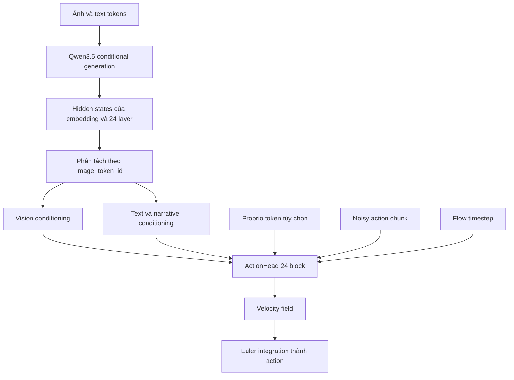
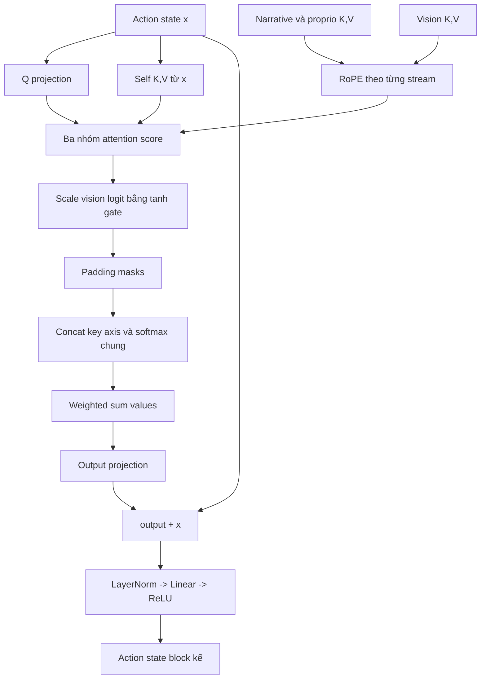

# Cấu trúc chi tiết của model `vla_core`

## Câu hỏi và phạm vi

Báo cáo này trả lời ba câu hỏi:

1. model gồm những khối nào và tensor đi qua chúng với shape gì;
2. action head dùng hidden state của Qwen như thế nào;
3. parameter nào được train, loss nào tác động tới đâu và invariant nào phải giữ.

Nguồn sự thật là code tại nested-repo commit
`4c0f2d86d46df8935ade3f5c63ef83013d6c15a6`, kiểm tra ngày 2026-07-24. Chưa load được
Qwen hoặc chạy forward vì môi trường thiếu PyTorch/Transformers, nên parameter count của
Qwen và trạng thái tied weight được đánh dấu **Unknown**. Parameter count của `ActionHead`
được tính tĩnh trực tiếp từ layer definition và config mặc định.

## Ý tưởng chính

Model không dự đoán action trực tiếp bằng token của Qwen. Qwen đóng vai trò encoder
vision-language, còn một action head riêng học trường vận tốc flow:



Qwen hidden state không bị reduce thành một vector duy nhất. Mỗi trong 24 action block nhận
hidden state của một Qwen transformer layer tương ứng. Đây là phần quyết định cấu trúc và
chi phí của model.

## Cây module

```text
VLAModel
├── qwen: Qwen3_5ForConditionalGeneration
│   ├── model.language_model
│   ├── model.visual
│   └── lm_head                         # vị trí/trạng thái tie phụ thuộc model runtime
├── action_head: ActionHead
│   ├── action_in: Linear(153 -> 1024)
│   ├── pos_embed: Parameter(16, 1024)
│   ├── time_embed: TimestepEmbedding
│   │   └── Linear(1024 -> 1024) -> SiLU -> Linear(1024 -> 1024)
│   └── model: MLPResNet
│       ├── input_norm: LayerNorm(1024)
│       ├── blocks: 24 x CrossAttentionBlock
│       ├── layer_norm2: LayerNorm(1024)
│       └── fc2: Linear(1024 -> 153)
└── proprio_encoder: ProprioEncoder | None
    └── Linear(P -> 512) -> ReLU
        -> Linear(512 -> 512) -> ReLU
        -> Linear(512 -> 1024)
```

Nguồn:
[`VLAModel.__init__`](https://github.com/VietnamRobotics/vla_core/blob/4c0f2d86d46df8935ade3f5c63ef83013d6c15a6/model/vla_model.py#L55),
[`ActionHead`](https://github.com/VietnamRobotics/vla_core/blob/4c0f2d86d46df8935ade3f5c63ef83013d6c15a6/model/action_head.py#L293),
[`ProprioEncoder`](https://github.com/VietnamRobotics/vla_core/blob/4c0f2d86d46df8935ade3f5c63ef83013d6c15a6/model/proprio_encoder.py#L13).

## Config làm thay đổi kiến trúc

| Nhóm | Mặc định active | Tác động |
| --- | ---: | --- |
| `qwen_model_id` | `Qwen/Qwen3.5-0.8B` | Chọn backbone và tokenizer/processor tương ứng |
| `llm_hidden_size` | `1024` | Bị ghi lại từ Qwen config sau khi load |
| `llm_num_layers` | `24` | Bị ghi lại từ Qwen config nhưng không tự đổi số action block |
| `action_dim` | `153` | Input/output width của action head |
| `num_actions_chunk` | `16` | Số action token và chiều đầu của positional embedding |
| `action_head_hidden_dim` | `1024` | Working width của toàn action head |
| `action_head_num_blocks` | `24` | Số layer Qwen được tiêu thụ và số cross-attention block |
| `action_head_num_heads` | `8` | `head_dim = 128` khi hidden width là 1024 |
| `proprio_dim` | `None` | Không instantiate `ProprioEncoder` trong run-1 |
| `train_dtype` | `bfloat16` | Dtype của Qwen load và action/proprio head |
| `freeze_backbone` | `True` | Freeze `qwen.model.language_model` |
| `freeze_vision` | `True` | Freeze `qwen.model.visual` |
| `num_inference_timesteps` | `4` | Số lần action head chạy trong Euler sampling |

Nguồn: [`model/config.py`](https://github.com/VietnamRobotics/vla_core/blob/4c0f2d86d46df8935ade3f5c63ef83013d6c15a6/model/config.py).

Các field `vision_out_dim`, `max_cameras` và `image_size` hiện không được `VLAModel` dùng để
tạo layer hoặc validate input. `ActionHead.input_dim` cũng được nhận nhưng không tạo projection
cho conditioning states. Vì vậy code ngầm yêu cầu:

```text
Qwen hidden size == action_head_hidden_dim == 1024
```

`VLAModel` cập nhật `llm_hidden_size` từ backbone runtime nhưng giữ nguyên
`action_head_hidden_dim=1024`. Đổi sang Qwen variant có width khác sẽ gây lỗi matrix shape nếu
không đồng thời đổi action-head config.

## Backbone Qwen và hidden-state contract

### Khởi tạo và freeze

Qwen được load bằng `from_pretrained()` với `attn_implementation="sdpa"` và dtype lấy từ
config. Code copy `VLAConfig` trước khi ghi lại hidden size, layer count và image token ID,
tránh mutate config do caller giữ
([`vla_model.py:60-81`](https://github.com/VietnamRobotics/vla_core/blob/4c0f2d86d46df8935ade3f5c63ef83013d6c15a6/model/vla_model.py#L60)).

Khi freeze mặc định:

```text
qwen.model.language_model.parameters() -> requires_grad = False
qwen.model.visual.parameters()         -> requires_grad = False
```

**Unknown:** code không freeze rõ `qwen.lm_head`. Chưa có model instance để xác nhận output
head có parameter riêng, được tie với embedding đã freeze, hay được tổ chức khác trong
revision Transformers thực tế.

### Tensor Qwen trả về

Training forward yêu cầu `output_hidden_states=True`. Contract được code giả định:

```text
hidden_states = tuple dài N + 1
hidden_states[l]: (B, S, D)

l = 0      embedding output
l = 1..N   output từng transformer layer
```

Với mặc định, `N=24`, `D=1024`.

`extract_hidden_states()` stack thành `(B, N+1, S, D)`, rồi tách theo vị trí
`input_ids == image_token_id`
([`model/utils.py:13-84`](https://github.com/VietnamRobotics/vla_core/blob/4c0f2d86d46df8935ade3f5c63ef83013d6c15a6/model/utils.py#L13)):

| Output | Shape | Nội dung |
| --- | --- | --- |
| `vision_hs` | `(B, N+1, Nv_max, D)` | Token có ID bằng `image_token_id` |
| `narrative_hs` | `(B, N+1, Nn_max, D)` | Mọi token còn lại có `attention_mask=1` |
| `vision_pad_mask` | `(B, Nv_max)` hoặc `None` | `True` tại padding được thêm khi tách |
| `narrative_pad_mask` | `(B, Nn_max)` hoặc `None` | `True` tại padding được thêm khi tách |

“Narrative” trong tên biến không chỉ là câu narrative. Stream này còn chứa chat marker,
instruction, task, history và assistant response.

## Proprio encoder

Nếu `proprio_dim=P` là số dương, proprio vector `(B, P)` đi qua MLP rồi được `unsqueeze(1)`
thành một token `(B, 1, 1024)`. Token này được nối **sau narrative tokens**, không có
positional embedding riêng ngoài vị trí nó nhận trong attention key sequence.

Run-1 đặt `proprio_dim=None`, nên module không được instantiate và train loop luôn truyền
`proprio=None`. Với ví dụ cũ `P=23`, MLP có `800.256` parameter; con số này không áp dụng cho
run-1 active model.

Code chỉ định shape, không định nghĩa field order, unit, coordinate frame hoặc timestamp của
proprio. Đây là **Unknown** cần contract ngoài repo.

## ActionHead trước các attention block

### Ba embedding được cộng

Action head tạo representation ban đầu:

$$
z_0 =
\operatorname{Linear}(x_t)
+ E_{position}
+ E_{time}(t)
$$

Trong đó:

- $x_t$: noisy action `(B, 16, 153)`;
- `action_in`: chiếu từng step `153 -> 1024`;
- `pos_embed`: learned parameter `(16, 1024)`;
- `time_embed`: sinusoidal features → MLP, tạo `(B, 1024)` rồi broadcast qua 16 step.

Kết quả `z_0` có shape `(B, 16, 1024)`.

Positional embedding là cần thiết vì toàn bộ 16 action step được self-attend không causal;
model dự đoán cả chunk song song, không autoregressive theo action time.

### Timestep embedding

Với hidden width `D`, code tạo `D/2` frequency theo exponential schedule, concatenate cosine
và sine rồi qua hai linear layer có SiLU ở giữa
([`TimestepEmbedding`](https://github.com/VietnamRobotics/vla_core/blob/4c0f2d86d46df8935ade3f5c63ef83013d6c15a6/model/action_head.py#L204)).
Embedding này được cộng giống nhau vào mọi step; step identity đến từ `pos_embed`.

## Một `CrossAttentionBlock`

Mỗi block nhận action state `x: (B, T, D)` và conditioning từ đúng một Qwen layer:



### Projection và multi-head shape

Với `D=1024`, `H=8`, mỗi head có `128` chiều. Block có:

- một query projection từ action;
- ba cặp key/value cho self, narrative/proprio và vision;
- một output projection;
- một FFN gồm `LayerNorm(1024) -> Linear(1024,1024) -> ReLU`.

Score shapes trước khi nối:

| Stream | Score shape |
| --- | --- |
| Action self-attention | `(B, 8, 16, 16)` |
| Narrative/proprio | `(B, 8, 16, Nn [+1])` |
| Vision | `(B, 8, 16, Nv)` |

Ba score tensor được nối trên key axis, chia cho `sqrt(128)` rồi dùng **một softmax chung**.
Do đó ba nguồn cạnh tranh cùng một attention budget; chúng không có ba softmax độc lập rồi
fusion sau.

### RoPE

Action query và self key dùng vị trí action `0..15`. Narrative/proprio key và vision key
được rotate theo index trong từng stream riêng. Code không dùng Qwen position ID gốc sau khi
tách token; vị trí vision/narrative được nén lại thành hai sequence độc lập.

**Inferred:** cách này giữ thứ tự nội bộ mỗi stream nhưng mất khoảng cách/vị trí tương đối
giữa image token và text token trong sequence Qwen gốc. Chưa có ablation để biết ảnh hưởng.

### Vision gate không phải hard gate

Mỗi block có scalar `gating_factor` khởi tạo `0`, và code tính:

```text
scores_vision = (Q @ K_vision^T) * tanh(gating_factor)
```

Khi gate bằng `0`, vision logits bằng `0`, nhưng vision values vẫn nằm trong softmax chung.
Chúng vẫn nhận xác suất khác 0 nếu các score còn lại hữu hạn. Vì vậy gate này điều chỉnh độ
sắc/độ lớn của vision logits chứ không triệt tiêu vision contribution lúc khởi tạo.

Đây là **Inferred implementation risk** từ công thức
([`action_head.py:139-192`](https://github.com/VietnamRobotics/vla_core/blob/4c0f2d86d46df8935ade3f5c63ef83013d6c15a6/model/action_head.py#L139));
cần unit test số nếu ý định thiết kế là zero-init vision branch.

### “Residual block” không phải Transformer block chuẩn

Code cộng attention output với `x`, nhưng sau đó thay toàn bộ state bằng:

```text
x_next = ReLU(Linear(LayerNorm(attention_output + x)))
```

Không có residual thứ hai quanh FFN, và FFN chỉ có một linear thay vì expansion–activation–
projection thường gặp trong Transformer. Tên `MLPResNet`/“residual block” nên được hiểu theo
implementation này, không suy ra kiến trúc Transformer FFN chuẩn.

## Ghép 24 block với 24 Qwen layer

`MLPResNet.forward()` lặp block index `i` và truyền:

```text
narrative_hs[:, i + 1]
vision_hs[:, i + 1]
```

Embedding output tại layer `0` bị bỏ qua. Với mặc định:

```text
Action block 0  <- Qwen layer 1
Action block 1  <- Qwen layer 2
...
Action block 23 <- Qwen layer 24
```

Code không assert `action_head_num_blocks == llm_num_layers`:

- ít block hơn: chỉ dùng các Qwen layer đầu;
- nhiều block hơn số Qwen layer: index out of range;
- đổi backbone không tự đồng bộ block count.

Sau block cuối, `LayerNorm(1024)` và `Linear(1024 -> 153)` trả velocity field
`(B, 16, 153)`.

## Parameter count của ActionHead

Đây là phép tính tĩnh với config run-1 `D=1024`, `A=153`, `T=16`, 24 block và 8 head:

| Thành phần | Parameter |
| --- | ---: |
| `action_in` | 157.696 |
| `pos_embed` | 16.384 |
| `time_embed` | 2.099.200 |
| Một `CrossAttentionBlock` | 9.448.449 |
| 24 cross-attention block | 226.762.776 |
| Norm + output projection trong `MLPResNet` | 160.921 |
| **Tổng `ActionHead`** | **229.196.977** |

Khoảng `98,9%` parameter action head nằm trong 24 block. Vì vậy dù README gọi đây là head
trên backbone 0.8B, nó vẫn là một module khoảng 229,2M parameter, không phải projection head
nhỏ. Con số đã gồm bias, LayerNorm affine parameter và 24 scalar vision gate; chưa gồm Qwen
hoặc proprio encoder.

Phép tính:

```text
Linear(I,O) = I*O + O
LayerNorm(D) = 2*D

CrossAttentionBlock
= 9 * Linear(1024,1024)
 + LayerNorm(1024)
 + 1 gate
= 9.448.449
```

Chín linear gồm tám attention projection và một linear trong FFN.

## Graph training và gradient

### Flow branch

Với action ground truth $a$, noise $\epsilon$ và timestep $t$:

$$
x_t=(1-t)\epsilon+ta,\qquad v^\*=a-\epsilon
$$

Action head dự đoán $\hat{v}$ và tối ưu masked MSE. Gradient chắc chắn đi qua toàn bộ
`ActionHead`, và qua `ProprioEncoder` nếu module tồn tại và proprio được truyền.

Action mask active có shape `(B,16,153)`, dù docstring của `VLAModel.forward()` còn mô tả
shape cũ `(B,16)`. Head block luôn valid; mỗi hand block dùng `valid` riêng.

### Narrative branch

Qwen nhận labels và trả narrative LM loss. Total loss:

$$
\mathcal{L}
=
\mathcal{L}_{flow}
+0.1\mathcal{L}_{narrative}
$$

Inner language model và vision module mặc định bị freeze. Narrative loss không đi qua
`ActionHead`; nó chỉ có thể cập nhật Qwen parameter còn `requires_grad=True`, nếu có.
Trạng thái `lm_head` là **Unknown** cho tới khi load model và in trainable parameter.

Một điểm khác biệt train/inference:

- training re-encode chuỗi chứa ground-truth assistant response;
- `predict_action()` sinh narrative rồi re-encode narrative do model tạo.

Đây là teacher-forcing distribution gap thông thường. Trong code hiện tại còn có leakage
riêng ở collator: narrative target đã xuất hiện trong user `task` trước khi được lặp lại làm
assistant target. Chi tiết nằm ở
[báo cáo dữ liệu và training](02_data_and_training.md).

## Graph inference

`predict_action()` thực hiện:

1. greedy narrative generation với tối đa 128 token;
2. re-encode full generated sequence để lấy hidden states mọi layer;
3. tạo Gaussian action noise;
4. chạy ActionHead bốn lần tại `t = 0, 0.25, 0.5, 0.75`;
5. cập nhật Euler `x <- x + 0.25 * velocity`.

Narrative generation deterministic vì `do_sample=False`, nhưng action output vẫn stochastic
do Gaussian noise. `sample_actions()` có nhận `torch.Generator`; `predict_action()` không
expose generator, nên API top-level chưa cung cấp reproducibility control.

`VLAModel.forward(actions_gt=None)` không generate narrative; nó lấy hidden states từ input
được truyền và sample action trực tiếp. Vì vậy:

- `forward(..., actions_gt=None)` là prompt/full-sequence conditioned sampling;
- `predict_action()` là generate-narrative-then-sample.

Hai API không có cùng inference semantics.

## Tensor contract end-to-end

| Điểm | Tensor | Shape run-1 |
| --- | --- | --- |
| Qwen text input | `input_ids`, `attention_mask` | `(B, S)` |
| Qwen visual input | `pixel_values` | Processor-dependent patch stream |
| Qwen visual grid | `image_grid_thw` | `(N_images_total, 3)` |
| Mọi Qwen layer | `hidden_states[l]` | `(B, S, 1024)` |
| Vision split | `vision_hs` | `(B, 25, Nv, 1024)` |
| Narrative split | `narrative_hs` | `(B, 25, Nn, 1024)` |
| Proprio token | `proprio_feat` | `None` trong run-1 |
| Ground-truth action | `actions_gt` | `(B, 16, 153)` |
| Element mask | `action_mask` | `(B, 16, 153)` |
| Noisy action | `x_t` | `(B, 16, 153)` |
| Action hidden state | `x` | `(B, 16, 1024)` |
| Predicted velocity | `predicted_actions` khi train | `(B, 16, 153)` |
| Sampled normalized action | output `predict_action()` | `(B, 16, 153)` |

`25` ở hai hidden-state split là suy ra từ embedding output + 24 transformer layer với
backbone mặc định. Runtime Qwen config là nguồn sự thật cuối cùng.

## Invariant cần test trước khi đổi model

### Verified từ code

- `action_dim` của config, dataset và output projection phải cùng bằng `153`.
- `num_actions_chunk` của config, dataset và `pos_embed` phải cùng bằng `16`.
- action-head hidden width phải bằng Qwen hidden width.
- số action block không được lớn hơn số Qwen transformer layer.
- narrative/vision pad mask phải khớp chiều key sau khi tách token.
- nếu append proprio token, adapter mask phải được nối thêm một cột `False`.

### Inferred risk

- vision zero gate không thực sự zero contribution;
- vị trí Qwen gốc bị mất khi vision/narrative stream được tách và đánh lại index RoPE;
- attention mask toàn `1` trong `predict_action()` có thể kích hoạt padding ở batch `B>1`;
- `predicted_actions` có hai semantics: velocity trong training, sampled action trong
  inference;
- action head chiếm khoảng 229,2M parameter, nên chạy bốn Euler step không nhất thiết
  “lightweight” nếu chưa benchmark.

### Unknown

- parameter count chính xác và trainable set của Qwen revision được tải;
- `lm_head` tied hay untied;
- action normalization/denormalization;
- tác động định lượng của vision gating và per-layer conditioning;
- VRAM, latency và throughput cho batch/horizon thực tế.

## Kiểm chứng tối thiểu được đề xuất

1. Sau khi cài dependency, in `model.print_trainable_summary()` và liệt kê riêng
   `qwen.lm_head` cùng tied-weight identity.
2. Assert runtime:

   ```text
   qwen_hidden_size == action_head_hidden_dim
   qwen_num_layers >= action_head_num_blocks
   actions_gt.shape[1:] == (num_actions_chunk, action_dim)
   ```

3. Thêm unit test chứng minh vision contribution khi gate bằng 0 và chốt behavior mong muốn.
4. Test `predict_action()` với batch có prompt/generation length khác nhau.
5. Expose generator/seed trong top-level inference API.
6. Profile riêng một Qwen encode và bốn ActionHead forward để biết bottleneck thật.

## Nguồn code

- [`model/vla_model.py`](https://github.com/VietnamRobotics/vla_core/blob/4c0f2d86d46df8935ade3f5c63ef83013d6c15a6/model/vla_model.py)
- [`model/action_head.py`](https://github.com/VietnamRobotics/vla_core/blob/4c0f2d86d46df8935ade3f5c63ef83013d6c15a6/model/action_head.py)
- [`model/proprio_encoder.py`](https://github.com/VietnamRobotics/vla_core/blob/4c0f2d86d46df8935ade3f5c63ef83013d6c15a6/model/proprio_encoder.py)
- [`model/utils.py`](https://github.com/VietnamRobotics/vla_core/blob/4c0f2d86d46df8935ade3f5c63ef83013d6c15a6/model/utils.py)
- [`model/config.py`](https://github.com/VietnamRobotics/vla_core/blob/4c0f2d86d46df8935ade3f5c63ef83013d6c15a6/model/config.py)
- [`data/collate.py`](https://github.com/VietnamRobotics/vla_core/blob/4c0f2d86d46df8935ade3f5c63ef83013d6c15a6/data/collate.py)
- [`data/corpus_dataset.py`](https://github.com/VietnamRobotics/vla_core/blob/4c0f2d86d46df8935ade3f5c63ef83013d6c15a6/data/corpus_dataset.py)
