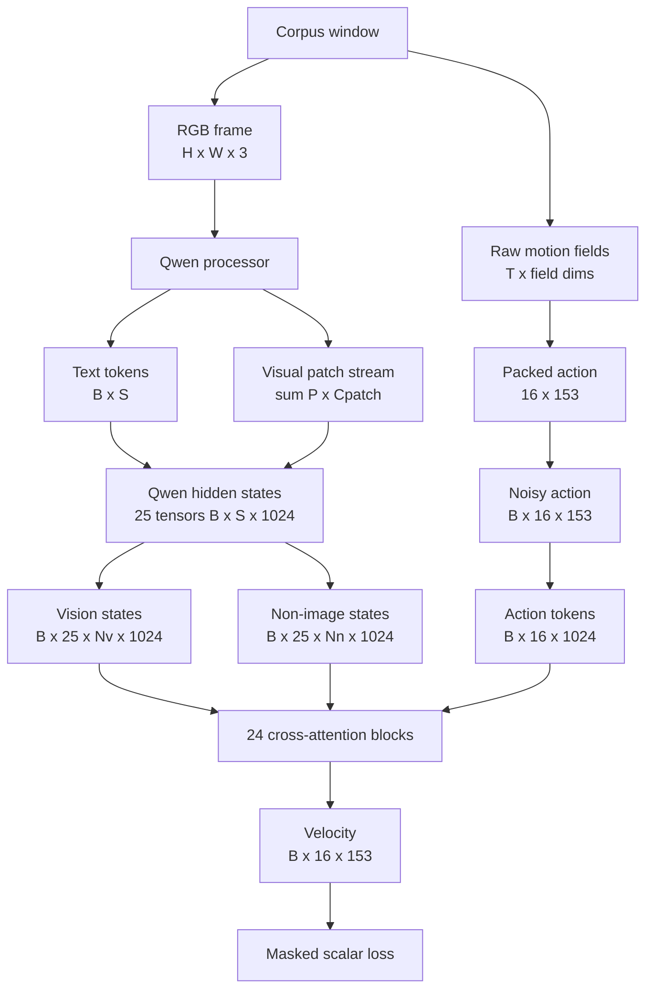

# Luồng tensor training của `vla_core`

## Câu hỏi và phạm vi

Báo cáo này trả lời: một sample đi từ corpus, qua processor, Qwen và `ActionHead` đến
training loss như thế nào, và shape thay đổi ở đâu?

Nguồn sự thật là **working tree cục bộ** của `third_party/02_vla_core`, khảo sát ngày
2026-07-26 khi nested repository đang ở commit `233396b679b1737a0ad78e3363e99c7e2be31a6c`
và có thay đổi chưa commit. Các shape được chia thành:

- **Verified (static):** đọc trực tiếp từ phép reshape, stack, projection và config trong code;
- **Illustrative:** con số được chọn để theo dõi một sample, không phải output từ corpus thật;
- **Unknown:** phụ thuộc `data_corpus`, Qwen processor/model artifact hoặc runtime chưa có.

Chi tiết semantics của 153 action field nằm ở
[Dữ liệu và training](02_data_and_training.md); cơ chế từng attention block nằm ở
[Cơ chế ActionHead](04_action_head_mechanics.md). File này tập trung vào một
trace liên tục, tránh lặp toàn bộ hai báo cáo đó.

## Câu trả lời ngắn

Training path có hai nhánh nhập rồi hội tụ tại `ActionHead`:

1. ảnh RGB và text được Qwen processor biến thành token/visual patch stream;
2. Qwen trả 25 mức hidden state theo contract mặc định: embedding output và 24 LM layer;
3. code tách mỗi mức thành vision tokens và non-image tokens;
4. action `(B,16,153)` được trộn với Gaussian noise, chiếu thành 16 action token rộng 1024;
5. mỗi action block lấy conditioning từ một Qwen layer tương ứng;
6. projection cuối trả velocity `(B,16,153)` để tính masked flow-matching MSE.



Inference dùng lại phần conditioning nhưng có lifecycle và rủi ro riêng; xem
[Luồng inference](06_inference_flow.md).

## Ký hiệu shape

| Ký hiệu | Ý nghĩa | Run-1 |
| --- | --- | ---: |
| `B` | batch size | CLI mặc định `8` |
| `T` | số action step/chunk | `16` |
| `A` | action dimension mỗi step | `153` |
| `S_i` | token length của sample `i` sau chat template | processor-dependent |
| `S` | `max_i(S_i)` sau right-padding | batch-dependent |
| `P_i` | số visual patch/feature row của sample `i` | processor/image-dependent |
| `Cpatch` | width một row `pixel_values` | processor/model-dependent |
| `N_v,i` | số vị trí có `input_ids == image_token_id` | processor/image-dependent |
| `N_n,i` | số non-image token hợp lệ | `S_i - N_v,i` |
| `Nv`, `Nn` | max vision/non-image count trong batch | batch-dependent |
| `L` | số Qwen transformer layer | mặc định `24` |
| `D` | Qwen/action-head hidden width | mặc định `1024` |
| `H_a` | số attention head | `8` |
| `d_h` | width mỗi attention head | `D/H_a = 128` |

Không thể suy `Nv` chỉ từ ảnh `224 × 224`: Qwen processor quyết định resize, patching,
temporal grid và token merge. `image_size=224` trong `VLAConfig` hiện không được
`VLAProcessor` truyền vào processor và cũng không validate ảnh.

## Trace 1 — corpus window thành sample của dataset

### Input upstream chưa nằm trong snapshot

`CorpusPretrainDataset` gọi `Layer1PretrainSampler.sample(clip, t0)`. Package cung cấp class
này không có trong workspace, nên schema dưới đây chỉ là contract tối thiểu mà adapter truy
cập, không phải serialization schema đã kiểm chứng.

```text
head_d_pos : (T, 3)
head_d_rot : (T, 3, 3)
hand_l/r   : None hoặc
             pos_cam (T, 3)
             rot_cam (T, 3, 3)
             kp21    (T, 21, 3)
             valid   (T,)
video      : path
video_frame: integer
```

Nguồn: [`data/corpus_dataset.py:36-52`](../../../../third_party/02_vla_core/data/corpus_dataset.py)
và [`data/corpus_dataset.py:92-108`](../../../../third_party/02_vla_core/data/corpus_dataset.py).

### Biến đổi action của một timestep

`pack_actions()` tạo hai array zero `(T,153)`: `act` và `msk`. Với `T=16`:

```text
head_d_pos               (16, 3)     ───────────────> action[:,   0:3]
head_d_rot               (16, 3, 3)
  lấy hai cột đầu         (16, 3, 2)
  concatenate theo axis -1
                           (16, 6)     ───────────────> action[:,   3:9]

left pos_cam              (16, 3)     ───────────────> action[:,  9:12]
left rot_cam              (16, 3, 3) ──rot_to_6d───> action[:, 12:18]
left kp21                 (16,21,3) ──reshape───────> (16,63)
                                                       action[:, 18:81]

right pos_cam             (16, 3)     ───────────────> action[:, 81:84]
right rot_cam             (16, 3, 3) ──rot_to_6d───> action[:, 84:90]
right kp21                (16,21,3) ──reshape───────> (16,63)
                                                       action[:,90:153]
```

Phép cộng dimension:

$$
A = (3+6)_{\text{head}} +
    (3+6+21\times3)_{\text{left}} +
    (3+6+21\times3)_{\text{right}}
  = 9+72+72=153.
$$

Head mask luôn bằng 1 ở 9 chiều. Mỗi `valid[t]` của một hand được broadcast từ scalar thành
72 phần tử tại timestep đó. Nếu hand là `None`, action và mask của toàn block 72 chiều giữ
bằng 0.

### Output dataset

Một lần `__getitem__` trả:

| Key | Shape/type | Ghi chú |
| --- | --- | --- |
| `image` | `(H,W,3)`, NumPy `uint8` | một RGB frame được FFmpeg decode |
| `text` | Python `str` | tối đa hai narrative và joystick |
| `actions` | `(16,153)`, Torch `float32` | chưa có normalization trong adapter |
| `action_mask` | `(16,153)`, Torch `float32` | mask theo phần tử |
| `source`, `clip_id` | scalar metadata | không truyền vào model |

**Unknown:** unit, coordinate frame và normalization của action upstream. Config nói action
phải normalized, nhưng `pack_actions()` chỉ copy/reshape giá trị.

## Trace 2 — sample thành multimodal batch

Collator xử lý từng item riêng, rồi mới ghép batch. Với mỗi sample:

```text
NumPy RGB (H,W,3)
    -> PIL.Image
    -> VLAProcessor.build_training_inputs(images=[img], ...)
```

Training processor tạo full conversation gồm một user turn và một assistant response. Nó
tokenize thêm một prompt-only conversation để lấy `prompt_len`, sau đó:

```text
input_ids       : (1, S_i)
attention_mask  : (1, S_i)
labels          : (1, S_i)
labels[:prompt_len] = -100
pixel_values    : (P_i, Cpatch)       # exact width phụ thuộc processor
image_grid_thw  : (1, 3)              # current dataset path: một ảnh/sample
```

Nguồn: [`data/processing.py:69-135`](../../../../third_party/02_vla_core/data/processing.py).

Collator right-pad ba text tensors đến `S=max(S_i)`, concatenate visual rows, rồi stack action:

| Batch key | Shape |
| --- | --- |
| `input_ids` | `(B,S)` |
| `attention_mask` | `(B,S)` |
| `labels` | `(B,S)` |
| `pixel_values` | `(\sum_i P_i,Cpatch)` |
| `image_grid_thw` | `(B,3)` trong train path một ảnh/sample |
| `actions_gt` | `(B,16,153)` |
| `action_mask` | `(B,16,153)` |

Nguồn: [`data/collate.py:24-51`](../../../../third_party/02_vla_core/data/collate.py).

`pixel_values` không có batch axis truyền thống. Các image patch row của mọi sample được nối
trên axis 0; `image_grid_thw` và image token positions trong `input_ids` giữ ranh giới để Qwen
khôi phục correspondence.

### Rủi ro text target

Collator truyền toàn bộ `s["text"]` làm user `task`, đồng thời lấy dòng đầu của chính text đó
làm assistant `narrative_target`. Vì vậy target xuất hiện trong prompt. Đây là
**Inferred target leakage**, không phải một thay đổi shape, nhưng làm thay đổi ý nghĩa của
`narrative_loss`.

## Trace 3 — Qwen batch thành hai conditioning stream

`VLAModel.forward()` truyền multimodal batch vào Qwen với
`output_hidden_states=True`. Code giả định:

```text
qwen_out.hidden_states
    tuple length L+1 = 25

hidden_states[0]      : (B,S,D) = embedding output
hidden_states[1..24]  : (B,S,D) = transformer-layer outputs
```

Nguồn: [`model/vla_model.py:144-162`](../../../../third_party/02_vla_core/model/vla_model.py)
và [`model/utils.py:13-39`](../../../../third_party/02_vla_core/model/utils.py).

`extract_hidden_states()` thực hiện:

```text
tuple[25] của (B,S,1024)
    --torch.stack(dim=1)-->
(B,25,S,1024)
```

Sau đó mỗi sample dùng hai boolean mask:

```text
vision_mask    = input_ids == image_token_id
narrative_mask = NOT vision_mask AND attention_mask
```

Kết quả được pad độc lập:

```text
vision_hs       : (B,25,Nv,1024)
narrative_hs    : (B,25,Nn,1024)
vision_pad_mask : None hoặc (B,Nv), True nghĩa là padding
narrative_pad_mask : None hoặc (B,Nn), True nghĩa là padding
```

Nguồn: [`model/utils.py:41-84`](../../../../third_party/02_vla_core/model/utils.py).

Tên `narrative_hs` dễ gây hiểu nhầm: tensor này chứa **mọi token hợp lệ không phải image**,
gồm chat markers, user prompt, task và assistant target; nó không chỉ chứa narrative.

## Trace 4 — ground-truth action thành flow-matching input

Với:

```text
actions_gt : a       (B,16,153)
noise      : epsilon (B,16,153)
t                   (B,)
```

code reshape timestep:

```text
t.view(B,1,1) : (B,1,1)
```

rồi broadcast trên 16 timestep và 153 action dimension:

$$
x_t=(1-t)\epsilon+ta,\qquad
v^\*=a-\epsilon.
$$

Do đó:

```text
noisy_actions   x_t : (B,16,153)
target_velocity v* : (B,16,153)
```

Nguồn: [`model/vla_model.py:169-193`](../../../../third_party/02_vla_core/model/vla_model.py).

### Ví dụ số cho một phần tử

Đây là **illustrative**, chỉ theo dõi một scalar trong tensor:

```text
a       =  0.40
epsilon = -0.20
t       =  0.25

x_t = 0.75*(-0.20) + 0.25*(0.40) = -0.05
v*  = 0.40 - (-0.20)              =  0.60
```

Action head nhìn `x_t=-0.05`, timestep `0.25` và Qwen conditioning, rồi học dự đoán velocity
`0.60` tại phần tử đó.

## Trace 5 — action embedding

`ActionHead` giữ nguyên số action token `T=16`, chỉ đổi feature width:

```text
noisy_actions                    (B,16,153)
    -> Linear(153,1024)           (B,16,1024)
    + pos_embed[None,:,:]         (1,16,1024), broadcast theo B
    + time_embed(t)[:,None,:]     (B,1,1024),  broadcast theo T
                                  ------------------------------
action state z0                  (B,16,1024)
```

Nguồn: [`model/action_head.py:293-379`](../../../../third_party/02_vla_core/model/action_head.py).

`pos_embed` phân biệt 16 vị trí trong chunk. `time_embed` cho biết mức noise của cả sample và
được cộng giống nhau vào 16 action token.

## Trace 6 — một cross-attention block

Phần này chỉ giữ shape transition cần cho trace. Cơ chế shared softmax, RoPE, vision gate và
FFN được sở hữu bởi [Cơ chế ActionHead](04_action_head_mechanics.md).

```text
x                              (B,16,1024)
narrative_hs[:,i+1]            (B,Nn,1024)
vision_hs[:,i+1]               (B,Nv,1024)
proprio p                      None trong run-1

q, k_self, v_self       : (B,8,16,128)
k_adapter, v_adapter    : (B,8,Nn,128)
k_vision, v_vision      : (B,8,Nv,128)

self score       : (B,8,16,16)
adapter score    : (B,8,16,Nn)
vision score     : (B,8,16,Nv)

concat key axis  : (B,8,16,16+Nn+Nv)
weighted values  : (B,8,16,128)
next action state: (B,16,1024)
```

Nguồn: [`model/action_head.py:120-199`](../../../../third_party/02_vla_core/model/action_head.py).

## Trace 7 — 24 Qwen layer thành 24 action block

`MLPResNet` bỏ hidden state index 0 và ghép theo index:

```text
action block  0 <- Qwen hidden_states[1]
action block  1 <- Qwen hidden_states[2]
...
action block 23 <- Qwen hidden_states[24]
```

Mỗi block giữ shape action state `(B,16,1024)`. Sau block 24:

```text
LayerNorm                 (B,16,1024)
Linear(1024,153)          (B,16,153)
```

Output này là **predicted velocity** trong training, chưa phải denoised action.
Nguồn: [`model/action_head.py:238-288`](../../../../third_party/02_vla_core/model/action_head.py).

Invariant ngầm:

```text
Qwen hidden width == action_head hidden width
Qwen layer count  >= action block count
```

`input_dim` của `ActionHead` không tạo conditioning projection, và code chưa assert hai
invariant trên. Đổi backbone sang width/layer count khác có thể lỗi matrix multiply hoặc
indexing.

## Trace 8 — loss làm scalar hóa tensor

Element-wise MSE:

```text
predicted_velocity : (B,16,153)
target_velocity    : (B,16,153)
square error       : (B,16,153), tính bằng FP32
action_mask        : (B,16,153)
masked error       : (B,16,153)
sum / mask.sum     : scalar action_loss
```

Nếu truyền mask `(B,16)`, code mở rộng thành `(B,16,153)`. Run-1 collator truyền mask theo
phần tử `(B,16,153)`, cho phép bỏ loss của từng hand mà vẫn giữ head/hand còn valid.

Narrative branch trả một scalar `qwen_out.loss`. Khi cả hai loss tồn tại:

$$
\mathcal L_{\text{total}}
= \mathcal L_{\text{action}} + 0.1\mathcal L_{\text{narrative}}.
$$

Nguồn: [`model/vla_model.py:202-218`](../../../../third_party/02_vla_core/model/vla_model.py)
và [`model/vla_model.py:351-379`](../../../../third_party/02_vla_core/model/vla_model.py).

## Worked example — batch hai sample

Ví dụ sau là **illustrative**, nhằm làm cụ thể shape động. Nó không được lấy từ Qwen hoặc
corpus runtime.

Giả sử:

```text
B = 2
sample 0: S0=64, Nv0=16, Nn0=48
sample 1: S1=72, Nv1=16, Nn1=56
```

Sau collate:

```text
input_ids, attention_mask, labels : (2,72)
actions_gt, action_mask           : (2,16,153)
```

Sample 0 có 8 text-padding position ở batch sequence. `extract_hidden_states()` loại chúng
khỏi narrative stream nhờ `attention_mask`, nên:

```text
Qwen hidden tuple    : 25 x (2,72,1024)
stacked hidden       : (2,25,72,1024)
vision_hs            : (2,25,16,1024)
narrative_hs         : (2,25,56,1024)
narrative_pad_mask   : (2,56)
  sample 0           : 48 False + 8 True
  sample 1           : 56 False
```

Trong một action block, không có proprio:

```text
self scores          : (2,8,16,16)
narrative scores     : (2,8,16,56)
vision scores        : (2,8,16,16)
combined scores      : (2,8,16,88)   # 16 + 56 + 16
block output         : (2,16,1024)
```

Sau 24 block và output projection:

```text
predicted velocity   : (2,16,153)
element MSE           : (2,16,153)
action loss           : scalar
```

Nếu sample 0 không có right hand, `action_mask[0,:,81:153]` bằng 0. Loss vẫn dùng
`action_mask[0,:,0:81]` và toàn bộ valid elements của sample 1.

## Bảng shape end-to-end

| Stage | Tensor | Shape run-1 |
| --- | --- | --- |
| Corpus | head translation | `(16,3)` |
| Corpus | head/hand rotation matrix | `(16,3,3)` |
| Corpus | hand keypoints | `(16,21,3)` |
| Dataset | RGB frame | `(H,W,3)` |
| Dataset | action, element mask | `(16,153)` |
| Per-sample processor | text tensors | `(1,S_i)` |
| Per-sample processor | visual features | `(P_i,Cpatch)` |
| Collator | text tensors | `(B,S)` |
| Collator | visual features | `(\sum_i P_i,Cpatch)` |
| Collator | action, element mask | `(B,16,153)` |
| Qwen layer | hidden state | `(B,S,1024)` |
| Hidden split | vision | `(B,25,Nv,1024)` |
| Hidden split | non-image | `(B,25,Nn,1024)` |
| Flow input | noisy action | `(B,16,153)` |
| Action embedding | action tokens | `(B,16,1024)` |
| Attention head split | query | `(B,8,16,128)` |
| One block output | action state | `(B,16,1024)` |
| Training output | velocity | `(B,16,153)` |
| Training reduction | losses | scalar |

## Verified, inferred và unknown

### Verified bằng đọc code tĩnh

- packing `9 + 72 + 72 = 153`, chunk `T=16`, và element-wise mask;
- collator right-padding text, concatenating visual streams và stacking action;
- Qwen hidden-state split, including exclusion của batch padding khỏi non-image stream;
- action projection `153 -> 1024`, 8 attention head × 128 chiều;
- mapping Qwen layer `1..24` sang action block `0..23`;
- velocity output và masked MSE;
- khi vision gate bằng 0, vision logits bằng 0 nhưng vẫn nhận nonzero softmax mass.

### Inferred từ implementation

- narrative target leakage do cùng text nằm ở user prompt và assistant target;
- tách stream và áp RoPE mới giữ thứ tự nội bộ nhưng mất vị trí tương đối vision–text trong
  sequence gốc.

### Verified inconsistency/bug

- docstring DDP, pixel input, action mask và output `(B,50,23)` không còn khớp implementation.

### Unknown vì thiếu artifact/runtime

- shape cụ thể của `pixel_values`, `Nv`, `Nn` trên ảnh thật;
- upstream action units, coordinate frames và normalization statistics;
- exact trainable set của Qwen, đặc biệt `lm_head` tied hay untied;
- tensor contract thật có khớp revision `transformers` dùng để tạo code hay không;
- VRAM, latency, throughput và chất lượng action;
- end-to-end train/inference checkpoint có chạy thành công hay không.

Tại lần khảo sát này, Python hệ thống thiếu `torch`, `transformers`, `cv2` và `corpus`, nên
các shape liên quan Qwen processor/model chưa được runtime-verified.

## Các bẫy cần nhớ khi đọc output

1. `predicted_actions` trong training chứa **velocity**, nhưng trong
   `forward(actions_gt=None)` lại chứa sampled action.
2. `narrative_hs` là toàn bộ non-image token hợp lệ, không chỉ narrative.
3. `pixel_values` dùng concatenated patch rows, không phải `(B,C,H,W)` theo code collator.
4. Config nói image `224`, nhưng train path không ép resize bằng field này.
5. Comment đầu `vla_model.py` còn ghi contract cũ `(B,50,23)`; active run-1 contract trong
   config/dataset/train loop là `(B,16,153)`.

## Kiểm chứng runtime tối thiểu tiếp theo

1. Pin dependency và revision Qwen/Transformers; gắn đúng `data_corpus`.
2. Chạy test hiện có, sau đó thêm hook log shape tại processor, Qwen split và từng action
   block với `B=2`.
3. Dùng hai sample có text length và image grid khác nhau để xác minh pad masks.
4. Assert các invariant về `T`, `A`, hidden width và layer count ngay khi model khởi tạo.
5. Xác minh normalization/denormalization bằng upstream `ACTION_SPEC` và statistics artifact.
6. Chạy `--overfit 8`, lưu command, loss curve, peak RAM/VRAM và checkpoint identity.

## Nguồn code cục bộ

- [`data/corpus_dataset.py`](../../../../third_party/02_vla_core/data/corpus_dataset.py)
- [`data/processing.py`](../../../../third_party/02_vla_core/data/processing.py)
- [`data/collate.py`](../../../../third_party/02_vla_core/data/collate.py)
- [`model/config.py`](../../../../third_party/02_vla_core/model/config.py)
- [`model/utils.py`](../../../../third_party/02_vla_core/model/utils.py)
- [`model/proprio_encoder.py`](../../../../third_party/02_vla_core/model/proprio_encoder.py)
- [`model/action_head.py`](../../../../third_party/02_vla_core/model/action_head.py)
- [`model/vla_model.py`](../../../../third_party/02_vla_core/model/vla_model.py)
- [`train/pretrain.py`](../../../../third_party/02_vla_core/train/pretrain.py)
