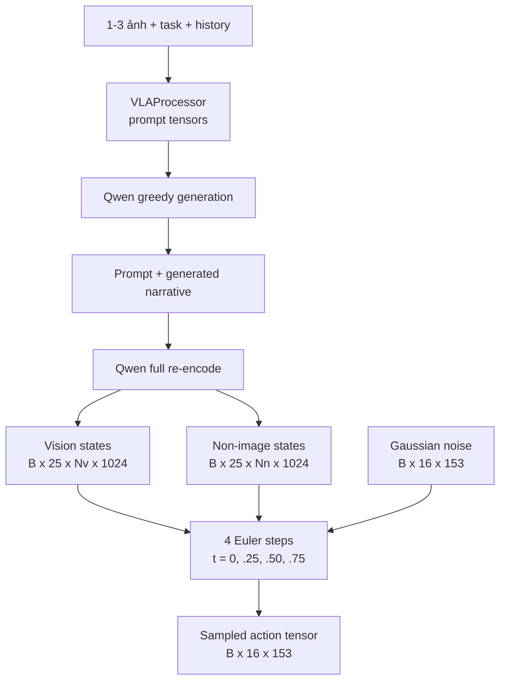

# Luồng inference của `vla_core`

## Câu hỏi và phạm vi

Báo cáo ngắn này trả lời: từ ảnh và task, model tạo action chunk bằng những pass nào,
tensor đổi shape ra sao, và output còn thiếu gì trước khi điều khiển robot?

Nguồn sự thật là **working tree cục bộ** của `third_party/02_vla_core`, khảo sát ngày
2026-07-26 tại commit `233396b679b1737a0ad78e3363e99c7e2be31a6c` với thay đổi chưa
commit. Đây là **static code trace**, chưa phải inference đã chạy. Training path đầy đủ nằm
ở [luồng tensor training](05_training_tensor_flow.md).

## Câu trả lời ngắn

Inference chuẩn qua `predict_action()` gồm ba pha:

1. Qwen greedily sinh tối đa 128 narrative token từ ảnh và prompt;
2. Qwen encode lại toàn bộ prompt + narrative để lấy hidden state của 25 mức;
3. action sampler khởi tạo Gaussian noise `(B,16,153)`, chạy `ActionHead` bốn lần và cập
   nhật Euler để trả action chunk cùng shape.

Narrative generation là deterministic (`do_sample=False`), nhưng action vẫn stochastic vì
noise ban đầu được lấy bằng `torch.randn`. Output là tensor trong action space mà model học;
normalization upstream là **Unknown**. Snapshot không có checkpoint loader, inference CLI,
robot controller hay safety layer.



## Trace 1 — ảnh và task thành prompt

`VLAProcessor.build_inference_inputs()` nhận 1–3 `PIL.Image`, `task` và history tùy chọn.
Mỗi ảnh thành một content item riêng; text có dạng:

```text
What action should the robot take to {task}?
What action should the robot take to {task}? History: {history}
```

Chat template thêm generation prompt rồi trả batch `B=1`:

| Tensor | Shape |
| --- | --- |
| `input_ids`, `attention_mask` | `(1,S)` |
| `pixel_values` | processor-dependent patch stream |
| `image_grid_thw` | `(N_images,3)` |

Code không enforce `max_cameras=3` hoặc `image_size=224`; hai field config này không được
truyền vào processor. Nguồn:
[`data/processing.py:33-67`](../../../../third_party/02_vla_core/data/processing.py) và
[`data/processing.py:139-174`](../../../../third_party/02_vla_core/data/processing.py).

## Trace 2 — generate narrative rồi encode lại

`predict_action()` trước hết gọi:

```text
qwen.generate(
    max_new_tokens=128,
    do_sample=False
)
```

Nếu prompt dài `S` và phần sinh dài `G`, `generated_ids` có shape `(B,S+G)` theo contract
được code kỳ vọng. Model sau đó tạo attention mask toàn `1` và chạy một Qwen forward nữa
với `output_hidden_states=True`.

Với backbone mặc định 24 LM layer:

```text
25 hidden states                 : mỗi tensor (B,S+G,1024)
stack + split theo image token   :
  vision_hs                     : (B,25,Nv,1024)
  narrative_hs                  : (B,25,Nn,1024)
```

`narrative_hs` thực tế chứa **mọi non-image token hợp lệ**: chat marker, prompt, task,
history và narrative vừa sinh; nó không chỉ chứa narrative.

Nguồn: [`model/vla_model.py:222-310`](../../../../third_party/02_vla_core/model/vla_model.py)
và [`model/utils.py:13-84`](../../../../third_party/02_vla_core/model/utils.py).

## Trace 3 — bốn bước từ noise thành action

Sampler tạo:

```text
x0 ~ Normal(0,I) : (B,16,153)
dt               : 1/4 = 0.25
```

Tại step `i`:

$$
t_i = i/4,\qquad
\hat v_i = \mathrm{ActionHead}(x_i,t_i,c),\qquad
x_{i+1}=x_i+0.25\hat v_i,
$$

trong đó `c` là vision/non-image hidden states đã tính một lần. Lịch thực thi chính xác:

| Step | `t_i` | Input/output của `ActionHead` |
| ---: | ---: | --- |
| 0 | `0.00` | `(B,16,153) -> (B,16,153)` |
| 1 | `0.25` | `(B,16,153) -> (B,16,153)` |
| 2 | `0.50` | `(B,16,153) -> (B,16,153)` |
| 3 | `0.75` | `(B,16,153) -> (B,16,153)` |

Sampler không evaluate velocity tại `t=1`. Mỗi call chiếu action `153 -> 1024`, thêm
chunk-position và timestep embedding, đi qua 24 cross-attention block, rồi chiếu
`1024 -> 153`. Vì conditioning được reuse, pha sampling chạy 4 Qwen-independent
`ActionHead` forward, tức 96 block execution cho mỗi action chunk.

Nguồn: [`model/vla_model.py:381-424`](../../../../third_party/02_vla_core/model/vla_model.py)
và [`model/action_head.py:304-379`](../../../../third_party/02_vla_core/model/action_head.py).

## Ba API inference không tương đương

| API | Narrative conditioning | Output |
| --- | --- | --- |
| `predict_action()` | generate rồi re-encode | sampled action-space tensor |
| `forward(actions_gt=None)` | encode trực tiếp sequence đầu vào, không generate | sampled action-space tensor trong `VLAOutput.predicted_actions` |
| `generate_narrative()` | chỉ gọi Qwen generation | token IDs, không phải action |

Vì vậy `forward(actions_gt=None)` không phải alias của `predict_action()`. Ngoài ra,
`predicted_actions` trong training lại mang nghĩa **predicted velocity**, không phải sampled
action. Nguồn:
[`model/vla_model.py:117-218`](../../../../third_party/02_vla_core/model/vla_model.py) và
[`model/vla_model.py:312-334`](../../../../third_party/02_vla_core/model/vla_model.py).

## Output chưa phải robot command

`predict_action()` trả `(B,16,153)`, tương ứng 16 step và mỗi step gồm head 9D, left hand
72D, right hand 72D. Code không chứng minh action được normalize upstream và chưa thực hiện:

- xác định normalization contract và, nếu có, đảo bằng đúng embodiment/statistics;
- đổi rotation 6D về rotation matrix;
- đổi coordinate frame và unit;
- chọn execute cả chunk hay receding horizon;
- clipping, collision/safety check và gửi lệnh tới controller.

Vì normalization status là **Unknown**, không được gọi output này là normalized action cho
tới khi tìm thấy upstream transform hoặc statistics artifact.

## Worked example — một sample end-to-end

Ví dụ dưới đây là **Illustrative**, không phải output từ checkpoint. Các token count và
velocity được chọn chỉ để làm rõ phép biến đổi; shape thực tế vẫn phụ thuộc Qwen processor
và ảnh đầu vào.

### 1. Input ứng dụng

```text
images  : [head_camera.jpg]              # một PIL RGB image
task    : "pick up the red cup"
history : "the gripper moved above the table"
```

Processor tạo prompt:

```text
What action should the robot take to pick up the red cup? History: the gripper moved above the table
```

Giả sử sau chat template:

```text
input_ids, attention_mask : (1,64)
pixel_values              : (P,Cpatch)   # exact P/Cpatch chưa biết
image_grid_thw            : (1,3)
```

### 2. Narrative generation và re-encode

Giả sử greedy generation sinh 12 token, biểu diễn narrative:

```text
"move the right hand toward the cup"
```

Chuỗi đầy đủ khi encode lần hai dài `64 + 12 = 76` token:

```text
generated_ids             : (1,76)
Qwen hidden_states        : 25 tensor, mỗi tensor (1,76,1024)
```

Để minh họa, giả sử 16 vị trí là image token:

```text
vision_hs                 : (1,25,16,1024)
narrative_hs              : (1,25,60,1024)
vision_pad_mask           : None
narrative_pad_mask        : None
proprio_feat              : None         # run-1 mặc định không có proprio
```

`60 = 76 - 16` gồm prompt, chat marker và generated narrative; đây không phải 60 narrative
token thuần túy.

### 3. Euler sampling

Sampler khởi tạo toàn bộ `x0`:

```text
x0 : (1,16,153), Gaussian noise
```

Theo dõi một phần tử `j` bất kỳ trong tensor, giả sử `x0[j] = -0.80`. Các velocity dưới
đây là số minh họa:

| Step | `t` | `x_i[j]` | `v_i[j]` giả định | `x_{i+1}[j] = x_i[j] + 0.25v_i[j]` |
| ---: | ---: | ---: | ---: | ---: |
| 0 | `0.00` | `-0.80` | `0.40` | `-0.70` |
| 1 | `0.25` | `-0.70` | `0.32` | `-0.62` |
| 2 | `0.50` | `-0.62` | `0.24` | `-0.56` |
| 3 | `0.75` | `-0.56` | `0.16` | `-0.52` |

Phép cập nhật này diễn ra song song trên mọi phần tử của `(1,16,153)`. Sau step cuối:

```text
action_chunk : (1,16,153), normalization status unknown
```

### 4. Giải nghĩa một timestep output

Với timestep đầu `a0 = action_chunk[0,0]`:

```text
a0[0:3]     head delta position
a0[3:9]     head delta rotation, representation 6D
a0[9:81]    left hand: position + rotation 6D + 21 keypoints
a0[81:153]  right hand: position + rotation 6D + 21 keypoints
```

`action_chunk[0,1:16]` giữ cùng layout cho 15 timestep kế tiếp. Nếu contract 10 Hz upstream
là đúng, chunk mô tả 1,6 giây; code inference không tự chọn bao nhiêu step sẽ được execute
trước khi quan sát lại.

### 5. Call sketch

Đoạn dưới chỉ minh họa cách nối API; snapshot chưa cung cấp checkpoint loader hoặc
post-processor:

```python
inputs = processor.build_inference_inputs(
    images=[head_image],
    task="pick up the red cup",
    history="the gripper moved above the table",
    device=device,
)

model.eval()
action_chunk = model.predict_action(**inputs)
# action_chunk.shape == (1, 16, 153)
# Chưa được gửi tensor này trực tiếp tới robot.
```

Để thành rollout thật, bước kế tiếp phải xác minh normalization contract, áp inverse
transform nếu cần, đổi rotation và coordinate frame, áp safety/controller policy, rồi quyết
định execute bao nhiêu timestep trước lần inference tiếp theo.

## Verified, inferred và unknown

**Verified bằng đọc code tĩnh**

- two-pass generate-then-encode của `predict_action()`;
- greedy generation tối đa 128 token;
- four-step Euler schedule `t={0,.25,.5,.75}`;
- Qwen conditioning được reuse, chỉ action head chạy lại ở mỗi step;
- output shape mặc định `(B,16,153)`; normalization status chưa xác định.

**Inferred risk**

- attention mask toàn `1` có thể biến prompt padding hoặc token pad sau EOS thành context
  hợp lệ khi batch `B>1`;
- `pad_token_id = pad_token_id or eos_token_id` thay pad ID hợp lệ `0` bằng EOS;
- top-level `predict_action()` không expose `torch.Generator`, nên không thể kiểm soát
  Gaussian seed qua API này;
- method có `@torch.no_grad()` nhưng không tự gọi `eval()`; caller vẫn phải đặt
  `model.eval()` để có inference mode đầy đủ.

**Unknown vì chưa có runtime/artifact**

- exact `pixel_values`, `Nv`, `Nn` trên ảnh thật;
- checkpoint nào tương thích và chất lượng action;
- latency của autoregressive generation, re-encode và bốn action-head pass;
- batch inference `B>1`, EOS/padding behavior và peak VRAM;
- normalization contract/statistics và robot execution semantics.

## Kiểm chứng tối thiểu tiếp theo

1. Thêm inference harness load checkpoint, gọi `model.eval()` và log từng shape.
2. Test `B=2` với prompt và generation length khác nhau để kiểm attention mask/EOS.
3. Expose `generator` hoặc seed qua `predict_action()` và kiểm cùng seed cho cùng output.
4. Profile riêng narrative generation, full re-encode và bốn action-head pass.
5. Chốt normalization contract và viết post-processor trước mọi robot rollout.

## Nguồn code cục bộ

- [`data/processing.py`](../../../../third_party/02_vla_core/data/processing.py)
- [`model/config.py`](../../../../third_party/02_vla_core/model/config.py)
- [`model/utils.py`](../../../../third_party/02_vla_core/model/utils.py)
- [`model/action_head.py`](../../../../third_party/02_vla_core/model/action_head.py)
- [`model/vla_model.py`](../../../../third_party/02_vla_core/model/vla_model.py)
