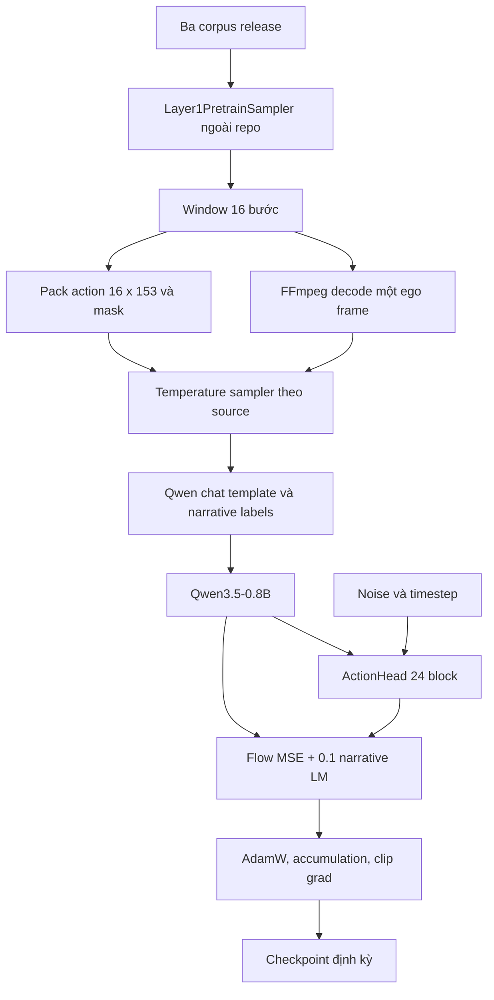
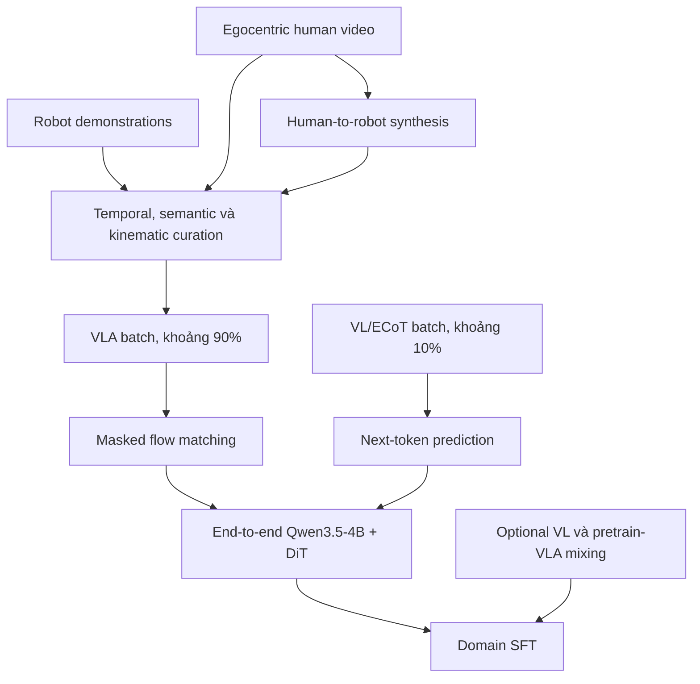

# So sánh `vla-core` với Qwen-RobotManip

## Câu hỏi và phạm vi

`vla-core` khác Qwen-RobotManip như thế nào về **training pipeline** và **kiến
trúc model**?

Báo cáo so sánh:

- code hiện có trong `third_party/02_vla_core` tại commit
  `233396b679b1737a0ad78e3363e99c7e2be31a6c`;
- Qwen-RobotManip theo technical report v2 và repository chính thức, được kiểm
  tra ngày 2026-07-26.

Không so sánh chất lượng bằng benchmark vì `vla-core` chưa có checkpoint hoặc
kết quả evaluation tương ứng. Qwen-RobotManip chưa phát hành code training hay
model weights; vì vậy cột Qwen-RobotManip dưới đây là **paper-level design**, còn
cột `vla-core` là **code-level implementation**. Đây là giới hạn quan trọng nhất
khi đọc bảng.

## Câu trả lời ngắn

Hai hệ thống cùng dùng Qwen3.5 để điều kiện hóa một action expert theo
flow matching, cùng dự đoán velocity field của action chunk và cùng lấy mẫu bằng
bốn bước Euler. Tuy nhiên, `vla-core` không phải bản tái tạo thu nhỏ trung thành
của Qwen-RobotManip:

1. `vla-core` dùng Qwen3.5-0.8B gần như frozen và action head 24 block đọc
   **hidden state của mọi Qwen layer**; Qwen-RobotManip dùng Qwen3.5-4B được train end-to-end với action loss và DiT 10 block chỉ cross-attend
   **hidden state layer cuối**.
2. `vla-core` run-1 học một không gian `16 × 153` dành cho head/hai tay từ video ego; Qwen-RobotManip học action chunk `T × 80` canonical cho nhiều robot, kèm proprioception, camera geometry và mask theo embodiment. Paper không
   công bố giá trị chung của `T`.
3. `vla-core` trộn action loss và narrative LM loss trong cùng một batch và còn sinh narrative trước khi suy luận action. Qwen-RobotManip xen kẽ batch VLA và batch VL theo tỷ lệ 9:1; ECoT là supervision phụ ở batch VL, không phải bước
   sinh text bắt buộc khi điều khiển.
4. Training loop của `vla-core` là một prototype AdamW tối giản. Qwen-RobotManip mô tả một recipe foundation-model gồm curation quy mô lớn, pretraining hai stream, tám noise/timestep cho mỗi VLA sample, rồi domain SFT.

Nói ngắn gọn: `vla-core` giữ lại **ý tưởng flow-matching action head trên VLM**
nhưng chưa có ba lớp alignment — representation, motion và behavior — tạo nên
Qwen-RobotManip.

## Bảng đối chiếu kiến trúc

| Thành phần                       | `vla-core` hiện tại                                                                                                      | Qwen-RobotManip                                                                                                                                | Ý nghĩa                                                                                                                  |
| ---------------------------------- | ---------------------------------------------------------------------------------------------------------------------------- | ---------------------------------------------------------------------------------------------------------------------------------------------- | -------------------------------------------------------------------------------------------------------------------------- |
| VLM backbone                       | Qwen3.5-0.8B, hidden width lấy từ config runtime; mặc định freeze language model và vision model                       | Qwen3.5-4B, hidden width 2.560; action loss cập nhật cả VLM và action expert                                                               | Qwen-RobotManip thích nghi representation của backbone với control;`vla-core` chủ yếu học cầu nối mới           |
| VLM feature đưa sang action head | Vision và non-image token từ embedding + mọi transformer layer; 24 action block ghép với 24 Qwen layer                  | Vision/language hidden state layer cuối                                                                                                       | Cơ chế fusion khác bản chất, không chỉ khác số layer                                                              |
| Action expert                      | 24 block, width 1.024, 8 head; mỗi block dùng một softmax chung trên action self-attention, narrative/proprio và vision | DiT 10 block, width 768, 12 head; self-attention trên state/action rồi luân phiên cross-attention tới vision và language; SwiGLU         | `vla-core` là all-layer cross-attention head tự viết; Qwen-RobotManip là DiT tách stream rõ hơn                   |
| Current proprioception             | Có`ProprioEncoder` MLP nhưng run-1 đặt `proprio_dim=None` và train loop luôn truyền `None`                      | Canonical state 80-D được MLP encode và prepend vào noisy-action sequence                                                                 | `vla-core` run-1 không phải closed-loop robot policy theo input contract                                               |
| Observation                        | Processor hỗ trợ 1–3 camera nhưng train path chỉ đưa một ego frame/sample                                            | Multi-view hiện tại; tùy chọn lịch sử ảnh, state và executed-action chunk                                                              | RobotManip có temporal/behavior context phong phú hơn                                                                   |
| Camera geometry                    | Không dùng intrinsics/extrinsics; vision attention chỉ có RoPE và một scalar gate                                      | CaPE từ extrinsics, intrinsics embedding, reference camera, end-effector type và cờ camera calibration                                      | RobotManip căn chỉnh chuyển động với observation geometry;`vla-core` không có lớp motion alignment tương ứng |
| Action contract                    | Chunk 16 step ở 10 Hz, 153 chiều: head delta pose và pose/keypoint 21 điểm của hai tay                                 | Fixed-length chunk`T × 80`: hai arm block 29-D và 22 chiều dự phòng; paper không công bố `T` chung                                 | Action semantics không tương thích; không có bằng chứng hai bên cùng chunk length                                |
| Mask                               | Head luôn valid; mỗi hand block dùng`hand.valid` theo step và dimension                                                | Kết hợp slot mask theo embodiment, step-validity mask và per-hand visibility mask; average theo từng sample                                | RobotManip kiểm soát bias giữa embodiment có số slot active khác nhau                                                |
| Flow path                          | `x_t=(1-t)ε+t a`, target `a-ε`, masked MSE; bốn Euler step                                                            | Cùng dạng interpolant/velocity/MSE; base inference dùng bốn Euler step, context ablation cần 10 để ổn định                           | Đây là phần tương đồng trực tiếp nhất, nhưng số step không cố định cho mọi variant                       |
| Text reasoning                     | Narrative target nằm trong VLA sample;`predict_action()` generate narrative rồi re-encode                                | VL/ECoT dùng batch next-token riêng; action path không yêu cầu decode ECoT                                                                | `vla-core` trả thêm latency autoregressive và có training semantics khác                                            |
| Execution context                  | `history` chỉ là text trong processor và đang rỗng trong collator                                                     | History`(observation, state, executed action chunk)`; mặc định fuse vào VLM, sample ngẫu nhiên khi train và rolling window khi deploy | Qwen-RobotManip có in-context policy adaptation thực sự                                                                 |

**Evidence cho `vla-core`:**
[`model/config.py`](../../../../third_party/02_vla_core/model/config.py),
[`model/vla_model.py`](../../../../third_party/02_vla_core/model/vla_model.py),
[`model/action_head.py`](../../../../third_party/02_vla_core/model/action_head.py),
[`data/corpus_dataset.py`](../../../../third_party/02_vla_core/data/corpus_dataset.py)
và [`data/collate.py`](../../../../third_party/02_vla_core/data/collate.py).

**Evidence cho Qwen-RobotManip:** technical report
[§3.1–§3.5, trang 9–13](../../../papers/01-gwen/vla-specific/qwen_robotmanip_2606.17846.pdf)
và [§4.1, trang 14–15](../../../papers/01-gwen/vla-specific/qwen_robotmanip_2606.17846.pdf).

## Hai luồng training

### `vla-core`: một loop VLA đơn giản



Code thực hiện các bước sau:

1. `CorpusPretrainDataset` gọi
   `corpus.labels.pretrain_loader.Layer1PretrainSampler`, dependency không nằm
   trong snapshot; ba release path còn hard-code dưới `/mnt/SSD4`.
2. Mỗi sample decode một frame bằng FFmpeg, ghép head/hands thành action
   `T × 153`, rồi tạo text từ tối đa hai narrative và joystick.
3. `SourceTemperatureSampler` lấy xác suất source tỷ lệ với
   `n_source^tau`, mặc định `tau=0.5`.
4. Collator dùng chính `sample["text"]` làm task prompt và dùng dòng đầu của nó
   làm narrative target.
5. Model tạo một noise/timestep cho mỗi sample, tính masked flow MSE và cộng
   `0.1 × narrative_loss`.
6. Loop dùng một AdamW learning rate, gradient accumulation, clip norm bằng
   `1.0` và lưu state dict định kỳ.

Nguồn:
[`data/corpus_dataset.py`](../../../../third_party/02_vla_core/data/corpus_dataset.py),
[`data/processing.py`](../../../../third_party/02_vla_core/data/processing.py),
[`data/collate.py`](../../../../third_party/02_vla_core/data/collate.py) và
[`train/pretrain.py`](../../../../third_party/02_vla_core/train/pretrain.py).

### Qwen-RobotManip: pretraining hai stream rồi SFT



Theo paper:

1. VLA corpus gồm robot demonstration, ego human video và trajectory
   human-to-robot tổng hợp. Cộng các hàng trong Table 1 được 38.161 giờ; paper
   tự làm tròn thành khoảng 38.100 giờ. Một stream VL riêng có khoảng 28 triệu
   example.
2. Pretraining xen kẽ batch VLA và VL theo tỷ lệ 9:1. Hai loại batch loại trừ
   nhau: VLA batch tối ưu flow matching, VL batch tối ưu next-token prediction.
3. Gradient flow-matching cập nhật cả VLM và action expert. Backbone và expert
   dùng learning rate riêng.
4. Một VLM forward được tái dùng cho `K_repeat=8` noise/timestep độc lập trên
   cùng action chunk.
5. Domain SFT mặc định chỉ giữ flow loss, thêm color jitter và dùng ít
   step/GPU hơn; recipe mở rộng có thể trộn VL và pretraining-VLA data để giảm
   overfit.

Nguồn: technical report
[§2, trang 3–9](../../../papers/01-gwen/vla-specific/qwen_robotmanip_2606.17846.pdf)
và [§4, trang 14–15](../../../papers/01-gwen/vla-specific/qwen_robotmanip_2606.17846.pdf).

## Khác biệt trong objective và gradient

### Flow matching gần giống nhau

Hai bên đều dùng:

\[
x_t=(1-t)\epsilon+t a,\qquad v^\star=a-\epsilon,
\]

rồi tối ưu MSE giữa velocity dự đoán và `v*`. `vla-core` sample
`s ~ Beta(1.5, 1)` rồi đặt `t=(1-s)×0.999`; bỏ hệ số `0.999`, phân phối này tương
đương `t ~ Beta(1, 1.5)` trong Qwen-RobotManip. Cả hai đều tích phân Euler bốn
bước khi inference.

Đây là **Verified** từ
[`VLAModel.forward()` và `sample_actions()`](../../../../third_party/02_vla_core/model/vla_model.py)
so với Qwen-RobotManip §3.1 và §4.1.2.

### Text loss không có cùng vai trò

Trong Qwen-RobotManip, batch VL thực sự fine-tune backbone và được dùng để chống
quên perception/language khi action loss cũng cập nhật backbone. ECoT là một
phần của supervision VL; paper không yêu cầu model sinh ECoT trước mỗi action ở
deployment.

Trong `vla-core`, language model và vision model mặc định bị freeze, còn
narrative loss không đi qua action head. Code không freeze rõ outer `lm_head`,
nên narrative loss có thể chỉ cập nhật output head hoặc chỉ là một số đo, tùy
weight tying của checkpoint runtime. Vì chưa load được model trong môi trường
này, trạng thái gradient chính xác của `lm_head` là **Unknown**.

Ngoài ra, collator đưa narrative vào `task` rồi dùng một phần của cùng chuỗi làm
assistant target. Đây là **Inferred risk of target leakage**, không phải hành vi
đã đo bằng tokenizer thật.

## Khác biệt trong action semantics

### `vla-core`: human-centric pose/keypoint target

Mỗi step có 153 chiều:

```text
head delta position             3
head delta rotation 6D          6
left hand position/rotation     9
left hand 21 keypoints         63
right hand position/rotation    9
right hand 21 keypoints        63
total                         153
```

Contract phù hợp pretraining trên ego human clips hơn là command của một robot
cụ thể. Snapshot không chứa normalization statistics, denormalization, inverse
kinematics hoặc adapter từ keypoint/pose sang actuator command.

### Qwen-RobotManip: cross-embodiment robot target

Canonical vector 80-D gồm hai block arm 29-D và 22 chiều dự phòng. Mỗi arm block
gồm joint position 7-D, end-effector state 9-D, gripper 1-D và dexterous-hand
joint 12-D. State dùng giá trị tuyệt đối; joint action dùng giá trị tuyệt đối,
còn end-effector action là delta và có thể được biểu diễn trong reference-camera
frame. Các dimension không tồn tại trên embodiment hiện tại bị mask.

Paper còn mô tả quantile normalization `[q01,q99] → [-1,1]` theo embodiment
trong data curation. Đây chính là phần mà comment của `vla-core` yêu cầu nhưng
code snapshot chưa triển khai.

Nguồn: `vla-core`
[`pack_actions()`](../../../../third_party/02_vla_core/data/corpus_dataset.py);
Qwen-RobotManip [§2.4 và §3.2–§3.3, trang
7–12](../../../papers/01-gwen/vla-specific/qwen_robotmanip_2606.17846.pdf).

## Khác biệt khi inference

`vla-core.predict_action()`:

1. autoregressively generate narrative;
2. re-encode toàn bộ prompt + generated narrative;
3. lấy hidden state mọi layer;
4. chạy action head bốn lần từ Gaussian noise.

Qwen-RobotManip theo paper:

1. encode current multi-view observation, structured prompt và context tùy chọn;
2. dùng last-layer vision/language features, current state và camera conditions
   để điều kiện hóa DiT;
3. base model chạy bốn Euler step; ablation của context-conditioned variant cho
   thấy bốn step bị jitter và dùng 10 step ổn định hơn, còn 20 không cải thiện
   thêm;
4. có thể dùng real-time chunking để sinh chunk kế tiếp bất đồng bộ trong lúc
   chunk hiện tại đang thực thi.

Vì vậy, narrative generation là chi phí riêng của `vla-core`, không phải yêu cầu
kiến trúc của Qwen-RobotManip. ECoT trong RobotManip nên được hiểu là
representation pretraining, không phải planner text bắt buộc ở runtime.

Nguồn: `vla-core`
[`predict_action()`](../../../../third_party/02_vla_core/model/vla_model.py);
Qwen-RobotManip §5 (deployment), §6.3.2 (context denoising ablation) và mô tả
ECoT ở §2.5.

## Mức hoàn thiện của training pipeline

| Capability                  | `vla-core`                                                                                  | Qwen-RobotManip public evidence                                                    |
| --------------------------- | --------------------------------------------------------------------------------------------- | ---------------------------------------------------------------------------------- |
| Dataset adapter             | Có code adapter nhưng phụ thuộc repo`data_corpus` ngoài snapshot                       | Paper mô tả corpus/curation; không có public loader                            |
| Train entry point           | Có`train/pretrain.py`                                                                      | Không phát hành                                                                 |
| Validation/evaluation loop  | Không có;`eval/` rỗng                                                                    | Có kết quả paper nhưng không có public evaluation code                       |
| Resume training             | Không có                                                                                    | Unknown                                                                            |
| Multi-GPU                   | Docstring nói`torchrun DDP`, nhưng code không init process group/DDP/distributed sampler | Training ở quy mô lớn được báo cáo; implementation không công khai       |
| LR schedule/warmup          | Không có                                                                                    | Chi tiết đầy đủ không công khai                                             |
| Separate backbone/expert LR | Không                                                                                        | Paper xác nhận có                                                               |
| Post-training               | Không                                                                                        | Có domain SFT và optional mixed post-training trong paper                        |
| Robot runtime               | Không                                                                                        | Paper mô tả real-time chunking và real-robot evaluation; code không công khai |
| Weights                     | Không có trong workspace                                                                    | Repository chính thức nói hiện không có kế hoạch phát hành weights       |

Repository chính thức Qwen-RobotManip tại thời điểm kiểm tra chỉ có `README.md`
và `assets/`; do đó không thể audit claim kiến trúc/training của Qwen ở mức
source code như `vla-core`.

## Verified, inferred và unknown

### Verified

- `vla-core` compile thành công bằng
  `python3 -m compileall -q third_party/02_vla_core` ngày 2026-07-26.
- Shape, packing, flow objective, optimizer loop và inference flow nêu trên có
  implementation trực tiếp trong workspace.
- Qwen-RobotManip paper v2 xác nhận backbone/action-expert dimensions, last-layer
  cross-attention, 80-D action contract, 9:1 dual-stream recipe, gradient
  end-to-end, `K_repeat=8`, domain SFT và bốn Euler step cho base inference;
  context-conditioned ablation cần 10 step để tránh jitter.
- Repository chính thức Qwen-RobotManip chưa phát hành source code hay weights.

### Inferred

- `vla-core` phù hợp làm thử nghiệm action-head trên human ego corpus hơn là
  generalist robot manipulation policy, do action semantics 153-D và
  proprioception bị tắt.
- Narrative task của `vla-core` có nguy cơ leakage vì target xuất hiện trong
  prompt.
- Nếu muốn tiến gần Qwen-RobotManip, thay action head thôi là không đủ; data
  alignment và training recipe là phần thay đổi lớn hơn.

### Unknown

- `data_corpus` bên ngoài đã normalize action đúng contract chưa.
- Narrative loss thực sự cập nhật parameter nào sau khi
  `Qwen3_5ForConditionalGeneration` load và weight tying được áp dụng.
- Code Qwen-RobotManip có khác paper ở edge case, sampling, optimizer,
  distributed training và deployment hay không.
- Giá trị chung của action chunk length `T/K` trong Qwen-RobotManip; paper không
  công bố.
- So sánh throughput, memory, convergence và task success giữa hai bên; chưa có
  checkpoint hoặc benchmark chung.

## Kết luận thực dụng

Nếu mục tiêu là biến `vla-core` thành một **Qwen-RobotManip-like robot policy**,
thứ tự ưu tiên hợp lý là:

1. chốt canonical robot state/action semantics và normalization, thay vì giữ
   target human keypoint 153-D;
2. đưa current proprioception, multi-view calibration và reference-frame
   transform vào data/model contract;
3. tách VL batch khỏi VLA batch và quyết định rõ frozen-backbone hay end-to-end;
4. thêm validation, resume, DDP thật, scheduler và reproducible config;
5. sau đó mới thử last-layer DiT so với all-layer action head bằng ablation trên
   cùng data/action contract.

Không nên diễn giải việc hai model cùng dùng Qwen3.5 và flow matching là bằng
chứng rằng pipeline hiện tại đã tương đương Qwen-RobotManip.

## Nguồn

- [`vla-core` README](../../../../third_party/02_vla_core/README.md)
- [`vla-core` training loop](../../../../third_party/02_vla_core/train/pretrain.py)
- [`vla-core` model](../../../../third_party/02_vla_core/model/vla_model.py)
- [`vla-core` action head](../../../../third_party/02_vla_core/model/action_head.py)
- [Qwen-RobotManip technical report v2](../../../papers/01-gwen/vla-specific/qwen_robotmanip_2606.17846.pdf)
- [Qwen-RobotManip official repository](https://github.com/QwenLM/Qwen-RobotManip)
- [Báo cáo Qwen-RobotManip chi tiết trong workspace](../../01-gwen/qwen_models/Qwen-RobotManip/qwen_robotmanip_details.md)
