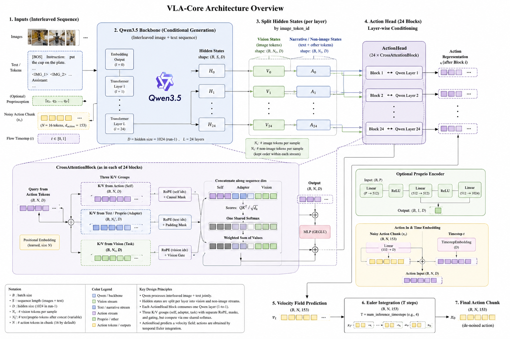
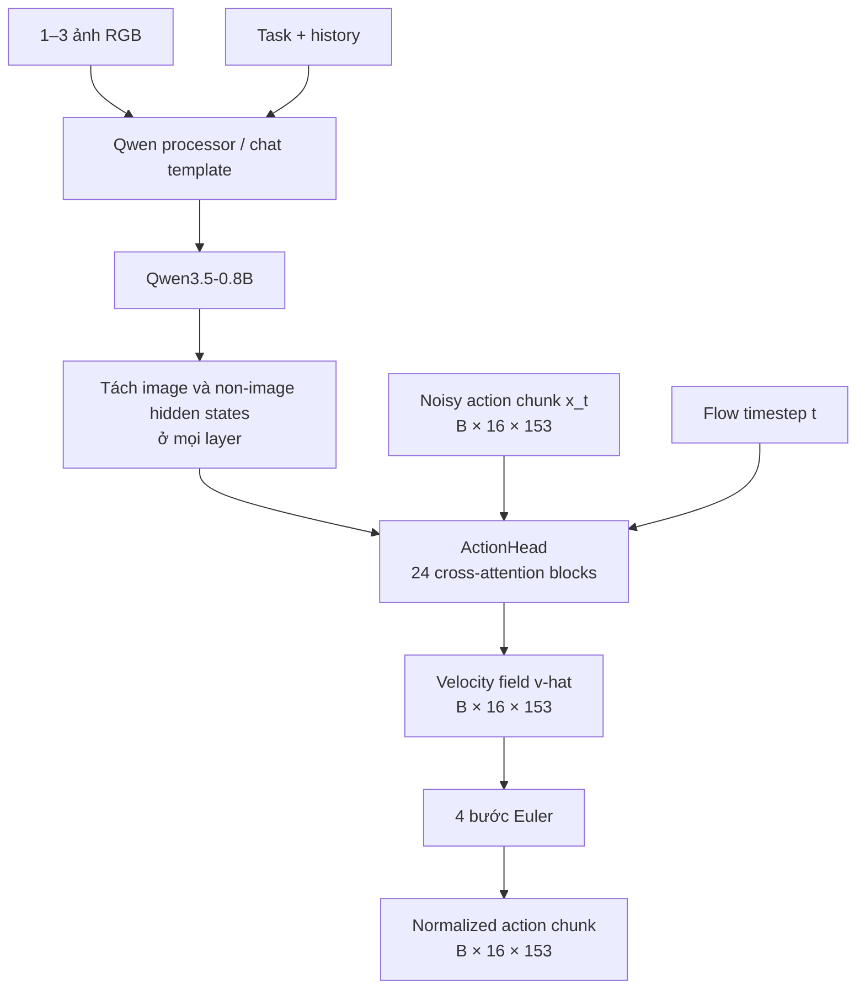
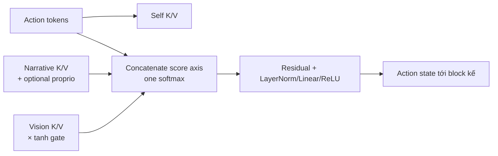

# `vla_core`: tổng quan model, action head và contract dữ liệu

> **Phạm vi.** Đây là overview của implementation `third_party/02_vla_core`, đọc tĩnh
> từ working tree ngày 2026-07-26 (HEAD `233396b`, có thay đổi chưa commit). Các shape
> và phép biến đổi dưới đây là **Verified (static)** từ code; sample là **Illustrative**,
> không phải một inference đã chạy. Chưa có runtime end-to-end vì workspace thiếu model
> weights, `torch`, `transformers` và package `data_corpus`.

## Ý chính

`vla_core` không biến action thành token rồi autoregress từng động tác. Nó ghép một
**Qwen3.5 vision-language backbone** với một **flow-matching action head** riêng:

- Qwen đọc ảnh và câu lệnh, trả hidden state ở mọi layer.
- Action head nhận một action chunk đang nhiễu, timestep của quá trình denoise, và các
  hidden state đó; nó dự đoán **velocity field**, không phải robot command trực tiếp.
- Sau bốn bước Euler, velocity field biến Gaussian noise thành một chunk action liên tục
  `16 × 153`. Chunk này vẫn ở normalized action space; adapter chưa denormalize hay gửi
  lệnh sang robot.

Với config run-1, mỗi chunk bao phủ 1,6 giây tại 10 Hz. Đây là prototype pretraining
cho human ego clips, không phải robot-control stack hoàn chỉnh.





## Ba thành phần của model

| Thành phần                    | Vai trò                                                                 | Contract mặc định                                                                                                |
| ------------------------------- | ------------------------------------------------------------------------ | ------------------------------------------------------------------------------------------------------------------- |
| Qwen backbone                   | Mã hóa ảnh + ngôn ngữ, đồng thời có thể học narrative LM loss | `Qwen/Qwen3.5-0.8B`, 24 text layer, hidden width 1024; language model và vision model được freeze mặc định |
| `ProprioEncoder` (tùy chọn) | Mã hóa proprioception thành một context token                        | `P → 512 → 512 → 1024`; **không active** khi `proprio_dim=None` ở run-1                              |
| `ActionHead`                  | Sinh action chunk liên tục bằng conditional flow matching             | 24 block, width 1024, 8 attention head; input/output là`16 × 153`                                               |

Qwen không bị ép thành một pooled feature. `extract_hidden_states()` giữ embedding output
và hidden state mỗi layer, rồi tách chúng theo vị trí `image_token_id` thành hai stream:

- **vision stream:** token do ảnh tạo ra;
- **narrative stream:** toàn bộ token hợp lệ còn lại — gồm chat marker, instruction,
  task, history và (khi train/inference two-pass) narrative response.

Do đó, “narrative” là tên stream kỹ thuật, không chỉ riêng câu mô tả hành động.

## Điểm khác biệt của action head

### 1. Action chunk là query, không phải learnable query hay text token

Tại flow time `t`, action head lấy noisy chunk `x_t` và tạo 16 action token:

$$
z_0 = \operatorname{Linear}(x_t) + E_{position} + E_{time}(t).
$$

`E_position` là positional embedding học được theo từng step; `E_time` là sinusoidal
embedding của flow timestep đi qua MLP. Nhờ vậy 16 bước được dự đoán song song nhưng vẫn
phân biệt thứ tự trong chunk.

Trong train, với action sạch `a` và Gaussian noise `ε`:

$$
x_t=(1-t)ε+ta, \qquad v^*=a-ε.
$$

Head học masked MSE giữa `v̂` và `v*`. Trong inference, khởi tạo `x ← N(0,I)` rồi lặp
`x ← x + Δt · v̂(x,t)` bốn lần. Vì vậy `VLAModel.forward(..., actions_gt=...)` trả
**velocity** trong `predicted_actions`; `predict_action()` mới trả action đã sampling.

### 2. Một action block condition theo đúng một layer Qwen

`ActionHead` có 24 `CrossAttentionBlock`. Block thứ `i` lấy hidden state từ Qwen layer
`i + 1` (bỏ embedding layer 0). Thay vì chỉ dùng last layer, head có đường condition tới
toàn bộ hierarchy của backbone.

Mỗi block dùng action tokens làm query và ghép ba nhóm key/value vào **một softmax chung**:

1. self-attention giữa 16 action tokens;
2. cross-attention tới narrative tokens, cộng thêm proprio token nếu có;
3. cross-attention tới vision tokens.

Vision logits được nhân với `tanh(gating_factor)` học được, ban đầu bằng 0. Điều này cho
phép model dần mở đường ảnh thay vì bắt mọi block phụ thuộc mạnh vào vision từ bước đầu.
RoPE được áp dụng riêng cho action, narrative/proprio và vision sequences; padding của hai
stream cũng bị mask trước softmax.



## Input và output format

### Input model-level

| Field                   | Shape / type               | Ý nghĩa                                                                                    |
| ----------------------- | -------------------------- | -------------------------------------------------------------------------------------------- |
| `input_ids`           | `(B, S)`, `LongTensor` | Qwen chat tokens, gồm image placeholder tokens                                              |
| `attention_mask`      | `(B, S)`                 | `1` ở text token hợp lệ, `0` ở right-padding                                         |
| `pixel_values`        | `(ΣP_i, C_patch)`       | visual rows do Qwen processor tạo và nối theo batch; không nhất thiết là`(B,C,H,W)` |
| `image_grid_thw`      | `(N_image, 3)`           | layout temporal/height/width của từng ảnh cho Qwen                                        |
| `actions_gt` (train)  | `(B, 16, 153)`, float    | action target đã**phải** normalize                                                  |
| `action_mask` (train) | `(B, 16, 153)`, float    | 1 tại thành phần có nhãn; cho phép mask độc lập hai tay                             |
| `proprio` (optional)  | `(B, P)`, float          | chỉ hợp lệ nếu config bật`proprio_dim`                                                |

Processor nhận 1–3 `PIL.Image` theo thứ tự `[head, left_wrist?, right_wrist?]` và tạo
user message có ảnh + câu hỏi `What action should the robot take to {task}?`. Dataset run-1
hiện chỉ đưa một ego RGB frame vào collator.

### Output

| API / chế độ                   | Output                                      | Ý nghĩa đúng                                                                       |
| --------------------------------- | ------------------------------------------- | -------------------------------------------------------------------------------------- |
| `forward(..., actions_gt=...)`  | `VLAOutput.predicted_actions: (B,16,153)` | predicted velocity`v̂`, cùng shape action nhưng **không** là action sạch |
| `forward(..., actions_gt=None)` | `VLAOutput.predicted_actions: (B,16,153)` | action sau sampling flow                                                               |
| `predict_action(...)`           | `(B,16,153)`                              | action sau narrative generation → re-encode → 4-step Euler sampling                  |
| `generate_narrative(...)`       | token IDs                                   | narrative generated; đây không phải action                                         |

Một step 153 chiều được pack như sau:

```text
[ 0: 3] head_d_pos                         3
[ 3: 9] head_d_rot_6d                      6
[ 9:12] left_pos_cam                       3
[12:18] left_rot_cam_6d                    6
[18:81] left_kp21_wrist_relative          63
[81:84] right_pos_cam                      3
[84:90] right_rot_cam_6d                   6
[90:153] right_kp21_wrist_relative        63
---------------------------------------------
total                                     153
```

Rotation 6D là hai cột đầu của ma trận xoay `3 × 3`. Head block luôn được mask valid;
block 72 chiều của mỗi tay chỉ valid ở timestep có hand annotation. Unit, coordinate frame,
normalization statistics và thao tác post-processing sang robot command vẫn **Unknown** vì
chúng nằm ngoài snapshot `data_corpus`.

## Sample minh họa: một sample vào và ra

Ví dụ dưới đây theo contract run-1, batch size 1. Các giá trị số chỉ để minh họa format.

```python
sample = {
    # Dataset record trước processor
    "image": "ego_rgb.png",                  # RGB uint8, H × W × 3
    "task": "pick up the red cup",
    "history": "hand moves toward the cup",
    "actions_gt": "float32[16, 153]",        # normalized target chunk
    "action_mask": "float32[16, 153]",       # head=1; missing hand fields=0
}

# VLAProcessor + VLACollator tạo batch (B=1)
batch = {
    "input_ids": "int64[1, S]",              # S phụ thuộc chat template/ảnh
    "attention_mask": "int64[1, S]",
    "pixel_values": "float[sum(P_i), C_patch]",
    "image_grid_thw": "int64[1, 3]",
    "actions_gt": "float32[1, 16, 153]",
    "action_mask": "float32[1, 16, 153]",
}

# Train
out = model(**batch)
assert out.predicted_actions.shape == (1, 16, 153)  # velocity, not action
assert out.action_loss.ndim == 0

# Inference
action_chunk = model.predict_action(
    input_ids=batch["input_ids"],
    attention_mask=batch["attention_mask"],
    pixel_values=batch["pixel_values"],
    image_grid_thw=batch["image_grid_thw"],
)
# action_chunk: normalized float tensor [1, 16, 153]
```

Ví dụ decode semantic của timestep `action_chunk[0, 0]`:

```text
0:3     Δ vị trí đầu
3:9     orientation đầu ở representation 6D
9:81    pose + 21 keypoint của tay trái trong camera frame
81:153  pose + 21 keypoint của tay phải trong camera frame
```

Không được gửi trực tiếp vector này tới robot: cần một adapter ngoài repo để denormalize,
kiểm tra mask, đổi representation/coordinate frame và map sang controller của robot đích.

## Giới hạn cần nhớ

- Cấu hình ngầm yêu cầu `Qwen hidden size == action_head_hidden_dim == 1024`; đổi sang
  backbone Qwen width khác sẽ gây lỗi nếu không đổi action head cùng lúc.
- `max_cameras=3` là capability của processor/config; đường dataset active chỉ dùng một ảnh.
- `train_narrative=True` cộng narrative LM loss với trọng số 0,1, nhưng collator hiện tái sử
  dụng text sample cho task và narrative target; cần kiểm tra leakage trước khi coi đó là
  supervision narrative đáng tin cậy.
- Không có denormalization, evaluation harness, checkpoint/runtime robot hoặc bằng chứng
  inference end-to-end trong workspace này.

## Đọc sâu hơn và nguồn code

- [Tổng quan và bản đồ báo cáo](code_details/01_overview.md)
- [Record format và training data](code_details/02_data_and_training.md)
- [Kiến trúc model](code_details/03_model_architecture.md)
- [Cơ chế riêng của ActionHead](code_details/04_action_head_mechanics.md)
- [Tensor flow training](code_details/05_training_tensor_flow.md)
- [Luồng inference](code_details/06_inference_flow.md)
- [Action head](../../../third_party/02_vla_core/model/action_head.py), [VLA model](../../../third_party/02_vla_core/model/vla_model.py), [processor](../../../third_party/02_vla_core/data/processing.py), [dataset/action packing](../../../third_party/02_vla_core/data/corpus_dataset.py)
