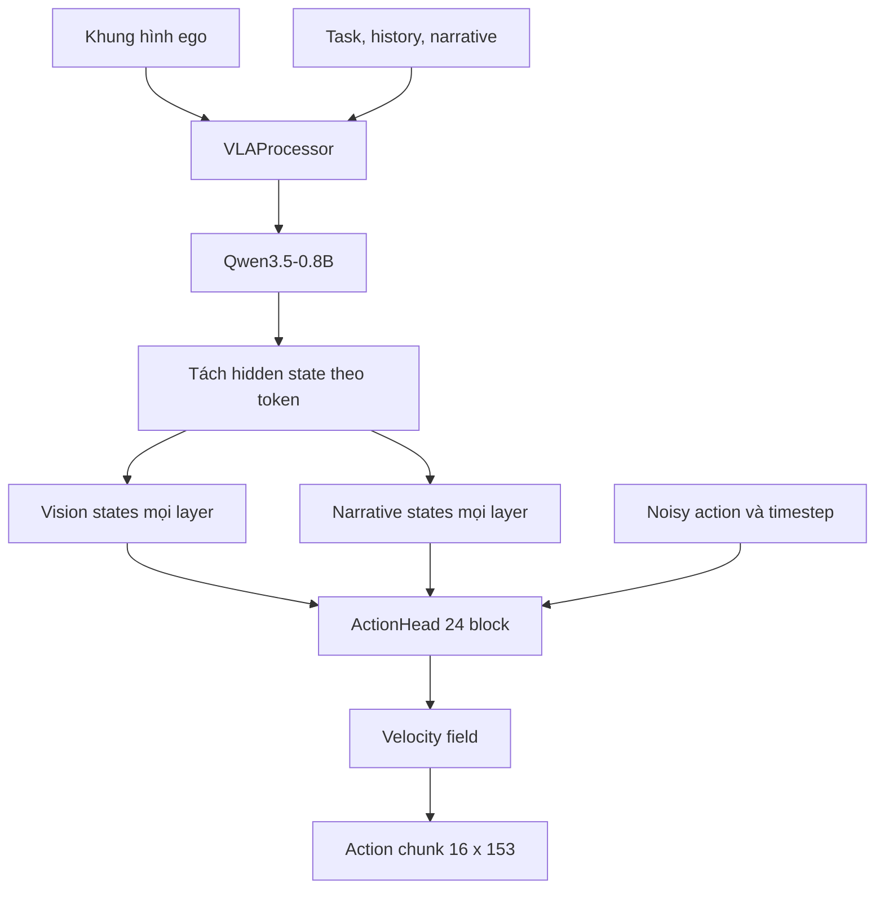

# Tổng quan `vla_core`

## Câu hỏi nghiên cứu

Snapshot `third_party/02_vla_core` thực sự triển khai phần nào của một hệ thống
Vision-Language-Action, dữ liệu đi qua model ra sao, và cần bổ sung bằng chứng gì trước khi
có thể xem nó là pipeline train/inference dùng được?

Phạm vi báo cáo chỉ gồm code có trong snapshot ngày 2026-07-24. Báo cáo không đánh giá chất
lượng Qwen3.5, không kiểm chứng corpus bên ngoài và không suy diễn kết quả huấn luyện chưa có.

## Câu trả lời ngắn

`vla_core` là một prototype pretraining nhỏ, tập trung vào cầu nối từ hidden state của
Qwen3.5-0.8B sang action chunk liên tục:

1. một ảnh ego và prompt được đóng gói theo chat template của Qwen;
2. Qwen trả hidden state ở mọi layer;
3. hidden state được tách thành vision token và narrative token;
4. một `ActionHead` 24 block dùng cross-attention để dự đoán velocity field của action
   chunk;
5. lúc inference, velocity được tích phân Euler bốn bước từ Gaussian noise để tạo action.

Run-1 dùng chunk `16 × 153`, tương ứng 1,6 giây ở 10 Hz. Mỗi step chứa chuyển động đầu và
pose/keypoint của hai tay. Proprioception có module hỗ trợ nhưng bị tắt trong cấu hình run-1.

Đây chưa phải VLA stack hoàn chỉnh. Snapshot phụ thuộc một repo `data_corpus` không đi kèm,
không khai báo dependency có thể tái tạo, chưa có evaluation implementation, checkpoint
loader, robot runtime hoặc bằng chứng một run end-to-end đã thành công.

## Những gì đã xác minh

**Verified bằng đọc code tĩnh tại nested-repo commit
`4c0f2d86d46df8935ade3f5c63ef83013d6c15a6`:**

- Backbone mặc định là `Qwen/Qwen3.5-0.8B`; inner language model và vision model đều bị
  freeze theo mặc định. Code không freeze rõ outer `lm_head`, nên trạng thái trainable của
  output head còn phụ thuộc cấu trúc/tied-weight của model được tải
  ([`model/config.py`](https://github.com/VietnamRobotics/vla_core/blob/4c0f2d86d46df8935ade3f5c63ef83013d6c15a6/model/config.py),
  [`model/vla_model.py`](https://github.com/VietnamRobotics/vla_core/blob/4c0f2d86d46df8935ade3f5c63ef83013d6c15a6/model/vla_model.py)).
- Action contract trong code là `16` step, `153` chiều/step; mask có cùng shape và cho phép
  bỏ loss riêng từng hand block
  ([`data/corpus_dataset.py`](https://github.com/VietnamRobotics/vla_core/blob/4c0f2d86d46df8935ade3f5c63ef83013d6c15a6/data/corpus_dataset.py)).
- Training action dùng conditional flow matching: nội suy noise–action, dự đoán
  `action - noise`, tối ưu masked MSE. Inference bắt đầu từ noise và chạy bốn bước Euler
  ([`model/vla_model.py`](https://github.com/VietnamRobotics/vla_core/blob/4c0f2d86d46df8935ade3f5c63ef83013d6c15a6/model/vla_model.py)).
- Dataloader hỗ trợ temperature sampling theo source và gradient accumulation
  ([`data/collate.py`](https://github.com/VietnamRobotics/vla_core/blob/4c0f2d86d46df8935ade3f5c63ef83013d6c15a6/data/collate.py),
  [`train/pretrain.py`](https://github.com/VietnamRobotics/vla_core/blob/4c0f2d86d46df8935ade3f5c63ef83013d6c15a6/train/pretrain.py)).
- `python3 -m compileall -q third_party/02_vla_core` pass trong workspace ngày
  2026-07-24.

**Chưa xác minh runtime:**

- Hai test không chạy được vì cả Python hệ thống lẫn `.venv` đều thiếu `torch`.
- Môi trường cũng thiếu `transformers`, `cv2` và package `corpus`; chỉ binary FFmpeg có sẵn.
- Không có model weight, corpus release hoặc checkpoint trong snapshot để chạy smoke test
  model/data end-to-end.

## Các phát hiện quan trọng

### Narrative loss không fine-tune backbone như tên “dual loss” dễ gợi ý

Code cộng `0.1 × narrative_loss` vào total loss, nhưng inner language model và vision model
mặc định bị freeze, còn narrative loss không đi qua action head. Code không freeze rõ
`self.qwen.lm_head`: nếu output head có parameter riêng, narrative loss có thể chỉ cập nhật
head này; nếu weight được tie với embedding đã freeze, nó có thể chỉ là số đo. Cần inspect
`requires_grad` sau khi load model và dùng backward hook để chốt hành vi runtime.

### “Multi-GPU via torchrun DDP” chưa được implement

Docstring của `pretrain.py` nói hỗ trợ DDP, nhưng file không init process group, không bọc
model bằng `DistributedDataParallel`, không dùng `DistributedSampler` và mặc định mọi process
đều chọn `cuda:0`. Lệnh `torchrun` vì vậy không đủ để tạo distributed training đúng.

### Contract normalization nằm ngoài snapshot

Action head yêu cầu action đã normalize, nhưng `pack_actions()` chỉ nối các giá trị raw nhận
từ `Layer1PretrainSampler`; snapshot không có normalization statistics hoặc transform.
Không thể kết luận dữ liệu train đúng miền `[-1, 1]` nếu chưa inspect repo `data_corpus`.

### Có rủi ro leakage ở narrative target

Dataset đặt narrative vào `sample["text"]`; collator vừa đưa toàn bộ chuỗi này vào trường
`task`, vừa dùng dòng đầu của cùng chuỗi làm assistant target. Vì target đã xuất hiện trong
prompt, narrative LM task hiện có dấu hiệu target leakage. Cần inspect tokenized batch và
chốt lại contract task/narrative trước khi train.

### Một số mô tả đã lệch khỏi code

Sơ đồ đầu `model/vla_model.py` vẫn ghi output `(B, 50, 23)`, trong khi config và data path đã
chuyển sang `(B, 16, 153)`. README đúng ở phần action space nhưng các con số `4.48M windows`,
group-disjoint validation và license `xp10m` không có source đi kèm trong snapshot, nên chỉ
được xem là claim chưa tái kiểm.

## Kết luận

Prototype đã có lõi ý tưởng rõ: tận dụng hidden state mọi layer của một VLM frozen để điều
kiện hóa flow-matching action head. Phần đáng tin nhất hiện tại là shape/action packing,
masking, action-head forward và loss formulation ở mức code.

Ưu tiên trước một run lớn:

1. vendoring hoặc pin dependency và contract `data_corpus`;
2. tách task input khỏi narrative target, xác minh normalization;
3. chạy test hiện có và thêm smoke test processor → model → backward;
4. sửa hoặc bỏ claim DDP;
5. thêm validation loop, checkpoint resume và inference/evaluation harness.

## Đọc tiếp

- [Kiến trúc và call graph](code_details/01_architecture.md)
- [Dữ liệu, action contract và training](code_details/02_data_and_training.md)
- [Cách chạy, trạng thái kiểm chứng và khoảng trống](code_details/03_runtime_status.md)
- [Cấu trúc chi tiết của model](code_details/04_model_structure.md)

## Nguồn

- [`vla_core/README.md`](https://github.com/VietnamRobotics/vla_core/blob/4c0f2d86d46df8935ade3f5c63ef83013d6c15a6/README.md)
- [`model/`](https://github.com/VietnamRobotics/vla_core/tree/4c0f2d86d46df8935ade3f5c63ef83013d6c15a6/model)
- [`data/`](https://github.com/VietnamRobotics/vla_core/tree/4c0f2d86d46df8935ade3f5c63ef83013d6c15a6/data)
- [`train/pretrain.py`](https://github.com/VietnamRobotics/vla_core/blob/4c0f2d86d46df8935ade3f5c63ef83013d6c15a6/train/pretrain.py)
- [`tests/`](https://github.com/VietnamRobotics/vla_core/tree/4c0f2d86d46df8935ade3f5c63ef83013d6c15a6/tests)
