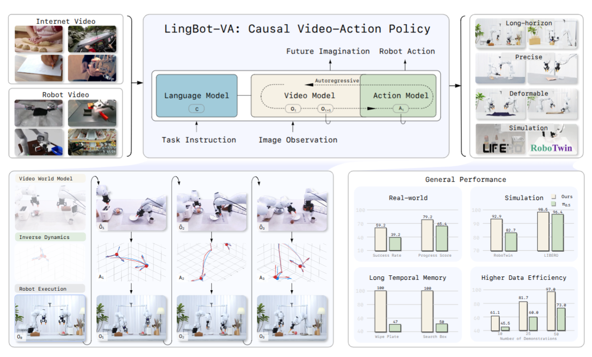
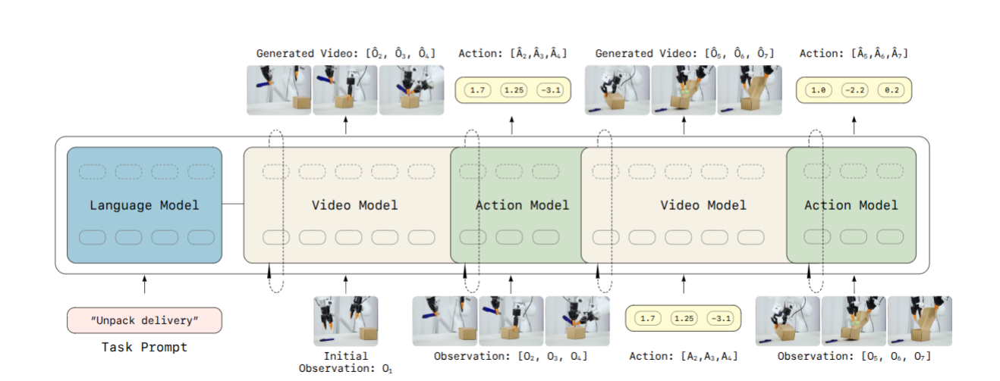

# LingBot-VA — world model video-action tự hồi quy, nhân quả

> **[SOTA-CODE]** Paper thuộc danh sách [sota_with_code.txt](../sota_with_code.txt) —
> nhóm có mã nguồn công khai. Code: https://github.com/robbyant/lingbot-va ·
> Checkpoint: https://huggingface.co/robbyant/lingbot-va ·
> Chỉ mục nhóm: [../02_sota_co_code.md](../02_sota_co_code.md)

## 1. Nguồn

- Tiêu đề thật của paper: ***Causal World Modeling for Robot Control***.
  "LingBot-VA" là tên **hệ thống** bên trong, không phải tiêu đề — `sota_with_code.txt`
  dùng tên hệ thống. Đã đối chiếu: chuỗi "LingBot" xuất hiện 33 lần trong PDF.
- Tác giả: Lin Li, Qihang Zhang, Yiming Luo (đồng tác giả chính), Shuai Yang,
  Ruilin Wang, Fei Han, Mingrui Yu, Zelin Gao, Nan Xue, Xing Zhu, Yujun Shen,
  Yinghao Xu
- arXiv: [2601.21998v2](https://arxiv.org/abs/2601.21998), 22 Mar 2026 [cs.CV]
- Venue: `sota_with_code.txt` ghi **RSS 2026**; bản PDF **không** ghi venue.
  Chưa xác minh được.
- Website: https://technology.robbyant.com/lingbot-va
- PDF trong repo: [docs/papers/05-long-horizon/05_lingbot_va_causal_world_modeling.pdf](../../../papers/05-long-horizon/05_lingbot_va_causal_world_modeling.pdf)
- Phân loại: **future prediction** (world model). Có tuyên bố mạnh về memory —
  xem mục 5.4.

## 2. Câu hỏi nghiên cứu

Tác giả đặt tên cho vấn đề của VLA feedforward là **representation entanglement**:
một mạng duy nhất phải đồng thời học hiểu cảnh, học động lực học vật lý, và học
điều khiển vận động — tất cả từ **một** tín hiệu giám sát. Ép kiến thức dị chất
(ngữ nghĩa thị giác cao chiều ↔ lệnh vận động thấp chiều) vào một không gian biểu
diễn chung gây kém hiệu quả mẫu và khái quát kém.

Nhưng các world model đã có cũng hỏng, vì ba lý do cụ thể:

| Vấn đề                          | Mô tả                                                                                                                                                    |
| ---------------------------------- | ---------------------------------------------------------------------------------------------------------------------------------------------------------- |
| **Reactivity gap**           | Sinh chunk/open-loop rollout đoạn dài không nhận phản hồi thời gian thực                                                                          |
| **Limited long-term memory** | Sinh theo chunk gây mâu thuẫn qua horizon dài khi lịch sử không được cache bền                                                                  |
| **Causality**                | Bidirectional attention trong một segment cho phép token tương lai ảnh hưởng dự đoán quá khứ — trái với bản chất nhân quả của vật lý |

Ba lý do này dẫn thẳng tới lời giải: **công thức tự hồi quy (autoregressive)**.

## 3. Đóng góp

1. **Autoregressive video-action world modeling**: video token và action token đan
   xen trong **một** chuỗi tự hồi quy nhân quả duy nhất.
2. **Mixture-of-Transformers bất đối xứng** + partial denoising + phối hợp bất
   đồng bộ để đạt điều khiển hiệu quả.
3. Chứng minh trên long-horizon và precision, kèm hiệu quả mẫu cao (50 demo để
   adapt) và khái quát.

## 4. Method

### 4.1 Phân rã hai tầng

$$
\text{(1) Visual dynamics: } o_{t+1} \sim p_\theta(\cdot \mid o_{\le t}), \qquad
\text{(2) Inverse dynamics: } a_t \sim g_\psi(\cdot \mid o_t, o_{t+1})
$$

Lợi ích của phân rã: tầng 1 tận dụng được **dữ liệu video quy mô lớn** để học
prior vật lý; tầng 2 chỉ cần demo robot để neo dự đoán thị giác thành action thực
thi được.

Mở rộng có điều kiện trên cả lịch sử action:

$$
z_{t+1:t+K} \sim p_\theta(\cdot \mid z_{\le t}, a_{<t}), \qquad
a_{t:t+K-1} \sim g_\psi(\cdot \mid \hat{z}_{t+1:t+K},\, z_{\le t},\, a_{<t})
$$

Lý do điều kiện trên $a_{<t}$: trong nhiều setting, action mã hoá pose tuyệt đối,
nên lịch sử action **chính là** quỹ đạo cấu hình của embodiment.

### 4.2 Kiến trúc MoT bất đối xứng

- Video stream: khởi tạo từ **Wan2.2-5B**, $d_v = 3072$, 30 layer.
- Action stream: cùng độ sâu, $d_a = 768$ (nhỏ hơn 4×), ~350M tham số thêm.
- Tổng: **5.3B**.

Lý do bất đối xứng được nêu rõ: phân phối action vốn đơn giản hơn dữ liệu thị
giác, cần ít tham số hơn.

Video và action được xử lý bởi transformer block riêng ở mỗi layer, rồi hợp nhất
qua cross-modal attention: action token chiếu lên chiều video, tham gia joint
self-attention, rồi chiếu ngược lại qua residual — giữ được không gian đặc trưng
riêng cho từng modality.

### 4.3 Video sparsification và đan xen

Downsample thời gian hệ số $\tau = 4$. Mỗi frame video $o_t$ gắn với $\tau$ action
liên tiếp, tạo chuỗi hợp nhất:

$$
[\,z_t,\ a_{t,1},\ a_{t,2},\ \dots,\ a_{t,\tau},\ z_{t+1},\ \dots\,]
$$

Nghĩa là dự đoán $K$ frame video sinh ra $\tau K$ action — điều khiển tần số cao
mà vẫn sinh video hiệu quả. Causal VAE Wan2.2 nén $4 \times 16 \times 16$, cộng
patchify /2, cho $N = 192$ spatial token mỗi frame. S

**Insight:** $K$ frame là guild chính thức cho các action output, không sinh future quá xa.

### 4.4 Noisy History Augmentation — mẹo giảm chi phí quan trọng nhất

Nút thắt inference là sinh video token. Nhận xét cốt lõi: **dự đoán action không
cần biểu diễn video đã khử nhiễu hoàn toàn**. Khi train:

$$
\tilde{z}_{\le t} =
\begin{cases}
(1 - s_{aug})\epsilon + s_{aug} z_{\le t}, & p = 0.5,\ s_{aug} \in [0.5, 1] \\
z_{\le t}, & 1 - p = 0.5
\end{cases}
$$

Khi inference chỉ cần khử nhiễu tới $s = 0.5$ thay vì $s = 1$ — **giảm một nửa số
bước denoise video**. Cấu hình thực tế: Euler 3 bước cho video (tới $s = 0.6$), 10
bước cho action; CFG video 5.0, CFG action 1.0.

Đây là **cùng một phát hiện** với một số báo cáo code-backed khác trong tập này.

### 4.5 Khởi tạo action stream

Train từ đầu gây tối ưu bất ổn và hội tụ chậm, vì phân phối output của action
token ban đầu lệch xa phân phối video, phá joint attention. Giải pháp: khởi tạo
bằng cách **nội suy trọng số video pretrained** rồi nhân hệ số
$\alpha = \sqrt{d_v / d_a}$ để bảo toàn phương sai output.

Đường cong huấn luyện (Fig. 7): random init → gradient norm cao, hội tụ chậm;
share weights → ổn định nhưng chưa tối ưu; copy + scaling → tốt nhất.

### 4.6 Asynchronous inference với FDM grounding

Đây là phần kỹ thuật tinh tế nhất của paper.

Async ngây thơ: trong lúc robot chạy chunk $a_t$, model dự đoán $a_{t+1}$ dựa trên
$\hat{z}_t$ đã cache. **Hỏng**: video generative model thiên về mượt thời gian nên
"tiếp tục" video ảo giác $\hat{z}_t$ và **bỏ qua phản hồi vật lý thật** $z_{t-1}$
— dẫn tới suy thoái open-loop và trôi quỹ đạo.

Sửa bằng **FDM grounding**: thay vì dùng dự báo cũ, chạy một lượt forward dynamics
dùng phản hồi thật $z_{t-1}$ để "tưởng tượng" trạng thái $z_t$ sau khi áp $a_t$,
rồi cache dự đoán đã neo phản hồi đó. Ép model tái căn chỉnh với môi trường trước
khi dự đoán $z_{t+1}$. Có thêm loss $\mathcal{L}_{fdm}$ trong post-training.

### 4.7 Dữ liệu

~**16K giờ**, 6 nguồn: Agibot, RoboMind, InternData-A1, OXE (subset OpenVLA), UMI
Data (loại DexUMI), RoboCOIN. Action interface hợp nhất 30 chiều cho dual-arm:
$(7_{EEF} + 7_{joints} + 1_{gripper}) \times 2$, zero-pad khi thiếu chiều.

Pretrain **1.4T token**. Post-training: **chỉ 50 demo là đủ**, lr $10^{-5}$, 3K
step.

## 5. Claim → Evidence

### 5.1 RoboTwin 2.0 (50 task bimanual, ALOHA-AgileX)

| Metric                  | X-VLA       | π0         | π0.5       | Motus       | **LingBot-VA**                  |
| ----------------------- | ----------- | ----------- | ----------- | ----------- | ------------------------------------- |
| Horizon = 1 (Easy/Hard) | 81.6 / 82.5 | 66.5 / 61.6 | 85.1 / 80.2 | 91.0 / 90.6 | **94.18 / 93.56** (+3.2 / +3.0) |
| Horizon = 2             | 59.3 / 55.9 | 66.1 / 54.7 | 79.3 / 73.0 | 85.2 / 80.9 | **90.35 / 86.95** (+5.2 / +6.1) |
| Horizon = 3             | 61.2 / 66.0 | 61.6 / 50.2 | 78.6 / 67.4 | 85.0 / 84.2 | **93.22 / 93.28** (+8.2 / +9.1) |
| Trung bình 50 task     | 72.9 / 72.8 | 65.9 / 58.4 | 82.7 / 76.8 | 88.7 / 87.0 | **92.93 / 91.55** (+4.2 / +4.6) |

Mức cải thiện **tăng theo horizon** (+3.2 → +5.2 → +8.2) — chữ ký nhất quán với
mọi paper long-horizon trong tập.

### 5.2 LIBERO

Avg **98.5**: Spatial 98.5±0.3, Object 99.6±0.3, Goal 97.2±0.2, **Long 98.5±0.5**.
Vượt X-VLA 98.1, OpenVLA-OFT 97.1, CronusVLA 97.0, π0 94.1.

### 5.3 Real world — 6 task, chỉ 50 demo mỗi task

Ba nhóm: long-horizon (Make Breakfast, Unpack Delivery), precision (Insert Tubes,
Pick Screws), deformable (Fold Clothes, Fold Pants). Finetune 500 step.

Theo Fig. 1: success rate **59.2 vs 39.2** (π0.5); progress score **79.2 vs 65.4**.
Kết luận của paper: hơn 20% cải thiện trên task khó, với chỉ 50 demo để adapt.

### 5.4 Temporal memory — hai task thiết kế rất sạch

1. **Wipe Plate**: lau đĩa **đúng sáu lần** — buộc phải đếm và nhớ hành động lặp.
2. **Search Box**: hai hộp (trái/phải), chỉ một hộp có block. Robot mở lần lượt
   phải rồi trái. Lúc thu dữ liệu, block nằm ở hai hộp với xác suất bằng nhau; lúc
   test **luôn ở hộp trái**. Không có memory thì sau khi thấy hộp phải rỗng, model
   có **50% khả năng mở lại chính hộp đó**.

Kết quả (Fig. 9): LingBot-VA **100 / 100**; π0.5 **47 / 50**.

Con số 50 của π0.5 trên Search Box **đúng bằng mức ngẫu nhiên** mà thiết kế task
dự đoán cho một policy không nhớ. Đây là một trong những bằng chứng sạch nhất về
memory trong corpus hiện tại — task được thiết kế sao cho baseline có giá trị kỳ
vọng tính toán được trước.

Cơ chế: teacher forcing điều kiện trên toàn bộ lịch sử lúc train; **KV-cache** giữ
toàn bộ thông tin lịch sử lúc inference.

### 5.5 Hiệu quả mẫu

| Số demo | RoboTwin Easy (progress) | Real world (progress)  |
| -------- | ------------------------ | ---------------------- |
| 5        | 46.6 vs 36.3             | —                     |
| 10       | 58.2 vs 50.7             | **61.1 vs 45.5** |
| 25       | 74.2 vs 70.5             | 81.7 vs 60.0           |
| 50       | 84.6 vs 81.2             | 97.0 vs 73.0           |

(Ours vs π0.5.) Ở chế độ 10 demo: +15.6% real, +10.3% sim.

### 5.6 Ablation (RoboTwin Easy)

| Cấu hình                                 | Easy toàn bộ | H=1  | H=2  | H=3            |
| ------------------------------------------ | -------------- | ---- | ---- | -------------- |
| LingBot-VA (tham chiếu)                   | **92.9** | 94.2 | 90.4 | 93.2           |
| FDM-grounded Async                         | 90.4           | 92.5 | 87.7 | 85.6           |
| **Naive Async**                      | **74.3** | 83.3 | 70.3 | **32.9** |
| Khởi tạo từ WAN (không joint pretrain) | 80.6           | 84.9 | 76.3 | 67.6           |

Hai điều đáng chú ý:

- **Async ngây thơ sụp đổ ở horizon dài**: 32.9 so với 93.2. Đây là bằng chứng
  định lượng mạnh nhất cho vấn đề "video model tiếp tục ảo giác của chính nó" mà
  mục 4.6 mô tả. Bất kỳ ai định pipeline hoá dự đoán với thực thi đều nên đọc
  con số này.
- **Joint video-action pretraining là bắt buộc**: khởi tạo thẳng từ Wan2.2-5B chỉ
  cho 80.6.

Async vs sync: success rate tương đương, nhưng async **nhanh gấp 2 lần**.

## 6. Giới hạn và điểm chưa rõ

- **Không có ablation Noisy History Augmentation.** Mức $s = 0.5$ (hoặc 0.6) được
  chọn mà không quét, dù đây là tham số đánh đổi chi phí/chất lượng trực tiếp.
- Baseline chính chỉ là π0.5 và Motus. Không so với các hướng world model +
  memory khác dù paper cũng chạm vào bài toán đếm/nhớ.
- 16K giờ dữ liệu và 1.4T token pretrain — **không tái lập được** ngoài phòng lab công nghiệp. Checkpoint công khai làm giảm nhẹ vấn đề này.
- **Insight:** Future prediction is probably beneficial, but it introduces an imagination-to-control failure path. LingBot’s major achievement is showing that this path can be controlled using joint training, real-observation replacement, KV cache and FDM-grounded asynchronous inference.

## 7. Liên hệ với workspace

- Đây là paper **có code + checkpoint công khai** duy nhất trong tập đạt quy mô
  công nghiệp. Với workspace chưa có training loop, khả năng tải checkpoint và
  chạy inference đáng giá hơn nhiều so với con số SOTA.
- LingBot-VA nằm ở cực "video và action trong cùng một chuỗi", khác hẳn các
  hướng chỉ dự báo trạng thái hoặc goal.
- Hai phát hiện có thể tách ra dùng ngay, độc lập kiến trúc:
  1. **Partial denoising** — action không cần video đã khử nhiễu hết.
  2. **FDM grounding cho async** — nếu định pipeline hoá dự đoán với thực thi
     (điều mà [02-realtime-chunking](../../02-realtime-chunking/) quan tâm), phải
     neo lại bằng quan sát thật, nếu không sẽ trôi.
- Interface action 30 chiều hợp nhất với zero-pad là **đúng cái mà
  `.agents/02_architecture.md` cảnh báo**: cùng shape không có nghĩa cùng
  semantics. Paper này zero-pad qua 6 dataset và nhiều embodiment mà không bàn về
  frame/unit/control convention.

## 8. Thử nghiệm tiếp theo

1. **Tái lập hai task memory** (Wipe Plate, Search Box) — thiết kế rẻ và có mức
   baseline tính toán được trước (50% ngẫu nhiên cho Search Box). Đây là cách tốt
   nhất trong cả tập để đo "policy này có nhớ không" mà không cần benchmark lớn.
2. **Quét $s_{aug}$ / mức partial denoise** trên checkpoint công khai: $s \in\{0.3, 0.5, 0.6, 0.8, 1.0\}$, đo latency và success rate. Trả lời trực tiếp câu hỏi chi phí/chất lượng mà LingBot-VA để ngỏ.
3. **Đo latency tuyệt đối** của checkpoint công khai trên GPU consumer, đối chiếu
   với latency của các policy khác trên cùng phần cứng/cấu hình.
   [Hi Robot](../hierarchical_agent/02_hi_robot.md). Không paper nào cho phép so trực tiếp; ta tự đo được vì có checkpoint.
