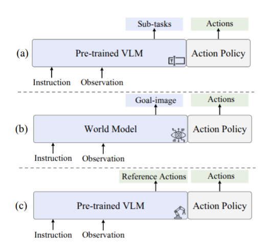
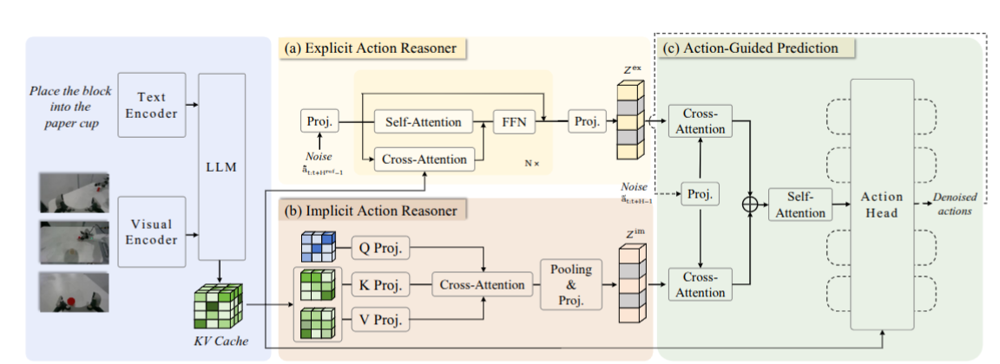

# ACoT-VLA — chain-of-thought trong không gian action

> **[SOTA-CODE]** Paper thuộc danh sách [sota_with_code.txt](../sota_with_code.txt) —
> nhóm có mã nguồn công khai. Code: https://github.com/AgibotTech/ACoT-VLA ·
> Chỉ mục nhóm: [../02_sota_co_code.md](../02_sota_co_code.md)

## 1. Nguồn

- Tiêu đề: *ACoT-VLA: Action Chain-of-Thought for Vision-Language-Action Models*
- Tác giả: Linqing Zhong, Yi Liu, Yifei Wei, Ziyu Xiong, Maoqing Yao, Si Liu,
  Guanghui Ren (Beihang University + AgiBot)
- arXiv: [2601.11404v2](https://arxiv.org/abs/2601.11404), 30 Mar 2026
- Venue: CVPR 2026
- PDF trong repo: [docs/papers/05-long-horizon/06_acot_vla_action_chain_of_thought.pdf](../../../papers/05-long-horizon/06_acot_vla_action_chain_of_thought.pdf)
- Phân loại: **future prediction**. Lý do xếp ở đây thay vì hierarchical_agent:
  cơ chế lõi (EAR) **dự báo chuỗi action thô ở tương lai** để điều kiện policy —
  cùng vị trí trong pipeline với [Seer](01_seer.md) dự báo ảnh tương lai, chỉ khác
  modality của thứ được dự báo.

## 2. Câu hỏi nghiên cứu

Paper đặt tên cho vấn đề là **semantic-kinematic gap**: kiến thức trong VLM backbone đến từ pretrain web-scale tối ưu cho hiểu ngôn ngữ và hỏi đáp, **không** cho động lực học vật lý. Tương tự, world model dự báo trạng thái thị giác tương lai nhưng hướng dẫn vẫn bị buộc vào biểu diễn thị giác.

Luận điểm: cả hai dạng lý luận — ngữ nghĩa và thị giác — chỉ cho hướng dẫn **gián tiếp, dưới tối ưu** cho việc sinh chuỗi action. Nếu "suy nghĩ" diễn ra **trực tiếp trong không gian action** thì sao?

## 3. Đóng góp

1. **ACoT** — định nghĩa lại quá trình "thought" không phải là chuỗi token ngôn ngữ mà là **chuỗi có cấu trúc gồm các ý định action tường minh, neo về mặt động học**.
2. Hai cơ chế bổ sung nhau: **EAR** (hướng dẫn quỹ đạo tường minh) và **IAR** (prior hành vi ngầm trích từ chính VLM).
3. **ACoT-VLA**  — extention trực tiếp từ mô hình **π0.5**,  đạt SOTA trên LIBERO, LIBERO-Plus, VLABench.

## 4. Method

### 4.1 Ba loại guidance

$$
\pi_\theta(a_{t:t+H-1},\, g \mid o_t, l) = \pi_\theta(a_{t:t+H-1} \mid o_t, l, g)\, \pi_\theta(g \mid o_t, l)
$$

Paper mở rộng $g \in \{g_{lang}, g_{vis}\}$ thành $g \in \{g_{lang}, g_{vis}, g_{action}\}$,
rồi tách $g_{action}$ thành dạng tường minh và ngầm.

Bảng so sánh của paper (Table 1) phân loại **25 phương pháp** theo cột "Guidance"
thành `–` / `Visual` / `Linguistics` / `Action`. Đây là một taxonomy độc lập, ánh
xạ khá sát với cách chia của [../01_tong_quan.md](../01_tong_quan.md): Linguistics
≈ hierarchical agent, Visual ≈ future prediction. ACoT là cột thứ ba mà taxonomy của chúng ta chưa tách riêng.

### 4.2 Explicit Action Reasoner (EAR)

Transformer nhẹ, $N = 18$ layer. Nhận chuỗi action nhiễu
$\tilde{a}_{t:t+H^{ref}-1}$, mỗi layer làm self-attention (bắt phụ thuộc thời gian
trong chuỗi action) **cộng** cross-attention với KV cache của **layer VLM tương ứng** , apply vào từng denoise step:

$$
\tilde{h}^{ref}_i = \text{Self-Attn}(h^{ref}_{i-1}) + \text{CrossAttn}(h^{ref}_{i-1}, K^{VLM}_i, V^{VLM}_i)
$$

$$
h^{ref}_i = h^{ref}_{i-1} + \text{FFN}(\tilde{h}^{ref}_i)
$$

Train bằng flow matching, sinh ra quỹ đạo tham chiếu thô $a^{ref}$, chiếu qua MLP thành $Z^{ex}$.

Tác giả diễn giải EAR như một dạng **self-conditioning trong không gian action**:
đưa ước lượng sơ bộ vào chính quá trình sinh, thủ pháp đã được chứng minh cải thiện chất lượng mẫu trong mô hình sinh.

### 4.3 Implicit Action Reasoner (IAR)

Thao tác trực tiếp trên **KV cache của VLM**. Với mỗi layer $i$, một ma trận học được $Q_i \in \mathbb{R}^{M \times d}$ ($M = 1$). Downsample KV về $d' = 128$ rồi cross-attention:
$Q_i$ là ma trận mới được paper thêm vào, init random ban đầu, với kích thước = VLM layer. Sử dụng để học trên KV Cache lấy ra các feature có ích cho action generation.

$$
z^{im}_i = \text{MLP}\big(\text{Pool}(\text{CrossAttn}(Q'_i, K'_i, V'_i))\big)
$$

Gộp qua các layer thành $Z^{im}$.

**Insight :** các gợi ý như "reach out", "grasp" và ý định tương tác trong ngữ cảnh thị giác **không** hiện ra dưới dạng quỹ đạo robot, nhưng vẫn ngầm định nghĩa phân phối trên các action khả thi.

### 4.4 Action-Guided Prediction (AGP)

Action nhiễu ( là một action nhiễu mới, khác với $\tilde{a}_{t:t+H^{ref}-1}$ trước) được mã hoá thành **action query** $Q_{action}$ (không đưa thẳng vào action head như thường lệ), rồi dual cross-attention:

$$
S^{ex} = \text{CrossAttn}(Q_{action}, Z^{ex}, Z^{ex}), \qquad
S^{im} = \text{CrossAttn}(Q_{action}, Z^{im}, Z^{im})
$$

$$
\bar{h} = \text{Self-Attn}([S^{ex}; S^{im}])
$$

### 4.5 Teacher Forcing Stabilization — chi tiết dễ bỏ sót

Output của $\pi_\theta^{ref}$ lúc train còn bất ổn. Nên khi train, final Action Head  được train **từ quỹ đạo tham chiếu ground-truth**, không từ dự đoán của EAR — tránh nhiễu tối ưu lan sang action head.

Tương tự như module EAR, train flow-matching **từ quỹ đạo tham chiếu ground-truth.**

Khi inference, model chuyển sang chế độ **tự điều kiện hoàn toàn**: EAR tự sinh reference action, Action Head consume output của EAR đó. Đây là một train-test mismatch có chủ ý mà paper không phân tích rủi ro.

### 4.6 Cấu hình

- Xây trên **π0.5**: SigLIP visual encoder, Gemma 2B ($N = 18$ layer, $d = 2048$), ảnh 224×224. Input, output cũng giống với **π0.5**
- Mặc định: $H^{ref} = 15$, $H = 10$; action shift 2 và 1. ("Action shift" = khoảng thời gian tương đối so với demo expert; shift 1 = khớp frame, shift 2 = bỏ một frame trung gian.)
- $\mathcal{L}_{total} = \lambda_1 \mathcal{L}_{\pi^{ref}_\theta} + \lambda_2 \mathcal{L}_{\pi^{head}_\theta}$,
  $\lambda_1 = \lambda_2 = 0.5$, cả hai đều flow-matching MSE.
- Train: cosine decay, warmup 10K step, peak lr $5 \times 10^{-5}$; AdamW, grad clip 1.0, EMA 0.999; **8× H100** bf16. Inference trên **một RTX 4090**.

## 5. Claim → Evidence

### 5.1 LIBERO (2000 rollout, 50 trial/task)

| Method                                        | Guidance         | Spatial | Object | Goal | Long           | Avg            |
| --------------------------------------------- | ---------------- | ------- | ------ | ---- | -------------- | -------------- |
| CoT-VLA                                       | Visual           | 87.5    | 91.6   | 87.6 | 69.0           | 81.1           |
| DreamVLA                                      | Visual           | 97.5    | 94.0   | 89.5 | 89.5           | 92.6           |
| GE-Act                                        | Visual           | 98.2    | 97.6   | 95.8 | 94.4           | 96.5           |
| [MemoryVLA](../memory_modules/01_memoryvla.md) | Linguistics      | 98.4    | 98.4   | 96.4 | 93.4           | 96.7           |
| π0.5                                         | Linguistics      | 98.8    | 98.2   | 98.0 | 92.4           | 96.9           |
| OpenVLA-OFT                                   | Linguistics      | 97.6    | 98.4   | 97.9 | 94.5           | 97.1           |
| VLA-Adapter                                   | Linguistics      | 97.8    | 99.2   | 97.2 | 95.0           | 97.3           |
| **Ours⋄** (LLM đóng băng)           | **Action** | 99.4    | 99.6   | 98.8 | 96.0           | **98.5** |
| **Ours**                                | **Action** | 98.6    | 99.0   | 99.4 | **97.0** | **98.5** |

+1.6 tuyệt đối so với π0.5. Mức tăng rõ nhất ở **LIBERO-Long** (92.4 → 97.0).

Chi tiết đáng chú ý: biến thể **đóng băng LLM backbone** đạt cùng 98.5 trung bình.
Nghĩa là guidance trong không gian action đủ mạnh để không cần tune backbone —
tiết kiệm chi phí huấn luyện đáng kể mà paper không nhấn mạnh.

### 5.2 LIBERO-Plus (10,030 episode, mỗi episode chạy một lần)

| Setting   | Method         | Camera         | Robot          | Language       | Light          | Background     | Noise          | Layout         | Avg            |
| --------- | -------------- | -------------- | -------------- | -------------- | -------------- | -------------- | -------------- | -------------- | -------------- |
| Zero-shot | OpenVLA-OFT    | 56.4           | 31.9           | 79.5           | 88.7           | 93.3           | 75.8           | 74.2           | 69.6           |
|           | π0.5*         | 75.8           | 79.4           | 83.3           | 95.5           | 95.0           | 89.6           | 87.0           | 85.7           |
|           | **Ours** | 72.6           | **82.6** | **87.5** | **97.7** | **96.5** | 87.8           | **88.1** | **86.6** |
| SFT       | π0.5⋄        | 70.3           | 41.7           | 81.1           | 97.3           | 94.6           | 71.8           | 84.9           | 75.7           |
|           | **Ours** | **96.6** | **70.4** | 79.7           | 95.1           | **97.1** | **95.9** | 85.0           | **88.0** |

Mạnh nhất ở nhiễu **robot initial-state** (+3.2) và **language variation** (+4.2)
ở chế độ zero-shot — đúng hai chiều mà policy dẫn hướng bằng ngôn ngữ/thị giác suy
giảm nhiều. Nhưng **thua π0.5 ở Camera** (72.6 vs 75.8) và Noise (87.8 vs 89.6);
paper không bàn.

### 5.3 VLABench (LLM đóng băng, train 60K step)

| Method           | IS avg         | PS avg         | Unseen Texture IS      | PS                    |
| ---------------- | -------------- | -------------- | ---------------------- | --------------------- |
| π0⋄            | 55.0           | 44.1           | 50.6                   | 42.5                  |
| π0.5⋄          | 60.2           | 43.1           | 62.0                   | 47.4                  |
| **Ours⋄** | **63.5** | **47.4** | **74.6** (+12.6) | **54.6** (+7.2) |

Nhưng **thua** ở Commonsense (52.3 IS vs 57.5 của π0.5) và Instruction (56.8 vs
57.1) — nghĩa là guidance action giúp robustness thị giác nhưng **không** giúp
lý luận ngữ nghĩa. Đây là giới hạn tự nhiên và hợp lý của paradigm, paper không nêu.

### 5.4 Ablation module (LIBERO, baseline = π0.5)

| #        | EAR | IAR | Spatial | Object | Goal | Long           | Avg            |
| -------- | --- | --- | ------- | ------ | ---- | -------------- | -------------- |
| Baseline |     |     | 98.8    | 98.2   | 98.0 | 92.4           | 96.9           |
| #1       | ✓  |     | 99.0    | 99.4   | 98.0 | **96.6** | 98.3           |
| #2       |     | ✓  | 99.2    | 99.2   | 98.2 | 95.6           | 98.1           |
| #3       | ✓  | ✓  | 99.4    | 99.6   | 98.8 | 96.0           | **98.5** |

Hai cơ chế bổ sung nhau ở trung bình. Nhưng trên **LIBERO-Long**, EAR một mình
(96.6) **tốt hơn** cả hai gộp lại (96.0) — không đơn điệu, và paper không bàn.

### 5.5 Ablation chiến lược tương tác KV-cache (IAR)

| Chiến lược                | Spatial | Object | Goal | Long           | Avg            |
| ---------------------------- | ------- | ------ | ---- | -------------- | -------------- |
| Baseline                     | 98.8    | 98.2   | 98.0 | 92.4           | 96.9           |
| Query (dùng thẳng KV gốc) | 98.8    | 99.0   | 97.2 | 92.8           | 97.0           |
| Attention Pooling            | 99.4    | 98.6   | 98.2 | 92.8           | 97.3           |
| **Downsample**         | 99.2    | 99.2   | 98.2 | **95.6** | **98.1** |

Kết luận của tác giả: đặc trưng VLM **chứa thông tin nhiễu** đối với dự đoán
action, nên phải giảm chiều trước khi trích. Đây là bằng chứng trực tiếp cho luận
điểm semantic-kinematic gap.

### 5.6 Real world

AgiBot G1, 3 task: *Wipe Stain* (contact-rich), *Pour Water* (thao tác tinh),
*Open-set Pick* (theo lệnh mở). Thêm nền tảng **AgileX** để kiểm tra khả năng
thích ứng chéo embodiment.

Trung bình: **66.7%** vs π0.5 61.0% vs π0 33.8%.

## 6. Giới hạn và điểm chưa rõ

- **Paper có mục "Limitations & Future Works".** Tác giả nêu chi phí triển khai tài nguyên và giới hạn của action chunk representation; không nên nói paper bỏ qua hoàn toàn giới hạn.
- **Paper có latency analysis**: baseline 91 ms, thêm EAR 110 ms, IAR thêm khoảng 2 ms. Tuy vậy, report không đủ chi tiết phần cứng/cấu hình để so trực tiếp với các paper khác; latency độc lập vẫn cần đo lại trước khi ra quyết định tích hợp.
- **Train-test mismatch có chủ ý** (mục 4.5): train dùng reference ground-truth, inference tự sinh. Không có thí nghiệm nào đo khoảng cách giữa hai chế độ, cũng không có phân tích chất lượng reference trajectory do EAR sinh ra.
- **Non-monotonicity ở LIBERO-Long** (mục 5.4) và **hồi quy ở Camera/Noise**
  (5.2), **Commonsense/Instruction** (5.3) đều không được thảo luận.
- Cải thiện tuyệt đối trên LIBERO là **+1.6 điểm trên nền 96.9** — vùng bão hoà. Bằng chứng thuyết phục hơn nằm ở LIBERO-Plus SFT (+12.3) và VLABench unseen texture (+12.6), không ở bảng LIBERO chính.
- **Missing baseline**: không so với các hệ manager tách rời dù cùng dùng π0.5 làm nền và cùng đo trên VLABench.

## 7. Liên hệ với workspace

- ACoT-VLA bổ sung một **cột thứ tư** vào taxonomy ở
  [../01_tong_quan.md](../01_tong_quan.md): hướng dẫn ở **không gian action**, bên
  cạnh ngôn ngữ (hierarchical agent) và thị giác (future prediction). Nó vẫn thuộc
  nhóm future_prediction về vị trí trong pipeline, nhưng khác về modality của thứ
  được dự báo. Bốn paper nay chiếm bốn ô của một ma trận rõ ràng:

| Dự báo cái gì tại$t+n$ | Paper                         | Chi phí gán nhãn                      |
| ----------------------------- | ----------------------------- | ---------------------------------------- |
| Ảnh RGB                      | [Seer](01_seer.md)             | Không (tự giám sát)                  |
| Latent video AR               | [LingBot-VA](02_lingbot_va.md) | Không (tự giám sát)                  |
| **Chuỗi action thô**  | **ACoT-VLA**            | **Không** (chính demo là nhãn) |

- Điểm thực dụng mạnh nhất: **nhãn cho EAR chính là dữ liệu demo đã có**. Không
  cần nhãn subtask, không cần affordance, không cần video ngoài. Cùng mức yêu cầu
  dữ liệu với Seer và MemoryVLA trong corpus hiện tại.
- Biến thể **đóng băng LLM** đạt cùng hiệu năng: nếu workspace muốn thử một thay
  đổi lên π0.5 mà không tune backbone 2B, đây là ứng viên khả thi nhất.

## 8. Thử nghiệm tiếp theo

1. **Xác minh latency của EAR và IAR** trên code công khai, cùng phần cứng/cấu hình
   đã ghi. Paper báo cáo 91 ms baseline, 110 ms với EAR và thêm khoảng 2 ms cho
   IAR; phép đo mới sẽ kiểm tra khả năng tái lập, không phải bù số liệu bị thiếu.
2. **Đo khoảng cách teacher-forcing**: chạy inference hai chế độ — reference từ
   ground-truth vs reference tự sinh — trên cùng checkpoint. Chênh lệch cho biết
   train-test mismatch ở mục 4.5 tốn bao nhiêu.
3. **Ghép ACoT với progress head**: EAR dự báo *đi đâu tiếp*,
   progress trả lời *đã đi được bao xa*. Cả hai đều rẻ về nhãn và đều chỉ thêm
   output vào action path. Ứng viên tốt nhất trong cả tập để kiểm tra **tính
   cộng dồn** — câu hỏi mà không paper nào trả lời.
