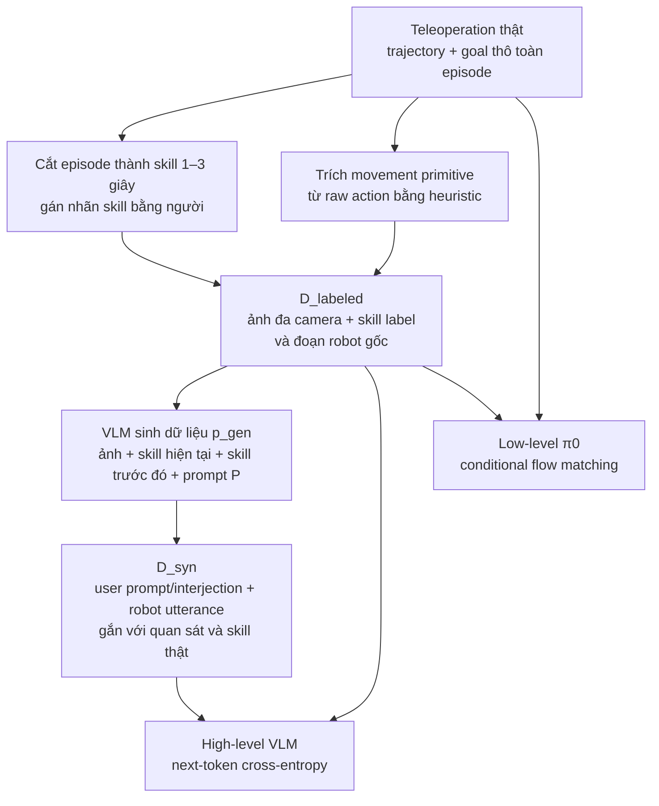

# Hi Robot — hệ hai tầng VLM cho prompt mở và phản hồi tại chỗ

## 1. Nguồn

- Tiêu đề: *Hi Robot: Open-Ended Instruction Following with Hierarchical
  Vision-Language-Action Models*
- Tác giả: Lucy Xiaoyang Shi, Brian Ichter, Michael Equi, Liyiming Ke, Karl
  Pertsch, Quan Vuong, ... Danny Driess, Sergey Levine, Chelsea Finn (Physical
  Intelligence / Stanford / UC Berkeley)
- arXiv: [2502.19417v2](https://arxiv.org/abs/2502.19417), 15 Jul 2025
- Venue: ICML 2025 (PMLR 267)
- Trang chính thức: [Teaching Robots to Listen and Think Harder](https://www.pi.website/research/hirobot)
  (truy cập 2026-08-04)
- PDF trong repo: [docs/papers/05-long-horizon/02_hi_robot_hierarchical_vla.pdf](../../../papers/05-long-horizon/02_hi_robot_hierarchical_vla.pdf)
- Phân loại: **hierarchical agent** (hai model tách rời, giao tiếp bằng ngôn ngữ).

## 2. Câu hỏi nghiên cứu

Làm sao để robot xử lý **prompt phức tạp và phản hồi giữa chừng** ("chỉ dọn rác, đừng đụng bát đĩa", "cái đó không phải rác", "tôi dị ứng dưa muối") thay vì chỉ lệnh nguyên tử ("nhặt cái cốc")?

## 3. Why — Hi Robot xử lý vấn đề gì?

### 3.1 Problem map

Hi Robot không bắt đầu từ bài toán học thêm một manipulation skill. Paper nhắm
đến khoảng cách giữa **lệnh nguyên tử mà VLA thường được train để thi hành** và
**ý định mở của người dùng có thể thay đổi trong lúc robot đang hành động**.
Đây là framing của Introduction và Sec. 3–4.2 (trang PDF 2, 4–5), không phải
suy luận từ riêng bảng benchmark.

| Vấn đề/failure mode | Vì sao cách trước chưa đủ | Điều gì phải cải thiện? |
|---|---|---|
| Prompt chứa ràng buộc ngầm hoặc world knowledge | Một low-level command ngắn không biểu diễn đầy đủ ý như “tôi dị ứng dưa muối” | Lệnh nguyên tử được chọn phải phù hợp cả cảnh hiện tại lẫn ràng buộc của người dùng |
| Người dùng sửa lệnh giữa chừng | Policy flat dễ tiếp tục chunk/hành vi đã chọn và không có tầng chuyên replanning bằng ngôn ngữ | Correction mới phải làm thay đổi subtask đủ nhanh để có ích khi robot đang chạy |
| Lý luận ngôn ngữ và điều khiển liên tục có nhịp khác nhau | Một policy flat phải học đồng thời hiểu ý định mở và sinh action tần số cao; paper giả thuyết phân tầng sẽ dễ chuyên môn hóa hơn | Tách được deliberation chậm khỏi control nhanh mà vẫn có giao diện đủ rõ giữa hai tầng |
| Demonstration robot thật thiếu prompt mở và correction đa dạng | Thu thập interaction vật lý cho mọi cách diễn đạt và ngoại lệ rất tốn kém | Mở rộng supervision ngôn ngữ mà không phải sinh trajectory/action giả |

### 3.2 Success criteria

Paper cần chứng minh hai việc khác nhau:

1. **Hiểu đúng ý định:** high-level command phải khớp prompt, correction và quan
   sát hiện tại; paper đo bằng **Instruction Accuracy**.
2. **Biến hiểu biết thành tiến độ vật lý:** vật thể phải đi tới vị trí đúng;
   paper đo bằng **Task Progress**.

Hai metric được tách ra vì một robot có thể chọn sai subtask dù low-level
controller thi hành chính xác, hoặc chọn đúng subtask nhưng thao tác thất bại.
So sánh với flat VLA, GPT-4o high-level và human high-level oracle lần lượt kiểm
tra giá trị của hierarchy, của robot-grounded fine-tuning và phần lỗi còn nằm ở
high-level hay low-level.
Định nghĩa metric và protocol nằm ở Sec. 5.2 (trang PDF 7).

## 4. How — Hi Robot xử lý như thế nào?

### 4.1 Câu trả lời ngắn

1. Kiến trúc **System 1 / System 2** trong đó **cả hai tầng đều là VLM**: tầng
   cao là VLM sinh lệnh ngôn ngữ, tầng thấp là π0 VLA sinh action chunk.
2. **Sinh dữ liệu tổng hợp có định vị (situated)**: dùng một VLM lớn để tưởng
   tượng ngược prompt/interjection của người dùng đã có thể dẫn tới một skill
   label quan sát được. Ablation cho thấy dữ liệu này đóng góp lớn, còn một
   ablation riêng cho thấy hierarchy vẫn có ích khi giữ synthetic data cố định;
   không thể quy toàn bộ năng lực cho riêng một thành phần.
3. Đánh giá trên 3 platform (single-arm UR5e, bimanual ARX, mobile ARX) với 2
   metric tách bạch lý luận và thi hành.

Ánh xạ từ vấn đề sang cơ chế và evidence:

| Vấn đề/failure mode | Thành phần xử lý | Cơ chế kỳ vọng | Evidence/ablation | Phần chưa giải quyết |
|---|---|---|---|---|
| Prompt mở, ràng buộc và correction | High-level VLM | Chuyển ảnh + ngôn ngữ người dùng thành skill command ngắn, grounded trong cảnh | Instruction Accuracy; so với GPT-4o và bản bỏ synthetic data | Không có memory dài hạn; phụ thuộc chất lượng relabeling |
| Control liên tục không nên chờ deliberation dài | Low-level π0 | Điều kiện action chunk trên skill command, ảnh và proprioception | Task Progress; human high-level oracle cô lập tương đối chất lượng low-level | Hai tầng không biết affordance/năng lực của nhau |
| Correction đến khi robot đang chạy | Lịch gọi lại high-level | Replan sau 1 giây hoặc ngay khi có user input mới | Evaluation có prompt/interjection giữa chừng, nhưng chỉ báo metric gộp theo domain | Không có metric riêng cho correction latency/success, detector hoàn thành subtask hay feedback thi hành rõ ràng |
| Thiếu ngôn ngữ tương tác đa dạng | Situated synthetic language relabeling | Sinh ngược prompt/interjection hợp lý cho skill và quan sát thật, không giả lập action mới | Ablation bỏ synthetic data (Fig. 7) | Không công bố generator, scale, filtering hoặc QA |
| Chưa rõ gain đến từ data hay hierarchy | Flat VLA dùng cùng synthetic data | Giữ data gần như cố định để đo riêng tác động phân tầng | Ablation hierarchy (Fig. 8) | Protocol ghép synthetic prompt với action của flat baseline chưa đủ chi tiết |

### 4.2 Modeling — phân tầng để tách reasoning khỏi control

- Tầng cao: $p_{hi}(\hat{\ell}_t \mid I^1_t, \dots, I^n_t, \ell_t)$ — nhận ảnh và
  prompt mở, xuất lệnh ngôn ngữ nguyên tử $\hat{\ell}_t$, có thể kèm câu nói
  $u_t$ phát ra loa (tách khỏi $\hat{\ell}_t$ trước khi đưa xuống tầng thấp).
- Tầng thấp: $p_{lo}(A_t \mid I^1_t, \dots, I^n_t, \hat{\ell}_t, q_t)$ — chính là
  π0 với flow matching action expert.
- **Lịch chạy tầng cao**: chạy lại khi (a) đã trôi qua 1 giây, hoặc (b) có tương
  tác mới từ người dùng. Cơ chế này nhắm trực tiếp vào correction giữa chừng,
  nhưng vẫn đơn giản: không có bộ phát hiện "subtask đã xong".

### 4.3 Data — tạo supervision ngôn ngữ mà không giả action

Điểm dễ hiểu nhầm nhất: **theo schema paper công bố, $D_{syn}$ là synthetic
language relabeling trên quan sát và skill robot thật**. Paper không mô tả bước
sinh video, state, action hay trajectory mới; vì vậy việc toàn bộ chuyển động
vẫn bắt nguồn từ demonstration teleoperation thật là **Inferred** từ pipeline,
không phải câu tác giả phát biểu nguyên văn (Sec. 4.3, Fig. 3, Appendix A; trang
PDF 5 và 13):

| Tập dữ liệu | Cách tạo | Trường được paper nêu rõ | Vai trò huấn luyện |
|---|---|---|---|
| $D_{demo}$ | Paper mô tả nhóm thu trajectory bằng teleoperation | ảnh nhiều camera, robot configuration/action theo trajectory, goal thô (*make a sandwich*) | low-level |
| $D_{labeled}$ | Cắt $D_{demo}$ thành skill thường dài 1–3 giây; người gán nhãn skill; movement primitive nhỏ được suy ra từ raw action bằng heuristic | paper viết tuple $(\hat\ell_t,I_t^1,\ldots,I_t^n)$; **Inferred:** phải giữ action/state window gốc mới dùng được cho low-level loss | high-level và low-level |
| $D_{syn}$ | $p_{gen}$ viết ngược interaction hợp lý có thể dẫn tới skill đã biết, trên ảnh và lịch sử skill thật | user prompt/interjection $\ell_t$, robot utterance $u_t$, skill đích $\hat\ell_t$, ảnh hiện tại; paper không mô tả action synthetic mới | high-level; flat ablation cũng đưa tập này vào low-level nhưng paper không nêu cách ghép |

Hai kiểu nhãn skill được tạo khác nhau:

- hành vi có nghĩa task như *pick up one piece of lettuce* được gán khi phân
  đoạn demonstration;
- primitive sửa tư thế ngắn như *move the right arm to the left* được trích bằng
  heuristic từ raw action. Paper không công bố heuristic, ngưỡng hay quy trình QA
  nhãn (Sec. 4.3, trang PDF 5).

Demonstration gốc không cố ý chèn perturbation hoặc correction. Vì vậy các mẫu
“that’s not trash” trong training high-level là interaction giả định do
$p_{gen}$ sinh, không phải trajectory sửa lỗi do người dùng thật điều khiển
(Related Work, trang PDF 3; Sec. 4.3, trang PDF 5).

### 4.4 Synthetic interaction — phủ prompt mở và correction

Với một segment đã có skill đích $\hat\ell_t$, data-generator VLM nhận:

$$
p_{gen}\big(\ell_t,u_t\mid I_t^1,\ldots,I_t^n,
\hat\ell_0,\ldots,\hat\ell_{t-1},\hat\ell_t,P\big).
$$

Nó phải **suy ngược** prompt hoặc phản hồi nào của người dùng có thể khiến robot
chọn đúng skill đó, rồi sinh cả câu trả lời của robot. Ví dụ, ảnh + skill *pick
up KitKat* có thể được relabel thành user prompt *get me something sweet* và
robot response xác nhận sẽ lấy KitKat. Vì target skill và ảnh đều đến từ
$D_{labeled}$, đây là situated language relabeling, không phải data augmentation
cho kỹ năng vận động.

Prompt $P$ chứa mô tả domain và taxonomy để ép độ phủ:

| Nhánh sinh             | Ý nghĩa                                            | Ví dụ trong paper                         |
| ----------------------- | ---------------------------------------------------- | ------------------------------------------- |
| *negative task*       | người dùng nói điều không được làm        | chỉ dọn rác, không đụng bát đĩa    |
| *situated correction* | sửa yêu cầu theo trạng thái task đang diễn ra | “that’s not trash”, “leave it alone”   |
| *specific constraint* | ràng buộc riêng cần world knowledge              | dị ứng lactose → không lấy cheese      |
| robot response          | confirmation, clarification hoặc error handling     | xác nhận, hỏi lại, xin lỗi/mở gripper |

Chuỗi $\hat\ell_{0:t-1}$ giúp interaction nhất quán theo tiến trình: nếu lettuce
và tomato đã được đặt lên sandwich thì prompt tiếp theo nên yêu cầu một nguyên
liệu hợp lý khác, thay vì tạo một mẫu độc lập. Tuy vậy, model **không nhận một
memory state dài hạn khi inference**; lịch sử skill ở đây là điều kiện cho bước
sinh dữ liệu offline (Appendix A.2, trang PDF 13).

Paper tạo **một $D_{syn}$ và một high-level policy riêng cho từng domain**:
table bussing, sandwich making và grocery shopping. Unified multi-task policy chỉ
được nêu là khả thi, chưa được train hoặc đánh giá. Appendix A.2 mô tả việc ghép
observation + human-labeled skill với hypothetical prompt/interjection, nhưng
không cung cấp scale, generator identity hoặc quy trình QA.

Khi deployment/evaluation, người dùng thật có thể nói hoặc nhập correction bất
kỳ lúc nào và correction sẽ kích hoạt high-level ngay. Đây chỉ là replanning có
điều kiện ở inference, **không phải online fine-tuning** hay cập nhật weight.
Sau khi một interjection đã được thực hiện, paper yêu cầu người dùng phát tín
hiệu để robot quay lại command trước; hệ thống không tự phát hiện lúc cần resume
(Sec. 4.2, trang PDF 4).

### 4.5 Training — hai objective cho hai vấn đề khác nhau

|            | High-level “System 2”                                                                                               | Low-level “System 1”                                                 |
| ---------- | --------------------------------------------------------------------------------------------------------------------- | ---------------------------------------------------------------------- |
| Input      | ảnh đa camera$I_t^{1:n}$ + user prompt/interjection $\ell_t$                                                    | cùng ảnh + robot configuration$q_t$ + skill command $\hat\ell_t$ |
| Target     | chuỗi text gồm low-level command; có thể kèm robot utterance$u_t$ rồi tách utterance trước khi gửi xuống | action chunk liên tục$A_t=[a_t,\ldots,a_{t+H-1}]$                  |
| Data       | $D_{syn}\cup D_{labeled}$                                                                                           | $D_{labeled}\cup D_{demo}$                                           |
| Objective  | autoregressive next-token cross-entropy                                                                               | conditional flow matching theo π0                                     |
| Base model | PaliGemma-3B                                                                                                          | π0: PaliGemma-3B + flow-matching action expert                        |
| Khi chạy  | tính lại sau 1 giây hoặc ngay khi có user input mới                                                             | sinh action chunk nhanh; robot control 50 Hz nhờ chunking             |

High-level học ánh xạ
$p_{hi}(\hat\ell_t\mid I_t^{1:n},\ell_t)$: ảnh và prompt là prefix, command
(và khi cần, utterance) là suffix text. Low-level không học language loss này;
nó học vector field biến một action chunk nhiễu thành action chunk demonstration,
điều kiện trên ảnh, proprioception và skill ngắn. Chi tiết cơ chế action expert
được ghi riêng ở
[Action expert Transformer dùng flow matching](../../01-gwen/module_details/VLAs/action_generation/04_flow_matching_transformer_expert.md);
Hi Robot chỉ nói làm theo π0, không lặp lại đầy đủ recipe π0 (Sec. 4.3–4.4,
trang PDF 5).

Hai policy được tối ưu **độc lập**, không joint/end-to-end training và không có
loss truyền kết quả thi hành từ low-level ngược lên high-level. Giao diện ngôn
ngữ cùng các training example là hiểu biết duy nhất của high-level về affordance
của low-level. Đây là lý do paper gọi việc hai tầng “không biết năng lực của
nhau” là limitation (Sec. 6, trang PDF 9).

Nói theo problem map: next-token cross-entropy cung cấp signal để chọn và diễn
đạt **subtask đúng**, còn conditional flow matching cung cấp signal để **thi
hành subtask đó bằng action liên tục**. Việc tách objective giúp chuyên môn hóa
hai nhịp tính toán, nhưng không tự giải quyết lỗi phối hợp giữa hai tầng.

### 4.6 Recipe tối ưu được công bố

- Appendix C nói dùng PaliGemma-3B và **unfreeze toàn model** khi fine-tune. Tuy
  nhiên mục này viết một config chung, không xác nhận riêng từng parameter group
  của mỗi tầng. Cả hai tầng bắt đầu từ cùng VLM backbone; riêng low-level thêm
  action expert π0.
- AdamW $\beta_1{=}0.9$, $\beta_2{=}0.95$, không weight decay; clip gradient
  norm ở 1; EMA 0.999; warmup learning rate 1.000 step rồi giữ
  $1\times10^{-5}$; batch size 512. Appendix không tách các giá trị này theo
  high-level và low-level.
- High-level train khoảng 2 giờ trên 8×H100. Paper chỉ nói low-level dùng pipeline
  tương tự nhưng thời gian phụ thuộc dataset và độ phức tạp action prediction;
  không cho số step, epoch hay GPU-hour của low-level (Appendix C.1–C.3, trang
  PDF 14).
- **Audio** không được mô tả như một training objective: Whisper large-v2 chạy
  local để STT và Cartesia API biến $u_t$ thành tiếng nói khi inference. Tuy
  nhiên, **text utterance $u_t$ vẫn là output/supervision của high-level**, nên
  không được kết luận chung rằng “speech không tham gia loss”.

### 4.7 Những chi tiết training/data **không được công bố**

Đây là khoảng trống của paper, không nên tự điền từ π0 hoặc π0.5:

- số episode/giờ/frame/segment và số mẫu synthetic của từng domain;
- danh tính và version của $p_{gen}$, decoding parameters, số candidate mỗi
  segment, prompt $P$ đầy đủ, bước lọc/deduplicate hay human verification;
- ai cắt segment, guideline gán nhãn, inter-annotator agreement, heuristic trích
  movement primitive và cách xử lý segment chồng lấn;
- train/validation split, cách tránh cùng trajectory xuất hiện ở cả split, data
  balancing/sampling weight giữa $D_{demo}$, $D_{labeled}$ và $D_{syn}$;
- serialization chính xác của prefix/suffix, delimiter tách $u_t$ khỏi
  $\hat\ell_t$, image sampling rate, augmentation, sequence length và tokenizer;
- action horizon $H$, control/state normalization, loss weighting, số training
  step/epoch/checkpoint-selection và low-level compute cho từng robot;
- $D_{labeled}$ được định nghĩa trong text chỉ bằng skill + ảnh nhưng lại được
  dùng cho flow-matching action training; paper không nói rõ schema giữ
  action/state window như thế nào;
- khi $D_{labeled}$ được dùng cho high-level loss, paper không nói rõ user-prompt
  input $\ell_t$ lấy từ goal thô của episode hay được format theo cách khác;
- cách ghép synthetic prompt với action cho baseline *Flat VLA with synthetic
  data*, cũng như tỷ lệ synthetic/real của baseline.

Vì paper không cung cấp code, checkpoint, dataset hoặc các chi tiết trên,
pipeline có thể hiểu về mặt khái niệm nhưng **chưa đủ để tái lập định lượng**.

### 4.8 Dữ liệu theo domain và embodiment

| Domain           | Dữ kiện training được nêu                                                                               | Camera / state-action space                                          |
| ---------------- | ------------------------------------------------------------------------------------------------------------- | -------------------------------------------------------------------- |
| Table bussing    | full table-cleaning episodes; thao tác dish/utensil vào bin và trash vào thùng rác                      | UR5e: wrist + over-shoulder; 7-D configuration/action                |
| Sandwich making  | nhiều loại sandwich, tối đa sáu ingredient + bread; có segment label như*pick up one slice of bread* | bimanual ARX: hai wrist + base camera; 14-D configuration/action     |
| Grocery shopping | lấy tổ hợp hàng từ shelf, bỏ vào basket rồi mang basket tới table                                    | mobile ARX: hai wrist + base camera; configuration 14-D, action 16-D |

Paper không cho biết các domain có chỉ dùng đúng embodiment tương ứng trong
training hay có transfer/cross-embodiment; không có so sánh chéo embodiment.

### 4.9 Inference — replanning chậm, action chunk nhanh

| Thành phần                    | Thời gian       |
| ------------------------------- | ---------------- |
| Image encoding (tầng thấp)    | 14 ms            |
| Observation processing          | 32 ms            |
| Action prediction (×10 bước) | 27 ms            |
| Tổng on-board tầng thấp      | 73 ms            |
| Tổng off-board + WiFi          | 86 ms            |
| Tầng cao — prefill / decode   | 47 ms / 13.2 ms  |
| Tầng cao trên H100            | 17.3 ms / 5.7 ms |

Tác giả kết luận khả thi ~10 Hz; với action chunking điều khiển robot ở 50 Hz.

Độ trễ này hỗ trợ lập luận system-level rằng high-level deliberation có thể chạy
chậm hơn low-level action generation. Nó chưa chứng minh correction luôn được
xử lý an toàn trước khi chunk đang chạy gây ra hành động không mong muốn.

### 4.10 Benchmark — evidence kiểm tra vấn đề nào?

| Claim/problem được kiểm tra | Bằng chứng | Kết luận được phép rút ra | Giới hạn |
|---|---|---|---|
| Robot-grounded high-level có hiểu prompt/cảnh tốt hơn general VLM không? | Instruction Accuracy trung bình cao hơn GPT-4o trên 40% theo caption Fig. 5 | Fine-tuning và data của Hi Robot hiệu quả hơn GPT-4o trong protocol này | GPT-4o không được fine-tune bằng dữ liệu robot; đây không phải so sánh quy mô model ngang bằng |
| Hierarchy có hơn policy flat không? | Hi Robot vượt flat VLA trên cả 3 domain (Fig. 5) | Phân tầng phù hợp với các task có prompt mở và feedback trong setup robot thật này | Không chứng minh hierarchy luôn hơn flat VLA trên task/lab khác |
| Nếu high-level ra lệnh đúng thì low-level còn là nút thắt chính không? | Hi Robot tiến gần human high-level oracle (Fig. 5) | Tác giả diễn giải rằng phần lớn failure đến từ reasoning hơn actuation trong protocol này | Oracle vẫn phụ thuộc cách người điều khiển chọn command; không có uncertainty nên đây không phải causal isolation hoàn toàn |
| Synthetic language có sửa thiếu hụt supervision không? | Ablation bỏ synthetic data, chênh trung bình 46 điểm IA và 39 điểm TP (Fig. 7) | Synthetic relabeling đóng góp lớn trong pipeline này | Không chứng minh mọi hierarchy cần synthetic data hoặc data synthetic tốt hơn data người thật cùng scale |
| Gain có chỉ đến từ synthetic data không? | Flat và hierarchical cùng dùng synthetic data; chênh trung bình khoảng 19 điểm IA và 34 điểm TP (Fig. 8) | Hierarchy có đóng góp riêng ngoài synthetic data | Cách ghép synthetic prompt/action cho flat baseline chưa được mô tả đủ để tái lập |
| Cơ chế có chạy trên nhiều robot không? | UR5e, bimanual ARX và mobile ARX | Có bằng chứng triển khai trên ba embodiment | Không có cross-embodiment transfer hoặc unified policy comparison |

Metric: **Instruction Accuracy** (lệnh tầng cao có khớp ý người dùng + quan sát
hiện tại không) và **Task Progress** (tỉ lệ vật thể về đúng chỗ). 20 trial mỗi
task mỗi method, người chấm bị làm mù phương pháp. Paper không báo confidence
interval, error bar, raw per-trial result hoặc significance test; vì vậy các gap
trong Fig. 5/7/8 là reported point estimates.

Quan sát định tính đáng chú ý (Fig. 6): tác giả nhận xét GPT-4o thường không duy
trì trạng thái nội bộ nhất quán sau khi bắt đầu tương tác vật lý — ví dụ ra lệnh
nhặt vật mới trong khi gripper còn đang cầm vật khác, hoặc gọi mọi thứ là
"plate". Đây là diễn giải từ output/behavior, không phải phép đo trực tiếp hidden
state. Bản không có synthetic data thì bám sát quan sát nhưng **bỏ qua ràng buộc
của người dùng**.

### 4.11 Residual problems — giải pháp chưa xử lý gì?

- **Tác giả tự nêu**: cần prompt engineering để sinh dữ liệu tổng hợp; hai tầng
  được train tách rời và **không biết năng lực của nhau**; tầng cao **không có
  memory** nên hỏng với lệnh cần lý luận dài; tầng thấp lệch về vật ở gần (lấy
  phô mai dù người dùng nói dị ứng lactose); không phục hồi tốt khi rơi vật.
- **Cross-paper baseline:** không có so sánh với π0.5, một hướng hợp nhất
  high-level/low-level trong cùng model được mô tả ở
  [report π0.5](01_pi0_5.md). Đây là quan sát khi đối chiếu hai paper, không phải
  limitation Hi Robot tự nêu, và hai protocol chưa đủ tương thích để xếp hạng
  trực tiếp. Sec. 6 của Hi Robot cũng nói việc dùng hai model không phải yêu cầu
  nền tảng và đề xuất hợp nhất chúng trong tương lai.
- **Dataset và khả năng tái lập:** dataset do nhóm tác giả tự thu thập nhưng
  không công bố scale, code, checkpoint hay dataset. Vì vậy chưa thể đánh giá
  scaling hoặc tái lập định lượng. Việc không có LIBERO không tự thân bác bỏ
  claim về interaction trên robot thật, nhưng khiến report không thể so ngang
  với các VLA SOTA trên một protocol chuẩn chung.
- **Threat to validity:** mỗi prediction của Instruction Accuracy được người
  chấm gán đúng/sai rồi lấy tỷ lệ; metric là định lượng nhưng nhãn vẫn có tính
  chủ quan. Với baseline flat không có output ngôn ngữ, người chấm còn phải suy
  intent từ behavior, nên phép so sánh không hoàn toàn ngang bằng.
- **Chưa rõ**: mỗi domain train một $D_{syn}$ và một tầng cao riêng. Tác giả nói
  kiến trúc cho phép hợp nhất multi-task nhưng **chưa đo**.

## 5. Liên hệ với workspace

- Là bản "hai model" đối chiếu trực tiếp với bản "một model" của
  [01_pi0_5.md](01_pi0_5.md). Hai paper này nên đọc liền nhau.
- Với dataset tooling: pipeline này cần **skill segmentation 1–3 giây** trên
  episode dài, cộng thêm kênh dữ liệu tương tác người dùng (prompt + utterance)
  gắn theo timestep. Canonical episode v0.1 không có chỗ cho trường này.
- Số liệu độ trễ ở mục 4.9 là mốc tham chiếu hữu ích cho phần inference của
  [02-realtime-chunking](../../02-realtime-chunking/): 73 ms/bước tầng thấp trên
  GPU consumer.

## 6. Kết luận và thử nghiệm tiếp theo

Hi Robot xử lý prompt mở và correction bằng cách tách **chọn subtask bằng ngôn
ngữ** khỏi **thi hành action liên tục**, rồi bù thiếu hụt supervision bằng
synthetic language relabeling trên trajectory thật. Evidence của paper ủng hộ cả
hai thành phần trong ba domain robot thật, nhưng chưa giải quyết memory dài hạn,
feedback thi hành giữa hai tầng hay khả năng tái lập/scaling ngoài setup nội bộ.

1. **Đo chi phí của việc thiếu memory**: tạo prompt cần nhớ ("đừng lặp lại món
   đã cho vào giỏ") và đo Instruction Accuracy theo độ dài episode. Nếu IA giảm
   đơn điệu theo thời gian thì memory là nút thắt, không phải chất lượng VLM.
2. **Thay dữ liệu tổng hợp bằng dữ liệu người thật cùng số lượng**: kiểm tra giả
   thuyết "synthetic thắng nhờ độ phủ tổ hợp ngôn ngữ" chứ không nhờ số lượng.
3. **Nối tầng cao với tín hiệu thành/bại của tầng thấp** (điều tác giả để ngỏ) và
   đo xem có giảm lỗi kiểu "ra lệnh nhặt vật mới khi gripper còn bận" không.
