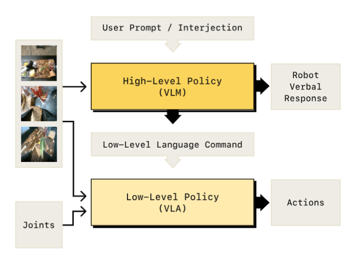
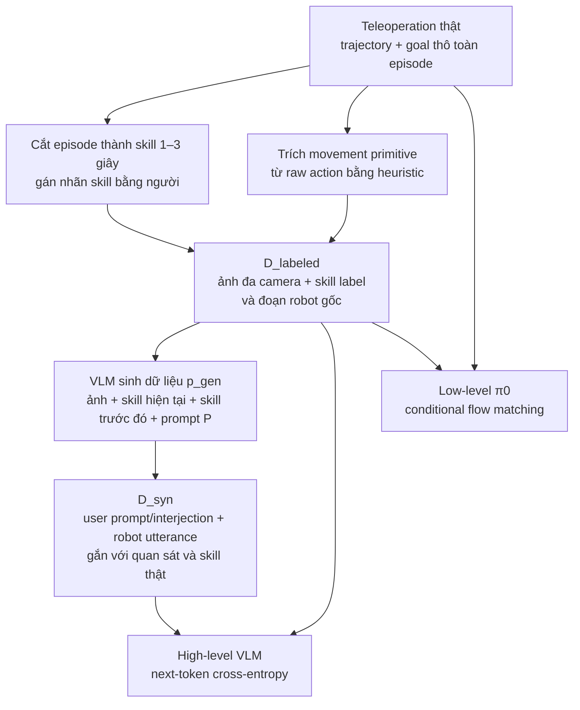

# Hi Robot — hệ hai tầng VLM cho prompt mở và phản hồi tại chỗ

## 1. Nguồn

- Tiêu đề: *Hi Robot: Open-Ended Instruction Following with Hierarchical
  Vision-Language-Action Models*
- Tác giả: Lucy Xiaoyang Shi, Brian Ichter, Michael Equi, Liyiming Ke, Karl
  Pertsch, Quan Vuong, ... Danny Driess, Sergey Levine, Chelsea Finn (Physical
  Intelligence / Stanford / UC Berkeley)
- arXiv: [2502.19417v2](https://arxiv.org/abs/2502.19417), 15 Jul 2025
- Venue: ICML 2025 (PMLR 267)
- Trang chính thức: [Teaching Robots to Listen and Think Harder](https://www.pi.website/research/hirobot)
  (truy cập 2026-08-04)
- PDF trong repo: [docs/papers/05-long-horizon/02_hi_robot_hierarchical_vla.pdf](../../../papers/05-long-horizon/02_hi_robot_hierarchical_vla.pdf)
- Phân loại: **hierarchical agent** (hai model tách rời, giao tiếp bằng ngôn ngữ).

## 2. Câu hỏi nghiên cứu

Làm sao để robot xử lý **prompt phức tạp và phản hồi giữa chừng** ("chỉ dọn rác, đừng đụng bát đĩa", "cái đó không phải rác", "tôi dị ứng dưa muối") thay vì chỉ lệnh nguyên tử ("nhặt cái cốc")?

## 3. Đóng góp

1. Kiến trúc **System 1 / System 2** trong đó **cả hai tầng đều là VLM**: tầng
   cao là VLM sinh lệnh ngôn ngữ, tầng thấp là π0 VLA sinh action chunk.
2. **Sinh dữ liệu tổng hợp có định vị (situated)**: dùng một VLM lớn để tưởng
   tượng ngược prompt/interjection của người dùng đã có thể dẫn tới một skill
   label quan sát được. Ablation cho thấy dữ liệu này đóng góp lớn, còn một
   ablation riêng cho thấy hierarchy vẫn có ích khi giữ synthetic data cố định;
   không thể quy toàn bộ năng lực cho riêng một thành phần.
3. Đánh giá trên 3 platform (single-arm UR5e, bimanual ARX, mobile ARX) với 2
   metric tách bạch lý luận và thi hành.

## 4. Method

### 4.1 Phân tầng

- Tầng cao: $p_{hi}(\hat{\ell}_t \mid I^1_t, \dots, I^n_t, \ell_t)$ — nhận ảnh và
  prompt mở, xuất lệnh ngôn ngữ nguyên tử $\hat{\ell}_t$, có thể kèm câu nói
  $u_t$ phát ra loa (tách khỏi $\hat{\ell}_t$ trước khi đưa xuống tầng thấp).
- Tầng thấp: $p_{lo}(A_t \mid I^1_t, \dots, I^n_t, \hat{\ell}_t, q_t)$ — chính là
  π0 với flow matching action expert.
- **Lịch chạy tầng cao**: chạy lại khi (a) đã trôi qua 1 giây, hoặc (b) có tương
  tác mới từ người dùng. Đơn giản, không có bộ phát hiện "subtask đã xong".

### 4.2 Dữ liệu được tạo như thế nào?

Điểm dễ hiểu nhầm nhất: **$D_{syn}$ chỉ tổng hợp ngôn ngữ trên quan sát robot
thật; nó không sinh video, state, action hay trajectory mới**. Toàn bộ chuyển
động vẫn bắt nguồn từ demonstration teleoperation thật. Paper mô tả pipeline
sau (Sec. 4.3, Fig. 3, Appendix A; trang PDF 5 và 13):

| Tập dữ liệu  | Cách tạo                                                                                                                                                         | Trường được paper nêu rõ                                                                                                                        | Vai trò huấn luyện                                                                                    |
| --------------- | ------------------------------------------------------------------------------------------------------------------------------------------------------------------ | ------------------------------------------------------------------------------------------------------------------------------------------------------ | -------------------------------------------------------------------------------------------------------- |
| $D_{demo}$    | Teleoperate robot;*.* Được author tự tạo, không sử dụng dataset opensource                                                                              | ảnh nhiều camera, robot configuration/action theo trajectory, goal thô (*make a sandwich)*                                                       | low-level                                                                                                |
| $D_{labeled}$ | Cắt$D_{demo}$ thành skill thường dài 1–3 giây; **người gán nhãn** skill. movement primitive nhỏ được suy ra từ raw action bằng heuristic | paper viết tuple$(\hat\ell_t,I_t^1,\ldots,I_t^n)$; **suy ra** phải giữ cả action/state window gốc mới dùng được cho low-level loss   | high-level và low-level                                                                                 |
| $D_{syn}$     | $p_{gen}$ viết ngược một interaction hợp lý có thể dẫn tới skill đã biết, trên ảnh và lịch sử skill thật                                      | user prompt/interjection$\ell_t$, robot utterance $u_t$, skill đích $\hat\ell_t$, ảnh hiện tại; **không có action tổng hợp mới** | high-level; paper nói flat ablation cũng đưa tập này vào low-level nhưng không nêu cách ghép |

Hai kiểu nhãn skill được tạo khác nhau:

- hành vi có nghĩa task như *pick up one piece of lettuce* được gán khi phân
  đoạn demonstration;
- primitive sửa tư thế ngắn như *move the right arm to the left* được trích bằng
  heuristic từ raw action. Paper không công bố heuristic, ngưỡng hay quy trình QA
  nhãn (Sec. 4.3, trang PDF 5).

Demonstration gốc không cố ý chèn perturbation hoặc correction. Vì vậy các mẫu
“that’s not trash” trong training high-level là interaction giả định do
$p_{gen}$ sinh, không phải trajectory sửa lỗi do người dùng thật điều khiển
(Related Work, trang PDF 3; Sec. 4.3, trang PDF 5).

### 4.3 Cách sinh interaction tổng hợp

Với một segment đã có skill đích $\hat\ell_t$, data-generator VLM nhận:

$$
p_{gen}\big(\ell_t,u_t\mid I_t^1,\ldots,I_t^n,
\hat\ell_0,\ldots,\hat\ell_{t-1},\hat\ell_t,P\big).
$$

Nó phải **suy ngược** prompt hoặc phản hồi nào của người dùng có thể khiến robot
chọn đúng skill đó, rồi sinh cả câu trả lời của robot. Ví dụ, ảnh + skill *pick
up KitKat* có thể được relabel thành user prompt *get me something sweet* và
robot response xác nhận sẽ lấy KitKat. Vì target skill và ảnh đều đến từ
$D_{labeled}$, đây là situated language relabeling, không phải data augmentation
cho kỹ năng vận động.

Prompt $P$ chứa mô tả domain và taxonomy để ép độ phủ:

| Nhánh sinh             | Ý nghĩa                                            | Ví dụ trong paper                         |
| ----------------------- | ---------------------------------------------------- | ------------------------------------------- |
| *negative task*       | người dùng nói điều không được làm        | chỉ dọn rác, không đụng bát đĩa    |
| *situated correction* | sửa yêu cầu theo trạng thái task đang diễn ra | “that’s not trash”, “leave it alone”   |
| *specific constraint* | ràng buộc riêng cần world knowledge              | dị ứng lactose → không lấy cheese      |
| robot response          | confirmation, clarification hoặc error handling     | xác nhận, hỏi lại, xin lỗi/mở gripper |

Chuỗi $\hat\ell_{0:t-1}$ giúp interaction nhất quán theo tiến trình: nếu lettuce
và tomato đã được đặt lên sandwich thì prompt tiếp theo nên yêu cầu một nguyên
liệu hợp lý khác, thay vì tạo một mẫu độc lập. Tuy vậy, model **không nhận một
memory state dài hạn khi inference**; lịch sử skill ở đây là điều kiện cho bước
sinh dữ liệu offline (Appendix A.2, trang PDF 13).

Paper tạo **một $D_{syn}$ và một high-level policy riêng cho từng domain**:
table bussing, sandwich making và grocery shopping. Unified multi-task policy chỉ
được nêu là khả thi, chưa được train hoặc đánh giá. Official project page cũng
chỉ mô tả việc ghép observation + human-labeled skill với hypothetical prompt và
interjection, không công bố thêm dataset hay code.

Khi deployment/evaluation, người dùng thật có thể nói hoặc nhập correction bất
kỳ lúc nào và correction sẽ kích hoạt high-level ngay. Đây chỉ là replanning có
điều kiện ở inference, **không phải online fine-tuning** hay cập nhật weight.

### 4.4 Hai đường huấn luyện tách rời

|            | High-level “System 2”                                                                                               | Low-level “System 1”                                                 |
| ---------- | --------------------------------------------------------------------------------------------------------------------- | ---------------------------------------------------------------------- |
| Input      | ảnh đa camera$I_t^{1:n}$ + user prompt/interjection $\ell_t$                                                    | cùng ảnh + robot configuration$q_t$ + skill command $\hat\ell_t$ |
| Target     | chuỗi text gồm low-level command; có thể kèm robot utterance$u_t$ rồi tách utterance trước khi gửi xuống | action chunk liên tục$A_t=[a_t,\ldots,a_{t+H-1}]$                  |
| Data       | $D_{syn}\cup D_{labeled}$                                                                                           | $D_{labeled}\cup D_{demo}$                                           |
| Objective  | autoregressive next-token cross-entropy                                                                               | conditional flow matching theo π0                                     |
| Base model | PaliGemma-3B                                                                                                          | π0: PaliGemma-3B + flow-matching action expert                        |
| Khi chạy  | tính lại sau 1 giây hoặc ngay khi có user input mới                                                             | sinh action chunk nhanh; robot control 50 Hz nhờ chunking             |

High-level học ánh xạ
$p_{hi}(\hat\ell_t\mid I_t^{1:n},\ell_t)$: ảnh và prompt là prefix, command
(và khi cần, utterance) là suffix text. Low-level không học language loss này;
nó học vector field biến một action chunk nhiễu thành action chunk demonstration,
điều kiện trên ảnh, proprioception và skill ngắn. Chi tiết cơ chế action expert
được ghi riêng ở
[Action expert Transformer dùng flow matching](../../01-gwen/module_details/VLAs/action_generation/04_flow_matching_transformer_expert.md);
Hi Robot chỉ nói làm theo π0, không lặp lại đầy đủ recipe π0 (Sec. 4.3–4.4,
trang PDF 5).

Hai policy được tối ưu **độc lập**, không joint/end-to-end training và không có
loss truyền kết quả thi hành từ low-level ngược lên high-level. Giao diện ngôn
ngữ cùng các training example là hiểu biết duy nhất của high-level về affordance
của low-level. Đây là lý do paper gọi việc hai tầng “không biết năng lực của
nhau” là limitation (Sec. 6, trang PDF 9).

### 4.5 Recipe tối ưu được công bố

- Appendix C nói dùng PaliGemma-3B và **unfreeze toàn model** khi fine-tune. Tuy
  nhiên mục này viết một config chung, không xác nhận riêng từng parameter group
  của mỗi tầng. Cả hai tầng bắt đầu từ cùng VLM backbone; riêng low-level thêm
  action expert π0.
- AdamW $\beta_1{=}0.9$, $\beta_2{=}0.95$, không weight decay; clip gradient
  norm ở 1; EMA 0.999; warmup learning rate 1.000 step rồi giữ
  $1\times10^{-5}$; batch size 512. Appendix không tách các giá trị này theo
  high-level và low-level.
- High-level train khoảng 2 giờ trên 8×H100. Paper chỉ nói low-level dùng pipeline
  tương tự nhưng thời gian phụ thuộc dataset và độ phức tạp action prediction;
  không cho số step, epoch hay GPU-hour của low-level (Appendix C.1–C.3, trang
  PDF 14).
- Speech không tham gia loss: Whisper large-v2 chạy local để STT; Cartesia API
  biến $u_t$ thành tiếng nói khi inference.

### 4.6 Những chi tiết training/data **không được công bố**

Đây là khoảng trống của paper, không nên tự điền từ π0 hoặc π0.5:

- số episode/giờ/frame/segment và số mẫu synthetic của từng domain;
- danh tính và version của $p_{gen}$, decoding parameters, số candidate mỗi
  segment, prompt $P$ đầy đủ, bước lọc/deduplicate hay human verification;
- ai cắt segment, guideline gán nhãn, inter-annotator agreement, heuristic trích
  movement primitive và cách xử lý segment chồng lấn;
- train/validation split, cách tránh cùng trajectory xuất hiện ở cả split, data
  balancing/sampling weight giữa $D_{demo}$, $D_{labeled}$ và $D_{syn}$;
- serialization chính xác của prefix/suffix, delimiter tách $u_t$ khỏi
  $\hat\ell_t$, image sampling rate, augmentation, sequence length và tokenizer;
- action horizon $H$, control/state normalization, loss weighting, số training
  step/epoch/checkpoint-selection và low-level compute cho từng robot;
- $D_{labeled}$ được định nghĩa trong text chỉ bằng skill + ảnh nhưng lại được
  dùng cho flow-matching action training; paper không nói rõ schema giữ
  action/state window như thế nào;
- khi $D_{labeled}$ được dùng cho high-level loss, paper không nói rõ user-prompt
  input $\ell_t$ lấy từ goal thô của episode hay được format theo cách khác;
- cách ghép synthetic prompt với action cho baseline *Flat VLA with synthetic
  data*, cũng như tỷ lệ synthetic/real của baseline.

Vì không có code, checkpoint hay dataset release được liên kết trên project page,
pipeline có thể hiểu về mặt khái niệm nhưng **chưa đủ để tái lập định lượng**.

### 4.7 Dữ liệu theo domain và embodiment

| Domain           | Dữ kiện training được nêu                                                                               | Camera / state-action space                                          |
| ---------------- | ------------------------------------------------------------------------------------------------------------- | -------------------------------------------------------------------- |
| Table bussing    | full table-cleaning episodes; thao tác dish/utensil vào bin và trash vào thùng rác                      | UR5e: wrist + over-shoulder; 7-D configuration/action                |
| Sandwich making  | nhiều loại sandwich, tối đa sáu ingredient + bread; có segment label như*pick up one slice of bread* | bimanual ARX: hai wrist + base camera; 14-D configuration/action     |
| Grocery shopping | lấy tổ hợp hàng từ shelf, bỏ vào basket rồi mang basket tới table                                    | mobile ARX: hai wrist + base camera; configuration 14-D, action 16-D |

Paper không cho biết các domain có chỉ dùng đúng embodiment tương ứng trong
training hay có transfer/cross-embodiment; không có so sánh chéo embodiment.

### 4.8 Độ trễ đo được (RTX 4090)

| Thành phần                    | Thời gian       |
| ------------------------------- | ---------------- |
| Image encoding (tầng thấp)    | 14 ms            |
| Observation processing          | 32 ms            |
| Action prediction (×10 bước) | 27 ms            |
| Tổng on-board tầng thấp      | 73 ms            |
| Tổng off-board + WiFi          | 86 ms            |
| Tầng cao — prefill / decode   | 47 ms / 13.2 ms  |
| Tầng cao trên H100            | 17.3 ms / 5.7 ms |

Tác giả kết luận khả thi ~10 Hz; với action chunking điều khiển robot ở 50 Hz.

## 5. Claim → Evidence

| Claim                                                              | Bằng chứng                                                           | Ghi chú                                                                                                                                                                                        |
| ------------------------------------------------------------------ | ---------------------------------------------------------------------- | ----------------------------------------------------------------------------------------------------------------------------------------------------------------------------------------------- |
| Hi Robot vượt GPT-4o làm tầng cao                              | Chênh trung bình >40 điểm Instruction Accuracy (Fig 5)             | GPT-4o là model lớn hơn nhiều nhưng không được finetune bằng dữ liệu robot                                                                                                          |
| Hi Robot vượt flat VLA                                           | Fig 5, cả 3 domain                                                    | Flat VLA không phản ứng với phản hồi real-time                                                                                                                                            |
| Tiến gần tới human high-level oracle                            | Fig 5                                                                  | Oracle cho thấy tầng thấp gần như không lỗi khi được ra lệnh đúng — lỗi nằm ở lý luận                                                                                        |
| Dữ liệu tổng hợp rất quan trọng trong setup này             | Ablation Fig 7, khoảng cách lớn trên trung bình cả IA và TP     | Đây là ablation trong cùng pipeline, không phải bằng chứng rằng mọi hierarchy đều bắt buộc dùng synthetic data; hai khoảng cách trung bình được ghi là ~39 và ~46 điểm |
| Hierarchy tốt hơn flat trên**cùng** dữ liệu tổng hợp | Ablation Fig 8, hai khoảng cách trung bình ~19 và ~34 điểm       | Tách được đóng góp của hierarchy khỏi đóng góp của dữ liệu                                                                                                                       |
| Chạy được trên 3 embodiment                                   | UR5e (7 chiều), bimanual ARX (14), mobile ARX (16 action / 14 config) | Không có so sánh chéo embodiment                                                                                                                                                            |

Metric: **Instruction Accuracy** (lệnh tầng cao có khớp ý người dùng + quan sát
hiện tại không) và **Task Progress** (tỉ lệ vật thể về đúng chỗ). 20 trial mỗi
task mỗi method, người chấm bị làm mù phương pháp.

Quan sát định tính đáng chú ý (Fig 6): GPT-4o mất trạng thái nội bộ sau khi bắt
đầu tương tác vật lý — ra lệnh nhặt vật mới trong khi gripper còn đang cầm vật
khác, hoặc gọi mọi thứ là "plate". Bản không có synthetic data thì bám sát quan
sát nhưng **bỏ qua ràng buộc của người dùng**.

## 6. Giới hạn và điểm chưa rõ

- **Tác giả tự nêu**: cần prompt engineering để sinh dữ liệu tổng hợp; hai tầng
  được train tách rời và **không biết năng lực của nhau**; tầng cao **không có
  memory** nên hỏng với lệnh cần lý luận dài; tầng thấp lệch về vật ở gần (lấy
  phô mai dù người dùng nói dị ứng lactose); không phục hồi tốt khi rơi vật.
- **Missing baseline**: không có so sánh với π0.5 (một model làm cả hai tầng),
  dù cùng nhóm tác giả. Câu hỏi "hai model hay một model" vẫn để mở — Hi Robot
  chính là hệ mà mục 6 của paper đề xuất hợp nhất trong tương lai.
- **Dataset:** Dataset được **self-create tạo bởi Author**, không có chi tiết về scale của dataset -> Không rõ model có tính scalable thế nào. Do đó không có Benchmark với các dataset phổ biến như LIBERO với các model SOTA.
- **Threat to validity**: Instruction Accuracy do người chấm định tính; với
  baseline flat (không có output ngôn ngữ) thì chấm dựa trên *suy đoán ý định của
  policy* — không so sánh được ngang bằng.
- **Chưa rõ**: mỗi task train một $D_{syn}$ và một tầng cao riêng. Tác giả nói
  kiến trúc cho phép hợp nhất multi-task nhưng **chưa đo**.

## 7. Liên hệ với workspace

- Là bản "hai model" đối chiếu trực tiếp với bản "một model" của
  [01_pi0_5.md](01_pi0_5.md). Hai paper này nên đọc liền nhau.
- Với dataset tooling: pipeline này cần **skill segmentation 1–3 giây** trên
  episode dài, cộng thêm kênh dữ liệu tương tác người dùng (prompt + utterance)
  gắn theo timestep. Canonical episode v0.1 không có chỗ cho trường này.
- Số liệu độ trễ ở mục 4.4 là mốc tham chiếu hữu ích cho phần inference của
  [02-realtime-chunking](../../02-realtime-chunking/): 73 ms/bước tầng thấp trên
  GPU consumer.

## 8. Thử nghiệm tiếp theo

1. **Đo chi phí của việc thiếu memory**: tạo prompt cần nhớ ("đừng lặp lại món
   đã cho vào giỏ") và đo Instruction Accuracy theo độ dài episode. Nếu IA giảm
   đơn điệu theo thời gian thì memory là nút thắt, không phải chất lượng VLM.
2. **Thay dữ liệu tổng hợp bằng dữ liệu người thật cùng số lượng**: kiểm tra giả
   thuyết "synthetic thắng nhờ độ phủ tổ hợp ngôn ngữ" chứ không nhờ số lượng.
3. **Nối tầng cao với tín hiệu thành/bại của tầng thấp** (điều tác giả để ngỏ) và
   đo xem có giảm lỗi kiểu "ra lệnh nhặt vật mới khi gripper còn bận" không.
