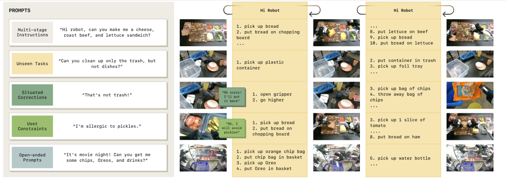

# Hi Robot — hệ hai tầng VLM cho prompt mở và phản hồi tại chỗ

## 1. Nguồn

- Tiêu đề: *Hi Robot: Open-Ended Instruction Following with Hierarchical
  Vision-Language-Action Models*
- Tác giả: Lucy Xiaoyang Shi, Brian Ichter, Michael Equi, Liyiming Ke, Karl
  Pertsch, Quan Vuong, ... Danny Driess, Sergey Levine, Chelsea Finn (Physical
  Intelligence / Stanford / UC Berkeley)
- arXiv: [2502.19417v2](https://arxiv.org/abs/2502.19417), 15 Jul 2025
- Venue: ICML 2025 (PMLR 267)
- PDF trong repo: [docs/papers/05-long-horizon/02_hi_robot_hierarchical_vla.pdf](../../../papers/05-long-horizon/02_hi_robot_hierarchical_vla.pdf)
- Phân loại: **hierarchical agent** (hai model tách rời, giao tiếp bằng ngôn ngữ).

## 2. Câu hỏi nghiên cứu

Làm sao để robot xử lý **prompt phức tạp và phản hồi giữa chừng** ("chỉ dọn rác,
đừng đụng bát đĩa", "cái đó không phải rác", "tôi dị ứng dưa muối") thay vì chỉ
lệnh nguyên tử ("nhặt cái cốc")?

## 3. Đóng góp

1. Kiến trúc **System 1 / System 2** trong đó **cả hai tầng đều là VLM**: tầng
   cao là VLM sinh lệnh ngôn ngữ, tầng thấp là π0 VLA sinh action chunk.
2. **Sinh dữ liệu tổng hợp có định vị (situated)**: dùng một VLM lớn để tưởng
   tượng ngược prompt/interjection của người dùng đã có thể dẫn tới một skill
   label quan sát được. Đây mới là thành phần tạo ra năng lực, không phải kiến
   trúc.
3. Đánh giá trên 3 platform (single-arm UR5e, bimanual ARX, mobile ARX) với 2
   metric tách bạch lý luận và thi hành.

## 4. Method

### 4.1 Phân tầng

- Tầng cao: $p_{hi}(\hat{\ell}_t \mid I^1_t, \dots, I^n_t, \ell_t)$ — nhận ảnh và
  prompt mở, xuất lệnh ngôn ngữ nguyên tử $\hat{\ell}_t$, có thể kèm câu nói
  $u_t$ phát ra loa (tách khỏi $\hat{\ell}_t$ trước khi đưa xuống tầng thấp).
- Tầng thấp: $p_{lo}(A_t \mid I^1_t, \dots, I^n_t, \hat{\ell}_t, q_t)$ — chính là
  π0 với flow matching action expert.
- **Lịch chạy tầng cao**: chạy lại khi (a) đã trôi qua 1 giây, hoặc (b) có tương
  tác mới từ người dùng. Đơn giản, không có bộ phát hiện "subtask đã xong".

### 4.2 Sinh dữ liệu tổng hợp

Từ demo teleop $D_{demo}$, cắt thành skill ngắn 1–3 giây và trích movement
primitive theo heuristic, thu được $D_{labeled}$ gồm bộ
$(\hat{\ell}_t, I^1_t, \dots, I^n_t)$.

Sau đó dùng VLM $p_{gen}$:

$$
p_{gen}\big(\ell_t, u_t \mid I^1_t, \dots, I^n_t,\ \hat{\ell}_0, \dots, \hat{\ell}_{t-1},\ \hat{\ell}_t,\ P\big)
$$

Điều kiện trên **chuỗi skill trước đó** là chi tiết quan trọng: nó làm prompt
tổng hợp nhất quán theo tiến trình task (đã đặt xà lách và cà chua thì prompt
sinh ra sẽ yêu cầu nguyên liệu tiếp theo hợp lý).

Prompt $P$ ép phân loại kịch bản: *negative task* (nói cái gì **không** được
làm), *situated correction* (sửa lệnh cũ theo trạng thái hiện tại), *specific
constraint* (ràng buộc như chế độ ăn). Phản hồi robot phân loại thành xác nhận,
làm rõ, xử lý lỗi.

Huấn luyện: tầng cao trên $D_{syn} \cup D_{labeled}$ (cross-entropy); tầng thấp
trên $D_{labeled} \cup D_{demo}$ (flow matching).

### 4.3 Hiện thực

- Cả hai tầng khởi tạo từ PaliGemma-3B, unfreeze toàn bộ.
- AdamW $\beta_1{=}0.9$, $\beta_2{=}0.95$, không weight decay, clip grad norm 1,
  EMA 0.999, LR warmup 1000 step rồi giữ $1\times10^{-5}$, batch 512.
- Tầng cao train ~2 giờ trên 8×H100.
- Speech: Whisper large-v2 (local) cho STT, Cartesia API cho TTS.

### 4.4 Độ trễ đo được (RTX 4090)

| Thành phần                    | Thời gian       |
| ------------------------------- | ---------------- |
| Image encoding (tầng thấp)    | 14 ms            |
| Observation processing          | 32 ms            |
| Action prediction (×10 bước) | 27 ms            |
| Tổng on-board tầng thấp      | 73 ms            |
| Tổng off-board + WiFi          | 86 ms            |
| Tầng cao — prefill / decode   | 47 ms / 13.2 ms  |
| Tầng cao trên H100            | 17.3 ms / 5.7 ms |

Tác giả kết luận khả thi ~10 Hz; với action chunking điều khiển robot ở 50 Hz.

## 5. Claim → Evidence

| Claim                                                              | Bằng chứng                                                           | Ghi chú                                                                                                                                                        |
| ------------------------------------------------------------------ | ---------------------------------------------------------------------- | --------------------------------------------------------------------------------------------------------------------------------------------------------------- |
| Hi Robot vượt GPT-4o làm tầng cao                              | Chênh trung bình >40 điểm Instruction Accuracy (Fig 5)             | GPT-4o là model lớn hơn nhiều nhưng không được finetune bằng dữ liệu robot                                                                          |
| Hi Robot vượt flat VLA                                           | Fig 5, cả 3 domain                                                    | Flat VLA không phản ứng với phản hồi real-time                                                                                                            |
| Tiến gần tới human high-level oracle                            | Fig 5                                                                  | Oracle cho thấy tầng thấp gần như không lỗi khi được ra lệnh đúng — lỗi nằm ở lý luận                                                        |
| Dữ liệu tổng hợp là bắt buộc                                | Ablation Fig 7, khoảng cách lớn trên trung bình cả IA và TP     | Bản trích PDF không cho phép gán chắc chắn con số nào cho IA và con số nào cho TP; hai khoảng cách trung bình được ghi là ~39 và ~46 điểm |
| Hierarchy tốt hơn flat trên**cùng** dữ liệu tổng hợp | Ablation Fig 8, hai khoảng cách trung bình ~19 và ~34 điểm       | Tách được đóng góp của hierarchy khỏi đóng góp của dữ liệu                                                                                       |
| Chạy được trên 3 embodiment                                   | UR5e (7 chiều), bimanual ARX (14), mobile ARX (16 action / 14 config) | Không có so sánh chéo embodiment                                                                                                                            |

Metric: **Instruction Accuracy** (lệnh tầng cao có khớp ý người dùng + quan sát
hiện tại không) và **Task Progress** (tỉ lệ vật thể về đúng chỗ). 20 trial mỗi
task mỗi method, người chấm bị làm mù phương pháp.

Quan sát định tính đáng chú ý (Fig 6): GPT-4o mất trạng thái nội bộ sau khi bắt
đầu tương tác vật lý — ra lệnh nhặt vật mới trong khi gripper còn đang cầm vật
khác, hoặc gọi mọi thứ là "plate". Bản không có synthetic data thì bám sát quan
sát nhưng **bỏ qua ràng buộc của người dùng**.

## 6. Giới hạn và điểm chưa rõ

- **Tác giả tự nêu**: cần prompt engineering để sinh dữ liệu tổng hợp; hai tầng
  được train tách rời và **không biết năng lực của nhau**; tầng cao **không có
  memory** nên hỏng với lệnh cần lý luận dài; tầng thấp lệch về vật ở gần (lấy
  phô mai dù người dùng nói dị ứng lactose); không phục hồi tốt khi rơi vật.
- **Missing baseline**: không có so sánh với π0.5 (một model làm cả hai tầng),
  dù cùng nhóm tác giả. Câu hỏi "hai model hay một model" vẫn để mở — Hi Robot
  chính là hệ mà mục 6 của paper đề xuất hợp nhất trong tương lai.
- **Threat to validity**: Instruction Accuracy do người chấm định tính; với
  baseline flat (không có output ngôn ngữ) thì chấm dựa trên *suy đoán ý định của
  policy* — không so sánh được ngang bằng.
- **Chưa rõ**: mỗi task train một $D_{syn}$ và một tầng cao riêng. Tác giả nói
  kiến trúc cho phép hợp nhất multi-task nhưng **chưa đo**.

## 7. Liên hệ với workspace

- Là bản "hai model" đối chiếu trực tiếp với bản "một model" của
  [01_pi0_5.md](01_pi0_5.md). Hai paper này nên đọc liền nhau.
- Với dataset tooling: pipeline này cần **skill segmentation 1–3 giây** trên
  episode dài, cộng thêm kênh dữ liệu tương tác người dùng (prompt + utterance)
  gắn theo timestep. Canonical episode v0.1 không có chỗ cho trường này.
- Số liệu độ trễ ở mục 4.4 là mốc tham chiếu hữu ích cho phần inference của
  [02-realtime-chunking](../../02-realtime-chunking/): 73 ms/bước tầng thấp trên
  GPU consumer.

## 8. Thử nghiệm tiếp theo

1. **Đo chi phí của việc thiếu memory**: tạo prompt cần nhớ ("đừng lặp lại món
   đã cho vào giỏ") và đo Instruction Accuracy theo độ dài episode. Nếu IA giảm
   đơn điệu theo thời gian thì memory là nút thắt, không phải chất lượng VLM.
2. **Thay dữ liệu tổng hợp bằng dữ liệu người thật cùng số lượng**: kiểm tra giả
   thuyết "synthetic thắng nhờ độ phủ tổ hợp ngôn ngữ" chứ không nhờ số lượng.
3. **Nối tầng cao với tín hiệu thành/bại của tầng thấp** (điều tác giả để ngỏ) và
   đo xem có giảm lỗi kiểu "ra lệnh nhặt vật mới khi gripper còn bận" không.
