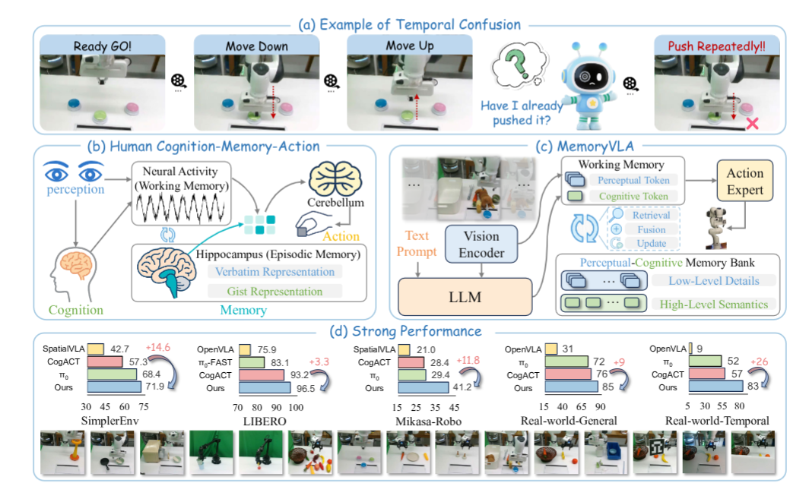
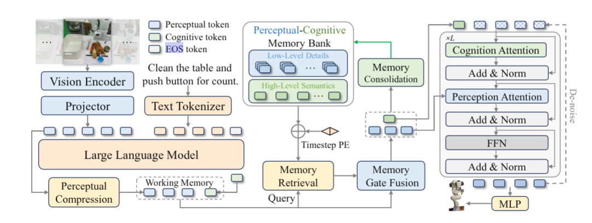
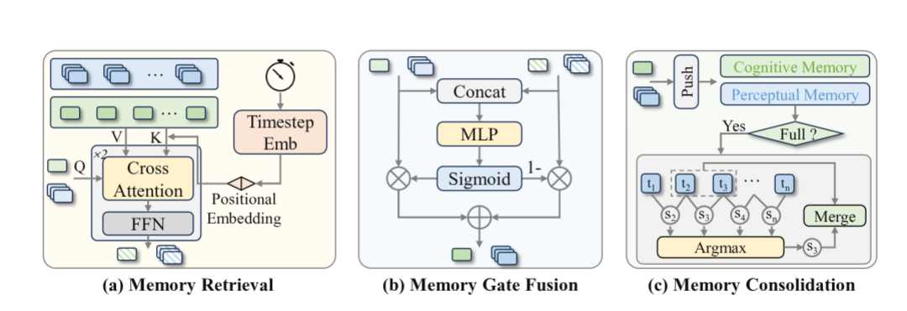

# MemoryVLA — Perceptual-Cognitive Memory Bank cho phụ thuộc thời gian

> **[SOTA-CODE]** Paper thuộc danh sách [sota_with_code.txt](../sota_with_code.txt) —
> nhóm có mã nguồn công khai. Code: https://github.com/shihao1895/MemoryVLA ·
> Chỉ mục nhóm: [../02_sota_co_code.md](../02_sota_co_code.md)

## 1. Nguồn

- Tiêu đề: *MemoryVLA: Perceptual-Cognitive Memory in Vision-Language-Action
  Models for Robotic Manipulation*
- Tác giả: Hao Shi (Tsinghua), Bin Xie, Yingfei Liu, Lin Sun, Fengrong Liu,
  Tiancai Wang, Erjin Zhou, Haoqiang Fan (Dexmal / MEGVII), Xiangyu Zhang,
  Gao Huang (corresponding)
- arXiv: [2508.19236v2](https://arxiv.org/abs/2508.19236), 30 Jan 2026
- Venue: ICLR 2026
- PDF trong repo: [docs/papers/05-long-horizon/04_memoryvla_perceptual_cognitive_memory.pdf](../../../papers/05-long-horizon/04_memoryvla_perceptual_cognitive_memory.pdf)
- Phân loại: **memory module** (module bộ nhớ gắn thêm, không thay đổi phân tầng).

## 2. Câu hỏi nghiên cứu

Manipulation là bài toán **non-Markovian**: hai quan sát giống hệt nhau có thể đòi hỏi hành động khác nhau tuỳ vào việc trước đó đã làm gì. 

Ví dụ chuẩn của paper: task *Push Buttons* — ảnh trước và sau khi nhấn nút gần như không khác nhau, model không biết "mình nhấn chưa". VLA chỉ nhìn frame hiện tại thì giải quyết thế nào?

Hai cách ngây thơ và lý do chúng hỏng:

1. Nối nhiều frame liên tiếp làm input VLM — self-attention có độ phức tạp bậc hai, giới hạn độ dài context.
2. Input dạng chuỗi frame **lệch phân phối** so với pretraining single-frame của chính model đó.



## 3. Đóng góp

1. Khung **Cognition-Memory-Action** lấy cảm hứng từ hệ nhớ kép của người:
   working memory (hoạt động thần kinh tức thời) + episodic memory (hippocampus,
   lưu cả *verbatim* chi tiết và *gist* ngữ nghĩa).
2. **Perceptual-Cognitive Memory Bank (PCMB)** hai luồng, với ba thao tác:
   retrieval, gate fusion, consolidation.
3. Action expert diffusion **có điều kiện trên memory**.
4. Đánh giá rộng: 3 robot, 6 benchmark, 150+ task, 500+ biến thể.

## 4. Method



### 4.1 Working memory

- Vision: DINOv2 và SigLIP song song trên **một** ảnh third-person RGB 224×224; nối feature thành raw visual token.
- Nén: module SE-bottleneck ép thành perceptual token $p \in \mathbb{R}^{N_p \times d_p}$ với $N_p = 256$.
- Cognition: raw visual token chiếu tuyến tính vào không gian embedding ngôn ngữ, nối với instruction đã tokenize, đưa vào LLaMA-7B. Lấy output ở vị trí EOS làm **một** cognitive token $c \in \mathbb{R}^{1 \times d_c}$.
- Working memory $M_{wk} = \{p, c\}$. Backbone là Prismatic VLM 7B đã pretrain thêm trên Open-X Embodiment.

Đối xứng đáng chú ý: 256 token cho chi tiết tri giác, **1** token cho ngữ nghĩa.
Đây là lựa chọn thiết kế mạnh và paper không ablate tỉ lệ này.



### 4.2 Memory Retrieval

Mỗi entry được gắn timestep qua sinusoidal embedding $TE(\cdot)$, cộng vào **key nhưng không vào value**:

$$
K^x = [\,m^x_1 + TE(t_1);\ \dots;\ m^x_L + TE(t_L)\,], \qquad
V^x = [\,m^x_1;\ \dots;\ m^x_L\,]
$$

$$
\hat{H}^x = \mathrm{softmax}\!\left(\frac{q^x (K^x)^\top}{\sqrt{d_x}}\right) V^x,
\qquad q^x \in \{p, c\},\ x \in \{per, cog\}
$$

Hai layer transformer (attention + FFN) cho ra $H^p$ và $H^c$.

### 4.3 Memory Gate Fusion

$$
g^x = \sigma\big(\mathrm{MLP}(\mathrm{concat}[x, H^x])\big), \qquad
\tilde{x} = g^x \odot H^x + (1 - g^x) \odot x
$$

Gate học được, không phải cộng thẳng — ablation cho thấy khác biệt 4.2 điểm.

### 4.4 Memory Consolidation

PCMB có giới hạn cố định $L$ **entry theo timestep**, không phải $L$ token đơn
lẻ. Với $L=16$:

- cognitive bank chứa tối đa 16 entry, mỗi entry $[1,d_c]$;
- perceptual bank chứa tối đa 16 entry, mỗi entry $[256,d_p]$, tức tối đa
  $16\times256=4096$ perceptual token khi retrieval.

Mỗi entry trong code được lưu dưới dạng:

```text
(timestep, feature)
```

Một lần gọi policy tạo một cognitive feature và một perceptual feature. Trình tự
trong inference là:

```text
encode current observation
→ query các entry quá khứ
→ gate fusion
→ dùng context đã fusion để denoise action chunk
→ thêm current feature vào PCMB
```

Do đó, một entry mới được tạo **mỗi lần policy được gọi**, không phải mỗi action
7-DoF bên trong action chunk. Khoảng thời gian thực mà $L=16$ bao phủ phụ thuộc
controller thực thi bao nhiêu action trước khi gọi policy lại.

#### Khi bank vượt capacity

Giả sử bank đã có $L$ entry. Sau khi append entry mới, bank tạm thời có $L+1$
entry. Với cấu hình mặc định `consolidate_type="tome"`, mỗi memory stream thực
hiện độc lập:

1. chỉ xét các cặp **kề nhau** trong bank;
2. tính cosine similarity giữa feature của từng cặp;
3. chọn cặp có similarity lớn nhất;
4. lấy trung bình 50/50 hai feature;
5. giữ vị trí của entry đầu và xóa entry sau.

$$
i^* =
\arg\max_i \cos(m_i,m_{i+1}),
\qquad
m_{i^*}\leftarrow\frac{m_{i^*}+m_{i^*+1}}{2}.
$$

Ví dụ với $L=4$:

```text
trước append:
[m0, m1, m2, m3]

sau append m4:
[m0, m1, m2, m3, m4]

nếu (m1,m2) giống nhau nhất:
[m0, merge(m1,m2), m3, m4]
```

Mục tiêu là nén các đoạn gần như tĩnh và giữ lại các mốc thay đổi. So với FIFO,
một trạng thái cũ nhưng khác biệt vẫn có thể tồn tại lâu; các frame chuyển động
lặp lại hoặc scene ít thay đổi thường bị gộp trước.

#### Cách tính similarity khác nhau giữa hai stream

Với cognitive entry $[1,4096]$, cosine similarity được tính trực tiếp giữa hai
vector ngữ nghĩa.

Với perceptual entry $[256,d_p]$, code so từng cặp token cùng vị trí rồi lấy
trung bình:

$$
s_{i,i+1}^{per}
=
\frac{1}{256}
\sum_{n=1}^{256}
\cos\!\left(m_{i,n}^{per},m_{i+1,n}^{per}\right).
$$

Cơ chế này giả định các perceptual token vẫn có tương ứng không gian tương đối
ổn định giữa hai observation từ cùng third-person camera.

#### Timestep embedding sau khi merge

Timestep embedding **không tham gia quyết định merge**. Similarity chỉ dùng
feature gốc. Sau khi chọn cặp:

$$
(t_i,m_i),\;(t_{i+1},m_{i+1})
\longrightarrow
\left(
 t_i,\;
 \frac{m_i+m_{i+1}}{2}
\right).
$$

Code giữ timestep của entry **đầu tiên** và bỏ timestep của entry thứ hai. Khi
retrieval ở lần sau, key được tạo lại như sau:

$$
K_{\text{merged}}
=
\frac{m_i+m_{i+1}}{2}+TE(t_i),
\qquad
V_{\text{merged}}
=
\frac{m_i+m_{i+1}}{2}.
$$

Ví dụ:

```text
(t=20, m20) + (t=23, m23)
→ (t=20, 0.5·m20 + 0.5·m23)
```

Feature đại diện cho cả đoạn 20–23 nhưng key vẫn được gắn $TE(20)$, không dùng
$TE(21.5)$ và không lưu interval $[20,23]$. Vì vậy timestamp trở thành xấp xỉ
sau consolidation.

#### Các giới hạn implementation quan trọng

**1. Recursive average không count-weighted.**

Nếu entry đã merge tiếp tục được merge:

$$
m_{01}=\frac{m_0+m_1}{2},
\qquad
m_{012}=\frac{m_{01}+m_2}{2}
=
\frac14m_0+\frac14m_1+\frac12m_2.
$$

Nó không bằng $(m_0+m_1+m_2)/3$. Code không lưu số frame mà một entry đại diện,
nên summary bị thiên về entry được merge sau.

**2. Hai stream merge độc lập.**

Cognitive bank có thể merge cặp $(t_4,t_5)$ trong khi perceptual bank merge
$(t_9,t_{10})$. Sau nhiều lần consolidation, hai bank vẫn có cùng capacity nhưng
không còn đảm bảo alignment một-một theo timestep.

**3. Merge không học được.**

Toàn bộ selection và averaging chạy dưới `torch.no_grad()`. Model có thể học
representation khiến các trạng thái dư thừa trở nên giống nhau, nhưng quy tắc
“adjacent cosine + average 50/50 + giữ timestamp trước” là heuristic cố định.

**4. Chỉ merge entry kề nhau.**

Hai sự kiện giống nhau nhưng cách xa trong episode không được gộp trực tiếp.
Điều này giữ thứ tự thời gian, nhưng không tạo semantic clustering toàn cục.

Vì các giới hạn trên, PCMB nên được hiểu là **fixed-capacity temporal
compression**, không phải một episodic database chính xác.

### 4.5 Action expert

DiT ~300M, DDIM 10 bước, CFG scale 1.5, sinh $T = 16$ action 7-DoF. Mỗi bước
denoise: token action nhiễu + sinusoidal encoding của denoising timestep, nối
với $\tilde{c}$; một **cognition-attention layer** đưa ngữ nghĩa cấp cao vào, một
**perception-attention layer** bổ sung chi tiết từ $\tilde{p}$; rồi FFN.

### 4.6 Training

#### 4.6.1 Khởi tạo và phần được fine-tune

Training public bắt đầu từ checkpoint **CogACT-Large** đã học trên Open-X
Embodiment, sau đó thêm perceptual compression và PCMB. Cấu hình mặc định đặt:

```text
freeze_vision_backbone = False
freeze_llm_backbone    = False
```

nên đây là `full-finetune`: DINOv2, SigLIP, projector, LLaMA-7B, PCMB và DiT đều
có thể nhận gradient. Tuy nhiên objective chỉ là action diffusion loss; không có
language-model loss riêng. LLaMA được tối ưu để tạo cognitive EOS feature hữu
ích cho retrieval và action prediction, không phải để tiếp tục sinh text.

Một training transition có dạng:

$$
(I_t,\ L,\ episode\_id,\ t,\ A_{t:t+15}),
$$

trong đó $A_{t:t+15}\in\mathbb{R}^{16\times7}$. Input mặc định chỉ gồm
third-person RGB, instruction và action target; không dùng wrist camera, depth
hay proprioception.

#### 4.6.2 Phân phối dữ liệu theo episode

Không thể shuffle frame hoàn toàn độc lập vì PCMB phải nhận đúng lịch sử của cùng
episode. Code hỗ trợ hai cách:

- **`stream`**: phát toàn bộ frame của một episode theo thứ tự; memory tồn tại qua
  nhiều batch và reset khi `episode_id` đổi. Dùng trong script Bridge,
  RT-1/Fractal và real-world.
- **`group`**: chọn ngẫu nhiên 16 frame trong một episode, sort theo timestep, rồi
  xử lý tuần tự và reset trước group tiếp theo. Nếu episode ngắn hơn 16, lặp
  frame cuối để pad. Dùng cho LIBERO và Mikasa-Robo.

Ví dụ group sampling:

```text
episode 140 frame
→ sample [3, 11, 28, 31, 52, ..., 137]
→ sort
→ xử lý tuần tự 16 observation
```

Các frame không có khoảng cách thời gian cố định. `group_size=16`,
`mem_length=16` và action chunk 16 chỉ tình cờ có cùng con số; chúng là ba
hyperparameter khác nhau.

#### 4.6.3 Forward và gradient qua memory

Tại frame $j$:

```text
image + instruction
→ p_j, c_j
→ query PCMB chứa các frame trước
→ gate fusion thành p̃_j, c̃_j
→ diffusion loss cho action chunk
→ append current feature vào PCMB
```

Current frame query history trước rồi mới được thêm vào bank. Các entry được lưu
bằng `feat.detach().clone()`, còn consolidation chạy dưới `torch.no_grad()`.
Vì vậy model không backpropagate xuyên toàn episode:

```text
gradient có:
current ViT/LLM
retrieval projection
gate fusion
DiT

gradient không đi vào:
encoder activation của các frame quá khứ
quyết định merge
```

Điều này cho phép giữ temporal state trong forward pass mà không phải giữ
activation của LLaMA-7B cho toàn bộ episode.

Một khác biệt giữa mô tả paper và config public: paper mô tả fused feature được
update vào memory, nhưng mặc định `update_fused=False`, nên code lưu current
feature trước fusion.

#### 4.6.4 Diffusion objective

Với action chunk sạch $A_0\in\mathbb{R}^{16\times7}$, code lấy timestep
$k\in\{0,\ldots,99\}$ và noise $\epsilon\sim\mathcal N(0,I)$:

$$
A_k=
\sqrt{\bar\alpha_k}A_0+
\sqrt{1-\bar\alpha_k}\epsilon.
$$

DiT dự đoán noise từ action nhiễu và memory-conditioned context:

$$
\hat\epsilon_\theta=f_\theta(A_k,k,\tilde c,\tilde p),
\qquad
\mathcal L_{diff}
=
\mathbb E\left[\|\hat\epsilon_\theta-\epsilon\|_2^2\right].
$$

`repeated_diffusion_steps=4` nghĩa là một observation được lặp bốn lần với noise
và diffusion timestep độc lập, không phải chạy chuỗi denoise bốn bước trong
training. Ở inference, PCMB retrieval/fusion được tính một lần cho observation,
rồi cùng $\tilde p,\tilde c$ được dùng lại qua 10 bước DDIM.

#### 4.6.5 Cấu hình chính

| Thuộc tính | Thiết lập |
| --- | --- |
| Compute | 8×A100, FSDP full-shard, BF16 |
| Batch | 32/GPU, global 256 |
| Optimizer config | LR $2\times10^{-5}$, weight decay 0, grad clip 1.0 |
| Action model | DiT-L, depth 24, hidden 1024, 16 heads |
| Action output | chunk 16, action dim 7 |
| Diffusion | 100 timestep train, 10-step DDIM inference, CFG 1.5 |
| PCMB | retrieval 2 layer, gate fusion, token merge |
| Memory length | 16 cho phần lớn benchmark; 256 cho real-world temporal |
| Train steps | Bridge 50k; Fractal 80k; LIBERO 20k/40k; Mikasa 20k; real 5k–20k |

Image augmentation gồm random crop 90%, brightness, contrast, saturation và hue;
tắt khi evaluation. Checkpoint được chọn theo validation success thay vì chỉ dựa
trên diffusion loss.

## 5. Claim → Evidence

### 5.1 Simulation

| Benchmark                  | MemoryVLA      | Baseline mạnh nhất              | Chênh               |
| -------------------------- | -------------- | --------------------------------- | -------------------- |
| SimplerEnv-Bridge (WidowX) | **71.9** | π0-Beta* 68.4; CogACT-Large 57.3 | +14.6 so với CogACT |
| SimplerEnv-Fractal overall | **72.7** | CogACT 68.1                       | +4.6                 |
| — Visual Matching         | 77.7           | CogACT 74.8                       | +2.9                 |
| — Visual Aggregation      | 67.7           | CogACT 61.3                       | +6.4                 |
| LIBERO (5 suite)           | **96.5** | π0* 94.2; CogACT 93.2            | +3.3 so với CogACT  |
| — Long-10 / Long-90       | 93.4 / 95.6    | CogACT 88.8 / 92.1                | —                   |
| Mikasa-Robo                | **41.2** | π0 29.4                          | +11.8                |
| — ShellGameTouch          | 88             | OpenVLA-OFT 47                    | +41                  |

Điểm đáng chú ý: mức tăng lớn nhất nằm ở **Visual Aggregation** (đổi background,
ánh sáng, distractor, texture bàn) và ở **Mikasa-Robo** (benchmark thiết kế riêng
cho memory). Đây là kiểu bằng chứng nhất quán với cơ chế được đề xuất, không phải
tăng đều đặn mọi nơi.

### 5.2 Real world (12 task, Franka + WidowX, chỉ RGB third-person)

| Nhóm                          | MemoryVLA    | CogACT | π0 | OpenVLA |
| ------------------------------ | ------------ | ------ | --- | ------- |
| General (6 task)               | **85** | 76     | 72  | 31      |
| Long-horizon Temporal (6 task) | **83** | 57     | 52  | 9       |

Per-task ở nhóm temporal: Seq. Push Buttons 58 vs 15 (**+43**), Change Food 85 vs
47 (+38), Guess Where 72 vs 40 (+32), Clean Table & Count 84 vs 67 (+17), Pick
Place Order 100, Clean Restaurant Table 96.

Khoảng cách general (+9) so với temporal (+26) là bằng chứng mạnh nhất của paper:
lợi ích tỉ lệ với mức độ phụ thuộc thời gian của task.

### 5.3 Ablation (SimplerEnv-Bridge, avg success %)

| Chiều ablate  | Biến thể                                       | Kết quả                   |
| -------------- | ------------------------------------------------ | --------------------------- |
| Loại memory   | Cognitive only / Perceptual only /**Both** | 63.5 / 64.6 /**71.9** |
| Độ dài$L$ | 4 /**16** / 64                             | 67.7 /**71.9** / 67.7 |
| Retrieval      | không /**có** timestep PE                | 69.8 /**71.9**        |
| Fusion         | Add /**Gate**                              | 67.7 /**71.9**        |
| Consolidation  | FIFO /**Token merge**                      | 66.7 /**71.9**        |

Hai luồng cộng lại (71.9) **vượt tổng phần riêng lẻ** so với từng luồng (63.5,
64.6) — chúng bổ sung nhau chứ không dư thừa.

## 6. Giới hạn và điểm chưa rõ

- **$L = 64$ tệ hơn $L = 16$** (67.7 vs 71.9). Paper không giải thích. Đây là dấu
  hiệu memory dài gây nhiễu chứ không đơn thuần "nhớ nhiều hơn thì tốt hơn" —
  mâu thuẫn nhẹ với động lực long-horizon của chính paper. Cần đọc kỹ trước khi
  suy ra "cứ tăng memory".
- Ablation chính tập trung ở Bridge; bản v2 có bổ sung một số kiểm tra trên
  LIBERO-Long-90 và Clean Table & Count, nhưng vẫn chưa quét đầy đủ trên nhiều
  benchmark và nhiều độ dài episode.
- Không có ablation toàn diện tỉ lệ 256 perceptual : 1 cognitive. Bản v2 chỉ so
  1 với 4 cognitive token; một EOS token 4096-dim cho kết quả tốt hơn.
- Bản v2 có báo cáo inference trên RTX 4090: 0.194 s và 16.6 GB, so với baseline
  0.187 s và 15.8 GB. Overhead nhỏ, nhưng chưa cho thấy scaling khi tăng đồng
  thời memory length, số perceptual token và batch size.
- Vẫn thiếu đối chứng trực tiếp với hệ **hierarchical planner + VLA** kiểu π0.5
  hoặc Hi Robot trên cùng task temporal. Câu hỏi “memory bank hay hierarchy giải
  quyết long-horizon tốt hơn” chưa được trả lời.
- Real-world dùng step-wise scoring với 10–15 trial mỗi task — cỡ mẫu nhỏ.
- Consolidation chỉ gộp entry **kề nhau**; sự kiện quan trọng lặp lại cách xa
  nhau về thời gian không được gộp hay ưu tiên.

## 7. Liên hệ với workspace

- Đây là câu trả lời trực tiếp cho giới hạn mà **cả π0.5 lẫn Hi Robot tự nêu**:
  "context ngắn, không có memory". Ba paper ghép lại thành một luận điểm rõ:
  hierarchy giải quyết *phân rã task*, memory giải quyết *xác định trạng thái đã
  làm tới đâu*. Chúng trực giao.
- Với dataset tooling: MemoryVLA chỉ cần **một camera third-person + instruction**
  — nhẹ nhất trong cả tập paper về yêu cầu dữ liệu. Không cần nhãn subtask, không
  cần wrist camera, không cần proprioception. Đây là điểm mạnh thực dụng cho
  workspace vì canonical episode v0.1 hiện có đủ trường cần thiết.
- Cơ chế PCMB độc lập backbone; về nguyên tắc có thể gắn vào action expert flow
  matching đang mô tả ở [03-vla-core](../../03-vla-core/).

## 8. Thử nghiệm tiếp theo

1. **Kiểm chứng nghịch lý $L$**: quét $L \in \{4,8,16,32,64,128\}$ trên
   LIBERO-Long-10 (dài hơn Bridge). Nếu điểm tối ưu dịch theo độ dài task thì
   $L$ là siêu tham số phụ thuộc task; nếu vẫn tụt ở $L$ lớn thì cơ chế
   consolidation là nút thắt, không phải capacity.
2. **Đối chứng memory vs hierarchy**: chạy MemoryVLA và một hệ hai tầng kiểu π0.5
   trên cùng bộ task "temporal" (Seq. Push Buttons, Clean Table & Count). Giả
   thuyết cần bác bỏ: hierarchy đủ để thay memory.
3. **Ablate tỉ lệ token**: giảm $N_p$ từ 256 xuống 64 và tăng cognitive token từ
   1 lên 8. Nếu hiệu năng không đổi thì chi phí retrieval (attention trên
   $L \cdot N_p$ token) đang bị lãng phí.
