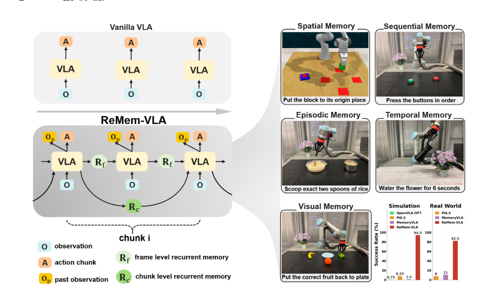
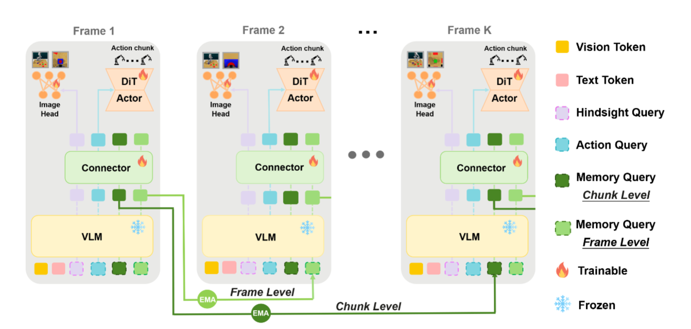
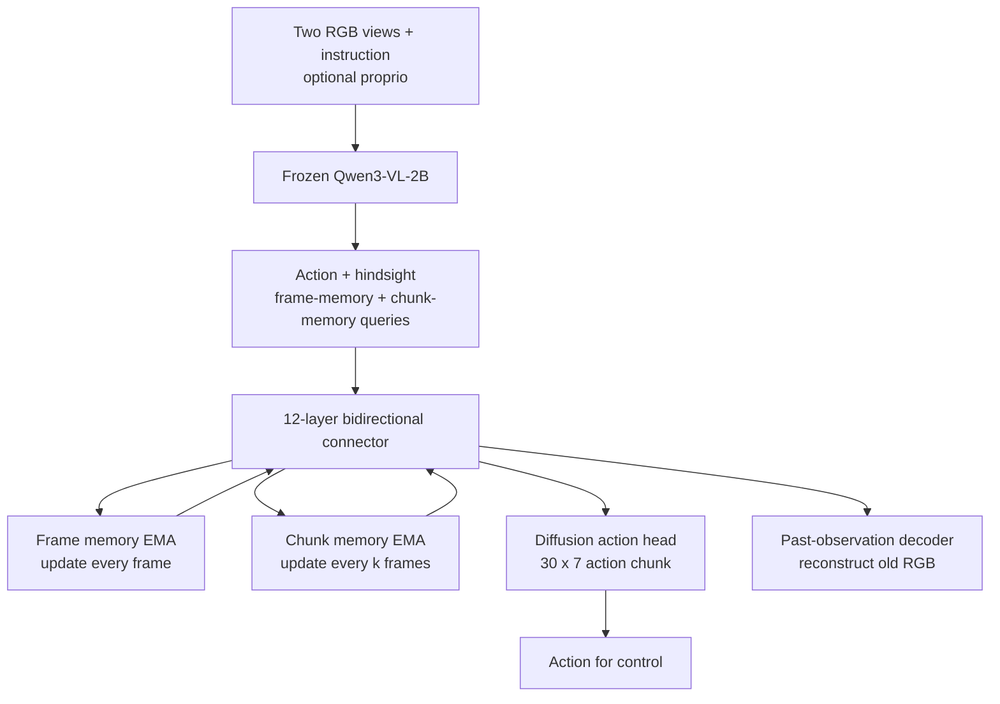
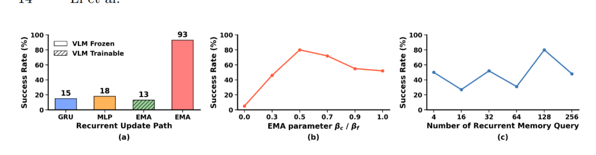
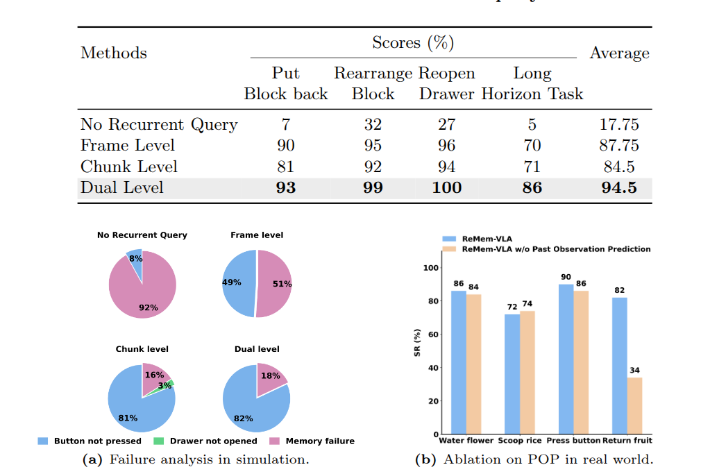

# ReMem-VLA — bộ nhớ hồi quy hai tầng cho short-term và long-term control

## 1. Nguồn và trạng thái

- Paper: *ReMem-VLA: Empowering Vision-Language-Action Model with Memory via
  Dual-Level Recurrent Queries*.
- Tác giả: Hang Li, Fengyi Shen, Dong Chen, Liudi Yang, Xudong Wang, Jinkui Shi,
  Zhenshan Bing, Ziyuan Liu và Alois Knoll.
- Nguồn chính thức: [arXiv:2603.12942v1](https://arxiv.org/abs/2603.12942v1),
  13/03/2026, category `cs.RO`.
- PDF trong workspace:
  [08_remem_vla_dual_level_recurrent_queries.pdf](../../../papers/05-long-horizon/08_remem_vla_dual_level_recurrent_queries.pdf),
  20 trang, SHA-256
  `6fc134eb086b08a2ced09f69c1cf5e09324e29fcfd46dfe7df55e8fe1b84d80c`.
- Trạng thái: **arXiv preprint v1**; venue chưa được paper/arXiv xác nhận.
- Code/project page: **Unknown.** PDF không in URL code hoặc project page; tìm kiếm
  GitHub theo title/arXiv ID ngày 10/08/2026 chưa thấy repository chính thức.

Các số liệu bên dưới là **reported result của tác giả**, chưa được tái lập trong
workspace.

## 2. Câu hỏi nghiên cứu

VLA closed-loop thường dự đoán action từ observation hiện tại hoặc một cửa sổ frame cố
định. Khi hai observation hiện tại trông giống nhau nhưng action đúng phụ thuộc vào điều
robot đã thấy hoặc đã làm từ lâu, policy phải giữ lịch sử bằng cách nào mà không tăng
sequence length theo thời gian và không cần backpropagate qua hàng trăm timestep?

Paper đặt phạm vi rõ: memory **bên trong một episode**, gồm spatial, sequential,
episodic, temporal và visual memory. Nó không giải quyết lifelong/persistent memory qua
nhiều session, ngày hoặc tuần [PDF, Sec. 1, pp. 2–3].

## 3. Why — xử lý vấn đề gì?

### 3.1 Markov assumption gây state aliasing

Cùng một frame có thể yêu cầu action khác nhau tùy lịch sử. Ví dụ, để đưa một object về
vị trí ban đầu, robot phải nhớ vị trí đó trước khi nó bị di chuyển; để múc đúng hai thìa,
robot phải nhớ số lần đã thực hiện. Current-frame VLA không có state để phân biệt hai thời
điểm này [PDF, Sec. 1, pp. 2–3].

Success criteria của paper không phải chỉ là success trên manipulation ngắn, mà là thành
công trên task buộc dùng năm loại memory:

- **spatial:** vị trí object trước đó;
- **sequential:** thứ tự các bước;
- **episodic:** hành động đã thực hiện bao nhiêu lần;
- **temporal:** thời lượng/elapsed time;
- **visual:** chi tiết của scene quá khứ.

### 3.2 Các hướng memory trước đó không bao phủ đủ horizon

Paper phân loại ba giới hạn [PDF, Sec. 1 và 2.2, pp. 3, 5–6]:

1. **Retrieval memory** phụ thuộc cue hiện tại; cue yếu hoặc distractor giống nhau có thể
   gọi nhầm memory.
2. **Extended frame window** vẫn có horizon cố định và attention cost tăng theo số token.
3. **Sparse/keyframe history** làm mất chi tiết và phụ thuộc chất lượng tracker/VLM ngoài.

Các failure mode này được tác giả mô tả nhưng không được benchmark tách biệt. Đặc biệt,
paper không có distractor benchmark để chứng minh recurrent memory chống interference tốt
hơn retrieval.

### 3.3 Naive recurrence không tự tạo long-term memory

Với VLA lớn, full BPTT qua cả episode không khả thi. Truncated BPTT cắt action-loss
gradient sau vài step, nên transition học được không nhận signal về thông tin cần giữ hàng
trăm frame sau. Đồng thời, recurrent state cập nhật mỗi frame có xu hướng overwrite context
cũ [PDF, Sec. 3.2, pp. 8–9].

Đây là gap trung tâm của ReMem-VLA: tách **việc ghi nội dung gì** khỏi **cơ chế truyền
state như thế nào**. Query/connector học nội dung cần lưu, còn đường truyền state dùng EMA
cố định, không học recurrent dynamics.

## 4. Method

### 4.1 Bước 1 — mã hóa observation hiện tại bằng frozen VLM

**Failure mode được xử lý:** policy cần trích current visual-language context mà không
làm recurrent transition trở thành một mạng lớn phải học qua full BPTT.

Input mỗi timestep là hai RGB view — third-person và wrist — cùng instruction, tùy chọn
proprioception. Frozen Qwen3-VL-2B mã hóa image/language thành hidden states
$H_t\in\mathbb{R}^{L\times D}$ [PDF, Sec. 3.2, pp. 7–8; Sec. 4.1, p. 10].

Bốn nhóm learnable query cùng tham gia pipeline:

- $Q^{action}$: trích feature cần cho action generation;
- $Q^{img}$: trích feature cần để nhớ/reconstruct visual history;
- $Q^f$: frame-level memory queries;
- $Q^c$: chunk-level memory queries.

**Output:** current-frame representations cho bốn nhóm query. Paper không công bố token
ordering, attention mask hay số action/hindsight query, nên các chi tiết đó là **Unknown**.

### 4.2 Bước 2 — connector cho current queries đọc recurrent memory

**Failure mode được xử lý:** causal attention trong VLM không cho action/hindsight queries
đọc memory queries theo layout của model.

ReMem-VLA thêm connector Transformer 12 layer với bidirectional self-attention. Tại đây,
$Q^{action}$, $Q^{img}$, $Q^f$ và $Q^c$ tương tác trong cùng latent space. Action/hindsight
queries nhận context lịch sử; memory queries nhận thông tin mới cần truyền sang timestep
sau [PDF, Sec. 3.2, p. 9].

**Output:** memory-enriched action/image features và hai representation mới
$\tilde Q_t^f,\tilde Q_t^c$ để cập nhật recurrent state.

### 4.3 Bước 3 — frame-level queries giữ short-term context

**Failure mode được xử lý:** pose, button press hoặc object state vừa thay đổi cần được giữ
liên tục giữa các frame gần nhau.

Frame memory cập nhật ở mọi timestep:

$$
Q_t^f
=
\beta_f\tilde Q_{t-1}^f
+
(1-\beta_f)Q_{t-1}^f.
$$

EMA truyền state mà không nối thêm token lịch sử vào input, vì vậy sequence length không
tăng theo episode [PDF, Eq. 5, Sec. 3.2, p. 8].

**Output:** latent state short-term đưa vào connector của frame kế tiếp. “Short-term” là
vai trò tác giả gán cho stream này; paper không đo effective half-life của memory.

### 4.4 Bước 4 — chunk-level queries giảm tốc độ overwrite

**Failure mode được xử lý:** frame memory cập nhật dày nên evidence ban đầu suy giảm nhanh,
đặc biệt với initial configuration hoặc task progress dài hàng trăm frame.

Chunk memory chỉ cập nhật tại boundary $t\bmod k=0$:

$$
Q_t^c=
\begin{cases}
\beta_c\tilde Q_{t-k}^c+(1-\beta_c)Q_{t-k}^c,
& t\bmod k=0,\\
Q_{t-1}^c,&\text{otherwise}.
\end{cases}
$$

Do update ít hơn, decay theo số chunk thay vì số frame. Model có thể giữ initial object
location/task state ổn định hơn [PDF, Eq. 6, Sec. 3.2, p. 8]. Ablation thử interval
`0.5/1/2/3 × 30` frame và báo `1×` tốt nhất, nhưng bảng số chi tiết được hứa ở appendix
không tồn tại trong PDF [PDF, Sec. 4.4, p. 14].

**Output:** latent long-term state giữ nguyên giữa các chunk boundary. Cần đọc claim
“arbitrary horizon” thận trọng: đây vẫn là EMA hữu hạn với exponential decay, không phải
log lịch sử lossless.

### 4.5 Bước 5 — truyền memory bằng đường gradient-free

**Failure mode được xử lý:** learned recurrent transition không nhận được long-delay credit
assignment khi TBPTT window rất ngắn.

Đường recurrent $\mathcal F$ gồm frozen VLM và fixed EMA. State đi qua forward recurrent
loop, nhưng không backpropagate xuyên toàn episode. Theo tác giả, learning chỉ cần quyết
định feature nào được query/connector ghi vào state; cơ chế propagation đã được đảm bảo
bởi phép cập nhật xác định [PDF, Sec. 3.2, pp. 8–9].

Đây là lựa chọn khác RNN thông thường. Nó tránh học một transition tệ dưới gradient bị cắt,
nhưng cũng không cho model học update rule thích ứng theo event. EMA coefficient và update
interval vẫn là hyperparameter cố định.

### 4.6 Bước 6 — action queries điều kiện diffusion action head

**Failure mode được xử lý:** memory chỉ hữu ích khi ảnh hưởng trực tiếp tới control output,
không chỉ tồn tại như một auxiliary latent.

Action queries đã fusion history condition diffusion head qua cross-attention. Target là
action chunk $A_{t:t+k}\in\mathbb{R}^{k\times7}$; action head học DDPM noise prediction:

$$
\mathcal L_{action}
=
\mathbb E_{\tau,\epsilon}
\left[
\left\|\epsilon-\epsilon_\theta(\mathcal A_\tau,\tau,Q^{action})\right\|^2
\right].
$$

Run trong paper dùng chunk 30, absolute joint positions và binary gripper state. Inference
dùng DDIM 20 denoising step [PDF, Eq. 7, p. 9; Sec. 4.1, p. 10].

**Output:** future action chunk `30 × 7` cho closed-loop controller.

### 4.7 Bước 7 — Past Observation Prediction giữ visual detail

**Failure mode được xử lý:** hai recurrent query stream đủ cho spatial/temporal/episodic
state nhưng không giữ tốt chi tiết hình ảnh ban đầu.

Hindsight queries condition một lightweight ViT-style patch decoder để reconstruct past
observation $o_{t-m}$ bằng pixel MSE:

$$
\mathcal L_{image}=\|o_{t-m}-\hat o_{t-m}\|_2^2,
\qquad
\mathcal L_{total}=\mathcal L_{action}+\lambda_{img}\mathcal L_{image}.
$$

Paper đặt $\lambda_{img}=0.5$. Trên Return Fruit, target là first frame cho kết quả tốt nhất
[PDF, Eq. 8–9, p. 9; Sec. 4.4, p. 14].

**Output khi train:** reconstructed past RGB và image loss. Paper không nói rõ image decoder
có bị bỏ hoàn toàn khi deployment hay cách chọn lag $m$ mặc định, nên inference-cost của POP
là **Unknown**.

## 5. Training

### 5.1 Slot-based streaming giữ continuity giữa các batch

Training recurrent policy cần mỗi episode đi đúng temporal order và không leak state sang
episode khác. Cắt episode thành fixed window giúp batch dễ hơn nhưng làm mất long-horizon
continuity.

ReMem-VLA giữ $B$ live slots. Mỗi training step lấy frame kế tiếp từ từng slot để tạo batch;
state của slot tồn tại qua toàn episode. Khi episode kết thúc, slot hard-reset state và nhận
episode mới. Cách này không cần pad/truncate episode [PDF, Sec. 3.3, pp. 9–10].

Paper đặt TBPTT horizon bằng 1. Vì VLM/EMA path frozen, state vẫn được truyền forward qua
episode nhưng gradient không đi ngược qua lịch sử.

### 5.2 Module được freeze và update

- **Frozen/fixed:** Qwen3-VL-2B vision-language backbone và EMA recurrence rule.
- **Trainable:** bốn nhóm query, connector 12 layer, diffusion action head và image decoder.

Danh sách trainable là suy luận trực tiếp từ architecture/loss; paper không công bố
optimizer parameter groups.

### 5.3 Dữ liệu và cấu hình

| Thành phần   | Cấu hình được paper báo cáo                                        |
| -------------- | ------------------------------------------------------------------------- |
| Visual input   | third-person + wrist RGB,`256 × 256`                                   |
| Action         | absolute joint positions + binary gripper, chunk 30                       |
| Proprioception | optional; không nói benchmark nào bật                                 |
| Loss           | DDPM action noise MSE + past-image MSE,$\lambda_{img}=0.5$              |
| Optimization   | cosine LR`5e-5 → 1e-7`; optimizer/warmup/weight decay không nêu      |
| Compute        | 8×A100, total batch 64; VRAM và wall-clock không nêu                  |
| Inference      | 1×RTX 4090, 10 Hz; gần 20 Hz nếu reuse action chunk giữa policy calls |

Simulation dùng 100 demo cho mỗi task, 4 task, joint training 150k step. Real-world dùng
200 SpaceMouse demo/task trên UR5 + Robotiq và hai RealSense D435; paper không nói rõ joint
hay per-task training và không nêu số step real-world [PDF, Sec. 4.1–4.3, pp. 10–12].

## 6. Claim → Evidence

### 6.1 Simulation — MemoryBench đã sửa và mở rộng

Success rate %, 100 rollout/task [PDF, Table 1, p. 11]:

| Model               | Put Block Back | Rearrange Block | Reopen Drawer | Long Horizon >600 frame |        Average |
| ------------------- | -------------: | --------------: | ------------: | ----------------------: | -------------: |
| OpenVLA-OFT         |              0 |               0 |             3 |                       0 |           0.75 |
| π0.5               |              6 |               4 |            20 |                       3 |           8.25 |
| MemoryVLA           |              0 |               1 |             5 |                       0 |            1.5 |
| **ReMem-VLA** |   **93** |    **99** | **100** |            **86** | **94.5** |

Chênh lệch rất lớn và tất cả baseline được tác giả nói là reproduce trên cùng data/protocol.
Tuy nhiên protocol không phải MemoryBench nguyên bản:

- button-position randomization giảm xuống 70% để bớt joint-limit failure;
- Rearrange Block bị ép trajectory nhất quán để loại visual shortcut;
- Long Horizon là task tự ghép Put Back và Rearrange;
- config/tuning/checkpoint của baseline không được công bố;
- không có seed, error bar hoặc confidence interval.

Đặc biệt, MemoryVLA chỉ đạt 1.5%, thấp hơn cả π0.5 8.25%. Không có code/config để kiểm tra
đây là khác biệt cơ chế hay reproduction quality.

### 6.2 Real-world — năm loại memory nhưng chỉ bốn task

Success rate %, 50 trial/task, đọc từ Fig. 4 [PDF, p. 12]:

| Model               |    Water 6 s | Scoop exactly 2 | Green-red-green, 3 s mỗi nút | Return fruit |        Average |
| ------------------- | -----------: | --------------: | -----------------------------: | -----------: | -------------: |
| MemoryVLA           |            2 |               2 |                              0 |           40 |             11 |
| π0.5               |            0 |               6 |                              0 |           26 |              8 |
| **ReMem-VLA** | **86** |    **72** |                   **90** | **82** | **82.5** |

bidirectional self-attentionWater kiểm temporal memory; Scoop kiểm episodic count; buttons kiểm sequence + duration;bidirectional self-attention
Return Fruit kiểm visual/spatial memory. Tác giả thỉnh thoảng di chuyển button để tránh
open-loop trajectory, nhưng không nêu số trial disturbed hoặc kết quả riêng.

Có một lỗi văn bản: paper viết “MemoryVLA and π0.5 (8% and 11%, respectively)”, trong khi
bars và phép tính cho MemoryVLA 11%, π0.5 8%. Bảng trên dùng số đọc trực tiếp từ bars.

### 6.3 Dual-level queries có thật sự bổ sung nhau?

Để giữ tổng recurrent-query budget bằng 128, dual model chia 64 frame + 64 chunk [PDF,
Table 2, p. 13]:

| Configuration        |     Put Back |                      Rearrange |        Reopen | Long Horizon |        Average |
| -------------------- | -----------: | -----------------------------: | ------------: | -----------: | -------------: |
| No recurrent query   |            7 |                             32 |            27 |            5 |          17.75 |
| Frame only           |           90 |                             95 |            96 |           70 |          87.75 |
| Chunk only           |           81 | 92bidirectional self-attention |            94 |           71 |           84.5 |
| **Dual level** | **93** |                   **99** | **100** | **86** | **94.5** |

Dual tốt nhất trên cả bốn task, hỗ trợ claim complementary memory. Tuy nhiên trên Long
Horizon, frame-only 70 và chunk-only 71 gần như ngang nhau; ablation này chưa tự nó chứng
minh chunk recurrence đơn lẻ tốt hơn frame recurrence cho long-term memory.

### 6.4 POP phân lập đúng visual-memory failure

With/without POP lần lượt là Water `86/84`, Scoop `72/74`, Buttons `90/86`, Return Fruit
`82/34` [PDF, Fig. 5b và Sec. 4.4, pp. 13–14]. POP gần như không giúp task không cần visual
recall nhưng tăng Return Fruit 48 điểm. Đây là ablation mechanism-specific mạnh nhất paper.

### 6.5 Fixed recurrence path có chênh lệch lớn nhưng evidence hẹp

Trên Put Block Back, frozen VLM + EMA đạt 93%; GRU 15%, MLP 18%, EMA với trainable VLM
13% [PDF, Fig. 6a, p. 14]. Kết quả hỗ trợ lập luận gradient-free path, nhưng chỉ trên một
task và paper không nêu capacity/tuning của GRU/MLP.

Các sweep khác chỉ có plot, không error bar:

- $\beta_f=\beta_c=0.5$ tốt nhất trong `{0, 0.3, 0.5, 0.7, 0.9, 1}`;
- 128 recurrent queries tốt nhất trong sweep được mô tả;
- text nói thử cả 512 query nhưng plot dừng ở 256;
- caption Fig. 6 hoán đổi mô tả panel EMA và query-count;
- chunk interval `1×30` tốt nhất, nhưng con số chi tiết không có trong PDF.

## 7. Đánh giá độ thuyết phục và giới hạn

### Điều được evidence hỗ trợ

- Trên tập task được thiết kế để observation hiện tại không đủ, dual recurrence tạo chênh
  success rate rất lớn so với no-memory/baselines.
- Table 2 cho thấy hai temporal granularity tốt hơn từng stream riêng.
- POP ablation tăng đúng task cần nhớ visual detail, không tăng đồng đều mọi task.
- Streaming slots là một training contract hợp lý để giữ state isolation và full-episode
  forward continuity.

### Điều chưa đủ evidence

1. **General VLA memory.** Chỉ 4 simulation task và 4 real-world task, nhiều task/protocol
   do chính nhóm xây hoặc sửa.
2. **Generalization.** Tác giả thừa nhận model chưa pretrain trên large-scale robot data;
   kết quả không chứng minh zero-shot task/embodiment generalization [PDF, Sec. 5, p. 15].
3. **“Arbitrary horizon”.** EMA vẫn decay theo thời gian, không giữ complete history và
   không có curve success-vs-delay dài dần.
4. **“No additional training/inference cost”.** Model thêm four query sets, connector 12
   layer, image head/loss và stateful streaming; không có parameter/FLOPs/latency comparison
   với vanilla backbone để hỗ trợ claim này.
5. **Reproducibility.** Không code, appendix, optimizer, seed, success tolerance, baseline
   config, training time hoặc confidence interval.
6. **Persistent memory.** State reset ở episode boundary theo thiết kế; paper không giải
   quyết cross-episode/lifelong memory.

## 8. So sánh với hai hướng memory trong workspace

| Hướng                       | State được giữ                                | Cách update                                    | Điểm mạnh                                           | Rủi ro chính                                                         |
| ----------------------------- | ------------------------------------------------- | ----------------------------------------------- | ------------------------------------------------------ | ---------------------------------------------------------------------- |
| [MemoryVLA](01_memoryvla.md)   | perceptual/cognitive memory bank                  | retrieve + learned gate + fixed consolidation   | truy xuất event cũ trực tiếp                       | distractor, finite bank, merge heuristic                               |
| [SeedPolicy](02_seedpolicy.md) | latent self-evolving state trong diffusion policy | learned attention gate mỗi denoise/action step | gắn memory sát action generation                     | horizon/overwrite phụ thuộc learned gate                             |
| **ReMem-VLA**           | frame/chunk recurrent query tensors               | fixed EMA ở hai temporal rates                 | sequence length cố định, state đi qua full episode | exponential decay, hyperparameter cố định, không event-addressable |

**Inferred:** ReMem-VLA gần SeedPolicy ở việc giữ latent recurrent state hơn MemoryVLA,
nhưng có hai clock cập nhật tách biệt và một POP objective cho visual recall. Không có paper
nào trong ba hướng chạy trên cùng backbone, data, action space và budget, nên không thể xếp
hạng trực tiếp từ success rate công bố.

## 9. Liên hệ workspace và thử nghiệm tiếp theo

Workspace hiện chỉ có VLA dataset reader/converter, chưa có Qwen3-VL training loop,
diffusion action head hoặc robot runtime. Vì vậy tích hợp ReMem-VLA là **Planned**, không
phải capability hiện có.

Ba thử nghiệm có khả năng củng cố hoặc bác bỏ claim:

1. **Delayed-cue scaling.** Tạo canonical episode có cue ở frame 0, observation cuối giống
   nhau và decision delay 30/60/120/300/600/1200 frame. So no/frame/chunk/dual theo
   success-vs-delay. Claim long-term bị bác bỏ nếu dual collapse cùng horizon frame-only.
2. **Distractor × overwrite factorial.** Chèn object/cue tương tự và irrelevant subtasks
   giữa cue–decision; so ReMem recurrence, MemoryVLA retrieval và fixed window dưới cùng
   backbone/query budget. Điều này kiểm trực tiếp ưu thế paper nêu nhưng chưa benchmark.
3. **POP target causality.** So action-only, previous-frame POP, random-past POP và
   first-frame POP; đo cả task success lẫn linear probe giải mã visual detail từ memory.
   Nếu success tăng mà visual detail không decode tốt hơn hoặc không lặp lại qua seed, cơ chế
   “visual memory” chưa được xác nhận.

## Nguồn

- [arXiv abstract và version history](https://arxiv.org/abs/2603.12942v1)
- [PDF local](../../../papers/05-long-horizon/08_remem_vla_dual_level_recurrent_queries.pdf)
- Báo cáo liên quan: [MemoryVLA](01_memoryvla.md), [SeedPolicy](02_seedpolicy.md)
