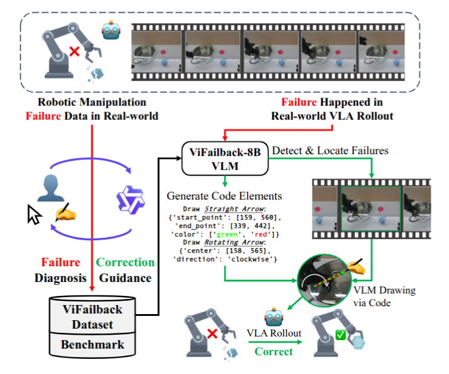

# ViFailback — chẩn đoán failure và sinh visual correction guidance

## 1. Nguồn và câu hỏi nghiên cứu

- Paper: *Diagnose, Correct, and Learn from Manipulation Failures via Visual
  Symbols*, Xianchao Zeng và cộng sự, CVPR 2026, pp. 42386–42395.
- [PDF trong repo](../../../papers/06-retry-handle/09_vifailback_visual_symbols.pdf), [CVF Open Access](https://openaccess.thecvf.com/content/CVPR2026/html/Zeng_Diagnose_Correct_and_Learn_from_Manipulation_Failures_via_Visual_Symbols_CVPR_2026_paper.html), [trang dự án](https://x1nyuzhou.github.io/vifailback.github.io/).
- Phân loại: **failure adaptation**. ViFailback là external VLM supervisor; để
  recovery thật, visual guidance phải được một VSF policy hoặc PMC controller
  chuyển thành action.

**Câu hỏi:** có thể thu thập failure thật và dùng ký hiệu trực quan để vừa giảm
chi phí annotation, vừa dạy VLM chẩn đoán và đưa correction đủ grounded cho robot
thực thi hay không?

## 2. Why — khoảng trống của failure data hiện tại

VLA học chủ yếu từ success nên không biết “sai ở đâu, vì sao, và phải sửa thế
nào”. Failure dataset trước thường được sinh programmatically trong simulator,
tạo sim-to-real gap. Text feedback thuần túy vừa tốn công annotate vừa khó biến
thành low-level motion vì instruction following của VLA chưa đủ chính xác.

Paper đặt success criteria ở ba tầng:

1. diagnosis/correction chính xác trên benchmark đóng và mở;
2. chất lượng symbol generation tăng theo lượng dữ liệu;
3. supervisor giúp VLA phục hồi trên task robot thật chưa thấy.

## 3. Đóng góp

1. **ViFailback dataset** gồm failure trajectory thật với diagnosis, textual guidance và visual-symbol guidance được gắn vào keyframe.
2. **ViFailback-Bench** tách 11 năng lực từ detection/localization tới reasoning và correction, với hai chế độ Lite và Hard.
3. **ViFailback-8B** sinh cả reasoning lẫn symbol code; hai executor chứng minh guidance có thể chuyển thành recovery action trên robot thật.

## 4. ViFailback Dataset

### 4.1 Dataset giải quyết failure nào?

**Failure mode được xử lý:** các corpus chỉ chứa successful demonstrations không cung cấp supervision về thời điểm failure bắt đầu, nguyên nhân failure hoặc cách recovery. Trong khi đó, nhiều failure dataset trước đây được tạo bằng cách chèn perturbation trong simulator, nên khả năng phản ánh failure khi triển khai trên robot thật bị giới hạn bởi sim-to-real gap.

ViFailback bắt đầu từ các real-world manipulation trajectories và chuyển chúng thành supervision cho ba nhóm năng lực:  **failure diagnosis** , **textual correction guidance** và  **visual-symbol guidance** . Dataset là artifact nền để xây dựng cả ViFailback-Bench và ViFailback-8B.

> Nên bỏ cụm “contact, perception error” vì paper không chỉ ra rõ dataset đã bao phủ hoặc gắn nhãn riêng hai loại lỗi này.

---

### 4.2 Thu failure trajectory thật

**Failure mode được xử lý:** failure được tạo programmatically trong simulator có thể không phản ánh đúng phân phối failure khi policy được triển khai ngoài đời. Vì vậy, model được huấn luyện chủ yếu trên simulated failure có nguy cơ học các tín hiệu diagnosis và correction không phù hợp với real-world deployment.

Nhóm tác giả thu **5,202 trajectories** trên nền tảng dual-arm ALOHA cho  **100 manipulation tasks** , gồm **657 successful trajectories** và  **4,545 failed trajectories** . Trong đó, **4,995 trajectories** được thu bằng human teleoperation; phần còn lại đến từ rollout của π0.5 đã được finetune trên các successful teleoperated samples.

Failure được tổ chức thành bốn nhóm:

* task planning;
* gripper 6D-pose;
* gripper state;
* human intervention.

Taxonomy này đồng thời được dùng cho các task diagnosis trong dataset và benchmark.

Dữ liệu thật giúp giảm phụ thuộc vào simulated failure, nhưng phạm vi đánh giá vẫn giới hạn ở một robot platform và bốn nhóm failure được thiết kế trước. Paper chưa đánh giá trực tiếp khả năng transfer của taxonomy hoặc visual-symbol interface sang embodiment khác.

> Thay “giảm sim-to-real gap” bằng “giảm phụ thuộc vào simulated failure” sẽ chính xác hơn. Paper chỉ chứng minh hiệu quả trên cùng ALOHA platform, chưa chứng minh cross-embodiment generalization.

---

### 4.3 Visual-symbol annotation

**Failure mode được xử lý:** low-level correction chỉ biểu diễn bằng ngôn ngữ có thể mơ hồ về target position, hướng dịch chuyển, hướng xoay và trạng thái mong muốn của gripper. Việc viết thủ công các mô tả failure reason và high-level correction cũng tốn chi phí annotation.

ViFailback định nghĩa bảy visual symbols:

1. colored straight arrow cho translation;
2. semi-circular arrow cho rotation;
3. dual crosshairs cho alignment;
4. single crosshair cho target object hoặc region;
5. ON/OFF label cho gripper state;
6. prohibition icon cho lệnh dừng;
7. rewind icon cho việc quay lại trạng thái trước.

Các symbol không chỉ được rasterize lên ảnh; pipeline còn lưu các thành phần có cấu trúc như symbol category, start point, end point và direction để VLM có thể học sinh drawing code.

Annotation pipeline gồm ba stage:

1. annotator dùng UI để chọn failure detection, keyframe, subtask và failure type; task được Qwen2.5-Max hỗ trợ phân rã thành subtasks;
2. annotator chọn correction category và vẽ visual symbols trực tiếp lên keyframe;
3. Qwen3-VL-235B sinh failure reason và high-level guidance từ các annotation đã có, sau đó con người kiểm tra và chỉnh sửa.

Pipeline tạo ra **58,128 VQA pairs** từ  **5,202 trajectories** . Accuracy của task sinh visual-symbol code tăng theo quy mô dữ liệu và đạt **38.73%** với full training split; tuy nhiên đây vẫn là một trong các task khó nhất. Paper không báo baseline về thời gian annotation hoàn toàn bằng text, inter-annotator agreement hoặc chi phí kiểm định, nên claim về annotation efficiency chưa được đánh giá đầy đủ bằng đối chứng trực tiếp.

---

### 4.4 Nội dung và quy mô dataset

ViFailback gồm **5,202 real-world trajectories** và  **58,128 VQA pairs** . Không nên hiểu rằng mỗi VQA sample chứa toàn bộ annotation fields. Thay vào đó,  **một trajectory có thể sinh nhiều VQA pairs** , mỗi pair kiểm tra một thành phần cụ thể, chẳng hạn:

* failure detection;
* failure keyframe localization;
* failure subtask localization;
* failure type;
* failure reason;
* low-level avoidance hoặc correction;
* high-level avoidance hoặc correction;
* visual-symbol generation.

Do đó, giá trị chính của dataset nằm ở việc liên kết observation theo thời gian với diagnosis và corrective guidance được ground trên keyframe, thay vì chỉ cung cấp video kèm success/failure label. ViFailback-Bench được thiết kế với tổng cộng 11 dạng VQA task, gồm closed-ended Lite và open-ended Hard.

Training split gồm  **4,702 trajectories thuộc 95 tasks** ; benchmark sử dụng  **500 trajectories thuộc 22 tasks** .

Dataset cũng chỉ được thu trên ALOHA dual-arm. Transfer sang robot embodiment, camera configuration hoặc action space khác chưa được paper kiểm chứng

## 5. ViFailback-Bench

### 5.1 Benchmark giải quyết failure nào?

ViFailback-Bench benchmark khả năng reasoning với action failure của mô hình. 

Mỗi trajectory được triển khai thành 11 VQA task: failure detection, keyframe và
subtask localization, bốn-way failure type, failure reason, low/high-level
avoidance, low/high-level correction và symbol code. ViFailback-Bench Lite dùng
câu hỏi closed-ended để đo năng lực lõi; Hard yêu cầu open-ended reasoning/CoT.

Benchmark có 500 trajectory và 22 task. Lite dùng exact accuracy. Hard dùng
GPT-4o judge dựa trên semantic similarity, completeness và functional
equivalence.

### 5.2 ViFailback-Bench Lite

Lite dùng closed-ended questions để đo sáu năng lực lõi: **detection, keyframe và
subtask localization, failure type, low-level avoidance và low-level correction.**
ViFailback-8B đạt average `93.70`, trong khi baseline mạnh nhất Gemini-2.5-Pro
đạt `54.64`. Hai kết quả quan trọng nhất đối với recovery là keyframe/subtask
localization `92.58/93.48` và low-level correction `95.93` (Table 2, p.7).

### 5.3 ViFailback-Bench Hard

Hard dùng open-ended answers/CoT cho **low-level avoidance, low-level correction,
failure reason và high-level guidance**. ViFailback-8B đạt average `72.64`; GPT-4o
là baseline kế tiếp với `40.00`. Model mạnh ở failure reason `83.97` và high-level
avoidance/correction `85.36/81.79`, nhưng low-level avoidance CoT chỉ `47.95`
(Table 3, p.7).

### 5.4 Benchmark contract và threat

Lite dùng exact accuracy. Hard dùng GPT-4o judge dựa trên semantic similarity,
completeness và functional equivalence. Paper không báo agreement giữa GPT-4o
và human judge. Quan trọng hơn, benchmark không được chứng minh task-disjoint:
95 training task và 22 benchmark task cùng lấy từ tổng 100 task. Vì vậy kết quả
đo khả năng trên held-out trajectories tốt hơn là generalization sang task mới.

## 6. ViFailback-8B Model

### 6.1 Model giải quyết failure nào?

**Failure mode được xử lý:** general-purpose VLM nhận biết object và instruction
nhưng chưa được dạy nối temporal evidence của failure với keyframe, nguyên nhân
và correction grounded trên ảnh.

ViFailback-8B khởi tạo từ Qwen3-VL-8B và được LoRA để trả lời cả closed-ended
diagnosis, open-ended reasoning và visual-symbol code. Đây là external supervisor,
không phải VLA trực tiếp sinh low-level robot action.

### 6.2 Training corpus và objective

Training split gồm 52,418 VQA từ 4,702 trajectory và 95 task. Cùng một supervised
fine-tuning objective học 11 target type: diagnosis/localization, reasoning,
low/high-level guidance và symbol serialization. Các subset 1,200, 2,400, 3,600
và 4,702 trajectory được dùng để đo data scaling.

Target provenance là hybrid: Qwen2.5-Max hỗ trợ task decomposition,
Qwen3-VL-235B sinh high-level description, rồi annotator kiểm tra và sửa. Model
được LoRA trong một epoch; paper không có RL stage hoặc loss trực tiếp tối ưu
robot task success.

### 6.3 Training detail còn thiếu

Main PDF không báo đầy đủ LoRA rank, optimizer, learning rate, batch size hoặc
compute. Vì vậy có thể tái dựng data contract và objective, nhưng chi phí/cấu
hình training chính xác vẫn là **Unknown**. Kết quả benchmark chứng minh domain
finetuning hữu ích, không phải zero-shot superiority của architecture.

## 7. Failure Recovery System

### 7.1 Từ guidance tới recovery action

**Failure mode được xử lý:** textual diagnosis đúng vẫn không đủ để robot thực
thi low-level correction; VLM không trực tiếp điều khiển actuator.

Paper thử hai cầu nối có contract khác nhau.

### 7.2 Visual Symbols-Following

VSF overlay symbol lên failure keyframe rồi finetune π0.5 để policy đi theo cue.
Nhánh này học mapping từ `observation + visual prompt` sang action và cần một số
episode symbol-following cho embodiment đích.

### 7.3 Point-based Motion Control

PMC không finetune VLA end-to-end. Nó parse target point từ symbol, kết hợp
GraspNet pose và dùng controller có sẵn để di chuyển gripper. Nhánh này tách
reasoning khỏi motion execution, nhưng phụ thuộc detector, pose estimator và
controller cổ điển.

### 7.4 Đánh giá recovery trên robot thật

Trên ba unseen real-world task, baseline có symbol đạt `52.4%`, VSF đạt `73.0%`;
baseline PMC đạt `50.8%`, ViFailback + PMC đạt `74.6%` (Table 4, p.8), tương ứng
+20.6 và +23.8 điểm phần trăm. Đây là **system-level evidence**: vì cả correction
module/executor cùng thay đổi, phép đo chưa cô lập visual symbol tốt hơn text bao
nhiêu. Paper cũng chưa dùng action distribution vốn có trong failure trajectory
để train VLA trực tiếp.

## 8. Claim → evidence

| Claim                                            | Evidence được báo cáo                                                                                               | Threat                                                                        |
| ------------------------------------------------ | ------------------------------------------------------------------------------------------------------------------------ | ----------------------------------------------------------------------------- |
| Fine-grained failure supervision cải thiện VLM | Overall`(93.70 + 72.64)/2 = 83.17`; Gemini-2.5-Pro `44.54`, GPT-4o `44.47` (Table 1)                               | Model được train đúng domain; không phải zero-shot model comparison    |
| Localization và correction cùng cải thiện    | Lite: keyframe`92.58`, subtask `93.48`, low-level correction `95.93` (Table 2)                                     | Closed-ended score có thể dễ hơn deployment mở                           |
| Open-ended reasoning tốt hơn baseline          | Hard: reason`83.97`, high-level avoidance/correction `85.36/81.79`; low-level avoidance CoT chỉ `47.95` (Table 3) | GPT-4o judge và không có reliability study                                 |
| Guidance giúp recovery robot thật              | VSF +20.6 pp; PMC +23.8 pp (Table 4)                                                                                     | Thay đổi cả correction module; không cô lập symbol-vs-text contribution |

Train có 95 task trong tổng 100, còn benchmark có 22 task, nên benchmark gần như
chắc chắn có **task overlap** dù trajectory split có thể riêng. Chỉ downstream
robot experiment được paper nói rõ là unseen-task.

## 9. Giới hạn và Unknown

- Paper mới khai thác video supervision; action distribution của failure
  trajectory chưa được dùng và được để lại cho future work (p.8).
- Không báo latency/trigger interval, class balance, symbol-coordinate error,
  annotation cost breakdown hay annotator agreement.
- Không có confidence interval/significance cho 21 trial/task.
- Dataset/license/download format không nằm trong main PDF; cần xác minh ở project
  page trước khi đưa vào pipeline.
- Framework đưa ra guidance, không tự chứng minh VLM có thể trực tiếp sinh
  low-level recovery action.

## 10. Liên hệ với workspace

**Inferred:** [`src/local_video_server.py`](../../../../src/local_video_server.py)
đã có video range request/scrubbing, phù hợp làm backend cho annotation UI. Sidecar
có thể chứa symbol type/color/start/end/center/arm cùng `failure_keyframe`,
`failure_subtask`, `failure_type`, guidance và VQA provenance.

Đây mới là khả năng tái sử dụng hạ tầng, không phải capability hiện có: workspace
chưa có ALOHA failure data, symbol schema/renderer, VQA evaluator hay robot
correction executor.

## 11. Thử nghiệm tiếp theo

1. Đo annotation time và inter-annotator agreement giữa text-only và symbol UI.
2. Tách ba executor input: text-only, point-only, full visual symbol trên cùng
   controller và trial budget.
3. Đánh giá task-disjoint, embodiment-disjoint và human-vs-GPT judge agreement;
   đây là ba kiểm tra có khả năng làm suy yếu claim generalization nhất.

**Mức tin cậy:** cao cho dataset/task definition và reported tables; trung bình
cho cross-task/general recovery claim.
