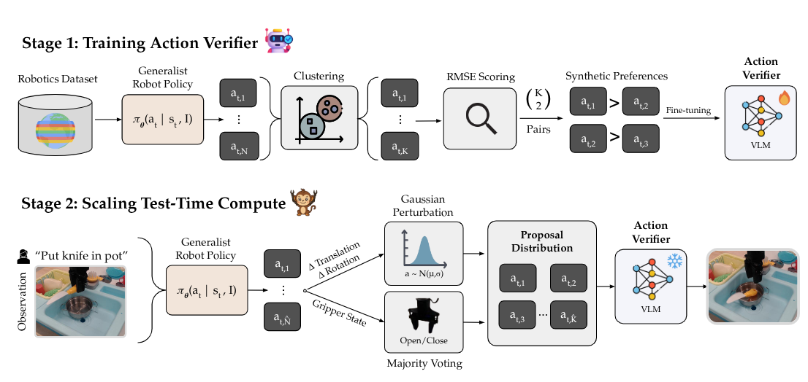
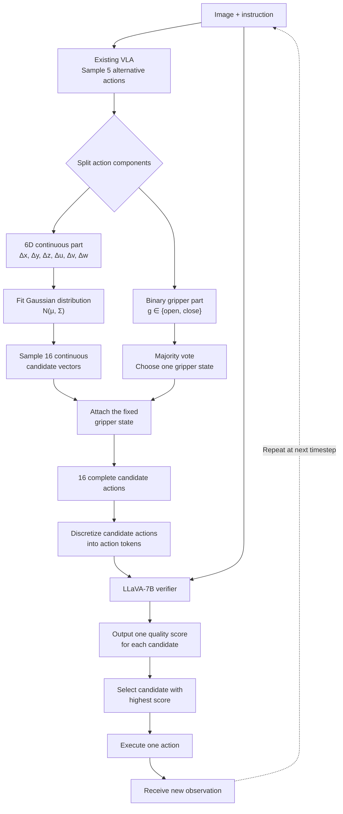

# RoboMonkey — sinh nhiều action rồi verify tại test time

## 1. Nguồn

- Tiêu đề: *RoboMonkey: Scaling Test-Time Sampling and Verification for
  Vision-Language-Action Models*
- Tác giả: Jacky Kwok, Christopher Agia, Rohan Sinha, Matt Foutter, Shulu Li,
  Ion Stoica, Azalia Mirhoseini, Marco Pavone (Stanford, UC Berkeley,
  NVIDIA Research)
- arXiv: [2506.17811v2](https://arxiv.org/abs/2506.17811), 7 Jul 2025
- Trang dự án: https://robomonkey-vla.github.io
- Code: https://github.com/robomonkey-vla/RoboMonkey
- PDF trong repo: [docs/papers/06-retry-handle/01_robomonkey_test_time_sampling_verification.pdf](../../../papers/06-retry-handle/01_robomonkey_test_time_sampling_verification.pdf)
- Venue: **Unknown** — PDF không ghi venue. Chỉ mục citation của người dùng ghi
  54 citation; bản PMLR gợi ý CoRL 2025 nhưng đây là **Inferred**, không xác minh
  được từ PDF.
- Phân loại: **test-time verification** — không sửa kiến trúc VLA, không huấn
  luyện lại policy, chỉ thêm compute và một verifier ở thời điểm deploy.

## 2. Câu hỏi nghiên cứu

VLA thường sinh **đúng một** action chunk cho mỗi quan sát. Câu hỏi: cho cùng observation và instruction, có thể tăng độ chính xác/robustness bằng cách **sinh nhiều candidate rồi chọn** hay không — tức là chuyển robot control từ bài toán *generation* sang bài toán *verification*?

## 3. Đóng góp

1. Đo **inference-time scaling law** cho VLA: action error giảm theo power law
   theo số sample, trên nhiều policy khác nhau.
2. Pipeline sinh **synthetic action preference** tự động từ dataset imitation,
   không cần nhãn người, và công thức huấn luyện verifier 7B.
3. Framework deploy RoboMonkey (sample → Gaussian perturbation → majority voting→ verify) với serving engine đủ nhanh để chạy thật.
4. Framework là một extention của các model VLA có sẵn (OpenVLA), không phải 1 model riêng, giúp refine output của các mô hình.
5. Bằng chứng finetune **cả VLA lẫn verifier** tốt hơn chỉ finetune VLA.

## 4. Method

### 4.1 Scaling law (Section 3)

Lấy 1.000 tuple $(s, a^*, I)$ từ Bridge V2, sinh 10.000 action mỗi tuple, đo
normalized RMSE với ground-truth action. Ba cách sample:

- **Random**: sample đều token action rời rạc (kiểu RT-1).
- **Policy sampling**: sample lặp từ $\pi_\theta(a \mid s, I)$ với temperature > 0.
- **Gaussian perturbation**: chỉ sample **4** action từ policy, fit Gaussian,
  rồi rút toàn bộ candidate từ phân phối đó.

Giả định có **oracle verifier** (luôn chọn action RMSE thấp nhất), error giảm đều
theo số sample ở cả ba cách. Fit power law $\log(e) \approx \log(a) + b\log(k)$.
Với OpenVLA, RMSE giảm **59.3%** khi sample 10.000 action. Đúng trên CogACT,
Octo, OpenVLA, SpatialVLA.

Ba phát hiện: (1) sample ngẫu nhiên >100 action đã vượt greedy decoding của
OpenVLA; (2) policy sampling cho error thấp nhất; (3) Gaussian perturbation gần
bằng policy sampling nhưng rẻ hơn nhiều.

**Cảnh báo đọc số:** toàn bộ Figure 1 giả định oracle verifier. Đây là **cận
trên**, không phải kết quả closed-loop.

### 4.2 Stage 1 — sinh preference và huấn luyện verifier

Với mỗi $(s_t, a^*_t, I)$: sinh $N$ candidate từ policy tham chiếu, clustering
xuống $K$ action đại diện, tạo $\binom{K}{2}$ cặp so sánh, gán nhãn theo RMSE tới
ground truth:

$$
(a^W_t, a^L_t) =
\begin{cases}
(a^i_t, a^j_t) & \text{nếu } \mathrm{RMSE}(a^i_t, a^*_t) < \mathrm{RMSE}(a^j_t, a^*_t)\\
(a^j_t, a^i_t) & \text{ngược lại}
\end{cases}
$$

Loss Bradley-Terry có thêm thành phần margin theo **mức độ** ưu tiên
$\Delta^*_t = \mathrm{RMSE}(a^W_t, a^*_t) - \mathrm{RMSE}(a^L_t, a^*_t)$:

$$
\mathcal{L}(\phi) = -\mathbb{E}\Big[\log \sigma\big(R_\phi(a^W_t, s_t, I) - R_\phi(a^L_t, s_t, I)\big) - \alpha \lVert \Delta^*_t - \hat{\Delta}_t \rVert^2_2\Big]
$$

- Verifier: LLaVA-7B, thay unembedding layer bằng reward head; ViT-Large làm vision encoder.
- Dữ liệu: **20 triệu** cặp so sánh từ Bridge V2 (40k+ trajectory WidowX).
- Train: 8× H100, LoRA (r=512, α=128), batch 256, Adam lr 2e-5, **1 epoch**, margin α=0.1.

### 4.3 Stage 2 — deploy

Mỗi timestep: sample $\hat{N}$ action từ VLA (T=1.0) → gripper state bằng
**majority voting** trên bit rời rạc → fit Gaussian $\mathcal{N}(\mu_t, \Sigma_t)$
trên 6 chiều liên tục (translation + rotation) → sample $\hat{K}$ candidate →
verifier chấm điểm → $\arg\max$.

Cấu hình thật: $\hat{N}=5$, $\hat{K}=16$, ~650 ms/step (**1.5 Hz**), 1× H100,
28 GB VRAM.

### 4.4 Serving

OpenVLA dựng trên Prismatic VLM và **không hỗ trợ batching**. Nhóm tác giả mở rộng SGLang để hỗ trợ Prismatic. Ở batch 32: latency giảm **74%**, throughput tăng **hơn 120×** so với pipeline OpenVLA gốc. Verifier nhanh hơn VLA vì chỉ cần prefill, không có decode tự hồi quy (46 action/s ở batch 16).

## 5. Claim → Evidence

### 5.1 In-distribution (SIMPLER, WidowX)

| Method               | Avg success                          |
| -------------------- | ------------------------------------ |
| OpenVLA              | ~38.5% (RoboMonkey +9%)              |
| V-GPS + OpenVLA      | thấp hơn cả OpenVLA đứng riêng |
| **RoboMonkey** | **47.5%**                      |

Eggplant-in-basket +19%, block stacking +10% so với OpenVLA.

### 5.2 Out-of-distribution (WidowX-250S thật, 4 task × 10 trial, 120 rollout)

| Method               | Avg success   |
| -------------------- | ------------- |
| OpenVLA              | 35%           |
| V-GPS                | 30%           |
| **RoboMonkey** | **60%** |

Task banana-in-basket: OpenVLA **0%** (không phân biệt được banana vàng và rổ
vàng), RoboMonkey hoàn thành. Cup stacking và hammer lifting hơn >20%.

### 5.3 LIBERO-Long (Franka, finetune, 500 trial)

OpenVLA 49.8% → RoboMonkey **56.5%** (+6.7%). **Mâu thuẫn nội bộ nhỏ:** abstract
và contribution list ghi "7%", phần 5.6 ghi 6.7%.

### 5.4 Scaling dữ liệu synthetic

SIMPLER avg tăng **37.5% → 46.3%** khi tăng số cặp so sánh; gần log-linear.
"Stacking Cube" 27% → 37% → 42%.

### 5.5 Ablation đáng chú ý

- **Preference learning > RMSE regression**: in-distribution gần bằng nhau,
  nhưng OOD preference learning cho error thấp hơn **6%** ở 64 sample. Học so
  sánh tương đối tổng quát hoá tốt hơn học hồi quy giá trị tuyệt đối.
- **V-GPS bị reward hacking**: sample >8 action thì performance **giảm**.
  RoboMonkey không có hiện tượng này — đây là luận cứ mạnh nhất cho verifier
  kiểu preference so với value function offline RL.
- **Margin α**: 0 → F1 0.83; **0.1 → F1 0.85**; 1.0 → F1 0.81.
- **Chọn action**: ở 64 sample, RoboMonkey giảm error **21%** so với greedy,
  V-GPS chỉ 6%.
- **Ghép với policy khác**: CogACT 0.145 → 0.133 (−8%), Octo 0.196 → 0.166
  (−15.3%), SpatialVLA 0.137 → 0.1298 (−5.3%).

## 6. Giới hạn và điểm chưa rõ

- Parameter của model rất nặng **(OpenVLA ~ 7B, Verifier: LLaVA 7B)** Chi phí phần cứng gấp đôi so với chạy VLA đơn.
- Phải chạy VLA 5 lần mỗi 1 run -> Rất tốn tài nguyên (**1.5 Hz**). Tác giả tự nhận không phù hợp cho control tần số cao. Với task contact-rich hoặc dynamic, đây là chặn cứng.
- **Nhãn preference dựa trên RMSE tới một action expert duy nhất.** Điều này ngầm giả định action space đơn mode: mọi action khác expert đều "tệ hơn" tỉ lệ theo khoảng cách. Với task đa mode (nhiều cách grasp đều đúng) giả định này sai, và paper **không** thảo luận.
- **Không phải "retry" theo nghĩa recovery.** RoboMonkey chọn action tốt hơn
  *trước khi* thực thi; nó không phát hiện lỗi đã xảy ra, không quay lui, không
  reset môi trường. Xếp vào tập retry/recovery là do vị trí can thiệp (test time,
  chống lỗi), không phải do cơ chế.
- **20M cặp là trần thí nghiệm, không phải trần method.** Chỉ trên Bridge V2.
- **Chỉ hai embodiment**: WidowX 250S và Franka.
- **Unknown:** không có ablation cho biết bao nhiêu phần cải thiện đến từ
  majority voting gripper so với từ verifier.

## 7. Liên hệ với workspace

- Đây là paper **rẻ nhất để thử** trong tập 4: không cần đổi kiến trúc, không
  cần thu dữ liệu robot mới. Chỉ cần một VLA có thể sample nhiều lần và một
  verifier.
- Pipeline sinh preference chỉ cần `(observation, ground-truth action, instruction)` — đúng ba trường mà canonical episode v0.1 đã có. **Đây là paper
  duy nhất trong tập mà `vla-data-tools` hiện tại đủ để sinh dữ liệu huấn luyện.**
- Phần serving (SGLang cho Prismatic) là đóng góp kỹ thuật tách rời được; có thể
  dùng lại kể cả khi không dùng verifier.
- **Unknown:** repo có checkpoint verifier công khai hay không — chưa clone.

## 8. Thử nghiệm tiếp theo

1. **Planned — tái lập scaling law offline, không cần robot.** Lấy một dataset
   trong `dataset/`, sample $k$ action từ một VLA, đo RMSE oracle theo $k$, fit
   power law. Nếu độ dốc $b$ gần 0 trên dữ liệu của mình thì toàn bộ tiền đề của
   RoboMonkey không áp dụng. Đây là phép kiểm rẻ nhất và phải làm trước.
2. **Planned — kiểm tra giả định đơn mode.** Trên dataset local, tìm các state có
   nhiều demo với action rất khác nhau; đo phân bố RMSE. Nếu đa mode phổ biến thì
   nhãn preference theo RMSE sẽ nhiễu.
3. **Planned — đo latency thực tế trước khi cam kết.** 650 ms/step là số trên
   H100. Ước lượng lại theo GPU có sẵn; nếu vượt ngân sách chu kỳ điều khiển thì
   dừng ở bước 1.
4. **Insight:** Với output của Verifier khá đơn giản (16 score với 16 actions), có thểLLaVA 7B là overkill, nên thử nghiệm với mô hình VLM nhỏ như **Qwen3.5-0.8B**, hoặc train các lớp **MLP/Attention** đơn giản hơn.
