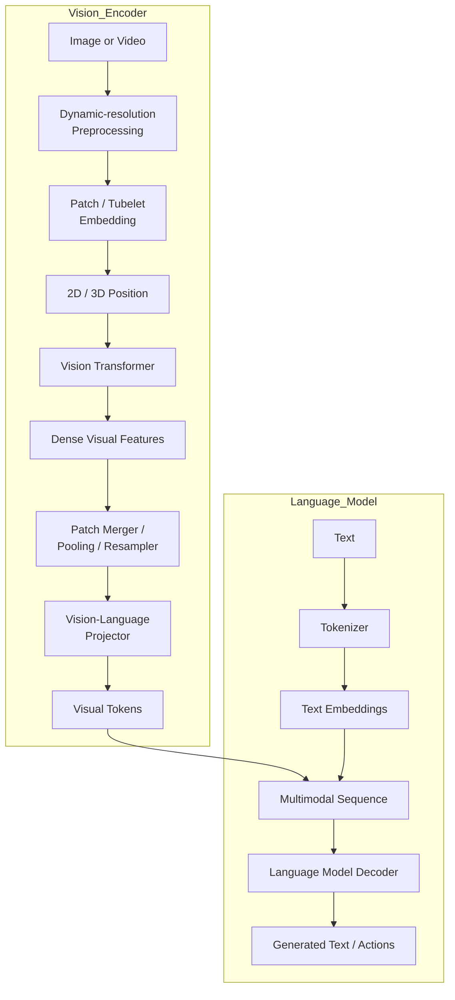

# Vision Transformer Architecture in Vision--Language Models

> **Note:** This version is formatted with display LaTeX (`$$ ... $$`)
> for Markdown renderers.

## 1. Executive Summary

A Vision Transformer (ViT) inside a Vision--Language Model (VLM) shares
the same fundamental architecture as a conventional ViT:

1. Split an image into patches.
2. Convert each patch into an embedding.
3. Add positional information.
4. Process the patch sequence with Transformer encoder blocks.

The major difference is **not the Transformer itself**, but **what
happens before and after it**.

A classification ViT compresses an image into a representation suitable
for image recognition. A VLM instead preserves detailed spatial
information so that an LLM can reason about objects, text, layouts,
documents, user interfaces, and videos.

Typical modern VLM additions include:

- Dynamic or native-resolution image preprocessing
- Language-aligned vision pretraining (CLIP, SigLIP, etc.)
- Dense patch features instead of only a CLS token
- Patch merging or token compression
- Vision-language projector
- 2D/3D positional encoding
- Multi-level visual feature injection
- Multimodal pretraining and instruction tuning

## Overall Architecture



---

# 2. Standard Vision Transformer

For an image of size $H\times W$ divided into square patches of size
$P$:

$$
N=\frac{H}{P}\times\frac{W}{P}
$$

where $N$ is the number of image patches.

Example:

$$
224\times224,\quad P=16
$$

gives

$$
N=14\times14=196
$$

Each image patch contains

$$
P^2\times3
$$

RGB values.

Each patch is projected into the ViT hidden dimension:

$$
z_i=x_iW_E+b_E
$$

Modern implementations perform this with a Conv2D whose kernel size and
stride equal the patch size.

The ViT input becomes

$$
X_0=
[z_{\mathrm{CLS}},z_1,z_2,\ldots,z_N]
+
E_{\mathrm{position}}
$$

The sequence is processed by repeated Transformer encoder blocks.

Finally, only the CLS token is normally sent to a classifier.

```text
Image
 ↓
Patch Embedding
 ↓
CLS + Patch Tokens
 ↓
ViT Encoder
 ↓
CLS Representation
 ↓
Classifier
```

---

# 3. Why VLMs Need More Than a Standard ViT

Classification requires only a global prediction.

A VLM must answer questions like:

- Where is the object?
- What text appears in the image?
- Which object changed?
- Which table cell contains the largest value?

Instead of one vector, the LLM needs a **sequence of spatial features**.

```text
Top-left region
Upper-middle
Upper-right
...
Bottom-right
```

Those become **visual tokens** inside the language model.

---

# 4. Major Modules

## 4.1 Visual Preprocessing

Three common approaches exist.

### Fixed Resolution

```text
1920×1080
      ↓
224×224
```

Simple but loses detail.

### Tiling

Large images become several crops.

Benefits:

- Better OCR
- Better small-object recognition

Drawback:

- More visual tokens.

### Dynamic Resolution

Image resolution is largely preserved.

```text
Small image → Few patches

Large image → Many patches
```

Modern models such as Qwen-VL increasingly use this approach.

---

## 4.2 Patch Embedding

Modern ViTs rarely flatten patches explicitly.

Instead they use

```text
Conv2D

Kernel = Patch Size

Stride = Patch Size
```

which is mathematically equivalent while being faster on GPUs.

Video models often use tubelets:

```text
2 Frames
×

14×14 Pixels
```

rather than individual image patches.

---

## 4.3 Positional Encoding

Language uses one-dimensional positions

$$
p=0,1,2,\ldots
$$

Images instead use

$$
(h,w)
$$

Videos use

$$
(t,h,w)
$$

Modern VLMs commonly adopt:

- 2D RoPE
- Relative positions
- Interpolated position embeddings

---

## 4.4 Vision Transformer Backbone

Self-attention is identical to ordinary Transformers.

$$
Q=XW_Q
$$

$$
K=XW_K
$$

$$
V=XW_V
$$

Attention is

$$
\operatorname{Attention}(X)=
\operatorname{softmax}
\left(
\frac{QK^\top}{\sqrt{d_k}}
\right)V
$$

The main architectural improvements are not inside attention itself, but
in training and preprocessing.

Many VLMs initialize their vision tower from an image-text encoder such as
CLIP or SigLIP, but the exact checkpoint and training policy differ by model;
some VLMs instead train the tower from scratch. See the verified
[pretrained encoder-to-VLM map](pretrained_vision_encoders.md).

---

## 4.5 Multi-Level Features

Instead of only using the final ViT layer,

modern VLMs may combine

- early layers (edges)
- middle layers (parts)
- late layers (objects)

Some architectures inject these features into multiple LLM layers.

---

## 4.6 Patch Merger / Resampler

High-resolution images may produce thousands of visual tokens.

Compression techniques include:

- Patch merger
- Average pooling
- Learned query resamplers
- Perceiver resamplers

Example:

```text
v1 v2
v3 v4

↓

Merged Token
```

This reduces LLM computation.

---

## 4.7 Vision-Language Projector

The projector maps

$$
d_{\text{vision}}
\rightarrow
d_{\text{LLM}}
$$

For example

$$
1152
\rightarrow
4096
$$

A simple projector is

$$
v'=Wv+b
$$

Modern projectors often use

$$
v'
=
W_2\phi(W_1v+b_1)+b_2
$$

where $\phi$ is GELU or SwiGLU.

Its job is not merely changing dimensions.

It aligns the vision representation with the language model's embedding
space.

---

## 4.8 Fusion

Two major approaches exist.

### Token Insertion

Visual tokens become part of the language sequence.

```text
<vision_start>

Visual Tokens

<vision_end>

Question
```

Used by models such as LLaVA and Qwen-VL.

### Cross Attention

Visual features stay separate.

Cross-attention layers retrieve visual information when needed.

Used by Flamingo.

---

# 5. Training Pipeline

1. Vision pretraining
2. Projector alignment
3. Joint multimodal pretraining
4. Instruction tuning

This staged approach stabilizes optimization while preserving language
ability.

---

# 6. Representative Models

## LLaVA

- CLIP vision encoder
- Linear / MLP projector
- Direct token insertion

Simple and effective.

## BLIP-2

- Frozen vision encoder
- Q-Former
- Frozen LLM

Compresses thousands of patches into a few learned visual tokens.

## Flamingo

- Vision encoder
- Perceiver Resampler
- Cross-attention inside the LLM

Better for interleaved image-text and video.

## Qwen-VL

Recent Qwen models introduce:

- Native dynamic resolution
- Window attention
- 2×2 patch merger
- MLP projector
- Multi-level visual injection
- Long-context multimodal RoPE

These changes primarily improve OCR, grounding, GUI understanding,
documents, and long videos.

## Gemini

Public information indicates:

- Native multimodal training
- Long multimodal context

The exact vision encoder and projector remain undisclosed.

## GPT-4 / GPT-4o

OpenAI has not published the detailed vision architecture.

Publicly known:

- Native image understanding
- End-to-end multimodal GPT-4o

Specific ViT details are not public.

---

# 7. Evolution of Modern VLMs

  Earlier              Modern

---

  Fixed resize         Dynamic resolution
  Classification ViT   Language-aligned ViT
  Final layer only     Multi-level features
  All patches          Patch merger
  Absolute positions   2D/3D RoPE
  Single image         Long multimodal context
  Frozen modules       End-to-end training

---

# 8. Conclusion

Modern VLM performance is determined less by changing the Transformer
itself and more by improving the entire **visual token generation
pipeline**:

1. Better preprocessing
2. Better vision encoders
3. Better positional encoding
4. Better token compression
5. Better projector
6. Better multimodal training

The Vision Transformer extracts semantic visual features, while the
merger and projector determine how efficiently those features become
language-model tokens. The LLM then performs multimodal reasoning using
the same Transformer architecture originally designed for text.
