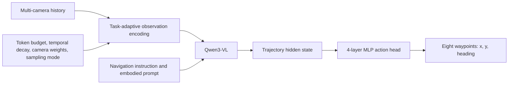
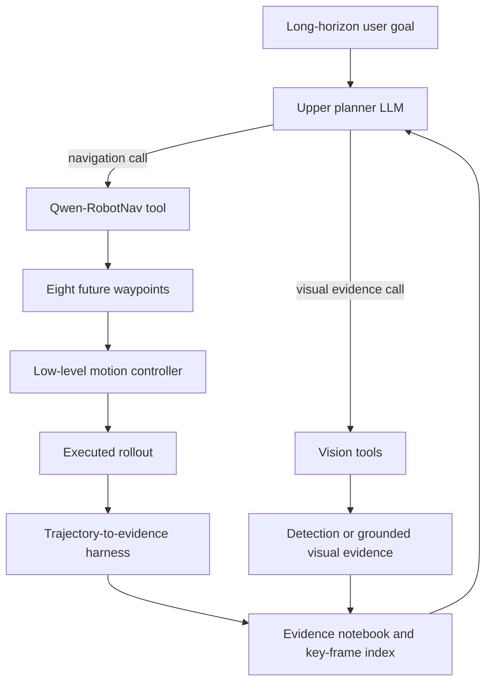

# Qwen-RobotNav: Architecture, Training Data, and Evaluation

## Scope

This report covers **Qwen-RobotNav**, the navigation specialist in the Qwen-Robot suite.
It focuses on its waypoint policy, configurable observation interface, training datasets,
batch-level task sampling, observation randomization, evaluations, and limitations. For the
manipulation specialist, see [qwen_robotmanip.md](qwen_robotmanip.md). For the general model,
see [qwen_vla.md](qwen_vla.md).

> **Research date:** 2026-07-22. The primary source checked is Qwen-RobotNav v3
> (2026-06-29). Dataset and evaluation numbers are author-reported and have not been
> reproduced in this workspace. The official repositories currently state that there is no
> plan to release the model weights.

## Core Idea

Qwen-RobotNav keeps the action head deliberately simple: Qwen3-VL encodes configurable
multi-camera history, and a four-layer MLP directly regresses eight future waypoints. Its main
training mechanism is not diffusion but joint multi-task adaptation under an 85:15
trajectory-to-VL mixture, with dataset selection at batch granularity and observation
configuration randomized independently for every trajectory sample.

## 1. Main Tasks

Qwen-RobotNav supports five navigation task families:

- Vision-language instruction following
- Point-goal navigation
- Object search
- Target tracking
- Autonomous driving

It can also serve as a reactive navigation executor beneath a higher-level LLM planner.

## 2. Architecture



The model outputs:

$$
W=\{(x_k,y_k,\theta_k)\}_{k=1}^{8}
$$

This is a 24-dimensional direct regression target.

Unlike Qwen-VLA and RobotManip:

- There is no diffusion process.
- There is no noisy action sequence.
- There is no Euler denoising loop.
- The model does not directly output wheel torques or joint commands.
- A lower-level controller converts waypoints into physical motion.


## 3. Model Inputs, Camera Angles, and Prompt Examples

A RobotNav call combines an observation stream, language, task identity, and a configurable context
policy. The input is best represented as:

$$
\left(I_{1:T}^{1:N},\;L,\;\tau,\;\Phi\right),
\qquad
\Phi=(B,\gamma,\{w_c\},m,b_{min},b_{max}),
$$

where \(I_{1:T}^{1:N}\) is RGB history from \(N\) cameras over \(T\) timesteps, \(L\) is the
navigation instruction plus embodiment preamble, \(\tau\) is the task mode, and \(\Phi\) controls which
images survive and at what resolution. The base model returns eight \((x,y,\theta)\) waypoints; an
external low-level controller executes them.

| Input group | Contents | Required or optional |
| --- | --- | --- |
| RGB observations | Current and historical frames from one or more cameras | Required; camera count varies by platform/task |
| Embodiment preamble | Natural-language identity such as robot or car | Required by the described prompt design |
| Sub-goal/instruction | Route, point, object, tracking, or driving request | Required, but its task-specific fields vary |
| Task mode | `VLN`, `PointNav`, `ObjNav`, or `Tracking` in the agent-facing interface | Required for configurable agent calls; autonomous driving is trained but is not listed as one of these four tool modes |
| Observation configuration | Token budget, recency decay, camera weights, frame sampling mode, per-image token bounds | Externally configurable; several values usually use platform defaults |
| Auxiliary navigation priors | Coordinates/bearing, target description, ego state, or prior trajectories depending on task | Optional/task-dependent |

[RobotNav paper v3, §§2.1-2.5 and 3.1-3.2](https://arxiv.org/abs/2606.18112v3)

### Camera layouts and published angle information

RobotNav supports an arbitrary platform-dependent number \(N\) of cameras rather than one fixed rig.
The paper documents these observation layouts:

| Layout | Published views | Angle coverage and use |
| --- | --- | --- |
| Monocular | Front only | Forward-facing deployment and evaluation; no numeric field of view is fixed by the model interface |
| Four-view panoramic | Current reasoning samples use front, right, back, left; R2R/RxR collection lists front, left, right, rear | Described as full 360-degree coverage; the paper does not assign a numeric azimuth to every view |
| Six-camera example | Labels begin `Front`, `Front Right`, continue through intermediate views, and end `Front Left` | Demonstrates that semantic camera names extend beyond four views; exact calibrated azimuths are not enumerated |
| Autonomous-driving multi-view | Multiple vehicle cameras | Exact count, order, and mounting angles are dataset/platform dependent and are not fixed in the model section |

The paper tested numeric labels such as **`right 90 degrees`**, but descriptive labels performed slightly
better. That is the only explicit azimuth example; assigning conventional values such as 0/90/180/270
degrees to the four-view rig would be an inference, not a reported input contract.

There is also no single published global camera order. Instruction-following data records `front, left,
right, rear`; reasoning data serializes the current panorama as `front, right, back, left`; and the six-view
example begins `Front, Front Right, ...`. These are dataset/example orders, not a normative API contract.

For the common four-view case, the example camera weights are:

```text
front = 2.0, right = 1.0, back = 0.5, left = 1.0
```

The weights control visual-token allocation, not physical camera angles. The front view receives the
largest share because it usually contains paths, obstacles, and goal landmarks; the rear view receives the
smallest. Each selected image is dynamically resized to its allocated token/pixel budget while preserving
aspect ratio. Training also augments simulator camera height over 0.5-1.5 m, horizontal field of view over
90-120 degrees, and aspect ratio from 2:1 to 4:3; these are data augmentations, not mandatory inference
settings. [RobotNav paper v3, §§2.2-2.3 and 4.2.1](https://arxiv.org/abs/2606.18112v3)

### Exact image and time serialization example

After frame selection, the model interleaves ordinary text tags with image tokens. The paper gives this
two-timestep, six-camera pattern:

```text
Time step 0 Front View <image> Front Right View <image> ... Front Left View <image>
Time step 1 Front View <image> ...
```

The groups are temporal, and every image is preceded by its semantic viewpoint label. No learned camera
ID embedding or architecture change is required. The report does not publish the complete production
chat template, separators, token IDs, or the exact six-camera list hidden by the ellipsis.
[RobotNav paper v3, §2.3](https://arxiv.org/abs/2606.18112v3)

### Exact embodiment preambles

The paper publishes two natural-language beginnings:

```text
Imagine you are a robot programmed for navigation tasks
```

```text
Imagine you are a car programmed for autonomous driving
```

These are task priors rather than learned embodiment IDs. The authors propose that a new platform such
as a drone, wheeled robot, or quadruped could use a new text preamble without adding parameters, but do
not publish validated templates for those platforms. [RobotNav paper v3, §2.4](https://arxiv.org/abs/2606.18112v3)

### What the instruction contains for each task

| Task family | Language/auxiliary input described in the paper | Typical visual history |
| --- | --- | --- |
| VLN | Natural-language route instruction | Global episode coverage to reconnect landmarks with earlier instruction steps |
| PointNav | Relative target coordinates plus current pose, distance, and bearing; or primitives such as `Move forward 2.0 meters`, `Turn left 90 degrees`, `Move forward`, and `Turn left` | Current view plus uniformly sampled navigation history |
| ObjNav | Templates include `navigate to the {goal_object}` and `find and reach the {goal_object}` | Broad, history-covering sampling to remember explored regions and backtracking |
| Tracking | Textual target description; the paper's representative query is `Follow the man in the blue t-shirt` | Current egocentric image plus a short, recent, high-resolution history |
| Autonomous driving | Multi-view images in all variants; optional navigation instruction, ego-vehicle state, and/or short history of ground-truth trajectories | Short driving history; NAVSIM evaluation supplies the previous three ground-truth trajectories |

These are different input renderings for one shared model. In the agent interface, the upper planner can
change \(L\), \(\tau\), and \(\Phi\) between calls without changing weights.
[RobotNav paper v3, §§3.1-3.2, 4.1 and 5.4](https://arxiv.org/abs/2606.18112v3)

Navigation reasoning co-training has another, more specific format: up to eight uniformly sampled
historical **front-view** frames, the current `front, right, back, left` panorama, the instruction, and
annotation-time action/trajectory statistics. The statistics supervise textual `History`, `Scene Analysis`,
`Instruction Progress`, and `Action Reasoning` targets; they are not all required at runtime by the
continuous waypoint policy. This distinction prevents training-only labels from being mistaken for
deployable sensor inputs. [RobotNav paper v3, §4.3](https://arxiv.org/abs/2606.18112v3)

### Illustrative assembled navigation call

The paper defines the abstract call \(W_i=\operatorname{nav\_qwennav}(L_i,\tau_i,\Phi_i)\), but it
does not release a literal JSON API. The following is a **reconstruction** from published fields:

```yaml
system_preamble: Imagine you are a robot programmed for navigation tasks
task_mode: ObjNav
instruction: Search the kitchen area for a mug.

observation_config:
  token_budget_B: 4096
  temporal_decay_gamma: 1.0
  frame_sample_mode: random
  camera_weights:
    front: 2.0
    right: 1.0
    back: 0.5
    left: 1.0
  min_tokens_per_image: 4
  max_tokens_per_image: 256

observations:
  - time_step: 0
    views:
      front: <image>
      right: <image>
      back: <image>
      left: <image>
  - time_step: 1
    views:
      front: <image>
      right: <image>
      back: <image>
      left: <image>
```

An upper planner could later switch the same model to `Tracking` or local `PointNav`, choose
`latest` sampling, increase \(\gamma\), and reduce \(B\) for a more reactive call. The YAML field names
and ordering above are explanatory, not an official interface.

The action head maps a final trajectory hidden state \(E_A\) to 24 numbers, but the paper does not state
which exact chat token/sequence position produces \(E_A\), whether a dedicated query token is used, or
the production prompt delimiters. Those details remain **unknown** without released code.

## 4. Task-Adaptive Observation Encoding

Navigation history can grow indefinitely, so the model cannot preserve every frame at full resolution.

RobotNav exposes configurable observation parameters:

- Total visual-token budget \(B\)
- Temporal-decay coefficient \(\gamma\)
- Per-camera weights \(w_c\)
- Minimum and maximum allocation per frame
- Frame sampling mode
- Task mode

These controls determine:

- Which time steps are retained
- Which cameras receive more tokens
- Which frames are encoded at higher resolution
- Whether recent observations or broad episode coverage are prioritized

Example:

```text
Target tracking:
- high resolution
- short recent window
- strong front-camera weight

Object search:
- longer history
- broader temporal coverage
- more balanced camera allocation
```

Camera identity and time order are communicated with natural-language tags rather than new architectural modules.

## 5. Hierarchical Agent Interface

The paper's broader proposal is an **agentic robot**, not merely a standalone navigation policy. A
general-purpose upper-level LLM receives the user's long-horizon goal, reasons about progress, chooses
which tool to call, and maintains compact memory. Qwen-RobotNav is one of those tools: it is the
movement executor that converts a local navigation sub-goal into eight waypoints.

This distinction also clarifies two different uses of “head”:

- The **upper planner LLM**—for example Qwen3.6-Plus in the reported embodied-QA system—is a
  separate reasoning component that decomposes tasks and dispatches tools.
- The **four-layer MLP action head** is internal to Qwen-RobotNav. It only maps RobotNav's final
  hidden state to waypoint coordinates; it is not the agent's planner or tool-calling head.

[RobotNav paper v3, §§3.1-3.3 and 5.3](https://arxiv.org/abs/2606.18112v3)




### Qwen-RobotNav as the movement tool

For every navigation call, the planner supplies:

$$
(L_i,\tau_i,\Phi_i),
$$

where \(L_i\) is a local sub-goal, \(\tau_i\) selects navigation behavior, and \(\Phi_i\) controls the
observation strategy. The movement tool exposes four named modes using the same RobotNav weights:

| Mode | Planner intent | Typical context strategy |
| --- | --- | --- |
| `VLN` | Follow a language route | Retain broad history so earlier landmarks can be checked against the instruction |
| `ObjNav` | Search for an object category or instance | Larger token budget and history-covering/random frame sampling |
| `PointNav` | Move to a coordinate, waypoint-like target, or nearby visible goal | More local context; can become recency-focused during approach |
| `Tracking` | Maintain lock on a moving or recently seen target | Latest-frame sampling, stronger recency bias, and high recent-frame fidelity |

RobotNav returns a waypoint trajectory, not motor torques and not a natural-language plan. A lower-level
controller executes the waypoints. The planner may change mode, sub-goal, and observation configuration
between calls without loading another navigation policy.
[RobotNav paper v3, §§3.1-3.2](https://arxiv.org/abs/2606.18112v3)

### Other tools around RobotNav

The paper explicitly names three **auxiliary visual-evidence tools**:

| Tool | Role in the agent loop | What it does not do |
| --- | --- | --- |
| Object detection | Locate candidate objects in current observations or stored key frames | Does not generate movement waypoints |
| Scene understanding | Summarize rooms, layout, landmarks, and other scene-level evidence | Does not replace the planner or navigation executor |
| Semantic grounding | Connect a textual target or referring expression to visual evidence | Does not execute the grounded target |

These tools answer perceptual questions when the planner needs more evidence before choosing its next
sub-goal. The paper does not disclose their model backbones, APIs, prompts, training data, or standalone
accuracy. Therefore they should be understood as named components of the proposed interface, not as
fully specified released tools. These are the only auxiliary tool categories explicitly named in Section 3;
the paper does not define a broader registry for manipulation, grasping, speech, mapping, or other robot
skills.

The system also provides two supporting capabilities that are not new movement policies:

- **Key-frame visual recall:** completed rollouts retain source-indexed frames; the planner can retrieve
  one later when a textual summary is insufficient.
- **Trajectory-to-evidence harness:** an adapter converts planner arguments into RobotNav calls, then
  compresses dense observations, controller traces, and waypoints into evidence for the next planning
  turn.

[RobotNav paper v3, §§3.1 and 3.3](https://arxiv.org/abs/2606.18112v3)

### Evidence notebook and context compression

Returning every image and low-level control trace to the planner would quickly exhaust its context
window, while returning only `success/failure` would discard useful evidence. The harness instead emits
a compact record. The paper gives this representative schema:

```text
{
  subgoal: "Search the kitchen area for a mug",
  task_mode: ObjNav,
  config: Phi_i (main controls: B, gamma, m),
  progress: "entered kitchen, checked countertop and dining table",
  salient: ["sink", "countertop", "round table", "no mug observed"],
  outcome: "target not found",
  key_frames: [#18, #31]
}
```

The evidence notebook persists searched regions, candidate locations, rejected hypotheses, landmark
cues, and layout assumptions through planner-context compression. A later entry can revise an earlier
belief while preserving an auditable update history. Key-frame IDs preserve a path back to raw images,
so text compression does not permanently remove the underlying visual evidence.

The paper's illustrative notebook entry is:

```text
[step 47] Kitchen entered and searched; countertop and dining table checked. No mug observed.
Corridor shelf remains a possible candidate region from key frame #12.
```

### Example long-horizon tool loop

The following sequence is **illustrative but directly follows the paper's mug-search example**:

1. The planner LLM decomposes “find the mug” into “search the kitchen.”
2. It calls Qwen-RobotNav in `ObjNav` mode with a large token budget and history-covering sampling.
3. RobotNav predicts eight waypoints at each navigation step; the low-level controller executes them.
4. The harness reports that the kitchen countertop and table were checked but no mug was found, and
   stores key frames.
5. The planner can call object detection or semantic grounding on a current/stored frame to verify a
   candidate object.
6. It updates the evidence notebook, selects another region, and calls RobotNav again.
7. Once a candidate mug is visible, it can switch the same RobotNav model to local `PointNav` or
   `Tracking` with a recency-focused observation configuration.

This is why Qwen-RobotNav is best described as **one tool inside the proposed agent**, specifically the
tool for moving. The upper planner performs long-horizon reasoning and tool selection; auxiliary vision
tools gather evidence; the harness manages memory; and a controller turns waypoints into actuator-level
motion. The paper evaluates one system-level instantiation for embodied question answering, but does not
release a complete general robot-agent software stack.
[RobotNav paper v3, §§3 and 5.3](https://arxiv.org/abs/2606.18112v3)

## 6. Training Datasets

The reported training set contains approximately **15.6 million samples**:


```text
85% navigation trajectory-planning data
15% navigation-related vision-language reasoning data
```

The sources are more specific than the aggregate ratio suggests:

| Training family               | Reported samples | Construction or source                                                                                                       |
| ----------------------------- | ---------------: | ---------------------------------------------------------------------------------------------------------------------------- |
| Instruction following         |           5.631M | VLN-CE R2R 1.491M and RxR 4.140M, unrolled with teacher forcing and expanded across view/augmentation variants               |
| Point-goal navigation         |             984K | Matterport3D and HM3D in Habitat: 348K direct approach, 174K short range, 400K long range, 62K command primitives            |
| Object-goal navigation        |           2.000M | Matterport3D, HM3D, and HM3D-OVON; skeleton-based exploration with open-vocabulary goal annotations                          |
| Target tracking               |           1.486M | EVT-Bench Single Target Tracking split, without distractors                                                                  |
| Autonomous driving            |           3.216M | nuScenes 78K and OpenScene 3.138M supervision variants                                                                       |
| General VL                    |       about 1.0M | VQA, captioning, grounding, instruction following, multi-image reasoning, landmark recognition, and STEM                     |
| Navigation-specific reasoning |             873K | Free-form decision-point QA and structured history/scene/progress/action reasoning derived from VLN trajectories             |
| Discrete VLN conversations    |             362K | CVDN, SOON, REVERIE, SRDF, and other graph-based VLN data reformatted as multi-round four-view action questions              |
| T2V-generated navigation      |              40K | Synthetic instruction-following and tracking videos converted to 2-D trajectories and filtered for visual/kinematic validity |

The named trajectory categories sum to about **13.357M**, while the named VL/reasoning components sum
to about **2.235M**, giving 15.592M and reconciling with the rounded headline. They must not be read as
15.6M independent raw episodes. R2R/RxR counts include view and language augmentations, while the
3.216M driving items are **conditioning variants**: one trajectory can appear with or without an
instruction, ego state, or prior trajectory context.
[RobotNav paper v3, §4 and Figure 5](https://arxiv.org/abs/2606.18112v3)

R2R/RxR clips are teacher-forced into step samples, instructions receive three paraphrases after
trajectory-ID deduplication, and images are refined. PointNav deliberately emphasizes harder 6-10 m
routes; forward steps are retained at 45% while turns/stops are always kept to reduce action imbalance.
ObjectNav uses branch-and-backtrack exploration on a skeletonized navigability map rather than only
shortest paths, then spline-smooths trajectories at 0.25 m waypoint spacing. The 40K T2V pipeline uses
`LLM prompt -> video generation -> VLM quality filter -> monocular pose/depth trajectory -> kinematic filter`.
Camera augmentation samples height from 0.5-1.5 m, horizontal field of view from 90-120 degrees, and
aspect ratio between 2:1 and 4:3. [RobotNav paper v3, §§4.1-4.2](https://arxiv.org/abs/2606.18112v3)

The VL portion preserves:

- Natural-language understanding
- Open-world perception
- Spatial reasoning
- Interpretation of camera and temporal tags
- Generalization to unseen instructions and environments

The evaluation suites reuse several **dataset families** seen in training—R2R/RxR, EVT-Bench,
Matterport3D/HM3D, and HM3D-OVON—under held-out labels such as Val-Unseen, test, or unseen-object
splits. The paper does not publish a sample-level deduplication or contamination audit across those
splits. This does not prove leakage, but it means the split definitions, not dataset names alone, carry the
generalization claim. AlpaSim is the clear exception: the paper explicitly reports zero-shot evaluation
without training on its 920 PhysicalAI-AV NuRec scenarios.

## 7. Training Objective

RobotNav uses a composite loss:

$$
\mathcal{L}
=
\mathcal{L}_{traj}
+
\lambda\mathcal{L}_{VL}
$$

where:

$$
\mathcal{L}_{traj}
=
\left\|
W-\hat{W}
\right\|_2^2
$$

is waypoint MSE, and \(\mathcal{L}_{VL}\) is next-token prediction on navigation-related reasoning samples.

The reported value is:

$$
\lambda=1.0
$$

Unlike flow matching, this is deterministic direct regression: one forward pass predicts all eight waypoints.

## 8. Configuration Randomization

No observation configuration remains fixed during training.

For every sample, the model randomizes:

- Token budget
- Temporal decay
- Per-camera weights
- Per-frame allocation bounds
- Random-history versus latest-frame sampling

This prevents the network from overfitting to one camera layout or one context strategy.

The resulting policy can switch observation strategies at inference without architecture changes or task-specific retraining.

## 9. How Tasks Alternate During Co-Training

RobotNav has two distinct sources of variation that should not be conflated:

```text
Batch level:
choose one dataset from a registry -> load that dataset's batch/objective

Sample level inside navigation data:
independently randomize token budget, temporal decay, camera weights,
per-frame bounds, and random/latest history mode
```

The top-level corpus target is **85% trajectory and 15% VL/reasoning**. Datasets are selected at the
**batch level** using rates stored in a registry so every navigation family remains exposed. This is the
mechanism intended to prevent large sources such as driving or RxR from overwhelming smaller tasks.
The paper does not publish the registry rates or exact batch ordering. Although selecting one dataset at
batch granularity implies that a batch follows that dataset's target type, it does not establish a literal
sequence such as `85 trajectory batches -> 15 VL batches`.

Once a trajectory sample is chosen, the observation configuration is randomized independently:

| Parameter | Training distribution |
| --- | --- |
| Visual-token budget \(B\) | Uniform from 2,048 to 4,096 |
| Temporal decay \(\gamma\) | Uniform from 1 to 3 |
| Camera weight \(w_c\) | Camera-specific uniform ranges |
| Minimum tokens per frame \(b_{min}\) | Discrete uniform from 1 to 8 |
| Maximum tokens per frame \(b_{max}\) | Discrete uniform from 128 to 256 |
| Frame-history mode | `random` or `latest`, each with 50% probability |

Trajectory batches activate waypoint MSE; VL batches activate next-token prediction. Both use the same
VLM policy network, and the reported total loss uses \(\lambda=1\). Co-training matters because the
authors observe that trajectory-only tuning collapses toward reactive action-sequence mapping and loses
general spatial/language reasoning. [RobotNav paper v3, §§2.2 and 2.6](https://arxiv.org/abs/2606.18112v3)

## 10. End-to-End Fine-Tuning

RobotNav is initialized from Qwen3-VL and fine-tuned end-to-end:

- Vision encoder is trainable
- Language backbone is trainable
- MLP action head is trainable
- The action head uses a larger learning rate than the pretrained backbone
- AdamW, warm-up, cosine decay, and gradient clipping are used

Reported example settings include:

```text
Backbone peak learning rate: 2 × 10^-5
Action-head peak learning rate: 1 × 10^-4
Warm-up: first 3% of steps
Gradient clipping: 1.0
```

## 11. Evaluation

RobotNav is evaluated across all five training task families plus an agentic embodied-QA system. These
are not one common benchmark: metrics, sensors, split semantics, controller assumptions, and access to
history differ, so scores should be compared only within a row.

| Evaluation | Protocol and metrics | Main Qwen-RobotNav result | Important interpretation |
| --- | --- | ---: | --- |
| VLN-CE R2R Val-Unseen | Monocular and panoramic; NE, OSR, nDTW, SR, SPL | Panoramic 8B: 72.1 SR / 66.6 SPL | Instruction-following family also supplies training data; unseen split is the operative boundary |
| VLN-CE RxR Val-Unseen | Same metrics, multilingual instructions | Panoramic 8B: 76.5 SR / 65.7 SPL | Paper reports +12.1 SR over NavFoM in its comparison |
| VLNVerse test | Fine- and coarse-grained instruction tracks; SR/SPL | 8B fine: 63.75 / 57.93; coarse: 46.59 / 41.54 | Coarse instructions are materially harder |
| VLN-PE R2R Val-Unseen | Flash low-level controller; SR/SPL and fall rate | 8B: 65.50 SR / 61.19 SPL / 4.05 falls | Higher fall rate than InternVLA-N1's 0.45 exposes controller-safety trade-off |
| MP3D / HM3D ObjectNav | Closed vocabulary; SR/SPL | RGB-only 4B: MP3D 52.2/16.0; HM3D-v2 75.6/30.6 | Several baselines use HM3D-v1, limiting direct ranking |
| HM3D-OVON | Seen, synonym, unseen objects; SR/SPL; one front camera | 4B SR: 57.7 / 60.1 / 53.1 | Search-style training improves reach but produces longer, less efficient paths |
| EVT-Bench STT | Single target, single view; tracking, collision and success rates | 4B: 90.0 tracking / 77.4 success | Best tracking rate does not become best episode success; specialists reach 86+ SR |
| NAVSIM navtest | Closed-loop driving metrics; prompt includes ground-truth trajectories from previous three frames | 4B PDMS 91.4; 79.5 without history prior | The historical ground-truth prior is a major part of the score |
| AlpaSim on NuRec | 920 zero-shot scenarios; close encounter, off-road and aggregate score | 8B: 22 / 27 / 0.17 | Far behind Alpamayo-R1-10B at 4 / 16 / 0.72; measures OOD transfer, not specialist parity |

[RobotNav paper v3, Tables 1-6 and 8-9](https://arxiv.org/abs/2606.18112v3)

The embodied-QA results are **system-level**, not standalone policy results. Qwen3.6-Plus acts as the
upper planner and Qwen-RobotNav-8B executes navigation. The combination reports 76.7 accuracy with
0.15 normalized steps on HM-EQA, 54.4/0.19 on the benchmark called MT-HM3D in prose but MT-EQA
in Table 7, and a 79.27 LLM score with 33.96 Epath on EXPRESS-Bench. The naming inconsistency and
planner contribution should be preserved when citing these values.
[RobotNav paper v3, §5.2.4 and Table 7](https://arxiv.org/abs/2606.18112v3)

Evaluation ablations expose several non-monotonic effects:

- Increasing navigation data from 12.5% to 100% strongly improves R2R, RxR, driving, and
  OVON-Unseen (37.1 to 53.1 SR), but tracking saturates early and peaks at 25% data.
- On 500 R2R Val-Unseen episodes with \(\gamma=2\), increasing token budget from 2,048 to 4,608
  raises SR from 70.8 to 74.6, while OSR peaks earlier at a 3,584-token budget.
- With \(B=3072\), SR peaks at \(\gamma=3.0\) and then declines slightly; more recent-frame bias is
  helpful only up to a point.
- Removing the three-frame ground-truth driving history prior reduces NAVSIM PDMS by more than 11
  points for both reported model sizes.

Real-robot Go2, exhibition-hall, apartment, and coffee-store demonstrations are qualitative. The paper
reports about 196 ms remote latency (5.1 Hz) and 204 ms on Jetson Thor (4.9 Hz), but no repeated-trial
success rate. Therefore, “zero-shot real-world generalization” is demonstrated by examples rather than a
statistical real-world protocol. [RobotNav paper v3, §§5.5-5.6 and Figures 14-15](https://arxiv.org/abs/2606.18112v3)

## 12. How RobotNav Differs from Qwen-VLA

| Aspect                    | Qwen-VLA                                          | Qwen-RobotNav                                                |
| ------------------------- | ------------------------------------------------- | ------------------------------------------------------------ |
| Scope                     | General embodied action and trajectory generation | Navigation only                                              |
| Backbone                  | Qwen3.5-4B                                        | Qwen3-VL family, evaluated from 2B to 8B                     |
| Policy head               | Large flow-matching DiT                           | Lightweight 4-layer MLP                                      |
| Output                    | Variable task-specific action chunk               | Fixed eight-waypoint trajectory                              |
| Generation                | Iterative flow integration                        | Single-pass regression                                       |
| Robot state               | Can be directly included in action modeling       | Primarily visual history, prompt, and navigation context     |
| Embodiment interface      | Robot/control description plus action masks       | Prompt tags and configurable observation encoding            |
| History handling          | General multimodal context                        | Explicit token-budgeted temporal and multi-camera allocation |
| Training schedule         | Four-stage curriculum including RL                | Single end-to-end multi-task fine-tuning pipeline            |
| Action loss               | Flow-matching velocity prediction                 | Waypoint MSE                                                 |
| Main robustness technique | Broad co-pretraining and progressive stages       | Randomization of observation configurations                  |
| Agent integration         | General policy                                    | Designed as a reactive module under an upper planner         |

## 13. Core Training Philosophy

> **Keep the action head simple and train the VLM to become the navigator.**

RobotNav assumes that navigation planning can be represented compactly as future waypoints. Most spatial reasoning remains inside the pretrained VLM, while the small MLP only translates its hidden state into coordinates.

---

## Primary Sources

1. Zhang et al. *Qwen-RobotNav Technical Report: A Scalable Navigation Model Designed for an
   Agentic Navigation System*, v3, 2026-06-29.
   [arXiv](https://arxiv.org/abs/2606.18112v3) ·
   [local PDF](../../papers/05-gwen/vla-specific/qwen_robotnav_2606.18112.pdf) ·
   [official repository](https://github.com/QwenLM/Qwen-RobotNav)
2. Wang et al. *Qwen-VLA: A Vision-Language-Action Model for General Embodied Intelligence*.
   [arXiv](https://arxiv.org/abs/2605.30280v2) ·
   [local PDF](../../papers/05-gwen/vla-specific/qwen_vla_2605.30280.pdf)
