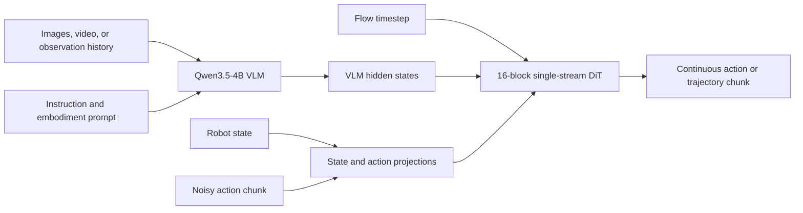
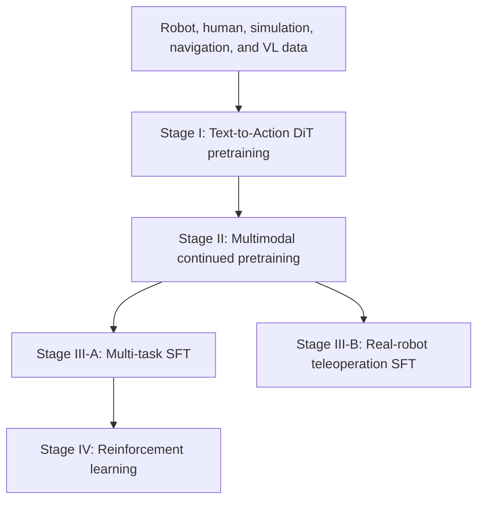
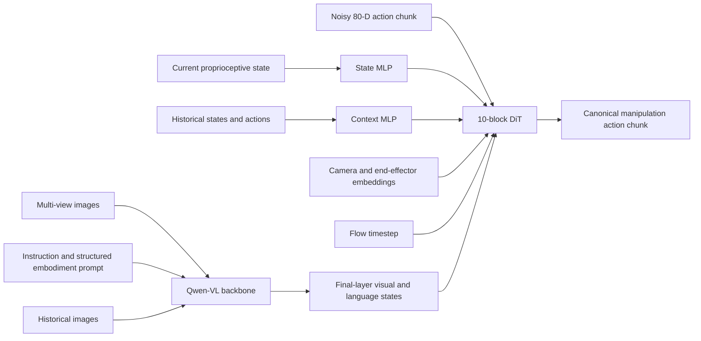
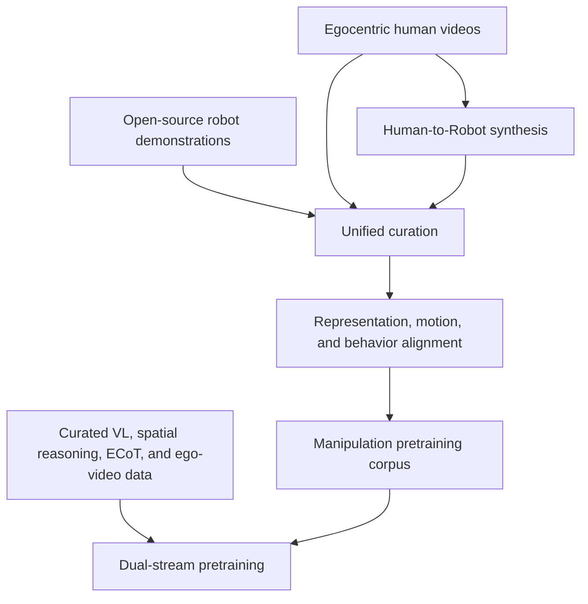
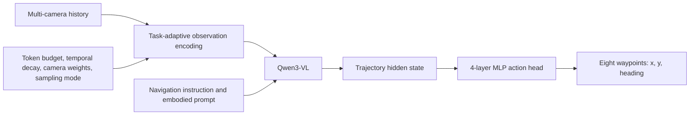
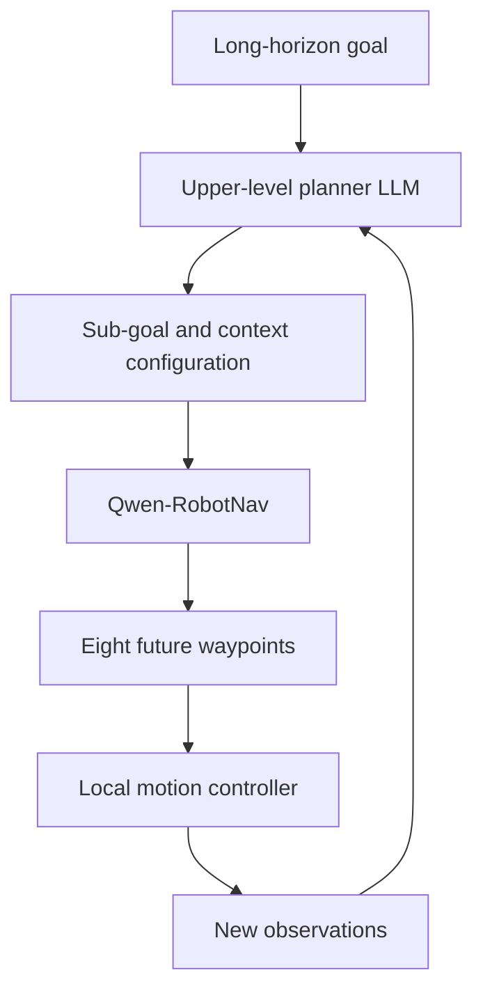
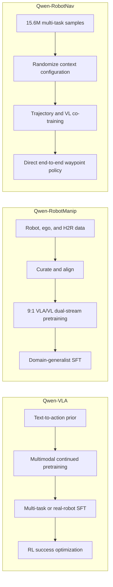

# Qwen Specialized Robot Models: Tasks, Differences from Qwen-VLA, and Training Techniques

## Scope

This report compares the Qwen models that directly produce robot control outputs:

- **Qwen-VLA** — the general-purpose reference model.
- **Qwen-RobotManip** — the manipulation specialist.
- **Qwen-RobotNav** — the navigation specialist.

**Qwen-RobotWorld is excluded** because it predicts future visual states as a world model rather than directly producing robot actions or navigation waypoints.

---

## 1. Executive Summary

Qwen-VLA, Qwen-RobotManip, and Qwen-RobotNav share the idea of reusing a pretrained vision-language model for embodied control, but they optimize for different goals.

| Model | Main task | Policy output | Action head | Main training idea |
|---|---|---|---|---|
| **Qwen-VLA** | General manipulation, navigation, and embodied trajectory prediction | Task-dependent continuous action or trajectory chunks | 16-block, approximately 1.15B-parameter single-stream flow-matching DiT | Progressive curriculum: text-to-action pretraining → multimodal continued pretraining → SFT → RL |
| **Qwen-RobotManip** | Cross-embodiment robot manipulation | Canonical 80-dimensional state/action chunks | 10-block flow-matching DiT with alternating visual/language cross-attention | Align heterogeneous manipulation data first, then scale with robot, human, and synthetic data |
| **Qwen-RobotNav** | Mobile robot and vehicle navigation | Eight future waypoints, each \((x,y,\theta)\) | Lightweight 4-layer MLP | Direct trajectory regression with randomized observation configurations and VL co-training |

The central difference is not simply that the specialist models use narrower datasets. Each specialist redesigns the policy around the structure of its task:

- **RobotManip** keeps a generative DiT policy but introduces stronger cross-robot representation, motion, and behavior alignment.
- **RobotNav** removes diffusion entirely and treats navigation as direct waypoint regression from VLM hidden states.
- **Qwen-VLA** accepts greater task heterogeneity and uses a staged curriculum to teach one decoder multiple kinds of embodied trajectories.

---

## 2. Qwen-VLA: General Embodied Reference Model

### 2.1 Main Tasks

Qwen-VLA is designed to place several embodied prediction problems under one model:

- Single-arm and bimanual manipulation
- End-effector and joint-space robot control
- Vision-language navigation
- Autonomous-driving or agent trajectory prediction
- Human egocentric hand or body trajectory modeling
- Cross-embodiment action prediction

The target is not always the same physical quantity. Depending on the sample, the output may represent:

```text
Manipulation:
[arm joints, end-effector pose, gripper, ...]

Navigation:
[(x1, y1, heading1), ..., (xH, yH, headingH)]

Human motion:
[hand pose, wrist pose, body joints, ...]
```

A task identifier, embodiment description, validity mask, and output convention tell the model which channels and time steps are meaningful.

### 2.2 Baseline Architecture



Important properties:

- The VLM performs visual understanding, language grounding, and high-level reasoning.
- The action expert is a **single-stream DiT**.
- VLM hidden states and noisy action tokens are concatenated into one sequence.
- Joint self-attention allows the action tokens and VLM-derived tokens to interact directly.
- AdaLN provides flow-timestep conditioning.
- Multi-section RoPE keeps positional conventions aligned with the multimodal backbone.
- The action expert contains roughly **1.15B parameters across 16 DiT blocks**.

### 2.3 Embodiment Handling

Qwen-VLA uses a textual embodiment prompt such as:

```yaml
robot: ALOHA
arm_configuration: bimanual
control_mode: end_effector_delta
control_frequency: 20 Hz
prediction_horizon: 16
```

The prompt is the main interface for telling the same model:

- Which robot is acting
- Which control convention is used
- How many action dimensions are active
- How quickly actions are executed
- How far into the future the action chunk extends

Inactive channels and padded time steps are masked in the action loss.

### 2.4 Training Pipeline

Qwen-VLA uses a **progressive, model-centric curriculum**.



#### Stage I: Text-to-Action DiT Pretraining

The VLM is frozen, images are omitted, and only the randomly initialized DiT is trained.

```text
Instruction + embodiment prompt
                ↓
        frozen text pathway
                ↓
             DiT
                ↓
       continuous action chunk
```

The purpose is to teach the action expert:

- The overall shape of action distributions
- How language selects a motion pattern
- How embodiment prompts change motor semantics
- The flow-matching denoising process

This separates action-prior learning from visual grounding. It also prevents noisy gradients from a randomly initialized action expert from immediately damaging the pretrained VLM.

#### Stage II: Continued Pretraining

The VLM and DiT are both unfrozen and trained jointly on a heterogeneous mixture:

- Multi-robot manipulation trajectories
- Egocentric human demonstrations
- Synthetic simulation trajectories
- Navigation and trajectory data
- Spatial grounding and embodied captions
- General vision-language samples

This stage grounds the action prior in visual observations and adapts the VLM to embodied perception.

The general training objective combines action generation and next-token prediction:

$$
\mathcal{L}
=
\lambda_{\text{act}}\mathcal{L}_{\text{act}}
+
\lambda_{\text{VL}}\mathcal{L}_{\text{VL}}
$$

The VL term preserves language grounding, perception, and reasoning during heavy action training.

#### Stage III: Supervised Fine-Tuning

The continued-pretraining checkpoint branches into two tracks:

1. **Multi-task SFT**
   - Manipulation
   - Navigation
   - Spatial grounding
   - VQA and embodied reasoning
   - Task-balanced and embodiment-balanced sampling

2. **Real-robot SFT**
   - High-quality teleoperation demonstrations
   - Deployment-oriented adaptation to physical hardware

#### Stage IV: Reinforcement Learning

The multi-task SFT checkpoint is further optimized using sparse binary success rewards in simulation.

The goal is to optimize properties not captured by imitation loss:

- Closed-loop task completion
- Recovery from small deviations
- Choosing actions that lead to final success rather than only matching demonstrations

### 2.5 Core Training Philosophy

> **Teach the general action generator in stages.**

Qwen-VLA treats the major difficulty as an optimization problem: the VLM is already mature, while the DiT begins randomly initialized. The curriculum gradually teaches action structure, visual grounding, downstream behavior, and finally closed-loop success.

---

## 3. Qwen-RobotManip: Manipulation Specialist

### 3.1 Main Tasks

Qwen-RobotManip focuses on manipulation rather than the full set of embodied tasks.

Target capabilities include:

- Single-arm and bimanual manipulation
- Parallel-gripper and dexterous-hand control
- Pick, place, fold, insert, operate, and rearrange tasks
- Instruction-conditioned manipulation
- Cross-robot transfer
- Robustness to new objects, layouts, backgrounds, and camera poses
- Rapid behavioral adaptation from recent episode history

Unlike Qwen-VLA, it does not need one action decoder to also model navigation waypoints or autonomous-driving trajectories.

### 3.2 Architecture



The action expert contains:

- **10 Transformer blocks**
- Hidden width **768**
- **12 attention heads**
- Self-attention over state and noisy-action tokens
- Cross-attention to the VLM after self-attention
- SwiGLU feed-forward layers
- Alternating cross-attention:
  - Even-indexed blocks attend to visual tokens
  - Odd-indexed blocks attend to language tokens

This differs from Qwen-VLA's larger single-stream DiT, where VLM-derived and action tokens are processed jointly through self-attention.

### 3.3 Canonical 80-Dimensional State and Action Space

RobotManip maps many embodiments into a fixed 80-dimensional template:

```text
Left arm block:  29 dimensions
Right arm block: 29 dimensions
Reserved block:  22 dimensions
Total:            80 dimensions
```

Each 29-dimensional arm block includes:

```text
7  joint-position dimensions
9  end-effector-state dimensions
1  gripper dimension
12 dexterous-hand dimensions
```

The reserved dimensions can represent additional degrees of freedom such as mobile-base motion.

Different robots activate different subsets of this space. Binary masks ensure that only valid dimensions contribute to training.

### 3.4 Three Forms of Cross-Embodiment Alignment

RobotManip's main innovation is not simply a larger manipulation dataset. It makes data from different robots numerically and behaviorally compatible.

#### A. Representation Alignment

All robots are converted into the same 80-D template.

```text
Franka data ─────┐
ALOHA data ──────┼──> canonical 80-D state/action representation
UR data ─────────┤
ARX data ────────┘
```

Per-dimension masks prevent:

- Missing joints from creating fake zero targets
- Single-arm robots from supervising the unused arm
- Dexterous-hand robots from dominating simpler gripper embodiments

#### B. Motion Alignment

End-effector actions are expressed as **camera-frame relative deltas** rather than only robot-base-frame coordinates.

This makes visually similar motions numerically closer:

```text
Robot A: move toward the cup in camera coordinates
Robot B: move toward the cup in camera coordinates
```

Although the two robots may have different base frames and kinematics, the target motion is aligned with what the vision model sees.

Camera positional encoding and learned camera embeddings provide information about viewpoint and camera geometry.

#### C. Behavior Alignment

The policy receives:

- Robot identity
- Execution speed
- FPS
- Camera direction
- Recent observation-state-action chunks

Recent history acts as an implicit description of:

- Kinematics
- Motion speed
- Grasping style
- Controller behavior
- Episode-specific execution dynamics

This enables **in-context policy adaptation** without changing model parameters.

### 3.5 Data Construction Pipeline

RobotManip is more data-centric than Qwen-VLA.



The reported corpus contains approximately **38,100 hours** of manipulation-related data from:

- Real robot demonstrations
- Egocentric human-hand manipulation videos
- Human-to-robot synthesized trajectories

The Human-to-Robot pipeline converts human demonstrations into trajectories for **15 robot platforms**, increasing embodiment diversity without collecting each behavior separately on every robot.

### 3.6 Data Curation

The curation pipeline harmonizes:

- Video timing
- Robot state and action timestamps
- Kinematic validity
- Episode boundaries
- Language annotations
- Camera streams
- Missing or occluded hands
- Invalid action steps

This is crucial because mixed robot data can create contradictory gradients when the same physical behavior is encoded differently.

### 3.7 Pretraining Technique

RobotManip uses **dual-stream co-training**:

```text
Approximately 90% manipulation/VLA data
Approximately 10% vision-language data
```

The two streams use separate sample types:

```text
VLA batch:
vision + language + state + context + action

VLM batch:
vision + language question/answer tokens
```

#### Flow-Matching Objective

For a ground-truth action chunk \(a\), Gaussian noise \(\epsilon\), and sampled time \(t\):

$$
x_t = (1-t)\epsilon + ta
$$

The target velocity is:

$$
v = a-\epsilon
$$

The action expert minimizes:

$$
\mathcal{L}_{FM}
=
\left\|
f_\theta(x_t,t,s,o)-(a-\epsilon)
\right\|_2^2
$$

where \(s\) is robot state and \(o\) is the visual-language observation.

#### Masked Flow-Matching Loss

RobotManip applies three masks:

1. **Slot mask** — active dimensions for the embodiment
2. **Step-validity mask** — valid, non-anomalous trajectory steps
3. **Human-hand validity mask** — removes supervision after a hand leaves the camera view

The loss is normalized per sample over valid entries so that robots with more active dimensions do not automatically produce larger gradients.

#### VLM Preservation Loss

Vision-language samples use standard autoregressive next-token prediction:

$$
\mathcal{L}
=
\mathcal{L}_{FM}
+
\lambda\mathcal{L}_{VLM}
$$

The report uses \(\lambda=0.1\), making the VL objective a regularizer that preserves perception and language capability without dominating action learning.

#### Repeated Noise Sampling

For one action chunk, the action expert draws multiple independent noise and timestep samples. The reported setup repeats the diffusion training calculation eight times while reusing the expensive VLM representation.

This improves action-expert training efficiency without requiring eight separate visual forward passes.

### 3.8 Stochastic Context Sampling

Always providing the immediately preceding action chunk can cause a shortcut: the model may copy the latest action instead of learning the robot's broader behavior.

During training, RobotManip samples historical context from random positions in the same episode.

```text
Naive context:
[t-3, t-2, t-1] → predict t

Stochastic context:
[random earlier chunks] → predict t
```

This forces the model to infer stable behavioral characteristics instead of exploiting temporal proximity.

At deployment, a normal rolling recent-history window can be used.

### 3.9 Post-Training

RobotManip uses domain-specific **generalist SFT**:

- All demonstrations for a target benchmark or deployment domain are combined
- One fine-tuned policy handles all tasks in that domain
- The default SFT objective is flow matching only
- Image color jitter is applied
- Optional mixed post-training can retain VL data and auxiliary pretraining VLA data to reduce domain overfitting

No dedicated reinforcement-learning stage is reported as the main pipeline.

### 3.10 How RobotManip Differs from Qwen-VLA

| Aspect | Qwen-VLA | Qwen-RobotManip |
|---|---|---|
| Scope | Manipulation, navigation, human and agent trajectories | Manipulation only |
| DiT structure | Large 16-block single-stream DiT | Smaller 10-block DiT with alternating cross-attention |
| Action representation | General task-dependent padded action/trajectory space | Explicit 80-D canonical manipulation template |
| Main cross-robot mechanism | Textual embodiment prompt and validity masks | Representation, camera-frame motion, and behavioral alignment |
| History | General observation history may be used | Explicit observation-state-action context for in-context adaptation |
| Data strategy | Broad heterogeneous embodied mixture | Deeply curated manipulation-only mixture |
| Synthetic scaling | Simulation and human data within broad mixture | Dedicated human-to-robot conversion across 15 platforms |
| Pretraining schedule | T2A → CPT → SFT → RL | Dual-stream aligned pretraining → domain-generalist SFT |
| RL | Included | Not a central reported stage |
| Main design philosophy | Build a universal action generator progressively | Align heterogeneous manipulation data, then scale it |

### 3.11 Core Training Philosophy

> **Alignment first, then scale.**

RobotManip treats inconsistent robot representations as the main bottleneck. The training pipeline is built around making different robots supervise a common physical concept before increasing data volume.

---

## 4. Qwen-RobotNav: Navigation Specialist

### 4.1 Main Tasks

Qwen-RobotNav supports five navigation task families:

- Vision-language instruction following
- Point-goal navigation
- Object search
- Target tracking
- Autonomous driving

It can also serve as a reactive navigation executor beneath a higher-level LLM planner.

### 4.2 Architecture



The model outputs:

$$
W=\{(x_k,y_k,\theta_k)\}_{k=1}^{8}
$$

This is a 24-dimensional direct regression target.

Unlike Qwen-VLA and RobotManip:

- There is no diffusion process.
- There is no noisy action sequence.
- There is no Euler denoising loop.
- The model does not directly output wheel torques or joint commands.
- A lower-level controller converts waypoints into physical motion.

### 4.3 Task-Adaptive Observation Encoding

Navigation history can grow indefinitely, so the model cannot preserve every frame at full resolution.

RobotNav exposes configurable observation parameters:

- Total visual-token budget \(B\)
- Temporal-decay coefficient \(\gamma\)
- Per-camera weights \(w_c\)
- Minimum and maximum allocation per frame
- Frame sampling mode
- Task mode

These controls determine:

- Which time steps are retained
- Which cameras receive more tokens
- Which frames are encoded at higher resolution
- Whether recent observations or broad episode coverage are prioritized

Example:

```text
Target tracking:
- high resolution
- short recent window
- strong front-camera weight

Object search:
- longer history
- broader temporal coverage
- more balanced camera allocation
```

Camera identity and time order are communicated with natural-language tags rather than new architectural modules.

### 4.4 Hierarchical Agent Interface

For long-horizon tasks, an upper-level planner can issue:

- Sub-goal instruction
- Navigation task mode
- Token budget
- Camera weights
- History strategy
- Sampling mode



RobotNav is therefore designed as a configurable navigation module rather than a complete general embodied policy.

### 4.5 Training Data

The reported training set contains approximately **15.6 million samples**:

```text
85% navigation trajectory-planning data
15% navigation-related vision-language reasoning data
```

The trajectory data spans all five task families and multiple embodiments.

The VL portion preserves:

- Natural-language understanding
- Open-world perception
- Spatial reasoning
- Interpretation of camera and temporal tags
- Generalization to unseen instructions and environments

### 4.6 Training Objective

RobotNav uses a composite loss:

$$
\mathcal{L}
=
\mathcal{L}_{traj}
+
\lambda\mathcal{L}_{VL}
$$

where:

$$
\mathcal{L}_{traj}
=
\left\|
W-\hat{W}
\right\|_2^2
$$

is waypoint MSE, and \(\mathcal{L}_{VL}\) is next-token prediction on navigation-related reasoning samples.

The reported value is:

$$
\lambda=1.0
$$

Unlike flow matching, this is deterministic direct regression: one forward pass predicts all eight waypoints.

### 4.7 Configuration Randomization

No observation configuration remains fixed during training.

For every sample, the model randomizes:

- Token budget
- Temporal decay
- Per-camera weights
- Per-frame allocation bounds
- Random-history versus latest-frame sampling

This prevents the network from overfitting to one camera layout or one context strategy.

The resulting policy can switch observation strategies at inference without architecture changes or task-specific retraining.

### 4.8 Multi-Task Co-Training

Datasets are sampled using a registry with per-dataset rates so that all navigation families remain represented.

The training procedure prevents one large task family, such as autonomous driving, from overwhelming smaller navigation tasks.

Co-training with VL samples is important because trajectory-only training tends to make the model behave like a reactive sequence mapper and erode its pretrained spatial and language reasoning.

### 4.9 End-to-End Fine-Tuning

RobotNav is initialized from Qwen3-VL and fine-tuned end-to-end:

- Vision encoder is trainable
- Language backbone is trainable
- MLP action head is trainable
- The action head uses a larger learning rate than the pretrained backbone
- AdamW, warm-up, cosine decay, and gradient clipping are used

Reported example settings include:

```text
Backbone peak learning rate: 2 × 10^-5
Action-head peak learning rate: 1 × 10^-4
Warm-up: first 3% of steps
Gradient clipping: 1.0
```

### 4.10 How RobotNav Differs from Qwen-VLA

| Aspect | Qwen-VLA | Qwen-RobotNav |
|---|---|---|
| Scope | General embodied action and trajectory generation | Navigation only |
| Backbone | Qwen3.5-4B | Qwen3-VL family, evaluated from 2B to 8B |
| Policy head | Large flow-matching DiT | Lightweight 4-layer MLP |
| Output | Variable task-specific action chunk | Fixed eight-waypoint trajectory |
| Generation | Iterative flow integration | Single-pass regression |
| Robot state | Can be directly included in action modeling | Primarily visual history, prompt, and navigation context |
| Embodiment interface | Robot/control description plus action masks | Prompt tags and configurable observation encoding |
| History handling | General multimodal context | Explicit token-budgeted temporal and multi-camera allocation |
| Training schedule | Four-stage curriculum including RL | Single end-to-end multi-task fine-tuning pipeline |
| Action loss | Flow-matching velocity prediction | Waypoint MSE |
| Main robustness technique | Broad co-pretraining and progressive stages | Randomization of observation configurations |
| Agent integration | General policy | Designed as a reactive module under an upper planner |

### 4.11 Core Training Philosophy

> **Keep the action head simple and train the VLM to become the navigator.**

RobotNav assumes that navigation planning can be represented compactly as future waypoints. Most spatial reasoning remains inside the pretrained VLM, while the small MLP only translates its hidden state into coordinates.

---

## 5. Direct Comparison of Training Pipelines



### 5.1 What Each Pipeline Treats as the Main Problem

| Model | Main training problem | Solution |
|---|---|---|
| **Qwen-VLA** | Randomly initialized action expert is unstable beside a mature VLM | Train capabilities progressively |
| **RobotManip** | Different robot datasets encode equivalent motions incompatibly | Align representation, motion, and behavior before scaling |
| **RobotNav** | Navigation tasks require different visual-history strategies | Randomize and expose the context-control interface during training |

### 5.2 Data-Centric Versus Model-Centric Training

- **Qwen-VLA is model-centric.** The central contribution is the order in which capabilities are introduced.
- **RobotManip is data-centric.** The central contribution is converting heterogeneous robot and human data into consistent supervision.
- **RobotNav is interface-centric.** The central contribution is training one model under many observation and task configurations so an external planner can reconfigure it at runtime.

### 5.3 Why the Same Training Pipeline Would Not Suit All Three

#### Applying Qwen-VLA's full pipeline to RobotNav

A large DiT and text-to-action stage would be unnecessary for a small, fixed waypoint output. Direct MSE is simpler and faster.

#### Applying RobotNav's direct regression to RobotManip

Manipulation actions are higher-dimensional, multimodal, and more sensitive to precise temporal coordination. A single deterministic MSE output can average incompatible valid actions, while flow matching can model multiple plausible action trajectories.

#### Applying RobotManip's 80-D representation to all Qwen-VLA tasks

The 80-D template is specifically organized around robot arms, end effectors, grippers, and hands. It cannot naturally represent every navigation, driving, or human body trajectory without extending or redefining the template.

---

## 6. Which Model Fits Which Use Case?

### Use Qwen-VLA when:

- One model must cover multiple embodied task families
- Manipulation and navigation should share a backbone and policy interface
- Broad transfer is more important than maximum specialization
- A staged pretraining and post-training pipeline is feasible
- Simulation RL is available for closed-loop refinement

### Use Qwen-RobotManip when:

- The target is precise robot manipulation
- Training data comes from many robot morphologies
- Camera frames and control conventions differ across datasets
- Human egocentric demonstrations should be converted into robot supervision
- Cross-embodiment transfer and out-of-distribution manipulation are priorities
- Iterative flow-matching inference is acceptable

### Use Qwen-RobotNav when:

- The system needs mobile navigation or autonomous-driving trajectories
- The desired output is a short waypoint sequence
- Low-latency single-pass prediction is important
- Multi-camera and long-history inputs must fit a fixed token budget
- An upper-level LLM planner will decompose long-horizon goals
- The local controller can translate waypoints into actuator commands

---

## 7. Final Conclusions

The specialist models are not merely smaller versions of Qwen-VLA trained on narrower data.

### Qwen-VLA

Creates a **general action-and-trajectory foundation model**. Its training pipeline progressively develops:

1. A language-conditioned action prior
2. Visual action grounding
3. Task-specific behavior
4. Closed-loop task success

### Qwen-RobotManip

Creates a **cross-embodiment manipulation foundation model**. Its pipeline emphasizes:

1. Canonical state/action representation
2. Camera-aligned motion targets
3. Behavioral alignment through prompts and history
4. Human-to-robot data synthesis
5. Masked flow-matching and VL co-training
6. Generalist domain SFT

### Qwen-RobotNav

Creates a **configurable navigation executor**. Its pipeline emphasizes:

1. Fixed waypoint regression
2. Task-adaptive visual-history allocation
3. Observation-configuration randomization
4. Navigation/VL multi-task co-training
5. End-to-end adaptation of the Qwen3-VL backbone

The clearest conceptual summary is:

```text
Qwen-VLA:
Progressively train one model to generate many kinds of embodied actions.

Qwen-RobotManip:
Make heterogeneous manipulation data physically consistent, then scale it.

Qwen-RobotNav:
Make observation strategy configurable, then directly regress navigation waypoints.
```

---

## 8. Primary Sources

1. **Qwen-VLA: A Vision-Language-Action Model for General Embodied Intelligence**  
   Technical report, arXiv:2605.30280.

2. **Qwen-RobotManip Technical Report: Alignment Unlocks Scale for Robotic Manipulation Foundation Models**  
   Technical report, arXiv:2606.17846.

3. **Qwen-RobotNav Technical Report: A Scalable Navigation Model Designed for an Agentic Navigation System**  
   Technical report, arXiv:2606.18112.
