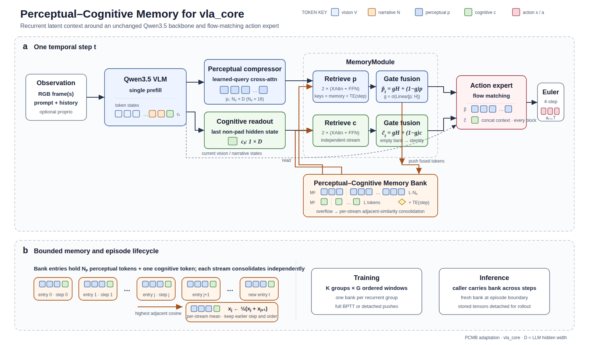

# 🗓️ Báo cáo tuần 10–14/08/2026

<aside>
📌

**Thời gian:** 10/08/2026–14/08/2026
**Phạm vi:** Long-horizon VLA pretraining, memory-based VLA, paper evaluation và chuyển sang implementation.
**Theo dõi tiến độ:** [VLA Research Paper Tracker](https://app.notion.com/p/e6fe219965064b1c9707012dbefcb2bc?pvs=21)

</aside>

# 1. Nhật ký công việc theo ngày

| Ngày | Công việc | Kết quả |
| --- | --- | --- |
| **10/08** | Đọc sâu ReMem-VLA; phân tích memory architecture, long-horizon mechanism và training pipeline. | Xác định ReMem-VLA là candidate đáng chú ý cho implimetation cho long-horizon vào vla-core và làm rõ cách memory được đưa vào model. |
| **11/08** | Đánh giá sâu ReMem-VLA và mở rộng search sang NativeMEM, ChainVLA, EventVLA. | Kết luận ReMem-VLA và các paper mới khác được mở rộng **không phù hợp tốt với pipeline pretraining custom VLA** và credibility chưa đủ thuyết phục. Các hướng mới cũng chủ yếu phù hợp với memory/fine-tuning hơn là mục tiêu pretraining. |
| **12/08** | Đánh giá các hướng cũ và ổn định hơn: MemoryVLA, HAMLET, Long-VLA. | MemoryVLA nổi lên là hướng **phù hợp nhất với project** và có tiềm năng làm foundation cho implementation. |
| **13/08** | Chuyển từ paper survey sang implementation planning; đề xuất MemoryVLA làm main implementation.  | Thiết lập hướng implementation chính dựa trên MemoryVLA; Adapt các memory module chính vào vla-core và chạy smoke test |
| **14/08** | Tiếp tục implementation và chuẩn bị development environment/server workflow; Đồng thời explore spatial-awareness directions như DepthVLA và SpatialVLA | Memory module version 1 được hoàn thiện, thực hiện xây dựng luồng data sampling phù hợp với cấu trúc memory mới của vVa-core. Spatial awareness là hướng tiếp theo được nghiên cứu để thực hiện implimetation. |

# 2. Tóm tắt kết quả

- Hoàn thành một vòng đánh giá sâu từ **ReMem-VLA → NativeMEM / ChainVLA / EventVLA → MemoryVLA / HAMLET / Long-VLA** để tìm foundation phù hợp cho long-horizon VLA; **ReMem-VLA bị loại khỏi hướng chính** vì không fit tốt với mục tiêu **pretraining-time long-horizon capability** và credibility chưa đủ mạnh.
- **MemoryVLA được chọn làm main implementation direction** và đã được tích hợp vào `vla_core`: dual-stream perceptual/cognitive memory, grouped episodic sampling, recurrent memory-aware action path và episodic evaluation đã chạy được.
    - Sampling audit đạt các gate về group purity/order; G=4 full-BPTT train được và DDP smoke/checkpoint round-trip pass.
    - Memory module thêm ~60.9M params (+5.6%), trong khi giới hạn hiện tại là VRAM của Qwen prefill/narrative CE;
    - G=8/G=16 cần GPU lớn hơn *(~56 VRAM cho G=16 để giống theo implimentation của paper)*. Chi tiết implementation: [MemoryVLA Integration Report](https://github.com/VietnamRobotics/vla_core/blob/feature/memoryvla/docs/memory_module/memoryvla_integration.md).

# 3. Insight chính

- Các paper nổi bật gần đây thường tập trung vào việc xây dựng **memory token / memory representation** rồi fine-tune VLA để sử dụng memory, như **NativeMEM và ChainVLA**, hoặc dùng các cơ chế bổ sung khác để xử lý long-horizon. Các hướng này có giá trị về memory mechanism, nhưng chưa trực tiếp focus vào việc **handle long-horizon ngay từ foundation pretraining model,** do đó chưa thể trực tiếp impliment vào vla-core
- **Long-horizon capability không nên được xem như một memory module độc lập.** Đây là capability cần được xem xét cùng data construction, temporal context, training objective và action generation.
- **Spatial awareness là một orthogonal capability quan trọng.** DepthVLA và SpatialVLA mở ra hướng bổ sung geometric/depth information thay vì cố giải quyết toàn bộ limitation bằng memory.

# 4. Công việc và finding kỹ thuật

## 4.1. ReMem-VLA — deep inspection và loại khỏi hướng chính

- **Core idea:** ReMem-VLA dùng **dual-level recurrent memory queries** (frame-level + chunk-level) với EMA để giữ short/long-term history, kết hợp **Past Observation Prediction (POP)** để tăng khả năng retention của visual information. Đây là điểm đáng tham khảo về multi-scale memory nhưng vẫn là một **memory augmentation approach** được xây dựng quanh training pipeline chuyên biệt.
- **Conclusion:** Approach không fit tốt với mục tiêu của project là **handle long-horizon ngay từ foundation pretraining**, vì cần thêm recurrent memory state, EMA update schedule, POP objective và temporal chunking assumptions. Paper hiện cũng là **preprint**, nên sau khi cân nhắc technical fit và credibility, giữ làm reference thay vì implementation foundation. [Report ReMem-VLA](https://app.notion.com/p/ReMem-VLA-Empowering-Vision-Language-Action-Model-with-Memory-via-Dual-Level-Recurrent-Queries-3b3fb0e63a018188ac33db5b3a2d0dbd?pvs=21)

## 4.2. MemoryVLA — main implementation direction

- **Decision & adaptation:** Chọn MemoryVLA làm foundation và đã tích hợp PCMB vào `vla_core`, giữ **Qwen3.5-0.8B** backbone cùng flow-matching action head. Implementation dùng dual-stream perceptual/cognitive memory, grouped episodic sampler với **G=16** theo paper, full BPTT trong group, và memory được đưa vào các block action head hiện có thay vì thêm sublayer mới. [MemoryVLA Integration Report](https://github.com/VietnamRobotics/vla_core/blob/feature/memoryvla/docs/memoryvla_integration.md)

- **Current measured result:** Integration path đã chạy end-to-end: sampling audit pass về clip purity/order, **G=4 full-BPTT overfit train** và DDP smoke/checkpoint round-trip pass, episodic evaluation đã carry bank đúng theo clip. Memory module thêm **60.9M params (+5.6%)**.
- Bottleneck hiện tại là VRAM từ Qwen prefill + narrative CE: G=8/G=16 OOM trên 31.3 GB, nên pretraining đầy đủ với G=16 cần GPU class A100/H100 hoặc memory-saving changes. Sampling audit cũng cho thấy G=16 ở stride 2s chỉ dùng **12.8% clips ≥32s**, tạo distribution shift cần đánh giá trước real pretraining. [MemoryVLA Integration Report](https://github.com/VietnamRobotics/vla_core/blob/feature/memoryvla/docs/memoryvla_integration.md)
- **Sampling concern:** Grouping theo **consecutive/incrementing timesteps với G=16** hiện đang ép mỗi training group phải tích lũy memory gần như xuyên suốt một episode/window dài. Điều này chưa chắc tạo ra đúng capability **long-horizon abstraction** mà project cần; model có thể đang học cách duy trì một episode-local history bank thay vì học cách dùng memory để giải quyết quan hệ dài hạn giữa các trạng thái/task phases. Cần nghiên cứu alternative sampling trước real pretraining. Hai hướng cần thử:
    - **(1) Random history sampling** — trong mỗi batch chọn một lượng frame rải trong cùng episode để xây history bank nhưng không yêu cầu toàn bộ group phải consecutive; Đây là cách MemoryVLA tổ chức data trên **LIBERO**
    - **(2) Continuous episode packing** — batch chạy tuần tự theo episode, khi một episode kết thúc thì tiếp tục bằng episode kế tiếp trong cùng batch/budget, thay vì yêu cầu một group cố định thuộc một episode duy nhất. Đây là cách MemoryVLA tổ chức data trên **SimplerEnv**

## 4.3. Spatial awareness — DepthVLA và SpatialVLA

- **DepthVLA:** Giải quyết hạn chế spatial reasoning bằng cách thêm một **pretrained depth prediction module** vào VLA theo kiến trúc mixture-of-transformers, trong đó VLM, depth transformer và action expert dùng shared attention. Điểm đáng chú ý với project là depth được đưa vào model như một nguồn spatial signal explicit, thay vì chỉ để VLM tự suy ra 3D geometry từ RGB.
- **SpatialVLA:** Tập trung thiết kế **spatial representation cho robot foundation model**, với **Ego3D Position Encoding** để inject 3D information vào observation và **Adaptive Action Grids** để biểu diễn spatial actions. Model được pretrain trên **1.1M real-world robot episodes**, hỗ trợ zero-shot generalization và adaptation sang robot setup mới; project cũng có open-source implementation và được accept tại RSS 2025.
- **Relevance:** DepthVLA phù hợp hơn nếu muốn bổ sung một **explicit depth/geometric feature stream**, trong khi SpatialVLA phù hợp hơn với mục tiêu xây dựng **spatial-aware foundation representation**. Cả hai vẫn là exploration/implementation candidates; chưa thay thế MemoryVLA làm foundation chính.

# 5. Next step

- Nghiên cứu **data sampling strategy phù hợp nhất cho memory training**, đặc biệt với dữ liệu hoàn toàn egocentric từ **EgoDex và EgoVerse**; ưu tiên cách sampling vẫn giữ được diversity nhưng cung cấp đủ temporal context cho memory.
- Thực hiện **training experiment và benchmark đơn giản** trong giới hạn tài nguyên hiện tại để kiểm tra liệu MemoryVLA integration có thực sự cải thiện performance trên **long-horizon tasks** so với baseline stateless.
- Tiếp tục nghiên cứu **spatial awareness**, tìm các paper phù hợp với custom VLA và đánh giá hướng nào có thể implement thực tế trên `vla_core`.