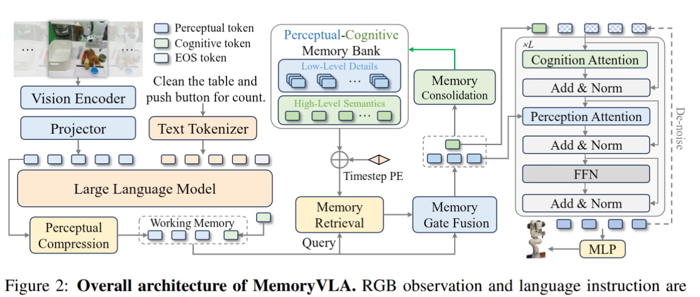

# Report_18-21_08_2026

*Đây cũng là báo cáo tổng hợp của tuần **18–21/08/2026**, bao gồm chi tiết MemoryVLA implimentation trong vla_core, và các training của vla_core trên LIBERO*

# 0. Phân tích bài báo — Vì sao cần điều chỉnh

## 0.1 Phát hiện 1 — Sự không tương thích về kiến trúc

MemoryVLA được xây dựng trên **Prismatic-7B**: một **ViT *riêng biệt* (SigLIP + DINOv2) và LLM (Llama 7B)**, cộng với một **expert diffusion DDIM**. Các điểm gắn (memory taps) của nó phụ thuộc vào sự tách biệt đó — token perceptual lấy từ ViT độc lập, việc chèn (injection) được thực hiện qua các sublayer chuyên biệt trong expert diffusion.

**Qwen3.5-0.8B** của vla-core là một **VLM hợp nhất** với một **đầu flow-matching**, nên không tồn tại các điểm gắn đó. Ta không thể bóc tách ra từng phần ViT và LM của một VLM, nên cần có cách riêng cô lập các token đó.

Và nếu sử dụng cách impliment của paper hiện tại sẽ bị mất đi các multimodular hidden state đáng giá mà VLM đã được pretrain trong module Memory Gate Fusion, nên cần cách giữ được hidden state của VLM làm input của Action Head chung với Memory Token. 



## 0.2 Phát hiện 2 — Memory Bank phá vỡ cách lấy mẫu tiêu chuẩn

Việc huấn luyện VLA tiêu chuẩn **xáo trộn (shuffle)** các cửa sổ (window) độc lập giữa các episode — điều này ổn với mô hình **không trạng thái (stateless)**.

Một ngân hàng bộ nhớ khiến lượt truyền tiến (forward pass) trở thành có **trạng thái (stateful):** việc truy xuất tại bước *t* đòi hỏi một ngân hàng được xây dựng từ ***các bước trước đó của cùng một episode*.**

Bài báo xác nhận việc lấy mẫu là đặc thù cho bộ nhớ: ngẫu nhiên trong cùng episode đối với **LIBERO/MIKASA-Robo**, liên tục (continuous) đối với **SimplerEnv**. 

## 0.3 Phát hiện 3 — Dữ liệu robot so với dữ liệu con người

Tất cả các bộ dữ liệu trong bài báo đều là **dữ liệu robot với các episode ngắn**, đồng nhất (**LIBERO ~130–156 bước, MIKASA ~72, SimplerEnv ~119)**; các cài đặt của nó **(L=16, ~0.3 giây/lần đẩy)** phù hợp với chế độ đó.

Kho ngữ liệu hiện tại là dữ liệu góc nhìn thứ nhất **(egocentric)** của con người và mang tính lưỡng phân (bimodal): egodex có median **5.4 giây** so với egoverse có median **77.7 giây**

Vì tầm với của bộ nhớ **(memory reach) ≈ L/Hz**, điểm vận hành của bài báo vượt quá nhu cầu của egodex và bị truncate đối với egoverse *(L=16 bao phủ 97.5% egodex nhưng chỉ 24.3% egoverse)*. Bộ ba `(G, L, Hz)` cần được điều chỉnh lại cho phù hợp với từng Dataset thông qua EDA và benchmark

# 1. Các mục tiêu chính

1. **Adapt MemoryVLA vào vla-core**
2. **Đo lường tài nguyên bổ sung và kiểm chứng phần triển khai**
    - Định lượng phần chi phí phát sinh (overhead) về tham số, VRAM, thông lượng (throughput), và dung lượng checkpoint/lưu trữ do bộ nhớ gây ra.
    - Chạy smoke test và profiling tài nguyên để tách riêng chi phí bộ nhớ khỏi chi phí của pipeline nền tảng (baseline).
3. **Phát triển bộ lấy mẫu dữ liệu huấn luyện nhận biết bộ nhớ (memory-aware)**
4. **Tinh chỉnh điểm vận hành bộ nhớ `(G, L, Hz)`**
    - Tìm tổ hợp tốt nhất giữa độ dài nhóm BPTT `G`, độ dài bộ nhớ `L`, và tần suất lấy mẫu `Hz` cho kho ngữ liệu thực tế.

# 2. Mục tiêu 1 — Tích hợp MemoryVLA

## 2.1 Thiết kế tích hợp

Trên mỗi bước thời gian bên trong một nhóm:


```
Qwen3.5 (one prefill over the whole flat batch, narrative LM loss as today)
  └─ extract_hidden_states → vision_hs (B,25,N_vis,D), narrative_hs (B,25,N_nar,D)
       [detach]                              D = 1024
  per group k, step t = 0..G-1:
    p  = PerceptualCompressor(vision_hs[:, -1])        # (K,16,D) learned-query pool
    c  = hs_last[:, last_non_pad]                      # (K, 1,D)
    H^p,H^c = MemoryRetrieval(p, c, bank)              # 2×(cross-attn+FFN), keys+TE(t_i)
    p̃,c̃  = GateFusion(p,H^p), GateFusion(c,H^c)       # σ-gated blend, identity at t=0
    bank.push(p̃, c̃, t)                                # adjacent-merge when len > 16
    v̂  = ActionHead(x_t, t_flow, vision_hs, narrative_hs, mem_p=p̃, mem_c=c̃)
         # per block: self+adapter shared softmax | gated vision softmax |
         #            gated MEMORY softmax over [p̃; c̃]   (Option B stream)
    loss_t = flow MSE
action_loss = mean_t loss_t ;  total = action_loss + 0.1·narrative_loss
```

## 2.2 Chèn bộ nhớ vào đầu hành động

Mỗi khối trong số 24 `CrossAttentionBlock` đã có sẵn các luồng self, adapter, và gated-vision. Bộ nhớ được thêm vào như **luồng độc lập thứ tư**:


```
k_mem = [k_task(p̃) ; k_adapter(c̃)]
out  += tanh(mem_gating_factor) · softmax(q·k_memᵀ/√d) · v_mem
```

- Softmax riêng giúp ngăn các token bộ nhớ bị lấn át bởi ngữ cảnh thị giác/tường thuật (narrative) lớn hơn.
- Việc khởi tạo gate giữ bộ nhớ ở trạng thái đóng ban đầu, bảo toàn hành vi không-có-bộ-nhớ và khả năng nạp checkpoint cũ.
- Điều này khác với cách chèn tuần tự nhận thức→tri giác của bài báo; cách triển khai hiện tại coi bộ nhớ là bổ trợ cho ngữ cảnh đầu hành động sẵn có.
- **Chẩn đoán:** giá trị `tanh(mem_gating_factor)` phẳng và gần bằng không cho thấy bộ nhớ không được sử dụng.

# 3. Mục tiêu 2 — Chi phí tài nguyên & Kiểm chứng Smoke Test

## 3.1 Chi phí phát sinh về tham số

| Thành phần | Số tham số |
| --- | --- |
| Mô hình nền tảng (Baseline) | 1.093B |
| Mô hình đầy đủ có bộ nhớ | 1.154B (+5.6%) |
| Module bộ nhớ | 60.9M |
| Truy xuất bộ nhớ | 50.4M |
| Bộ nén tri giác (Perceptual compressor) | 4.2M |
| Các gate | 4.2M |
| Mã hóa vị trí theo thời gian (Timestep PE) | 2.1M |
| Luồng bộ nhớ ở đầu (Head memory stream) | 24 số vô hướng (scalar) |
| Tham số thực sự thay đổi dưới cờ mặc định | ~300.9M, gồm LoRA 10.8M + head 229.2M + bộ nhớ 60.9M + 2 hàng embedding |

Chi phí tham số chiếm ưu thế của module bộ nhớ nằm ở hai khối truy xuất (retrieval). Đây do đó là mục tiêu đầu tiên để giảm tham số nếu cần thiết.

## 3.2 Kết quả smoke test

Môi trường: **2× RTX 5090, 31.3 GiB**.

- **Kiểm tra overfit:** `G=4`, `overfit 4`, 80 bước. Action loss giảm từ 1.41 → 0.30; narrative loss giảm từ 3.09 → 0.000; ~3.0 mẫu/giây. Đường dẫn bộ nhớ hồi quy huấn luyện đúng.
- **Smoke test DDP:** 2 rank, `G=2`, tích lũy (accumulation) 2. Các loss vẫn đồng bộ; không có hiện tượng treo tập thể (collective hang); checkpoint rank-0 (~6.4 GB) nạp được vào đánh giá episodic.
- **Kiểm thử (Tests):** 9 test bộ nhớ + các test sampler đều pass. Còn một lỗi không liên quan tồn tại từ trước trong `test_targets.py`.

## 3.3 Chi phí VRAM

Được đo với `K=1` và BPTT đầy đủ:

**VRAM đỉnh ≈ 8.6 + 2.71·G GiB**

| G | VRAM đỉnh |
| --- | --- |
| 1 | 11.2 GiB |
| 2 | 14.2 GiB |
| 3 | 16.8 GiB |
| 4 | 19.3 GiB |
| 8* | 30.3 GiB |
| 16* | 52.0 GiB |

`G=4` hiện có thể huấn luyện được. `G=8/16` bị tràn bộ nhớ (OOM) trên hộp máy 31.3 GiB, nhưng giới hạn tương tự cũng xuất hiện ở baseline không có bộ nhớ, nên đây là giới hạn về năng lực phần cứng chứ không phải sự thoái hóa (regression) do bộ nhớ gây ra.

Phân rã độ dốc VRAM: đồ thị autograd của backbone **78%**, logit CE của narrative **13%**, đầu hành động **7%**, tính hồi quy của bộ nhớ **2% (~0.4 GiB)**.

**Kết luận về tài nguyên:** bản thân tính hồi quy của bộ nhớ chỉ chiếm một phần nhỏ trong mức tăng VRAM; việc tăng `G` chủ yếu tốn kém là do đồ thị autograd của backbone.

# 4. Mục tiêu 3 — Lấy mẫu dữ liệu nhận biết bộ nhớ (Memory-Aware)

Hai chiến lược lấy mẫu nhận biết episode hiện đang được triển khai trong `vla-core`. Cả hai đều bảo toàn danh tính episode, nhưng tối ưu hóa các khía cạnh khác nhau của việc huấn luyện dài hạn.

## 4.1 Lấy mẫu ngẫu nhiên trong cùng episode


Lấy mẫu `G` cửa sổ từ **cùng một episode tại các vị trí thời gian ngẫu nhiên**, sau đó sắp xếp theo trình tự thời gian trước khi xử lý hồi quy. Cách này loại bỏ ràng buộc khoảng-cách-cố-định trước đây trong khi vẫn giữ ngân hàng bộ nhớ được sắp thứ tự theo thời gian.

**Cơ sở từ bài báo:** Lấy mẫu ngẫu nhiên được dùng với các bộ dữ liệu như **LIBERO** và **MIKASA-Robo** trong bài báo.

**Ưu điểm:** đa dạng hơn về khoảng cách thời gian; ít thiên lệch (bias) về một mẫu khoảng-cách cố định; giúp mô hình thích ứng cả **short-term và long-term memory** mà không cần tăng `G`.

**Nhược điểm:** các khung hình được lấy mẫu thưa thớt và bất quy tắc, nên các sự kiện liên tiếp có thể bị thiếu; và với method sử dụng random sampling, có thể một số frame, step, sự kiện quan trọng bị bỏ sót trong quá trình training. 

## 4.2 Lấy mẫu episode liên tục


Xử lý một episode **tuần tự qua các nhóm**: mỗi nhóm mới tiếp nối từ vị trí thời gian trước đó, và khi một episode kết thúc, bộ lấy mẫu chuyển sang episode kế tiếp trong khi đặt lại (reset) trạng thái bộ nhớ. Cách này tạo ra một luồng cuộn (rolling stream) các nhóm huấn luyện thay vì lấy lại mẫu vị trí một cách độc lập.

**Cơ sở từ bài báo:** Lấy mẫu liên tục/có thứ tự được bài báo dùng cho các bộ dữ liệu như **SimplerEnv-Bridge, SimplerEnv-Fractal**.

**Ưu điểm:** Mô phỏng đúng tính chất của Memory bank; huấn luyện trực tiếp ngân hàng bộ nhớ trên việc tích lũy lịch sử qua nhiều nhóm;

**Nhược điểm:** ít đa dạng về thời gian hơn so với lấy mẫu ngẫu nhiên, có thể khiến overfit/bias với các clip dài hơn; thành phần batch phụ thuộc nhiều hơn vào độ dài episode và đòi hỏi xử lý cẩn thận ranh giới episode.

## 4.3 Reference dataset paper sử dụng

| Bộ dữ liệu | Độ dài episode/hành động trung bình | Median | Min–Max | Cách lấy mẫu trong MemoryVLA |
| --- | --- | --- | --- | --- |
| **LIBERO-Spatial/Object/Goal** | **130 bước** | 131 | 75–270 | Ngẫu nhiên trong episode |
| **LIBERO-10/90** | **156 bước** | 144 | 58–505 | Ngẫu nhiên trong episode |
| **MIKASA-Robo** | **72 bước** | 60 | 60–90 | Ngẫu nhiên trong episode |
| **SimplerEnv-Bridge / Fractal** | **119 bước** | 117 | 80–200 | Liên tục/có thứ tự |

| Dataset / Benchmark | Avg. Duration | Median | Min–Max | Hz |
| --- | --- | --- | --- | --- |
| **LIBERO-Spatial / Object / Goal** | **6.50 s** | 6.55 s | 3.75–13.50 s | 20 Hz |
| **LIBERO-10 / 90** | **7.80 s** | 7.20 s | 2.90–25.25 s | 20 Hz |
| **MIKASA-Robo** | **2.88 s** | 2.40 s | 2.40–3.60 s | 25 Hz |
| **SimplerEnv-Bridge / Fractal** | **N/A*** | **N/A*** | **16.0–66.7 s**† | 5 Hz / 3 Hz |

Các dataset có thể có số lượng step tương đương nhưng **temporal horizon thực tế rất khác nhau** do khác biệt về sampling frequency. Ví dụ, ~120 steps ở LIBERO (20 Hz) chỉ tương đương ~6 giây, trong khi cùng 120 steps ở Bridge (5 Hz) tương đương ~24 giây. Vì vậy, **number of steps không phải là thước đo tốt cho độ dài temporal horizon** của một episode.

Với **LIBERO/MIKASA ở 20–25 Hz**, các frame liên tiếp có khoảng thời gian rất nhỏ, nên continuous sampling trong 16 frames chỉ bao phủ ~0.6–0.8 giây; grouped random sampling giúp mở rộng temporal coverage. 

Ngược lại, **Bridge/Fractal ở 3–5 Hz**, 16 consecutive frames đã bao phủ khoảng **3.2–5.3 giây**, nên continuous sampling có lợi thế giữ được behavioral/causal continuity.

**Insight:** Với Hz lớn, nên dùng random sampling để tránh lấy nhiều frame reduntant, với Hz nhỏ, sử dụng continuous sampling để bảo toàn tính chất temporal của data tốt nhất, đồng thời tránh bỏ lỡ frame quan trọng. 

# 5. Mục tiêu 4 — Tinh chỉnh `(G, L, Hz)`

## 5.1 Diễn giải ba tham số

- **G — Độ dài nhóm BPTT:** số cửa sổ được sắp thứ tự theo thời gian, xử lý hồi quy trong một nhóm. Yếu tố chính chi phối VRAM.
- **L — Dung lượng ngân hàng bộ nhớ:** số mục bộ nhớ được lưu giữ. Quyết định lượng lịch sử có thể truy xuất trực tiếp.
- **Hz — Tần suất lấy mẫu:** tần suất một mục bộ nhớ được tạo ra. Cùng với `L`, quyết định tầm với theo thời gian.

**Mối liên hệ:**

Đại lượng liên quan là **tầm với của bộ nhớ (memory reach)**, xấp xỉ bằng:

$reach = L / Hz$

Do đó, `L` không nên được tinh chỉnh độc lập với `Hz`.

## 5.2 Phân tích khám phá dữ liệu (EDA) trên kho ngữ liệu


| Chỉ số | egodex | egoverse | Tham chiếu bài báo |
| --- | --- | --- | --- |
| Episode trung vị | 5.4 giây / 54 bước @10 Hz | 77.7 giây / 777 bước | LIBERO 144 / Real-Temporal 981 |
| Trung vị / p90 số sub-goal | 4 / 7 | 17 / 49 | — |
| Số mục ngân hàng @2 giây, p50 / p90 | 2 / 7 | 39 / 49 | L đếm số mục |
| L vừa khớp episode @2 giây | 8 | 48–64 | — |

Reference các dataset mà paper sử dụng, toàn bộ sử dụng L = 16, trừ real-world data (không nói rõ dataset nào) sử dụng L = 256.

| Bộ dữ liệu | Độ dài episode/hành động trung bình | Median | Min–Max | Cách lấy mẫu trong MemoryVLA |
| --- | --- | --- | --- | --- |
| **LIBERO-Spatial/Object/Goal** | **130 bước** | 131 | 75–270 | Ngẫu nhiên trong episode |
| **LIBERO-10/90** | **156 bước** | 144 | 58–505 | Ngẫu nhiên trong episode |
| **MIKASA-Robo** | **72 bước** | 60 | 60–90 | Ngẫu nhiên trong episode |
| **SimplerEnv-Bridge / Fractal** | **119 bước** | 117 | 80–200 | Liên tục/có thứ tự |

| Dataset / Benchmark | Avg. Duration | Median | Min–Max | Hz | L (paper) |
| --- | --- | --- | --- | --- | --- |
| **LIBERO-Spatial / Object / Goal** | **6.50 s** | 6.55 s | 3.75–13.50 s | 20 Hz | 16 |
| **LIBERO-10 / 90** | **7.80 s** | 7.20 s | 2.90–25.25 s | 20 Hz | 16 |
| **MIKASA-Robo** | **2.88 s** | 2.40 s | 2.40–3.60 s | 25 Hz | 16 |
| **SimplerEnv-Bridge / Fractal** | **N/A*** | **N/A*** | **16.0–66.7 s**† | 5 Hz / 3 Hz | 16 |

Ở bước nhảy (stride) 2 giây:

- `L=16` khớp với **97.5% egodex** nhưng chỉ **24.3% egoverse**.
- `L=48` khớp với **83.2%** số episode.
- `L=64` khớp với **97.3%**.

Do đó kho ngữ liệu chứa hai chế độ (regime) khác nhau. Egodex đủ ngắn nên **tần suất lấy mẫu** quan trọng hơn việc tăng `L`; egoverse đòi hỏi tầm với theo thời gian lớn hơn đáng kể.

**Giá trị L** **không nhất thiết phải khớp với toàn bộ episode** để việc huấn luyện có thể tiến hành, nhờ khối hợp nhất bộ nhớ (memory consolidation block), nhưng vẫn có nguy cơ mất thông tin và bộ nhớ nhiễu, nên việc tinh chỉnh vẫn cần thiết.

**Giả định hiện tại:** 

- **L=16 với 10 Hz (2s)** là phù hợp với **Egodex**, vì có cùng khung thời gian với các dataset trong paper (LIBERO, Mikasa-Robo).
- **EgoVerse** có tính chất khác hẳn, clip vô cùng dài **(avg = 77,7s)**, có thể **L = 48/64 với 10 Hz** để khớp với phần lớn episode. Nhưng giả định này chưa chắc chắn vì qua QC, egoverse có tính lặp lại rất nhiều, nên benchmark với các giá trị L/Hz là cần thiết.


# 6. Hạn chế

Hiện chưa có bộ mô phỏng (simulator) hay robot nào khả dụng, nên giao thức benchmark thực tế để đo hiệu quả của bộ nhớ vẫn chưa được thiết lập.

Chiến lược lấy mẫu và các cài đặt `(G, L, Hz)` mô tả ở trên là **các phương pháp đề xuất, chưa phải là lựa chọn tối ưu đã được thiết lập**. Việc xác định cấu hình tốt nhất đòi hỏi các nghiên cứu loại bỏ dần (ablation study) có kiểm soát trên các chiến lược lấy mẫu, độ dài bộ nhớ, tần suất, và độ dài BPTT.

Do các ràng buộc hiện tại về tài nguyên tính toán (2 RTX 5090 là không đủ, hoặc có thể mất quá nhiều thời gian), chỉ một tập con hạn chế trong số các thí nghiệm này có thể được thực hiện, nên chưa có cấu hình hay giao thức huấn luyện nào nên được coi là cuối cùng.

# 7. Tình trạng hiện tại & Công việc còn lại

| Hạng mục | Tình trạng | Hành động tiếp theo |
| --- | --- | --- |
| Tích hợp MemoryVLA | Đã triển khai và kiểm chứng end-to-end | Tiến hành pretraining thực tế |
| Smoke test | Đạt (Passing) | Tiếp tục profiling tài nguyên |
| Hạch toán tài nguyên | Đã có các phép đo baseline | Ghi nhận thông lượng huấn luyện đầy đủ + VRAM đỉnh cho từng cấu hình cuối cùng |
| Bộ lấy mẫu dữ liệu | Đã có bộ lấy mẫu nhóm liên tục (consecutive group sampler) | Triển khai và benchmark lấy mẫu dàn trải (spread sampling) |
| Tinh chỉnh L | Đã hoàn thành EDA; L=48 là giả định hiện tại | Quét thử (sweep) sau khi bộ lấy mẫu được chốt |
| Tinh chỉnh Hz | Chưa được benchmark | Quét thử stride {1, 2, 4} giây sau khi chọn xong sampler/L |
| Tinh chỉnh G | G=4 đã được kiểm chứng; G=8/16 vượt quá hộp máy hiện tại | Chạy trên node 80 GB nếu các giai đoạn trước cho thấy hiệu ứng của bộ nhớ |
| Hiệu quả của bộ nhớ | Chưa có benchmark tỷ lệ thành công (success-rate) | Triển khai đánh giá với ngân hàng bị hỏng (corrupted-bank) + không có lịch sử (no-history) |

# MemoryVLA in vla_core — training on LIBERO

# 0. Phân tích trước khi implement.

## 0.1 Phát hiện 1 — Cấu trúc input/output không tương thích

LIBERO khác hẳn kho ngữ liệu mà vla_core đang aim được pretrain, ở **cả ba trục: input, output và supervision**.

- Dữ liệu robot **HDF5 robomimic-style (trong server).**
- Ảnh **third-person `agentview_rgb` 128×128** lưu sẵn dạng array,
- Action **7-DoF OSC_POSE** (delta-EEF + gripper, 20 Hz), 1 language instruction gắn theo task file, **không có từng subtask để làm narrative text**.


Kho ngữ liệu hiện tại (egodex/egoverse) là:

- **Video egocentric của con người** (AV1, decode qua ffmpeg),
- Action **153-dim hand/head chunk @10 Hz**,
- Huấn luyện bằng **dual loss** (flow-MSE + narrative LM với control token `<|done|>`/`<|endsub|>`).

Hệ quả — phải thay đổi bốn thứ:

- **Input:** đường decode video không dùng lại được → dataset adapter mới đọc HDF5, kèm phép xoay 180° theo convention OpenGL.
- **Output:** `action_dim` thành dataset-dependent (7 vs 153), norm stats tính **riêng từng suite** — mirror pipeline RLDS public, pooled stats sẽ là silent deviation.
- **Loss:** LIBERO không có narrative → **cắt LM (narrative) loss** tại nguồn, chỉ còn action flow-matching MSE; backbone đóng băng hoàn toàn (trainable còn 290M head+memory).
- **Timing:** demo 20 Hz, không tái sử dụng hằng số suy từ `action_hz` của corpus — adapter tự sở hữu timing của nó.

## 0.2 Phát hiện 2 — LIBERO-Long là nhánh duy nhất thật sự stress memory

Paper báo cáo **improvement lớn nhất trên LIBERO-Long**, và phân tích độ dài episode xác nhận Long là nhánh duy nhất đáng train:


Các lý do có thể:

- Memory bank giữ **L=16 entries**. Episode của spatial/object/goal chỉ ~14–19 model call (chunk 16 step) — bank **gần như không bao giờ overflow**, cơ chế retrieval-over-forgetting không được exercise, kết quả trên các nhánh đó không nói lên gì về memory.
- `libero_10` trung bình 276 step ≈ **32 call = 2× bank capacity**; với chunk-execute 8 là ~64 call = **4×** — bank buộc phải quên và truy xuất chọn lọc.
- Long là suite **duy nhất có task multi-stage** (chuỗi sub-goal): thành công đòi hỏi nhớ stage đã hoàn thành — đúng năng lực mà memory module tồn tại để cung cấp.

Protocol theo paper: train **joint `libero_10` + `libero_90`**, 40k step, group mode G=16, data no-op-filtered. Eval **chỉ trên `libero_10`**.

## 0.3 Phát hiện 3 — Resources

Paper train trên **8× A100, batch 256**. Phần cứng hiện tại là **2× RTX 5090 32 GB** — không thể bê nguyên plan của paper:

- **Batch size, sampling và lượng data mỗi run phải thu gọn** và phải đo VRAM gate bằng smoke test trước khi commit run dài.

Tuy nhiên paper dùng backbone **Prismatic-7B**, còn vla_core chỉ **1.15B tổng** — và ở config LIBERO (narrative off, backbone frozen, LoRA off) phần trainable chỉ **290M** (action head 229M + memory PCMB 61M). Model nhỏ hơn ~6× nghĩa là:

- VRAM/checkpoint nhẹ hơn nhiều (đo được: 10.5 GiB peak ở batch 32, checkpoint 3.3 GB) — **G=16 của paper giữ nguyên được**, không cần cắt.
- Số step (40k) và số epoch giữ nguyên theo paper; thứ duy nhất phải giảm là **effective batch 256 → 64.**

# 1. Các mục tiêu chính

1. **Xây dựng pipeline trên vla_core để train trên LIBERO hoàn chỉnh**
2. **Setup training scale phù hợp cho phần cứng**
3. **Thực hiện training trên LIBERO-Long và benchmark kết quả**

---

## Goal 1 — Pipeline LIBERO hoàn chỉnh trên vla_core

Những gì đã build:

1. **`data/libero_dataset.py` — `LiberoPretrainDataset`**: mirror interface của `CorpusPretrainDataset`.
    - "Clip" = (task file, demo); index `(N,2)` của `(clip_idx, t0)`, 1 window/frame;
    - `__getitem__` trả agentview frame (đã xoay 180° theo convention OpenGL của LIBERO, mô phỏng RGB input của Ego dataset), language instruction, 16 action tiếp theo + `action_mask` zero-pad qua cuối demo. HDF5 mở lazy per worker.
    - **No-op filtering** replicate mix `libero_*_no_noops` mà paper train, loại bỏ các idle operations.
2. **Action space 7-DoF + per-suite norm stats**: `action_dim` thành dataset-dependent (7 vs 153 của human-ego).
3. **Narrative-free path**: LIBERO không có từng sub-task nhỏ như EgoDex/EgoVerse, chỉ có 1 global task instruction → `history`/`recent` rỗng, `narrative=None`, narrative CE = 0, embeddings frozen, **không LoRA**. Trainable còn đúng action_head (229M) + memory PCMB (61M) = **289.844.231 params**; loss chỉ còn action flow-matching MSE.


1. **`eval/libero_sim.py` — simulator eval**: LIBERO sim chạy trong conda env riêng qua `eval/libero_bridge.py` (line-JSON subprocess, `MUJOCO_GL=egl`). Protocol theo paper: 
    - Fixed init states, 10 settle step với dummy action, max 520 step, fresh `MemoryBank` mỗi episode, `memory_step` = env step = 8 action step.
    - Chunk-execute 8/16, gripper remap model-space {0,1} → env {−1,+1}, un-normalize bằng stats `libero_10` bake trong checkpoint.
    - `narrative_max_new_tokens=1` vì đo được pass-1 narrative mặc định (128 token) làm mỗi call chậm 6.5× (2.74 s → 0.42 s) mà model narrative-free không sinh gì hữu ích.
2. **Tests + smoke**: `tests/test_libero_dataset.py` (index shape, padding cuối demo, per-suite norm, zero narrative loss); overfit smoke loss giảm; 2-rollout sim eval end-to-end (`runs/smoke_libero_train/`) chứng minh bridge, settle, remap, bank reset chạy đúng.

---

## Goal 2 — Training scale cho 2× RTX 5090

Đo thực tế trước khi commit run:

| Config | Throughput | PyTorch peak alloc | PyTorch peak reserved | NVML process memory |
| --- | --- | --- | --- | --- |
| Smoke G=16, K=1 (batch 16) | 8,2 samp/s | 7,58 GiB | 8,55 GiB | không đo |
| Smoke G=16, K=2 (batch 32) | 15,3 samp/s | 9,79 GiB | 10,48 GiB | không đo |
| **Memory v4 actual: DDP 2 rank × (G=16, K=2)** = effective batch 64 | **mean 31,4; median 31,8 global** | không log trong run | không log trong run | **12,2–13,2 GB/rank** tại snapshot step ~29,9k |
| **Base v2 actual: DDP 2 rank × batch 16 × accum 2** = effective batch 64 | mean 116,5; median 125,3 global | không log trong run | không log trong run | peak sampler ~9,45 GB/rank |

Projection 40k step, effective batch = DDP ranks × K × G × accum, với G=16:

| Effective batch | Samples | Dataset-equivalent draws | 1 GPU | 2-GPU DDP |
| --- | --- | --- | --- | --- |
| 64 (chọn) | 2,56M | **3,25× tổng dataset**; do τ=0,5: ~5,9× `libero_10`, ~2,7× `libero_90` epochs | 46 h | **~22–24 h observed/projected** |
| 128 | 5,12M | ~6,5× tổng dataset | 93 h | ~47 h |
| 256 (paper) | 10,24M | ~13,0× tổng dataset | 186 h | ~93 h |

**Quyết định scale:** effective batch 64 (paper dùng 256) — setup của paper tốn ~4 ngày/run × 2 run trên box không dedicated là không khả thi; batch 64 chạy khoảng một ngày DDP. Chi tiết về 1 batch:

- 1 batch = 64 frame, với G = 16 thì 1 batch sẽ có 4 group, thu từ 4 episodes (task + demo)
- 1 group có 16 random frames, tất cả đều contribute trong training, với memory bank tăng dần theo timestamps
    
    ```
    window 0: bank = []          → predict → loss₀ → push raw tokens₀
    window 1: bank = [0]         → predict → loss₁ → push raw tokens₁
    window 2: bank = [0,1]       → predict → loss₂ → push raw tokens₂
    ...
    window 15: bank = [0...14]   → predict → loss₁₅ → push raw tokens₁₅
    ```
    
- DDP training: mỗi GPU xử lý 2 group = 32 frame.

Sự reduce của lượng training sample có thể ảnh hưởng performance của mô hình vì train không cùng scale với paper. 

### Tổ chức dataset & train/val split

**Đơn vị dữ liệu.** Mỗi suite là một thư mục HDF5, mỗi task một file, mỗi file 50 demo teleop:

```
/mnt/SSD4/LIBERO/datasets/
├── libero_10/   10 file  × 50 demo   (long-horizon, benchmark suite)
│   └── KITCHEN_SCENE3_turn_on_the_stove_and_put_the_moka_pot_on_it_demo.hdf5
│       └── data/demo_0 … demo_49:  obs/agentview_rgb (T,128,128,3), actions (T,7)
└── libero_90/   90 file × 50 demo   (short-horizon, data phụ trợ pretraining)
```

"Clip" trong pipeline = 1 cặp (task file, demo), ví dụ `clip_id = "libero_10/KITCHEN_SCENE3_turn_on_the_stove_and_put_the_moka_pot_on_it_demo/demo_0"`, language instruction lấy từ file attrs ("turn on the stove and put the moka pot on it"). 

Sau no-op filter, **mỗi frame còn lại = 1 window**: 

- Ví dụ window `(clip, t0=120)` = frame 120 làm input + 16 action kế tiếp (trên chuỗi đã filter) làm target, zero-pad + mask nếu chạm cuối demo.

**Train/val split — demo-disjoint, deterministic** (`data/libero_dataset.py`, `val_demos_per_file=1`):

| Split | Nội dung | Ví dụ |
| --- | --- | --- |
| Train | 49 demo đầu mỗi task file =**4.900 demo** (490 của libero_10 + 4.410 của libero_90) | `…moka_pot…/demo_0 … demo_48` |
| Val | **demo cuối mỗi task file = 100 demo** (10 + 90) = 16.344 window | `…moka_pot…/demo_49` |

**Sampling scale.** Group sampler chọn suite theo temperature **τ=0.5** (`p ∝ n_windows^0.5`) → mỗi group draw ra ~**31% libero_10 / 69% libero_90** (tỷ lệ tự nhiên là 17/83). 

Mỗi group = 16 window random của **một** demo, sort theo thời gian; batch = 2 group × 16 = 32, DDP 2 rank = effective 64. 

Trên 40k step (2,56M sample), exposure tương đương ~**5,9× `libero_10`** và ~**2,7× `libero_90`** epochs.

Config run thực tế — `runs/libero_long_group_v4/config.json`, launch trực tiếp bằng 2-rank `torchrun`:

- `-dataset libero --memory --group-size 16 --groups-per-batch 2 --accum 1`, DDP 2 rank → effective batch 64; τ=0.5, workers 8.
- lr peak `1e-4`, warmup 1.500 rồi cosine-decay; seed 7, 40k step, `skip_gnorm 100`. Tại audit step ~29,9k, lr `1,61e-5`, gnorm toàn run 0,407–3,319; không grad spike, non-finite, OOM hay skipped update.
- `norm configs/action_norm_libero.json`, memory L=16, detach-push, continuous off (group baseline).
- Thực đo steady-state: **mean 31,4, median 31,8 samp/s global**. Tại step ~29,9k còn ~5,7 h pure-train theo throughput này, cộng validation/checkpoint overhead.

---

## Goal 3 — Training LIBERO-Long và benchmark

### Trạng thái hai model run

Goal 3 hiện có **hai arm đã đủ dữ liệu để đọc interim**. Continuous mode chưa chạy và không được tính là model thứ ba trong kết luận này.

| Arm | Run / checkpoint benchmark | Trainable | Training sample/s | Train status | Total training time | `libero_10` val tại checkpoint |
| --- | --- | --- | --- | --- | --- | --- |
| **Base, no-memory** | `vla_core-benchmark-libero-base/runs/libero_long_base_v2/ckpt_best.pt` (step 37.000) | 228.946.951 | **125,9 global** | Hoàn tất 40k | **8h36m** | 0,1112 |
| **Memory, group** | `vla_core/runs/libero_long_group_v4/ckpt_best_step25500.pt` | 289.844.231 | **29,7 global** | Benchmark ở 25,5k; đang train,**31,2k/40k** | **19h06m hiện tại; ETA +5h16m → ~24h22m tại 40k** | 0,1111 |

Hai arm dùng τ=0,5, seed 7 và effective batch 64. Khác biệt cần giữ rõ khi diễn giải:

- Base lấy window độc lập bằng `SourceTemperatureSampler`; memory lấy group N = 16 window cùng demo để train PCMB L=16.
- Checkpoint benchmark **không cùng training step**: base 37k, memory 25,5k. Đây là early read của memory, chưa phải final 40k comparison.
- Log cho thấy base giữ lr `1e-4` tới 40k, trong khi memory v4 warmup rồi cosine-decay. Val cũng dùng layout khác nhau (per-window vs group-major), nên chênh lệch val chỉ là tín hiệu định hướng, không phải đối chứng tuyệt đối.

### Loss diagrams và phân tích


- Cả hai run đều hội tụ, không có dấu hiệu loss diverge sau stability fix. Median training loss giảm từ **0,2983 xuống 0,1009** ở base (-66,2%) và từ **0,3382 xuống 0,0986** ở memory (-70,8%).
- Training loss là stochastic flow-matching objective; validation loss bên dưới dùng fixed noise/timestep và thích hợp hơn để đọc xu hướng. Giá trị tuyệt đối giữa hai arm vẫn chỉ mang tính định hướng vì layout batch, sampler, số tham số và lr schedule khác nhau.


| Arm | `libero_10` đầu chuỗi | `libero_10` tốt nhất / mới nhất | Mức giảm | `libero_90` đầu → mới nhất |
| --- | --- | --- | --- | --- |
| Base | 0,1490 @ 10k | **0,1112 @ 37k** / 0,1138 @ 40k | -25,4% tới best | 0,1502 → 0,1047 (-30,3%) |
| Memory | 0,1880 @ 2,5k | **0,1066 @ 30,5k** | -43,3% | 0,1794 → 0,1064 (-40,7%) |
- Tại các step chung 10k/20k/25k/30k, memory có `libero_10` loss thấp hơn base khoảng **5,9–9,3%**. Đây chưa phải causal gain của memory: memory thêm khoảng 61M trainable parameter, dùng group-major batch và cosine lr; base dùng per-window batch và lr cố định `1e-4`.
- Base `libero_10` tăng nhẹ **2,3%** từ best 37k tới 40k, trong khi `libero_90` vẫn giảm. Mẫu này phù hợp với plateau hoặc mild suite-specific overfit trên `libero_10`, không phải global divergence.
- Sau checkpoint benchmark, memory loss còn giảm **4,1%** tới 0,1066 @ 30,5k. Cần benchmark checkpoint mới/final 40k trước khi kết luận hiệu quả của PCMB.

### Inference throughput smoke

Smoke dùng đúng hai checkpoint benchmark, task 0, một rollout 64 env step, `chunk_execute=8`, không quay video. Mỗi arm có 7 warm call sau khi bỏ call đầu:

| Arm | Mean | p50 | p95 | Policy-call Hz | Executed-action Hz |
| --- | --- | --- | --- | --- | --- |
| Base 37k | 273,0 ms | 273,0 ms | 288,4 ms | **3,66 Hz** | 29,3 Hz |
| Memory 25,5k | 335,6 ms | 314,4 ms | 394,0 ms | **2,98 Hz** | 23,8 Hz |

Memory chậm hơn **22,9% theo mean latency** và thấp hơn **18,6% policy-call Hz** trong smoke này. 

Đây chỉ là directional lower-bound: GPU1 đang 100% utilization, đồng thời chạy memory DDP (~12,2 GiB) và một eval co-tenant (~2,3 GiB); 7 measured call không đủ cho performance claim. 

Metric chỉ bao quanh `predict_action`, không gồm image preprocessing, LIBERO bridge/env step, unnormalize hay video encoding. Cần rerun idle-GPU với ít nhất 100 warm call để lấy số publishable.

### Benchmark interim — 500 rollout mỗi model

Protocol giống nhau cho cả hai arm: `libero_10`, 10 task × 50 trial, seed 7, cùng thứ tự fixed init state; 10 settle step; tối đa 520 env step; model sinh chunk 16 action và execute 8 trước khi replan; một camera `agentview` 128×128, **không proprioception**; success lấy từ `done`/goal predicate của LIBERO.

Memory seting cho inference: L = 16, lưu memory mỗi 8 step = action chunks ~ 2.5 Hz. Với 520 env step tổng cộng 65 lần memory push. 

| # | Task (rút gọn) | Memory | Base |
| --- | --- | --- | --- |
| 0 | alphabet soup + tomato sauce → basket | 0/50 | 0/50 |
| 1 | cream cheese + butter → basket | 1/50 | **3/50** |
| 2 | turn on stove, then moka pot on stove | 1/50 | **7/50** |
| 3 | bowl vào bottom drawer,**rồi đóng drawer** | **2/50** | 1/50 |
| 4 | hai mug → hai plate | 1/50 | 1/50 |
| 5 | book → back compartment của caddy | 0/50 | **5/50** |
| 6 | mug lên plate + pudding bên phải plate | 0/50 | 0/50 |
| 7 | alphabet soup + cream cheese → basket | 0/50 | **5/50** |
| 8 | hai moka pot → stove | 0/50 | 0/50 |
| 9 | mug vào microwave,**rồi đóng cửa** | 0/50 | 0/50 |
| **Tổng** | **500 rollout/model** | **5/500 = 1,0%** | **22/500 = 4,4%** |

Kết quả trực tiếp: ở checkpoint interim này, memory arm thấp hơn base **3,4 điểm phần trăm**, tương đương success rate thấp hơn 4,4×.

Tại đúng checkpoint đã benchmark, `libero_10` loss gần như hòa: memory **0,1111 @ 25,5k** và base **0,1112 @ 37k**. Closed-loop success lại là **1,0% vs 4,4%**. Chênh lệch này xác nhận offline action loss không dự báo trực tiếp khả năng grasp, recovery hay đạt goal trong rollout. 

Memory chỉ dẫn ở task 3, task có thứ tự subgoal rõ nhất; chênh lệch 2-vs-1 success quá nhỏ để coi là bằng chứng memory giúp sequencing.

Với loss còn giảm đều, **verdict:** train vẫn chưa đủ để đạt khả năng tối ưu của model để đánh giá thật sự đúng.

### Insight từ rollout: benchmark đang đo grasp/control, chưa đo memory

Review video cho thấy policy thường hỏng ngay primitive đầu: quét book khỏi bàn, grasp trượt mug, làm đổ target hoặc đẩy basket thay vì nhấc object. **Task success chỉ quyết đỉnh bởi lần grasp đầu tiên có thành công hay không.** 

Đây không phải signature của lỗi memory theo dõi stage, hoàn tất subgoal đầu rồi lặp, stall hoặc undo, mà là lỗi perception/manipulation xảy ra **trước** khi history có thể tạo lợi thế. 

Nghi vấn là mô hình đang dựa quá nhiều vào memory, khiến trong giai đoạn cold-start **khi bank còn trống hoặc thưa, chất lượng action có thể thấp hơn base**

Điểm val và closed-loop success cũng tách rời. Memory checkpoint có `libero_10` val 0,1111, nhỉnh hơn base best 0,1112, nhưng success chỉ 1,0% so với 4,4%. **Verdict:** action loss không hoàn toàn chứng minh hiệu quả của mô hình.

Đến step 28,5k memory val còn 0,1079 nhưng checkpoint đó chưa benchmark. Flow-matching loss đo bắt chước action trên held-out frame; nó không bảo đảm rollout phục hồi khỏi lỗi nhỏ hay đi tới goal state.

**Do đó benchmark này đưa ra các điều:**

1. Pipeline train → checkpoint → 1.000 closed-loop rollout chạy hoàn chỉnh và success predicate hoạt động.
2. Với recipe hiện tại và checkpoint memory 25,5k, thêm PCMB **chưa cải thiện** LIBERO-Long success.
3. Failure tập trung ở primitive đầu làm phát sinh giả thuyết cold-start: memory arm có thể đã học phụ thuộc vào memory context, nên action kém ổn định khi bank còn trống hoặc thưa. Giả thuyết này cần được kiểm chứng qua các biến thể của memory bank: ablation normal-bank, disabled/reset-bank và warm-bank.
4. Chưa thể kết luận “memory làm giảm performance” hoặc “memory không hữu ích”: hai arm đều ở floor và hầu hết episode không vượt qua primitive đầu; thêm confound checkpoint step và lr schedule.

---

**Quyết định đề xuất**

- Thêm metric: primitive đầu hoàn tất, subgoal sâu nhất, thời điểm consolidation đầu tiên.
- Chạy cùng 10 fixed init/task, hai chế độ trên checkpoint 40k:
    - `bank-on`: evaluator hiện tại.
    - `bank-off`: truyền `memory=None`.
- Đánh giá theo cặp, ưu tiên stage progress. Chỉ mở rộng dần 20 rồi 50 trial/task nếu kết quả chưa rõ.
- Rẽ nhánh:
    - `bank-on > bank-off`: chạy benchmark 500. Sau đó train no-memory control có cùng group sampler và cosine LR; chưa chạy continuous trước control này.
    - `bank-on < bank-off`: chạy thêm `reset-bank-every-16-calls`. Nếu tốt hơn rolling bank, root cause là consolidation chưa được train; smoke G=32 hoặc continuous ngắn trước run dài.
    - Cả hai không vượt primitive đầu: dừng memory experiments. Nâng action-policy ceiling trước bằng proprioception/camera hoặc robot-action pretraining.